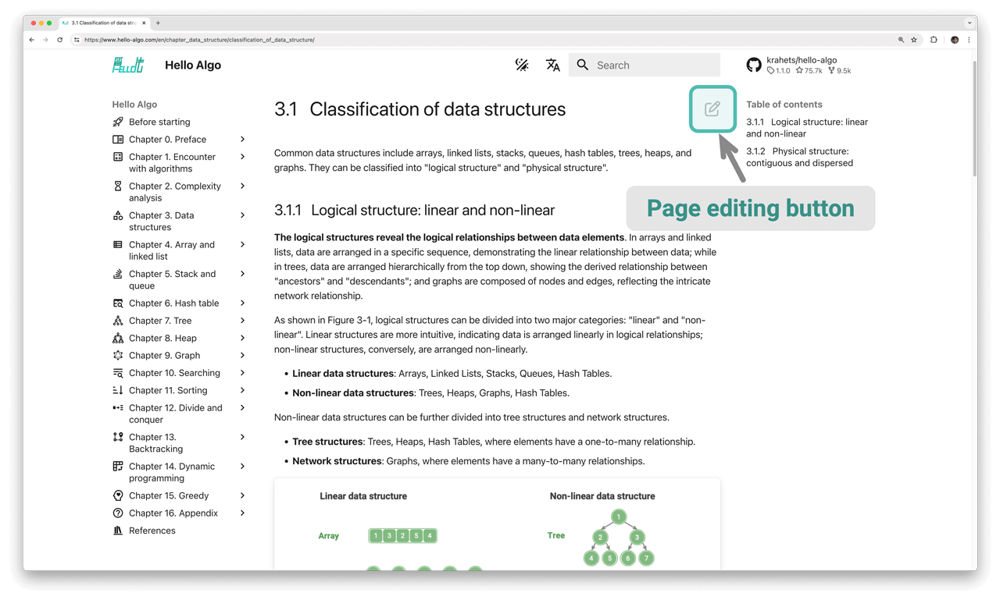

# Cùng tham gia đóng góp

Do năng lực của tác giả có hạn, trong sách khó tránh khỏi một số thiếu sót và sai sót, kính mong bạn đọc thông cảm. Nếu bạn phát hiện lỗi chính tả, liên kết bị hỏng, nội dung bị thiếu, câu từ đa nghĩa, giải thích chưa rõ ràng hoặc cấu trúc hành văn chưa hợp lý, xin vui lòng hỗ trợ chúng tôi sửa đổi để mang lại tài nguyên học tập chất lượng tốt hơn cho độc giả.

GitHub ID của tất cả các [người đóng góp](https://github.com/krahets/hello-algo/graphs/contributors) sẽ được vinh danh trên trang chủ của kho lưu trữ sách, phiên bản web và phiên bản PDF, nhằm tri ân những cống hiến quên mình của các bạn cho cộng đồng mã nguồn mở.

!!! success "Sức hút của mã nguồn mở"

    Khoảng thời gian giữa hai lần tái bản của một cuốn sách in thường khá dài, việc cập nhật nội dung vô cùng bất tiện.
    
    Còn trong cuốn sách mã nguồn mở này, thời gian cập nhật nội dung được rút ngắn xuống chỉ còn vài ngày hoặc thậm chí vài giờ.

### Tinh chỉnh nội dung

Như hình dưới đây, ở góc trên bên phải của mỗi trang đều có "biểu tượng chỉnh sửa". Bạn có thể làm theo các bước sau để sửa đổi văn bản hoặc mã nguồn:

1. Nhấp vào "biểu tượng chỉnh sửa", nếu gặp thông báo "Cần Fork kho lưu trữ này", xin vui lòng đồng ý thao tác.
2. Sửa đổi nội dung file nguồn Markdown, kiểm tra tính chính xác của nội dung và cố gắng duy trì định dạng trình bày thống nhất.
3. Điền phần mô tả nội dung sửa đổi ở cuối trang, sau đó nhấp vào nút "Propose file change". Sau khi trang chuyển hướng, nhấp vào nút "Create pull request" để gửi yêu cầu kéo (Pull Request).



Hình ảnh không thể trực tiếp sửa đổi, cần mô tả vấn đề bằng cách tạo [Issue](https://github.com/krahets/hello-algo/issues) mới hoặc để lại bình luận, chúng tôi sẽ vẽ lại và thay thế hình ảnh trong thời gian sớm nhất có thể.

### Sáng tạo nội dung

Nếu bạn có hứng thú tham gia vào dự án mã nguồn mở này, bao gồm dịch mã nguồn sang các ngôn ngữ lập trình khác, mở rộng nội dung bài viết, v.v., bạn cần thực hiện theo quy trình làm việc Pull Request sau:

1. Đăng nhập vào GitHub, Fork [kho mã nguồn](https://github.com/krahets/hello-algo) của cuốn sách về tài khoản cá nhân.
2. Truy cập vào trang kho lưu trữ Fork của bạn, sử dụng lệnh `git clone` để sao chép kho lưu trữ về máy tính cục bộ.
3. Tiến hành sáng tạo nội dung ở máy cục bộ và chạy kiểm thử hoàn chỉnh để xác minh tính chính xác của mã nguồn.
4. Thực hiện `commit` các thay đổi ở máy cục bộ, sau đó `push` lên kho lưu trữ từ xa (remote repository).
5. Làm mới trang web kho lưu trữ, nhấp vào nút "Create pull request" để gửi yêu cầu kéo.

### Triển khai bằng Docker

Tại thư mục gốc của `hello-algo`, thực thi lệnh Docker sau để có thể truy cập dự án này tại địa chỉ `http://localhost:8000`:

```shell
docker-compose up -d
```

Sử dụng lệnh sau để xoá bỏ triển khai:

```shell
docker-compose down
```
