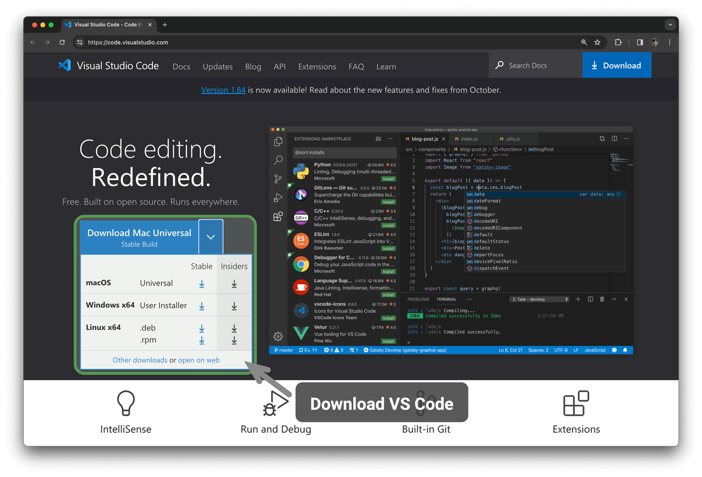

# Cài đặt môi trường lập trình

## Cài đặt IDE

Khuyến nghị sử dụng VS Code mã nguồn mở và gọn nhẹ làm môi trường phát triển tích hợp (IDE) cục bộ. Truy cập [Trang chủ chính thức của VS Code](https://code.visualstudio.com/) ，lựa chọn phiên bản VS Code tương ứng theo hệ điều hành của bạn để tải xuống và cài đặt.

VS Code sở hữu hệ sinh thái gói mở rộng (extension) vô cùng mạnh mẽ, hỗ trợ chạy và gỡ lỗi (debug) cho hầu hết các ngôn ngữ lập trình. Lấy Python làm ví dụ, sau khi cài đặt gói mở rộng "Python Extension Pack", bạn đã có thể tiến hành gỡ lỗi mã nguồn Python. Các bước cài đặt được minh hoạ như hình dưới đây.

## Cài đặt môi trường ngôn ngữ

### Môi trường Python

1. Tải xuống và cài đặt [Miniconda3](https://docs.conda.io/en/latest/miniconda.html) ，cần phiên bản Python 3.10 trở lên.
2. Tìm kiếm `python` trong Extension Marketplace của VS Code, cài đặt Python Extension Pack.
3. (Tuỳ chọn) Nhập lệnh `pip install black` trong dòng lệnh để cài đặt công cụ định dạng mã nguồn.

### Môi trường C/C++

1. Hệ điều hành Windows cần cài đặt [MinGW](https://sourceforge.net/projects/mingw-w64/files/) ([hướng dẫn cấu hình](https://blog.csdn.net/qq_33698226/article/details/129031241)); macOS đã tích hợp sẵn Clang, không cần cài đặt thêm.
2. Tìm kiếm `c++` trong Extension Marketplace của VS Code, cài đặt C/C++ Extension Pack.
3. (Tuỳ chọn) Mở trang Settings, tìm kiếm tuỳ chọn định dạng mã nguồn `Clang_format_fallback Style` ，thiết lập thành `{ BasedOnStyle: Microsoft, BreakBeforeBraces: Attach }` 。

### Môi trường Java

1. Tải xuống và cài đặt [OpenJDK](https://jdk.java.net/18/) (phiên bản cần thoả mãn > JDK 9).
2. Tìm kiếm `java` trong Extension Marketplace của VS Code, cài đặt Extension Pack for Java.

### Môi trường C#

1. Tải xuống và cài đặt [.NET 8.0](https://dotnet.microsoft.com/en-us/download) 。
2. Tìm kiếm `C# Dev Kit` trong Extension Marketplace của VS Code, cài đặt C# Dev Kit ([hướng dẫn cấu hình](https://code.visualstudio.com/docs/csharp/get-started)).
3. Cũng có thể sử dụng Visual Studio ([hướng dẫn cài đặt](https://learn.microsoft.com/zh-cn/visualstudio/install/install-visual-studio?view=vs-2022)).

### Môi trường Go

1. Tải xuống và cài đặt [Go](https://go.dev/dl/) 。
2. Tìm kiếm `go` trong Extension Marketplace của VS Code, cài đặt Go.
3. Nhấn tổ hợp phím `Ctrl + Shift + P` để mở thanh lệnh, nhập `go` ，chọn `Go: Install/Update Tools` ，tích chọn toàn bộ và tiến hành cài đặt.

### Môi trường Swift

1. Tải xuống và cài đặt [Swift](https://www.swift.org/download/) 。
2. Tìm kiếm `swift` trong Extension Marketplace của VS Code, cài đặt [Swift for Visual Studio Code](https://marketplace.visualstudio.com/items?itemName=sswg.swift-lang) 。

### Môi trường JavaScript

1. Tải xuống và cài đặt [Node.js](https://nodejs.org/en/) 。
2. (Tuỳ chọn) Tìm kiếm `Prettier` trong Extension Marketplace của VS Code, cài đặt công cụ định dạng mã nguồn.

### Môi trường TypeScript

1. Thực hiện các bước cài đặt giống như môi trường JavaScript.
2. Cài đặt [TypeScript Execute (tsx)](https://github.com/privatenumber/tsx?tab=readme-ov-file#global-installation) 。
3. Tìm kiếm `typescript` trong Extension Marketplace của VS Code, cài đặt [Pretty TypeScript Errors](https://marketplace.visualstudio.com/items?itemName=yoavbls.pretty-ts-errors) 。

### Môi trường Dart

1. Tải xuống và cài đặt [Dart](https://dart.dev/get-dart) 。
2. Tìm kiếm `dart` trong Extension Marketplace của VS Code, cài đặt [Dart](https://marketplace.visualstudio.com/items?itemName=Dart-Code.dart-code) 。

### Môi trường Rust

1. Tải xuống và cài đặt [Rust](https://www.rust-lang.org/tools/install) 。
2. Tìm kiếm `rust` trong Extension Marketplace của VS Code, cài đặt [rust-analyzer](https://marketplace.visualstudio.com/items?itemName=rust-lang.rust-analyzer) 。
