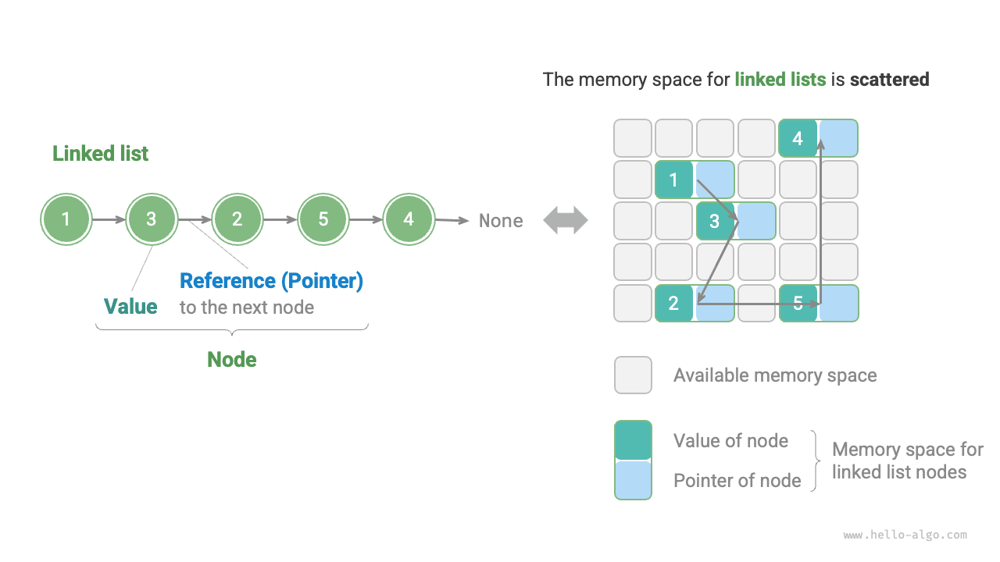
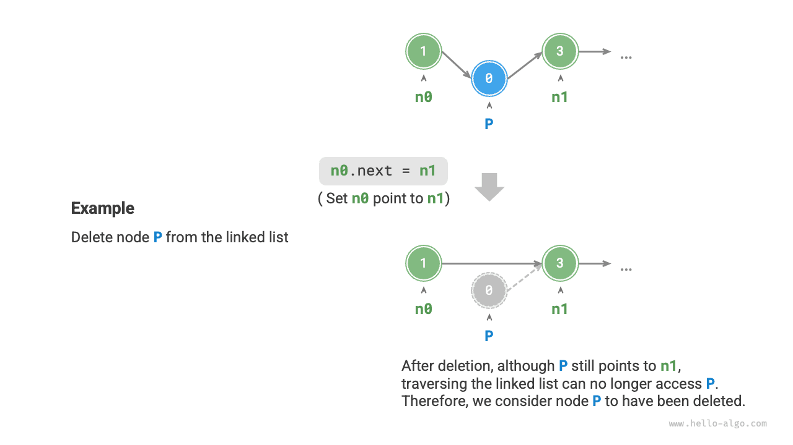

# Danh sách liên kết

Không gian bộ nhớ là tài nguyên công cộng của mọi chương trình; trong một môi trường hệ thống vận hành phức tạp, các khoảng bộ nhớ trống có thể nằm rải rác ở khắp nơi trong RAM. Chúng ta đã biết rằng, không gian bộ nhớ để lưu trữ mảng bắt buộc phải là các ô nhớ liên tục, và khi mảng có kích thước rất lớn thì bộ nhớ có thể không thể cung cấp được một khối không gian liên tục lớn đến như vậy. Lúc này, ưu thế về tính linh hoạt của danh sách liên kết sẽ được phát huy rõ rệt.

<u>Danh sách liên kết (linked list)</u> là một cấu trúc dữ liệu tuyến tính, trong đó mỗi phần tử là một đối tượng nút (node), và các nút được liên kết với nhau thông qua "tham chiếu". Tham chiếu ghi lại địa chỉ bộ nhớ của nút tiếp theo, nhờ đó từ nút hiện tại có thể truy cập sang nút kế tiếp.

Thiết kế của danh sách liên kết cho phép các nút có thể lưu trữ phân tán ở khắp nơi trong bộ nhớ mà địa chỉ bộ nhớ của chúng không cần phải liên tục.



Quan sát hình trên, đơn vị cấu thành của danh sách liên kết là đối tượng <u>nút (node)</u>. Mỗi nút đều chứa hai hạng mục dữ liệu: "giá trị" của nút và "tham chiếu" trỏ đến nút tiếp theo.

- Nút đầu tiên của danh sách liên kết được gọi là "nút đầu" (head node), nút cuối cùng được gọi là "nút cuối" (tail node).
- Nút cuối trỏ đến "rỗng", lần lượt được biểu diễn là `null` trong Java, `nullptr` trong C++ và `None` trong Python.
- Trong các ngôn ngữ hỗ trợ con trỏ như C, C++, Go và Rust, "tham chiếu" nói trên được thay thế bằng "con trỏ".

Như đoạn mã dưới đây, nút danh sách liên kết `ListNode` ngoài việc chứa giá trị còn phải lưu thêm một tham chiếu (con trỏ). Do đó với cùng một lượng dữ liệu, **danh sách liên kết chiếm nhiều không gian bộ nhớ hơn so với mảng**.

=== "Python"

    ```python title=""
    class ListNode:
        """Lớp nút danh sách liên kết"""
        def __init__(self, val: int):
            self.val: int = val               # Giá trị nút
            self.next: ListNode | None = None # Tham chiếu đến nút tiếp theo
    ```

=== "C++"

    ```cpp title=""
    /* Cấu trúc nút danh sách liên kết */
    struct ListNode {
        int val;         // Giá trị nút
        ListNode *next;  // Con trỏ trỏ đến nút tiếp theo
        ListNode(int x) : val(x), next(nullptr) {}  // Hàm khởi tạo
    };
    ```

=== "Java"

    ```java title=""
    /* Lớp nút danh sách liên kết */
    class ListNode {
        int val;        // Giá trị nút
        ListNode next;  // Tham chiếu đến nút tiếp theo
        ListNode(int x) { val = x; }  // Hàm khởi tạo
    }
    ```

=== "C#"

    ```csharp title=""
    /* Lớp nút danh sách liên kết */
    class ListNode(int x) {  // Hàm khởi tạo
        int val = x;         // Giá trị nút
        ListNode? next;      // Tham chiếu đến nút tiếp theo
    }
    ```

=== "Go"

    ```go title=""
    /* Cấu trúc nút danh sách liên kết */
    type ListNode struct {
        Val  int       // Giá trị nút
        Next *ListNode // Con trỏ trỏ đến nút tiếp theo
    }

    // Hàm khởi tạo NewListNode, tạo một nút danh sách liên kết mới
    func NewListNode(val int) *ListNode {
        return &ListNode{
            Val:  val,
            Next: nil,
        }
    }
    ```

=== "Swift"

    ```swift title=""
    /* Lớp nút danh sách liên kết */
    class ListNode {
        var val: Int // Giá trị nút
        var next: ListNode? // Tham chiếu đến nút tiếp theo

        init(x: Int) { // Hàm khởi tạo
            val = x
        }
    }
    ```

=== "JS"

    ```javascript title=""
    /* Lớp nút danh sách liên kết */
    class ListNode {
        constructor(val, next) {
            this.val = (val === undefined ? 0 : val);       // Giá trị nút
            this.next = (next === undefined ? null : next); // Tham chiếu đến nút tiếp theo
        }
    }
    ```

=== "TS"

    ```typescript title=""
    /* Lớp nút danh sách liên kết */
    class ListNode {
        val: number;
        next: ListNode | null;
        constructor(val?: number, next?: ListNode | null) {
            this.val = (val === undefined ? 0 : val);       // Giá trị nút
            this.next = (next === undefined ? null : next); // Tham chiếu đến nút tiếp theo
        }
    }
    ```

=== "Dart"

    ```dart title=""
    /* Lớp nút danh sách liên kết */
    class ListNode {
      int val;
      ListNode? next;
      ListNode(this.val, [this.next]); // Hàm khởi tạo
    }
    ```

=== "Rust"

    ```rust title=""
    /* Cấu trúc nút danh sách liên kết */
    #[derive(Debug)]
    pub struct ListNode {
        pub val: i32,
        pub next: Option<Box<ListNode>>,
    }

    impl ListNode {
        /* Hàm khởi tạo */
        pub fn new(val: i32) -> Self {
            ListNode { val, next: None }
        }
    }
    ```

=== "C"

    ```c title=""
    /* Cấu trúc nút danh sách liên kết */
    typedef struct ListNode {
        int val;               // Giá trị nút
        struct ListNode *next; // Con trỏ trỏ đến nút tiếp theo
    } ListNode;

    /* Hàm khởi tạo */
    ListNode *newListNode(int val) {
        ListNode *node;
        node = (ListNode *) malloc(sizeof(ListNode));
        node->val = val;
        node->next = NULL;
        return node;
    }
    ```

=== "Kotlin"

    ```kotlin title=""
    /* Lớp nút danh sách liên kết */
    // Phương thức khởi tạo
    class ListNode(var `val`: Int) {
        var next: ListNode? = null // Tham chiếu đến nút tiếp theo
    }
    ```

=== "Ruby"

    ```ruby title=""
    # Lớp nút danh sách liên kết
    class ListNode
      attr_accessor :val    # Giá trị nút
      attr_accessor :next   # Tham chiếu đến nút tiếp theo

      def initialize(val=0, next_node=nil)
        @val = val
        @next = next_node
      end
    end
    ```

=== "Zig"

    ```zig title=""
    // Cấu trúc nút danh sách liên kết
    pub fn ListNode(comptime T: type) type {
        return struct {
            const Self = @This();

            val: T = 0,               // Giá trị nút
            next: ?*Self = null,      // Con trỏ trỏ đến nút tiếp theo

            // Hàm khởi tạo
            pub fn init(self: *Self, x: T) void {
                self.val = x;
                self.next = null;
            }
        };
    }
    ```

## Các thao tác thường dùng trên danh sách liên kết

### Khởi tạo danh sách liên kết

Việc xây dựng một danh sách liên kết gồm hai bước: bước thứ nhất là khởi tạo các đối tượng nút đơn lẻ, bước thứ hai là thiết lập quan hệ tham chiếu giữa các nút. Sau khi khởi tạo xong, chúng ta có thể xuất phát từ nút đầu của danh sách liên kết, thông qua tham chiếu trỏ `next` để lần lượt truy cập tất cả các nút.

=== "Python"

    ```python title="linked_list.py"
    # Khởi tạo danh sách liên kết 1 -> 3 -> 2 -> 5 -> 4
    # Khởi tạo từng nút
    n0 = ListNode(1)
    n1 = ListNode(3)
    n2 = ListNode(2)
    n3 = ListNode(5)
    n4 = ListNode(4)
    # Xây dựng các tham chiếu giữa các nút
    n0.next = n1
    n1.next = n2
    n2.next = n3
    n3.next = n4
    ```

=== "C++"

    ```cpp title="linked_list.cpp"
    /* Khởi tạo danh sách liên kết 1 -> 3 -> 2 -> 5 -> 4 */
    // Khởi tạo từng nút
    ListNode* n0 = new ListNode(1);
    ListNode* n1 = new ListNode(3);
    ListNode* n2 = new ListNode(2);
    ListNode* n3 = new ListNode(5);
    ListNode* n4 = new ListNode(4);
    // Xây dựng các tham chiếu giữa các nút
    n0->next = n1;
    n1->next = n2;
    n2->next = n3;
    n3->next = n4;
    ```

=== "Java"

    ```java title="linked_list.java"
    /* Khởi tạo danh sách liên kết 1 -> 3 -> 2 -> 5 -> 4 */
    // Khởi tạo từng nút
    ListNode n0 = new ListNode(1);
    ListNode n1 = new ListNode(3);
    ListNode n2 = new ListNode(2);
    ListNode n3 = new ListNode(5);
    ListNode n4 = new ListNode(4);
    // Xây dựng các tham chiếu giữa các nút
    n0.next = n1;
    n1.next = n2;
    n2.next = n3;
    n3.next = n4;
    ```

=== "C#"

    ```csharp title="linked_list.cs"
    /* Khởi tạo danh sách liên kết 1 -> 3 -> 2 -> 5 -> 4 */
    // Khởi tạo từng nút
    ListNode n0 = new(1);
    ListNode n1 = new(3);
    ListNode n2 = new(2);
    ListNode n3 = new(5);
    ListNode n4 = new(4);
    // Xây dựng các tham chiếu giữa các nút
    n0.next = n1;
    n1.next = n2;
    n2.next = n3;
    n3.next = n4;
    ```

=== "Go"

    ```go title="linked_list.go"
    /* Khởi tạo danh sách liên kết 1 -> 3 -> 2 -> 5 -> 4 */
    // Khởi tạo từng nút
    n0 := NewListNode(1)
    n1 := NewListNode(3)
    n2 := NewListNode(2)
    n3 := NewListNode(5)
    n4 := NewListNode(4)
    // Xây dựng các tham chiếu giữa các nút
    n0.Next = n1
    n1.Next = n2
    n2.Next = n3
    n3.Next = n4
    ```

=== "Swift"

    ```swift title="linked_list.swift"
    /* Khởi tạo danh sách liên kết 1 -> 3 -> 2 -> 5 -> 4 */
    // Khởi tạo từng nút
    let n0 = ListNode(x: 1)
    let n1 = ListNode(x: 3)
    let n2 = ListNode(x: 2)
    let n3 = ListNode(x: 5)
    let n4 = ListNode(x: 4)
    // Xây dựng các tham chiếu giữa các nút
    n0.next = n1
    n1.next = n2
    n2.next = n3
    n3.next = n4
    ```

=== "JS"

    ```javascript title="linked_list.js"
    /* Khởi tạo danh sách liên kết 1 -> 3 -> 2 -> 5 -> 4 */
    // Khởi tạo từng nút
    const n0 = new ListNode(1);
    const n1 = new ListNode(3);
    const n2 = new ListNode(2);
    const n3 = new ListNode(5);
    const n4 = new ListNode(4);
    // Xây dựng các tham chiếu giữa các nút
    n0.next = n1;
    n1.next = n2;
    n2.next = n3;
    n3.next = n4;
    ```

=== "TS"

    ```typescript title="linked_list.ts"
    /* Khởi tạo danh sách liên kết 1 -> 3 -> 2 -> 5 -> 4 */
    // Khởi tạo từng nút
    const n0 = new ListNode(1);
    const n1 = new ListNode(3);
    const n2 = new ListNode(2);
    const n3 = new ListNode(5);
    const n4 = new ListNode(4);
    // Xây dựng các tham chiếu giữa các nút
    n0.next = n1;
    n1.next = n2;
    n2.next = n3;
    n3.next = n4;
    ```

=== "Dart"

    ```dart title="linked_list.dart"
    /* Khởi tạo danh sách liên kết 1 -> 3 -> 2 -> 5 -> 4 */
    // Khởi tạo từng nút
    ListNode n0 = ListNode(1);
    ListNode n1 = ListNode(3);
    ListNode n2 = ListNode(2);
    ListNode n3 = ListNode(5);
    ListNode n4 = ListNode(4);
    // Xây dựng các tham chiếu giữa các nút
    n0.next = n1;
    n1.next = n2;
    n2.next = n3;
    n3.next = n4;
    ```

=== "Rust"

    ```rust title="linked_list.rs"
    /* Khởi tạo danh sách liên kết 1 -> 3 -> 2 -> 5 -> 4 */
    // Khởi tạo từng nút
    let mut n0 = Box::new(ListNode::new(1));
    let mut n1 = Box::new(ListNode::new(3));
    let mut n2 = Box::new(ListNode::new(2));
    let mut n3 = Box::new(ListNode::new(5));
    let n4 = Box::new(ListNode::new(4));
    // Xây dựng các tham chiếu giữa các nút
    n3.next = Some(n4);
    n2.next = Some(n3);
    n1.next = Some(n2);
    n0.next = Some(n1);
    ```

=== "C"

    ```c title="linked_list.c"
    /* Khởi tạo danh sách liên kết 1 -> 3 -> 2 -> 5 -> 4 */
    // Khởi tạo từng nút
    ListNode* n0 = newListNode(1);
    ListNode* n1 = newListNode(3);
    ListNode* n2 = newListNode(2);
    ListNode* n3 = newListNode(5);
    ListNode* n4 = newListNode(4);
    // Xây dựng các tham chiếu giữa các nút
    n0->next = n1;
    n1->next = n2;
    n2->next = n3;
    n3->next = n4;
    ```

=== "Kotlin"

    ```kotlin title="linked_list.kt"
    /* Khởi tạo danh sách liên kết 1 -> 3 -> 2 -> 5 -> 4 */
    // Khởi tạo từng nút
    val n0 = ListNode(1)
    val n1 = ListNode(3)
    val n2 = ListNode(2)
    val n3 = ListNode(5)
    val n4 = ListNode(4)
    // Xây dựng các tham chiếu giữa các nút
    n0.next = n1
    n1.next = n2
    n2.next = n3
    n3.next = n4
    ```

=== "Ruby"

    ```ruby title="linked_list.rb"
    # Khởi tạo danh sách liên kết 1 -> 3 -> 2 -> 5 -> 4
    # Khởi tạo từng nút
    n0 = ListNode.new(1)
    n1 = ListNode.new(3)
    n2 = ListNode.new(2)
    n3 = ListNode.new(5)
    n4 = ListNode.new(4)
    # Xây dựng các tham chiếu giữa các nút
    n0.next = n1
    n1.next = n2
    n2.next = n3
    n3.next = n4
    ```

=== "Zig"

    ```zig title="linked_list.zig"
    // Khởi tạo danh sách liên kết 1 -> 3 -> 2 -> 5 -> 4
    // Khởi tạo từng nút
    var n0: ListNode(i32) = undefined;
    var n1: ListNode(i32) = undefined;
    var n2: ListNode(i32) = undefined;
    var n3: ListNode(i32) = undefined;
    var n4: ListNode(i32) = undefined;
    n0.init(1);
    n1.init(3);
    n2.init(2);
    n3.init(5);
    n4.init(4);
    // Xây dựng các tham chiếu giữa các nút
    n0.next = &n1;
    n1.next = &n2;
    n2.next = &n3;
    n3.next = &n4;
    ```

Mảng tổng thể là một biến duy nhất, ví dụ mảng `nums` chứa các phần tử `nums[0]` và `nums[1]` v.v., trong khi danh sách liên kết được cấu thành từ nhiều đối tượng nút độc lập. **Chúng ta thường dùng nút đầu làm đại diện cho toàn bộ danh sách liên kết**, ví dụ danh sách liên kết trong đoạn mã trên có thể gọi là danh sách liên kết `n0` 。

### Chèn nút

Việc chèn một nút vào danh sách liên kết diễn ra rất dễ dàng. Như minh hoạ trong hình dưới đây, giả sử chúng ta muốn chèn một nút mới `P` vào giữa hai nút liền kề `n0` và `n1` ，**thì chỉ cần thay đổi hai tham chiếu (con trỏ) của nút là xong**, độ phức tạp thời gian là $O(1)$ 。

So sánh với việc chèn phần tử trong mảng có độ phức tạp thời gian là $O(n)$ ，hiệu năng của mảng khi xử lý lượng dữ liệu lớn sẽ thấp hơn nhiều.


```src
[file]{linked_list}-[class]{}-[func]{insert}
```

### Xoá nút

Như minh hoạ trong hình dưới đây, việc xoá nút trong danh sách liên kết cũng rất thuận tiện, **chỉ cần thay đổi tham chiếu (con trỏ) của một nút là xong**.

Xin lưu ý rằng mặc dù sau khi thao tác xoá hoàn tất, nút `P` vẫn còn trỏ đến `n1` ，nhưng trên thực tế khi duyệt danh sách liên kết này sẽ không thể nào truy cập đến `P` được nữa, đồng nghĩa với việc `P` đã không còn thuộc về danh sách liên kết này.



```src
[file]{linked_list}-[class]{}-[func]{remove}
```

### Truy cập nút

**Hiệu năng truy cập nút trong danh sách liên kết là tương đối thấp**. Như đã trình bày ở phần trước, chúng ta có thể truy cập bất kỳ phần tử nào trong mảng với thời gian $O(1)$ 。Danh sách liên kết thì không như vậy, chương trình buộc phải xuất phát từ nút đầu, lần lượt duyệt qua từng nút một cho đến khi tìm thấy nút mục tiêu. Nghĩa là việc truy cập nút thứ $i$ của danh sách liên kết đòi hỏi phải lặp $i - 1$ vòng, độ phức tạp thời gian là $O(n)$ 。

```src
[file]{linked_list}-[class]{}-[func]{access}
```

### Tìm kiếm nút

Duyệt danh sách liên kết để tìm nút có giá trị bằng `target` ，trả về chỉ số của nút đó trong danh sách liên kết. Quá trình này cũng thuộc dạng tìm kiếm tuyến tính. Đoạn mã như sau:

```src
[file]{linked_list}-[class]{}-[func]{find}
```

## Mảng vs. Danh sách liên kết

Bảng dưới đây tổng kết các đặc điểm của mảng và danh sách liên kết, đồng thời so sánh hiệu năng của các thao tác. Do áp dụng hai chiến lược lưu trữ hoàn toàn trái ngược nhau, các tính chất và hiệu năng thao tác của chúng cũng thể hiện tính đối lập rõ nét.

<p align="center"> Bảng <id> &nbsp; So sánh hiệu năng giữa mảng và danh sách liên kết </p>

|          | Mảng                           | Danh sách liên kết           |
| -------- | ------------------------------ | -------------- |
| Phương thức lưu trữ | Không gian bộ nhớ liên tục                   | Không gian bộ nhớ phân tán   |
| Mở rộng dung lượng | Độ dài không thể thay đổi                     | Mở rộng linh hoạt     |
| Hiệu năng bộ nhớ | Phần tử chiếm ít bộ nhớ, nhưng có thể lãng phí không gian | Phần tử chiếm nhiều bộ nhớ hơn |
| Truy cập phần tử | $O(1)$                         | $O(n)$         |
| Thêm phần tử | $O(n)$                         | $O(1)$         |
| Xoá phần tử | $O(n)$                         | $O(1)$         |

## Các loại danh sách liên kết phổ biến

Như minh hoạ trong hình dưới đây, các loại danh sách liên kết phổ biến bao gồm ba loại:

- **Danh sách liên kết đơn (Singly linked list)**: Chính là danh sách liên kết thông thường đã giới thiệu ở trên. Nút của danh sách liên kết đơn chứa hai hạng mục dữ liệu: giá trị và tham chiếu trỏ đến nút tiếp theo. Chúng ta gọi nút đầu tiên là nút đầu, nút cuối cùng là nút cuối, nút cuối trỏ đến rỗng `None` 。
- **Danh sách liên kết vòng (Circular linked list)**: Nếu cho nút cuối của danh sách liên kết đơn trỏ ngược lại nút đầu (nối đầu và đuôi lại với nhau), chúng ta sẽ thu được một danh sách liên kết vòng. Trong danh sách liên kết vòng, bất kỳ nút nào cũng có thể được coi là nút đầu.
- **Danh sách liên kết đôi (Doubly linked list)**: So với danh sách liên kết đơn, danh sách liên kết đôi ghi nhận tham chiếu ở cả hai chiều. Định nghĩa nút của danh sách liên kết đôi chứa đồng thời tham chiếu (con trỏ) trỏ đến nút kế tiếp (nút sau) và nút liền trước (nút trước). So với danh sách liên kết đơn, danh sách liên kết đôi linh hoạt hơn nhiều, có thể duyệt danh sách theo cả hai chiều, nhưng bù lại cũng chiếm nhiều không gian bộ nhớ hơn.

=== "Python"

    ```python title=""
    class ListNode:
        """Lớp nút danh sách liên kết đôi"""
        def __init__(self, val: int):
            self.val: int = val                # Giá trị nút
            self.next: ListNode | None = None  # Tham chiếu đến nút kế tiếp
            self.prev: ListNode | None = None  # Tham chiếu đến nút liền trước
    ```

=== "C++"

    ```cpp title=""
    /* Cấu trúc nút danh sách liên kết đôi */
    struct ListNode {
        int val;         // Giá trị nút
        ListNode *next;  // Con trỏ trỏ đến nút kế tiếp
        ListNode *prev;  // Con trỏ trỏ đến nút liền trước
        ListNode(int x) : val(x), next(nullptr), prev(nullptr) {}  // Hàm khởi tạo
    };
    ```

=== "Java"

    ```java title=""
    /* Lớp nút danh sách liên kết đôi */
    class ListNode {
        int val;        // Giá trị nút
        ListNode next;  // Tham chiếu đến nút kế tiếp
        ListNode prev;  // Tham chiếu đến nút liền trước
        ListNode(int x) { val = x; }  // Hàm khởi tạo
    }
    ```

=== "C#"

    ```csharp title=""
    /* Lớp nút danh sách liên kết đôi */
    class ListNode(int x) {  // Hàm khởi tạo
        int val = x;    // Giá trị nút
        ListNode next;  // Tham chiếu đến nút kế tiếp
        ListNode prev;  // Tham chiếu đến nút liền trước
    }
    ```

=== "Go"

    ```go title=""
    /* Cấu trúc nút danh sách liên kết đôi */
    type DoublyListNode struct {
        Val  int             // Giá trị nút
        Next *DoublyListNode // Con trỏ trỏ đến nút kế tiếp
        Prev *DoublyListNode // Con trỏ trỏ đến nút liền trước
    }

    // NewDoublyListNode khởi tạo
    func NewDoublyListNode(val int) *DoublyListNode {
        return &DoublyListNode{
            Val:  val,
            Next: nil,
            Prev: nil,
        }
    }
    ```

=== "Swift"

    ```swift title=""
    /* Lớp nút danh sách liên kết đôi */
    class ListNode {
        var val: Int // Giá trị nút
        var next: ListNode? // Tham chiếu đến nút kế tiếp
        var prev: ListNode? // Tham chiếu đến nút liền trước

        init(x: Int) { // Hàm khởi tạo
            val = x
        }
    }
    ```

=== "JS"

    ```javascript title=""
    /* Lớp nút danh sách liên kết đôi */
    class ListNode {
        constructor(val, next, prev) {
            this.val = val  ===  undefined ? 0 : val;        // Giá trị nút
            this.next = next  ===  undefined ? null : next;  // Tham chiếu đến nút kế tiếp
            this.prev = prev  ===  undefined ? null : prev;  // Tham chiếu đến nút liền trước
        }
    }
    ```

=== "TS"

    ```typescript title=""
    /* Lớp nút danh sách liên kết đôi */
    class ListNode {
        val: number;
        next: ListNode | null;
        prev: ListNode | null;
        constructor(val?: number, next?: ListNode | null, prev?: ListNode | null) {
            this.val = val  ===  undefined ? 0 : val;        // Giá trị nút
            this.next = next  ===  undefined ? null : next;  // Tham chiếu đến nút kế tiếp
            this.prev = prev  ===  undefined ? null : prev;  // Tham chiếu đến nút liền trước
        }
    }
    ```

=== "Dart"

    ```dart title=""
    /* Lớp nút danh sách liên kết đôi */
    class ListNode {
        int val;        // Giá trị nút
        ListNode? next;  // Tham chiếu đến nút kế tiếp
        ListNode? prev;  // Tham chiếu đến nút liền trước
        ListNode(this.val, [this.next, this.prev]);  // Hàm khởi tạo
    }
    ```

=== "Rust"

    ```rust title=""
    use std::rc::Rc;
    use std::cell::RefCell;

    /* Kiểu nút danh sách liên kết đôi */
    #[derive(Debug)]
    struct ListNode {
        val: i32, // Giá trị nút
        next: Option<Rc<RefCell<ListNode>>>, // Con trỏ trỏ đến nút kế tiếp
        prev: Option<Rc<RefCell<ListNode>>>, // Con trỏ trỏ đến nút liền trước
    }

    /* Hàm khởi tạo */
    impl ListNode {
        fn new(val: i32) -> Self {
            ListNode {
                val,
                next: None,
                prev: None,
            }
        }
    }
    ```

=== "C"

    ```c title=""
    /* Cấu trúc nút danh sách liên kết đôi */
    typedef struct ListNode {
        int val;               // Giá trị nút
        struct ListNode *next; // Con trỏ trỏ đến nút kế tiếp
        struct ListNode *prev; // Con trỏ trỏ đến nút liền trước
    } ListNode;

    /* Hàm khởi tạo */
    ListNode *newListNode(int val) {
        ListNode *node;
        node = (ListNode *) malloc(sizeof(ListNode));
        node->val = val;
        node->next = NULL;
        node->prev = NULL;
        return node;
    }
    ```

=== "Kotlin"

    ```kotlin title=""
    /* Lớp nút danh sách liên kết đôi */
    // Phương thức khởi tạo
    class ListNode(x: Int) {
        val _val: Int = x           // Giá trị nút
        var next: ListNode? = null  // Tham chiếu đến nút kế tiếp
        var prev: ListNode? = null  // Tham chiếu đến nút liền trước
    }
    ```

=== "Ruby"

    ```ruby title=""
    # Lớp nút danh sách liên kết đôi
    class ListNode
      attr_accessor :val    # Giá trị nút
      attr_accessor :next   # Tham chiếu đến nút kế tiếp
      attr_accessor :prev   # Tham chiếu đến nút liền trước

      def initialize(val=0, next_node=nil, prev_node=nil)
        @val = val
        @next = next_node
        @prev = prev_node
      end
    end
    ```

=== "Zig"

    ```zig title=""
    // Cấu trúc nút danh sách liên kết đôi
    pub fn DoublyListNode(comptime T: type) type {
        return struct {
            const Self = @This();

            val: T = 0,               // Giá trị nút
            next: ?*Self = null,      // Con trỏ trỏ đến nút kế tiếp
            prev: ?*Self = null,      // Con trỏ trỏ đến nút liền trước

            // Hàm khởi tạo
            pub fn init(self: *Self, x: T) void {
                self.val = x;
                self.next = null;
                self.prev = null;
            }
        };
    }
    ```


## Các ứng dụng điển hình của danh sách liên kết

Danh sách liên kết đơn thường dùng để hiện thực hoá ngăn xếp, hàng đợi, bảng băm và đồ thị:

- **Ngăn xếp và hàng đợi**: Khi thao tác chèn và xoá đều thực hiện ở một đầu của danh sách liên kết, nó thể hiện đặc tính vào sau ra trước (LIFO), tương ứng với ngăn xếp; khi thao tác chèn thực hiện ở một đầu và thao tác xoá thực hiện ở đầu đối diện, nó thể hiện đặc tính vào trước ra trước (FIFO), tương ứng với hàng đợi.
- **Bảng băm**: Nối chuỗi (chaining) là một trong những phương án chủ đạo để xử lý đụng độ băm, trong đó tất cả các phần tử bị đụng độ đều được đưa vào trong cùng một danh sách liên kết.
- **Đồ thị**: Danh sách kề (adjacency list) là một phương thức phổ biến để biểu diễn đồ thị, trong đó mỗi đỉnh của đồ thị đều liên kết với một danh sách liên kết, và mỗi phần tử trong danh sách liên kết đại diện cho các đỉnh khác có cạnh nối với đỉnh đó.

Danh sách liên kết đôi thường dùng trong các tình huống cần tìm kiếm nhanh phần tử đứng trước và phần tử đứng sau:

- **Cấu trúc dữ liệu nâng cao**: Chẳng hạn trong cây đỏ-đen hay cây B, chúng ta cần truy cập nút cha của một nút, điều này có thể hiện thực bằng cách lưu một tham chiếu trỏ đến nút cha trong mỗi nút, tương tự như danh sách liên kết đôi.
- **Lịch sử trình duyệt**: Trong trình duyệt web, khi người dùng nhấp nút tiến (forward) hoặc lùi (backward), trình duyệt cần biết trang web trước đó và trang web tiếp theo mà người dùng đã truy cập. Đặc tính của danh sách liên kết đôi giúp thao tác này trở nên rất đơn giản.
- **Thuật toán LRU**: Trong thuật toán loại bỏ bộ nhớ đệm (LRU cache), chúng ta cần tìm nhanh dữ liệu ít được sử dụng gần đây nhất, cũng như hỗ trợ thêm và xoá nút nhanh chóng. Lúc này sử dụng danh sách liên kết đôi là vô cùng thích hợp.

Danh sách liên kết vòng thường dùng trong các tình huống cần thao tác mang tính chu kỳ, ví dụ như lập lịch điều phối tài nguyên của hệ điều hành:

- **Thuật toán lập lịch luân phiên theo lát cắt thời gian (Round Robin)**: Trong hệ điều hành, thuật toán Round Robin là một thuật toán điều phối CPU phổ biến, nó cần quay vòng tuần hoàn qua một tập hợp các tiến trình. Mỗi tiến trình được cấp một lát cắt thời gian (time slice), khi hết thời gian, CPU sẽ chuyển sang tiến trình tiếp theo. Thao tác tuần hoàn này có thể hiện thực hoá thông qua danh sách liên kết vòng.
- **Bộ đệm dữ liệu**: Trong một số hiện thực bộ đệm dữ liệu (buffer), danh sách liên kết vòng cũng có thể được sử dụng. Chẳng hạn trong các trình phát âm thanh, video, luồng dữ liệu có thể được chia thành nhiều khối đệm và đưa vào danh sách liên kết vòng để phát liền mạch không gián đoạn.
