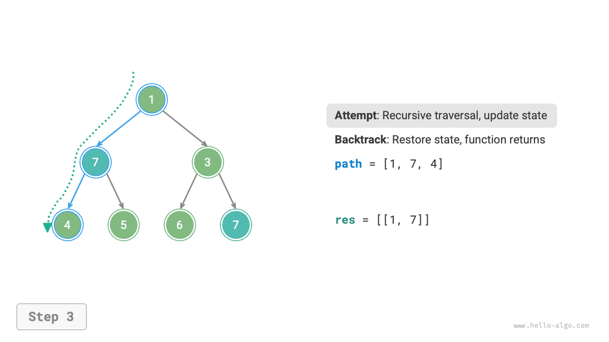
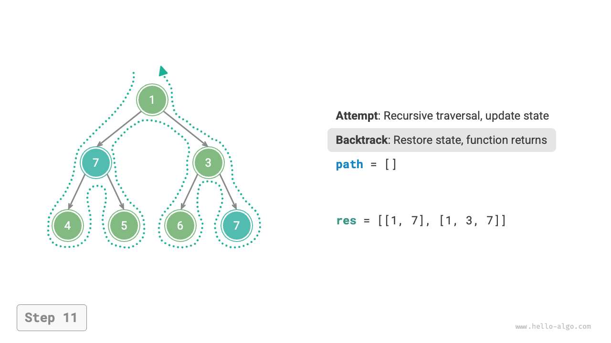
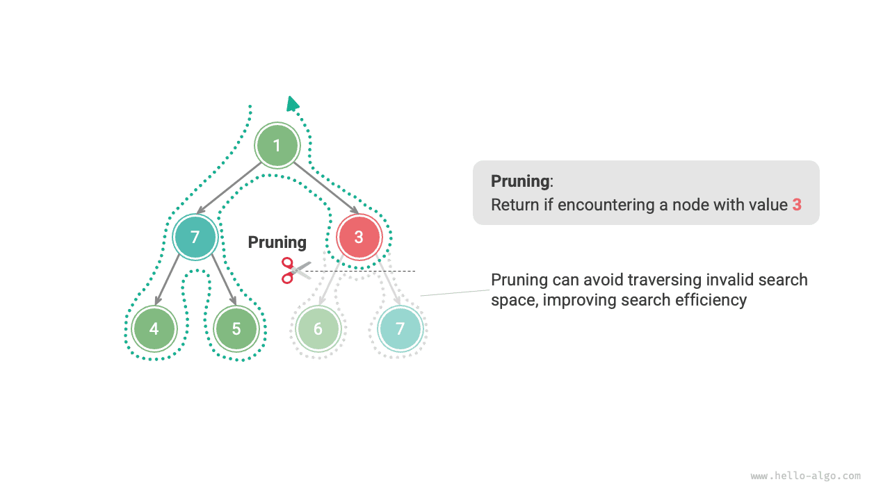

# Thuật toán quay lui

<u>Thuật toán quay lui (backtracking algorithm)</u> là một phương pháp giải quyết bài toán thông qua vét cạn (exhaustive search). Tư tưởng cốt lõi của nó là xuất phát từ một trạng thái ban đầu, tìm kiếm vét cạn tất cả các phương án khả dĩ, khi gặp một lời giải đúng thì ghi nhận lại, cho đến khi tìm thấy lời giải hoặc đã thử hết tất cả các lựa chọn mà vẫn không tìm thấy lời giải thì dừng lại.

Thuật toán quay lui thường áp dụng "tìm kiếm theo chiều sâu" (DFS) để duyệt qua không gian lời giải. Trong chương "Cây nhị phân", chúng ta đã biết duyệt tiền thứ tự, trung thứ tự và hậu thứ tự đều thuộc về tìm kiếm theo chiều sâu. Tiếp theo, chúng ta sử dụng duyệt tiền thứ tự để xây dựng một bài toán quay lui, từng bước tìm hiểu nguyên lý hoạt động của thuật toán quay lui.

!!! question "Ví dụ 1"

    Cho một cây nhị phân, hãy tìm kiếm và ghi lại tất cả các nút có giá trị là $7$ ，trả về danh sách các nút đó.

Đối với bài này, chúng ta duyệt tiền thứ tự cây nhị phân, và kiểm tra xem giá trị của nút hiện tại có bằng $7$ hay không; nếu có, thêm giá trị của nút đó vào danh sách kết quả `res` 。Quy trình thực hiện được thể hiện như hình dưới và mã nguồn sau:

```src
[file]{preorder_traversal_i_compact}-[class]{}-[func]{pre_order}
```


## Thử và quay lui (Backtrack)

**Sở dĩ gọi là thuật toán quay lui là vì thuật toán này áp dụng chiến lược "thử" (attempt) và "quay lui" (backtrack) khi tìm kiếm không gian lời giải**. Khi thuật toán trong quá trình tìm kiếm gặp phải một trạng thái không thể tiếp tục tiến lên phía trước hoặc không thể thu được lời giải thoả mãn điều kiện, nó sẽ huỷ bỏ lựa chọn ở bước trước đó, lùi về trạng thái cũ và thử các lựa chọn khả dĩ khác.

Đối với Ví dụ 1, việc truy cập mỗi nút đại diện cho một lần "thử", còn câu lệnh `return` khi vượt quá nút lá hoặc quay về nút cha đại diện cho việc "quay lui".

Cần làm rõ rằng, **quay lui không chỉ đơn thuần là việc hàm trả về (`return`)**. Để giải thích điều này, chúng ta mở rộng Ví dụ 1 thêm một chút.

!!! question "Ví dụ 2"

    Tìm kiếm tất cả các nút có giá trị là $7$ trong cây nhị phân, **hãy trả về các đường đi từ nút gốc đến các nút đó**.

Trên nền tảng mã nguồn Ví dụ 1, chúng ta cần nhờ một danh sách `path` để ghi lại đường đi các nút đã đi qua. Khi duyệt đến nút có giá trị là $7$ ，thì sao chép `path` và thêm vào danh sách kết quả `res` 。Sau khi duyệt xong, trong `res` sẽ lưu trữ toàn bộ các lời giải. Mã nguồn như sau:

```src
[file]{preorder_traversal_ii_compact}-[class]{}-[func]{pre_order}
```

Trong mỗi lần "thử", chúng ta ghi lại đường đi bằng cách thêm nút hiện tại vào `path` ；còn trước khi "quay lui", chúng ta cần lấy nút đó ra khỏi `path` ，**nhằm khôi phục lại trạng thái trước lần thử này**.

Quan sát quá trình minh hoạ ở hình dưới đây, **chúng ta có thể hiểu thử và quay lui là hai thao tác "tiến tới" và "huỷ bỏ"**, hai thao tác này mang tính nghịch đảo lẫn nhau.

=== "<1>"
    

=== "<2>"
    

=== "<3>"
    

=== "<4>"
    

=== "<5>"
    

=== "<6>"
    

=== "<7>"
    

=== "<8>"
    

=== "<9>"
    

=== "<10>"
    

=== "<11>"
    

## Cắt tỉa (Pruning)

Các bài toán quay lui phức tạp thường chứa một hoặc nhiều điều kiện ràng buộc, **các điều kiện ràng buộc thường có thể dùng cho thao tác "cắt tỉa"**.

!!! question "Ví dụ 3"

    Tìm kiếm tất cả các nút có giá trị là $7$ trong cây nhị phân, hãy trả về các đường đi từ nút gốc đến các nút đó, **đồng thời yêu cầu đường đi không được chứa các nút có giá trị là $3$** 。

Để thoả mãn ràng buộc trên, **chúng ta cần thêm thao tác cắt tỉa**: trong quá trình tìm kiếm, nếu gặp nút có giá trị là $3$ thì lập tức trả về sớm, không tiếp tục tìm kiếm nhánh đó nữa. Mã nguồn như sau:

```src
[file]{preorder_traversal_iii_compact}-[class]{}-[func]{pre_order}
```

"Cắt tỉa" là một danh từ mang tính hình tượng rất cao. Như hình dưới đây, trong quá trình tìm kiếm, **chúng ta đã "cắt bỏ" những nhánh tìm kiếm không thoả mãn điều kiện ràng buộc**, tránh được rất nhiều lần thử vô nghĩa, từ đó nâng cao hiệu năng tìm kiếm.



## Khung mã nguồn tổng quát

Tiếp theo, chúng ta thử đúc kết bộ khung tổng quát chứa "thử, quay lui, cắt tỉa" của thuật toán quay lui, nhằm nâng cao tính dùng chung của mã nguồn.

Trong khung mã nguồn dưới đây, `state` đại diện cho trạng thái hiện tại của bài toán, `choices` đại diện cho các lựa chọn có thể đưa ra tại trạng thái hiện tại:

=== "Python"

    ```python title=""
    def backtrack(state: State, choices: list[choice], res: list[state]):
        """Khung thuật toán quay lui"""
        # Phán đoán xem có phải là lời giải hay không
        if is_solution(state):
            # Ghi nhận lời giải
            record_solution(state, res)
            # Không tiếp tục tìm kiếm nữa
            return
        # Duyệt qua tất cả các lựa chọn
        for choice in choices:
            # Cắt tỉa: phán đoán xem lựa chọn có hợp lệ không
            if is_valid(state, choice):
                # Thử: đưa ra lựa chọn, cập nhật trạng thái
                make_choice(state, choice)
                backtrack(state, choices, res)
                # Quay lui: huỷ bỏ lựa chọn, khôi phục về trạng thái trước đó
                undo_choice(state, choice)
    ```

=== "C++"

    ```cpp title=""
    /* Khung thuật toán quay lui */
    void backtrack(State *state, vector<Choice *> &choices, vector<State *> &res) {
        // Phán đoán xem có phải là lời giải hay không
        if (isSolution(state)) {
            // Ghi nhận lời giải
            recordSolution(state, res);
            // Không tiếp tục tìm kiếm nữa
            return;
        }
        // Duyệt qua tất cả các lựa chọn
        for (Choice choice : choices) {
            // Cắt tỉa: phán đoán xem lựa chọn có hợp lệ không
            if (isValid(state, choice)) {
                // Thử: đưa ra lựa chọn, cập nhật trạng thái
                makeChoice(state, choice);
                backtrack(state, choices, res);
                // Quay lui: huỷ bỏ lựa chọn, khôi phục về trạng thái trước đó
                undoChoice(state, choice);
            }
        }
    }
    ```

=== "Java"

    ```java title=""
    /* Khung thuật toán quay lui */
    void backtrack(State state, List<Choice> choices, List<State> res) {
        // Phán đoán xem có phải là lời giải hay không
        if (isSolution(state)) {
            // Ghi nhận lời giải
            recordSolution(state, res);
            // Không tiếp tục tìm kiếm nữa
            return;
        }
        // Duyệt qua tất cả các lựa chọn
        for (Choice choice : choices) {
            // Cắt tỉa: phán đoán xem lựa chọn có hợp lệ không
            if (isValid(state, choice)) {
                // Thử: đưa ra lựa chọn, cập nhật trạng thái
                makeChoice(state, choice);
                backtrack(state, choices, res);
                // Quay lui: huỷ bỏ lựa chọn, khôi phục về trạng thái trước đó
                undoChoice(state, choice);
            }
        }
    }
    ```

=== "C#"

    ```csharp title=""
    /* Khung thuật toán quay lui */
    void Backtrack(State state, List<Choice> choices, List<State> res) {
        // Phán đoán xem có phải là lời giải hay không
        if (IsSolution(state)) {
            // Ghi nhận lời giải
            RecordSolution(state, res);
            // Không tiếp tục tìm kiếm nữa
            return;
        }
        // Duyệt qua tất cả các lựa chọn
        foreach (Choice choice in choices) {
            // Cắt tỉa: phán đoán xem lựa chọn có hợp lệ không
            if (IsValid(state, choice)) {
                // Thử: đưa ra lựa chọn, cập nhật trạng thái
                MakeChoice(state, choice);
                Backtrack(state, choices, res);
                // Quay lui: huỷ bỏ lựa chọn, khôi phục về trạng thái trước đó
                UndoChoice(state, choice);
            }
        }
    }
    ```

=== "Go"

    ```go title=""
    /* Khung thuật toán quay lui */
    func backtrack(state *State, choices []Choice, res *[]State) {
        // Phán đoán xem có phải là lời giải hay không
        if isSolution(state) {
            // Ghi nhận lời giải
            recordSolution(state, res)
            // Không tiếp tục tìm kiếm nữa
            return
        }
        // Duyệt qua tất cả các lựa chọn
        for _, choice := range choices {
            // Cắt tỉa: phán đoán xem lựa chọn có hợp lệ không
            if isValid(state, choice) {
                // Thử: đưa ra lựa chọn, cập nhật trạng thái
                makeChoice(state, choice)
                backtrack(state, choices, res)
                // Quay lui: huỷ bỏ lựa chọn, khôi phục về trạng thái trước đó
                undoChoice(state, choice)
            }
        }
    }
    ```

=== "Swift"

    ```swift title=""
    /* Khung thuật toán quay lui */
    func backtrack(state: inout State, choices: [Choice], res: inout [State]) {
        // Phán đoán xem có phải là lời giải hay không
        if isSolution(state: state) {
            // Ghi nhận lời giải
            recordSolution(state: state, res: &res)
            // Không tiếp tục tìm kiếm nữa
            return
        }
        // Duyệt qua tất cả các lựa chọn
        for choice in choices {
            // Cắt tỉa: phán đoán xem lựa chọn có hợp lệ không
            if isValid(state: state, choice: choice) {
                // Thử: đưa ra lựa chọn, cập nhật trạng thái
                makeChoice(state: &state, choice: choice)
                backtrack(state: &state, choices: choices, res: &res)
                // Quay lui: huỷ bỏ lựa chọn, khôi phục về trạng thái trước đó
                undoChoice(state: &state, choice: choice)
            }
        }
    }
    ```

=== "JS"

    ```javascript title=""
    /* Khung thuật toán quay lui */
    function backtrack(state, choices, res) {
        // Phán đoán xem có phải là lời giải hay không
        if (isSolution(state)) {
            // Ghi nhận lời giải
            recordSolution(state, res);
            // Không tiếp tục tìm kiếm nữa
            return;
        }
        // Duyệt qua tất cả các lựa chọn
        for (let choice of choices) {
            // Cắt tỉa: phán đoán xem lựa chọn có hợp lệ không
            if (isValid(state, choice)) {
                // Thử: đưa ra lựa chọn, cập nhật trạng thái
                makeChoice(state, choice);
                backtrack(state, choices, res);
                // Quay lui: huỷ bỏ lựa chọn, khôi phục về trạng thái trước đó
                undoChoice(state, choice);
            }
        }
    }
    ```

=== "TS"

    ```typescript title=""
    /* Khung thuật toán quay lui */
    function backtrack(state: State, choices: Choice[], res: State[]): void {
        // Phán đoán xem có phải là lời giải hay không
        if (isSolution(state)) {
            // Ghi nhận lời giải
            recordSolution(state, res);
            // Không tiếp tục tìm kiếm nữa
            return;
        }
        // Duyệt qua tất cả các lựa chọn
        for (let choice of choices) {
            // Cắt tỉa: phán đoán xem lựa chọn có hợp lệ không
            if (isValid(state, choice)) {
                // Thử: đưa ra lựa chọn, cập nhật trạng thái
                makeChoice(state, choice);
                backtrack(state, choices, res);
                // Quay lui: huỷ bỏ lựa chọn, khôi phục về trạng thái trước đó
                undoChoice(state, choice);
            }
        }
    }
    ```

=== "Dart"

    ```dart title=""
    /* Khung thuật toán quay lui */
    void backtrack(State state, List<Choice>, List<State> res) {
      // Phán đoán xem có phải là lời giải hay không
      if (isSolution(state)) {
        // Ghi nhận lời giải
        recordSolution(state, res);
        // Không tiếp tục tìm kiếm nữa
        return;
      }
      // Duyệt qua tất cả các lựa chọn
      for (Choice choice in choices) {
        // Cắt tỉa: phán đoán xem lựa chọn có hợp lệ không
        if (isValid(state, choice)) {
          // Thử: đưa ra lựa chọn, cập nhật trạng thái
          makeChoice(state, choice);
          backtrack(state, choices, res);
          // Quay lui: huỷ bỏ lựa chọn, khôi phục về trạng thái trước đó
          undoChoice(state, choice);
        }
      }
    }
    ```

=== "Rust"

    ```rust title=""
    /* Khung thuật toán quay lui */
    fn backtrack(state: &mut State, choices: &Vec<Choice>, res: &mut Vec<State>) {
        // Phán đoán xem có phải là lời giải hay không
        if is_solution(state) {
            // Ghi nhận lời giải
            record_solution(state, res);
            // Không tiếp tục tìm kiếm nữa
            return;
        }
        // Duyệt qua tất cả các lựa chọn
        for choice in choices {
            // Cắt tỉa: phán đoán xem lựa chọn có hợp lệ không
            if is_valid(state, choice) {
                // Thử: đưa ra lựa chọn, cập nhật trạng thái
                make_choice(state, choice);
                backtrack(state, choices, res);
                // Quay lui: huỷ bỏ lựa chọn, khôi phục về trạng thái trước đó
                undo_choice(state, choice);
            }
        }
    }
    ```

=== "C"

    ```c title=""
    /* Khung thuật toán quay lui */
    void backtrack(State *state, Choice *choices, int numChoices, State *res, int numRes) {
        // Phán đoán xem có phải là lời giải hay không
        if (isSolution(state)) {
            // Ghi nhận lời giải
            recordSolution(state, res, numRes);
            // Không tiếp tục tìm kiếm nữa
            return;
        }
        // Duyệt qua tất cả các lựa chọn
        for (int i = 0; i < numChoices; i++) {
            // Cắt tỉa: phán đoán xem lựa chọn có hợp lệ không
            if (isValid(state, &choices[i])) {
                // Thử: đưa ra lựa chọn, cập nhật trạng thái
                makeChoice(state, &choices[i]);
                backtrack(state, choices, numChoices, res, numRes);
                // Quay lui: huỷ bỏ lựa chọn, khôi phục về trạng thái trước đó
                undoChoice(state, &choices[i]);
            }
        }
    }
    ```

=== "Kotlin"

    ```kotlin title=""
    /* Khung thuật toán quay lui */
    fun backtrack(state: State?, choices: List<Choice?>, res: List<State?>?) {
        // Phán đoán xem có phải là lời giải hay không
        if (isSolution(state)) {
            // Ghi nhận lời giải
            recordSolution(state, res)
            // Không tiếp tục tìm kiếm nữa
            return
        }
        // Duyệt qua tất cả các lựa chọn
        for (choice in choices) {
            // Cắt tỉa: phán đoán xem lựa chọn có hợp lệ không
            if (isValid(state, choice)) {
                // Thử: đưa ra lựa chọn, cập nhật trạng thái
                makeChoice(state, choice)
                backtrack(state, choices, res)
                // Quay lui: huỷ bỏ lựa chọn, khôi phục về trạng thái trước đó
                undoChoice(state, choice)
            }
        }
    }
    ```

=== "Ruby"

    ```ruby title=""
    ### Khung thuật toán quay lui ###
    def backtrack(state, choices, res)
        # Phán đoán xem có phải là lời giải hay không
        if is_solution?(state)
            # Ghi nhận lời giải
            record_solution(state, res)
            return
        end

        # Duyệt qua tất cả các lựa chọn
        for choice in choices
            # Cắt tỉa: phán đoán xem lựa chọn có hợp lệ không
            if is_valid?(state, choice)
                # Thử: đưa ra lựa chọn, cập nhật trạng thái
                make_choice(state, choice)
                backtrack(state, choices, res)
                # Quay lui: huỷ bỏ lựa chọn, khôi phục về trạng thái trước đó
                undo_choice(state, choice)
            end
        end
    end
    ```

Tiếp theo, chúng ta giải quyết Ví dụ 3 dựa trên khung mã nguồn trên. Trạng thái `state` là đường đi duyệt các nút, lựa chọn `choices` là nút con trái và nút con phải của nút hiện tại, kết quả `res` là danh sách các đường đi:

```src
[file]{preorder_traversal_iii_template}-[class]{}-[func]{backtrack}
```

Theo yêu cầu đề bài, sau khi tìm thấy nút có giá trị là $7$ chúng ta vẫn nên tiếp tục tìm kiếm, **do đó cần phải xoá câu lệnh `return` sau khi ghi nhận lời giải**. Hình dưới đây so sánh quá trình tìm kiếm khi giữ lại hoặc xoá bỏ câu lệnh `return` 。


So với mã nguồn hiện thực dựa trên duyệt tiền thứ tự, mã nguồn dựa trên khung thuật toán quay lui tuy có vẻ dài dòng hơn nhưng lại có tính tổng quát tốt hơn nhiều. Trên thực tế, **rất nhiều bài toán quay lui có thể được giải quyết trong khung mẫu này**. Chúng ta chỉ cần căn cứ vào bài toán cụ thể để định nghĩa `state` và `choices` ，đồng thời hiện thực các phương thức trong khung mẫu là xong.

## Thuật ngữ thường dùng

Để phân tích các bài toán thuật toán một cách rõ ràng và mạch lạc hơn, chúng ta đúc kết ý nghĩa các thuật ngữ thường dùng trong thuật toán quay lui và đưa ra ví dụ tương ứng từ Ví dụ 3, như bảng dưới đây:

<p align="center"> Bảng <id> &nbsp; Các thuật ngữ thường dùng trong thuật toán quay lui </p>

| Thuật ngữ | Định nghĩa | Ví dụ 3 |
| --- | --- | --- |
| Lời giải (solution) | Lời giải là đáp án thoả mãn các điều kiện cụ thể của bài toán, có thể có một hoặc nhiều lời giải | Toàn bộ các đường đi từ nút gốc đến nút $7$ thoả mãn điều kiện ràng buộc |
| Ràng buộc (constraint) | Ràng buộc là điều kiện trong bài toán giới hạn tính khả thi của lời giải, thường dùng để cắt tỉa | Đường đi không chứa nút có giá trị là $3$ |
| Trạng thái (state) | Trạng thái biểu thị tình huống của bài toán tại một thời điểm nhất định, bao gồm các lựa chọn đã đưa ra | Đường đi các nút hiện đã truy cập, tức danh sách nút `path` |
| Thử (attempt) | Thử là quá trình khám phá không gian lời giải dựa trên các lựa chọn khả dụng, bao gồm đưa ra lựa chọn, cập nhật trạng thái, kiểm tra xem có phải lời giải hay không | Đệ quy truy cập nút con trái (phải), thêm nút vào `path` ，kiểm tra giá trị nút có bằng $7$ không |
| Quay lui (backtracking) | Quay lui chỉ việc khi gặp trạng thái không thoả mãn ràng buộc thì huỷ bỏ lựa chọn đã đưa ra trước đó, quay về trạng thái liền trước | Khi vượt quá nút lá, kết thúc truy cập nút, gặp nút có giá trị là $3$ thì dừng tìm kiếm, hàm trả về |
| Cắt tỉa (pruning) | Cắt tỉa là phương pháp tránh các nhánh tìm kiếm vô nghĩa dựa trên đặc tính bài toán và ràng buộc, giúp nâng cao hiệu năng tìm kiếm | Khi gặp nút có giá trị là $3$ thì không tiếp tục tìm kiếm nhánh đó nữa |

!!! tip

    Các khái niệm bài toán, lời giải, trạng thái mang tính tổng quát, đều xuất hiện trong các thuật toán chia để trị, quay lui, quy hoạch động, tham lam, v.v.

## Ưu điểm và hạn chế

Thuật toán quay lui về bản chất là một thuật toán tìm kiếm theo chiều sâu, nó thử tất cả các phương án giải quyết khả dĩ cho đến khi tìm thấy lời giải thoả mãn điều kiện. Ưu điểm của phương pháp này là có thể tìm ra tất cả các lời giải khả dĩ, và dưới sự hỗ trợ của các thao tác cắt tỉa hợp lý, nó sở hữu hiệu năng rất cao.

Tuy nhiên, khi xử lý các bài toán quy mô lớn hoặc phức tạp, **hiệu năng thực thi của thuật toán quay lui có thể khó chấp nhận được**:

- **Thời gian**: Thuật toán quay lui thường phải duyệt qua mọi khả năng trong không gian trạng thái, độ phức tạp thời gian có thể đạt mức luỹ thừa hoặc giai thừa.
- **Không gian**: Trong các lời gọi đệ quy cần lưu trữ trạng thái hiện tại (chẳng hạn như đường đi, các biến phụ trợ dùng cho cắt tỉa, v.v.), khi độ sâu đệ quy lớn, nhu cầu bộ nhớ có thể trở nên rất lớn.

Dẫu vậy, **thuật toán quay lui vẫn là giải pháp tối ưu nhất cho một số bài toán tìm kiếm và bài toán thoả mãn ràng buộc**. Đối với các bài toán này, do không thể dự đoán trước những lựa chọn nào sẽ sinh ra lời giải hợp lệ, nên chúng ta bắt buộc phải duyệt qua toàn bộ các lựa chọn khả dĩ. Trong tình huống này, **mấu chốt là làm thế nào để tối ưu hoá hiệu năng**, thường có hai phương pháp tối ưu hiệu năng phổ biến:

- **Cắt tỉa**: Tránh tìm kiếm những nhánh chắc chắn không sinh ra lời giải, từ đó tiết kiệm thời gian và không gian bộ nhớ.
- **Tìm kiếm heuristic**: Đưa vào một số chiến lược hoặc giá trị ước lượng trong quá trình tìm kiếm, từ đó ưu tiên tìm kiếm các nhánh có khả năng sinh ra lời giải hợp lệ cao nhất.

## Các dạng bài toán quay lui điển hình

Thuật toán quay lui có thể dùng để giải quyết rất nhiều bài toán tìm kiếm, bài toán thoả mãn ràng buộc và bài toán tối ưu hoá tổ hợp.

**Bài toán tìm kiếm**: Mục tiêu của dạng bài này là tìm kiếm các phương án giải quyết thoả mãn điều kiện cụ thể:

- Bài toán hoán vị: Cho một tập hợp, tìm tất cả các hoán vị và tổ hợp khả dĩ của nó.
- Bài toán tổng tập con: Cho một tập hợp và một tổng mục tiêu, tìm tất cả các tập con trong tập hợp có tổng các phần tử bằng tổng mục tiêu.
- Bài toán tháp Hà Nội: Cho ba chiếc cọc và một loạt các đĩa kích thước khác nhau, yêu cầu chuyển toàn bộ đĩa từ cọc này sang cọc khác, mỗi lần chỉ chuyển một đĩa và không được đặt đĩa lớn lên đĩa nhỏ.

**Bài toán thoả mãn ràng buộc (Constraint Satisfaction Problem - CSP)**: Mục tiêu của dạng bài này là tìm lời giải thoả mãn tất cả các điều kiện ràng buộc:

- Bài toán $n$ quân hậu: Đặt $n$ quân hậu trên bàn cờ $n \times n$ sao cho chúng không thể tấn công lẫn nhau.
- Sudoku: Điền các chữ số từ $1$ đến $9$ vào lưới $9 \times 9$ sao cho mỗi hàng, mỗi cột và mỗi lưới con $3 \times 3$ đều không có chữ số trùng lặp.
- Bài toán tô màu đồ thị: Cho một đồ thị vô hướng, sử dụng số màu ít nhất để tô màu cho từng đỉnh của đồ thị sao cho các đỉnh liền kề nhau có màu khác nhau.

**Bài toán tối ưu hoá tổ hợp**: Mục tiêu của dạng bài này là tìm lời giải tối ưu thoả mãn các điều kiện nhất định trong một không gian tổ hợp:

- Bài toán cái túi 0-1 (0-1 Knapsack): Cho một tập hợp các đồ vật và một chiếc túi, mỗi đồ vật có giá trị và trọng lượng nhất định, yêu cầu trong giới hạn dung tích túi, chọn các đồ vật sao cho tổng giá trị là lớn nhất.
- Bài toán người du lịch (TSP): Trong một đồ thị, xuất phát từ một điểm, ghé thăm tất cả các điểm khác đúng một lần rồi quay về điểm xuất phát, tìm đường đi ngắn nhất.
- Bài toán đồ thị con đầy đủ cực đại (Maximum Clique): Cho một đồ thị vô hướng, tìm đồ thị con đầy đủ lớn nhất, tức là đồ thị con mà giữa hai đỉnh bất kỳ đều có cạnh nối.

Xin lưu ý rằng, đối với rất nhiều bài toán tối ưu hoá tổ hợp, quay lui không phải là giải pháp tối ưu nhất:

- Bài toán cái túi 0-1 thường sử dụng quy hoạch động để đạt hiệu năng thời gian cao hơn.
- Người du lịch (TSP) là một bài toán NP-Hard nổi tiếng, các cách giải phổ biến bao gồm thuật toán di truyền, thuật toán bầy kiến, v.v.
- Đồ thị con đầy đủ cực đại là một bài toán kinh điển trong lý thuyết đồ thị, có thể dùng các thuật toán heuristic như thuật toán tham lam để giải quyết.
