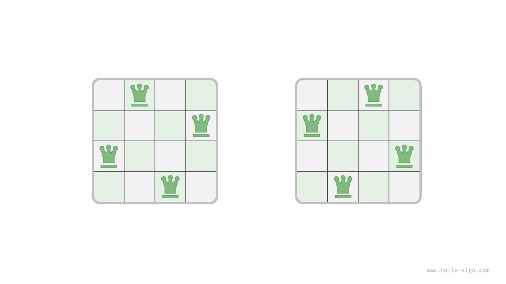
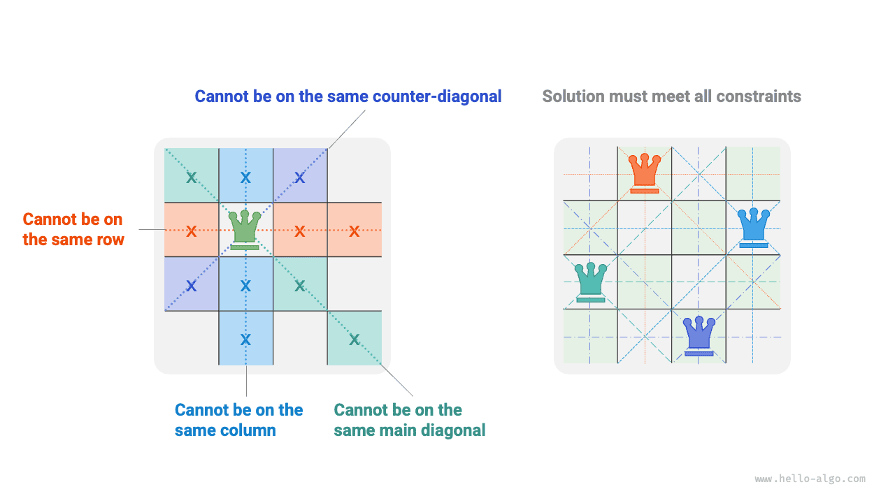

# Bài toán N quân hậu

!!! question

    Theo luật cờ vua, quân hậu có thể tấn công bất kỳ quân cờ nào nằm trên cùng một hàng, một cột hoặc một đường chéo với nó. Cho $n$ quân hậu và một bàn cờ kích thước $n \times n$, hãy tìm các phương án sắp xếp sao cho tất cả các quân hậu đều không thể tấn công lẫn nhau.

Như hình dưới đây, khi $n = 4$, có thể tìm thấy tổng cộng hai lời giải. Xét từ góc độ của thuật toán quay lui, bàn cờ kích thước $n \times n$ có tổng cộng $n^2$ ô cờ, cung cấp toàn bộ các lựa chọn `choices`. Trong quá trình lần lượt đặt từng quân hậu, trạng thái của bàn cờ liên tục thay đổi, trạng thái bàn cờ tại mỗi thời điểm chính là `state`.



Hình dưới đây minh hoạ ba điều kiện ràng buộc của bài toán này: **nhiều quân hậu không được cùng nằm trên một hàng, một cột hay trên cùng một đường chéo**. Cần lưu ý rằng đường chéo chia thành hai loại: đường chéo chính `\` và đường chéo phụ `/`.



### Chiến lược đặt theo từng hàng

Số lượng quân hậu và số hàng của bàn cờ đều bằng $n$, do đó chúng ta dễ dàng suy ra một kết luận: **mỗi hàng của bàn cờ cho phép và chỉ cho phép đặt duy nhất một quân hậu**.

Nói cách khác, chúng ta có thể áp dụng chiến lược đặt theo từng hàng: bắt đầu từ hàng đầu tiên, đặt một quân hậu trên mỗi hàng cho đến khi hoàn thành hàng cuối cùng.

Hình dưới đây minh hoạ quá trình đặt theo từng hàng của bài toán 4 quân hậu. Do giới hạn về khung hình, hình vẽ dưới đây chỉ mở rộng một trong các nhánh tìm kiếm của hàng thứ nhất, và đã cắt tỉa toàn bộ các phương án không thoả mãn ràng buộc về cột và đường chéo.


Xét về mặt bản chất, **chiến lược đặt theo từng hàng đóng vai trò như một thao tác cắt tỉa**, nó loại bỏ toàn bộ các nhánh tìm kiếm xuất hiện nhiều quân hậu trên cùng một hàng.

### Cắt tỉa theo cột và đường chéo

Để thoả mãn ràng buộc theo cột, chúng ta có thể sử dụng một mảng boolean `cols` có độ dài $n$ để ghi nhận mỗi cột đã có quân hậu hay chưa. Trước mỗi lần quyết định đặt quân hậu, chúng ta dựa vào `cols` để cắt tỉa các cột đã có quân hậu, và cập nhật động trạng thái của `cols` trong quá trình quay lui.

!!! tip

    Xin lưu ý rằng gốc toạ độ của ma trận nằm ở góc trên bên trái, trong đó chỉ số hàng tăng dần từ trên xuống dưới, chỉ số cột tăng dần từ trái sang phải.

Vậy làm thế nào để xử lý ràng buộc đường chéo? Giả sử chỉ số hàng và cột của một ô cờ nào đó trên bàn cờ là $(row, col)$, chọn một đường chéo chính trong ma trận, chúng ta nhận thấy tất cả các ô cờ trên đường chéo chính đó đều có hiệu giữa chỉ số hàng và chỉ số cột bằng nhau, **tức là $row - col$ của mọi ô cờ trên cùng một đường chéo chính là một hằng số**.

Nói cách khác, nếu hai ô cờ thoả mãn $row_1 - col_1 = row_2 - col_2$ thì chúng chắc chắn nằm trên cùng một đường chéo chính. Tận dụng quy luật này, chúng ta có thể nhờ mảng `diags1` như hình dưới đây để ghi nhận xem mỗi đường chéo chính đã có quân hậu hay chưa.

Tương tự, **tổng $row + col$ của toàn bộ các ô cờ trên cùng một đường chéo phụ là một hằng số**. Chúng ta cũng có thể nhờ mảng `diags2` để xử lý ràng buộc đường chéo phụ.


### Hiện thực mã nguồn

Xin lưu ý rằng trong ma trận vuông cấp $n$, phạm vi của $row - col$ là $[-n + 1, n - 1]$, phạm vi của $row + col$ là $[0, 2n - 2]$, do đó số lượng đường chéo chính và đường chéo phụ đều là $2n - 1$, tức độ dài của cả hai mảng `diags1` và `diags2` đều là $2n - 1$.

```src
[file]{n_queens}-[class]{}-[func]{n_queens}
```

Đặt theo từng hàng $n$ lần, xét theo ràng buộc cột thì từ hàng thứ nhất đến hàng cuối cùng lần lượt có $n$, $n-1$, $\dots$, $2$, $1$ lựa chọn, sử dụng thời gian $O(n!)$. Khi ghi nhận lời giải, cần sao chép ma trận `state` và thêm vào `res`, thao tác sao chép mất thời gian $O(n^2)$. Do đó, **tổng độ phức tạp thời gian là $O(n! \cdot n^2)$**. Trên thực tế, việc cắt tỉa dựa trên ràng buộc đường chéo cũng có thể thu hẹp đáng kể không gian tìm kiếm, vì vậy hiệu năng tìm kiếm thực tế thường vượt trội hơn nhiều so với độ phức tạp thời gian nêu trên.

Mảng `state` sử dụng $O(n^2)$ không gian, các mảng `cols`, `diags1` và `diags2` đều sử dụng $O(n)$ không gian. Độ sâu đệ quy tối đa là $n$, chiếm dụng $O(n)$ không gian khung ngăn xếp. Do đó, **tổng độ phức tạp không gian là $O(n^2)$**.
