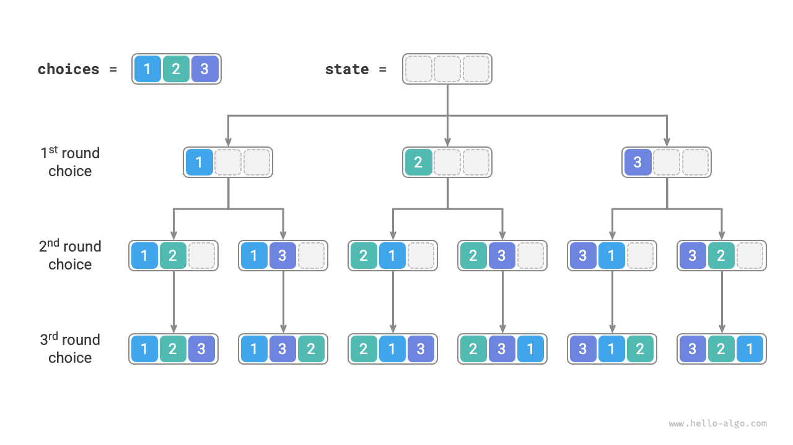
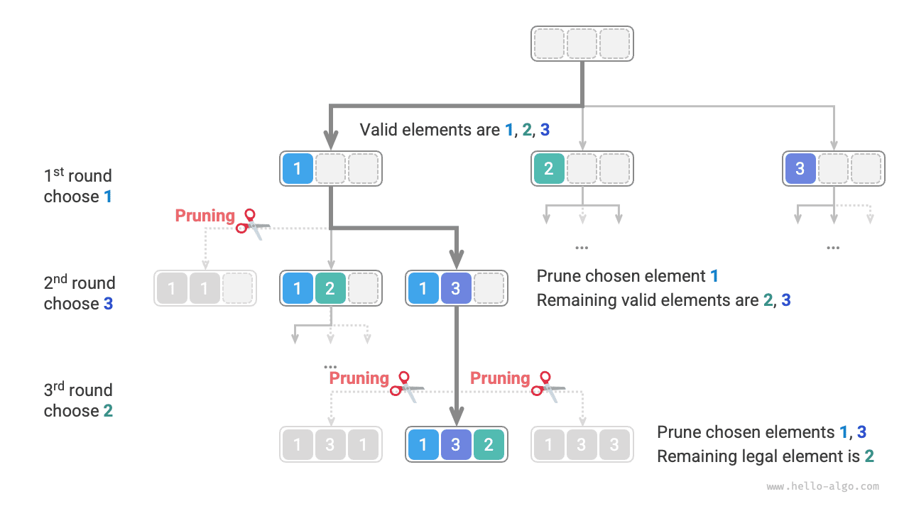
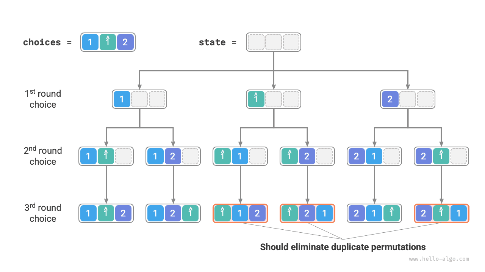
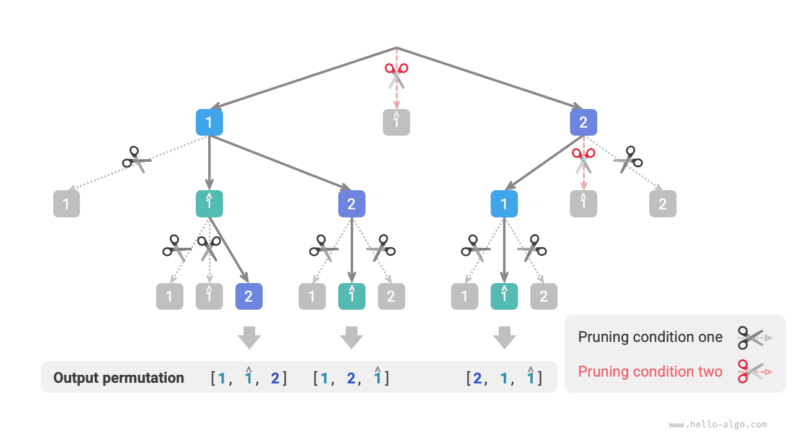

# Bài toán hoán vị

Bài toán hoán vị (permutations problem) là một ứng dụng điển hình của thuật toán quay lui. Nó được định nghĩa là trong trường hợp cho trước một tập hợp (chẳng hạn như một mảng hoặc chuỗi ký tự), hãy tìm ra tất cả các cách sắp xếp (hoán vị) có thể có của các phần tử trong đó.

Bảng dưới đây liệt kê một vài ví dụ về dữ liệu, bao gồm mảng đầu vào và toàn bộ các hoán vị tương ứng:

<p align="center"> Bảng <id> &nbsp; Ví dụ về hoán vị </p>

| Mảng đầu vào | Toàn bộ các hoán vị |
| :--- | :--- |
| $[1]$ | $[1]$ |
| $[1, 2]$ | $[1, 2], [2, 1]$ |
| $[1, 2, 3]$ | $[1, 2, 3], [1, 3, 2], [2, 1, 3], [2, 3, 1], [3, 1, 2], [3, 2, 1]$ |

## Trường hợp không có phần tử trùng lặp

!!! question

    Nhập một mảng số nguyên không chứa các phần tử trùng lặp, hãy trả về tất cả các hoán vị khả dĩ.

Xét từ góc độ của thuật toán quay lui, **chúng ta có thể hình dung quá trình sinh ra hoán vị là kết quả của một chuỗi các lựa chọn**. Giả sử mảng đầu vào là $[1, 2, 3]$ ，nếu chúng ta chọn $1$ trước, sau đó chọn $3$ ，cuối cùng chọn $2$ ，thì sẽ thu được hoán vị $[1, 3, 2]$ 。Quay lui đại diện cho việc huỷ bỏ một lựa chọn, sau đó tiếp tục thử các lựa chọn khác.

Xét từ góc độ mã nguồn quay lui, tập hợp ứng viên `choices` là toàn bộ các phần tử trong mảng đầu vào, trạng thái `state` là các phần tử đã được chọn cho đến thời điểm hiện tại. Xin lưu ý rằng mỗi phần tử chỉ được phép chọn đúng một lần, **do đó mọi phần tử trong `state` đều phải là duy nhất**.

Như hình dưới đây, chúng ta có thể triển khai quá trình tìm kiếm thành một cây đệ quy, mỗi nút trong cây đại diện cho một trạng thái hiện tại `state` 。Xuất phát từ nút gốc, sau ba vòng lựa chọn sẽ chạm tới nút lá, mỗi nút lá đều tương ứng với một hoán vị hoàn chỉnh.



### Cắt tỉa lựa chọn trùng lặp

Để đảm bảo mỗi phần tử chỉ được chọn đúng một lần, chúng ta cân nhắc đưa vào một mảng boolean `selected` ，trong đó `selected[i]` biểu thị `choices[i]` đã được chọn hay chưa, và dựa vào đó để thực hiện thao tác cắt tỉa sau:

- Sau khi đưa ra lựa chọn `choices[i]` ，chúng ta gán giá trị cho `selected[i]` là $\text{True}$ ，đại diện cho việc nó đã được chọn.
- Khi duyệt qua danh sách các lựa chọn `choices` ，bỏ qua toàn bộ các nút đã được chọn, tức là thực hiện cắt tỉa.

Như hình dưới đây, giả sử ở vòng 1 chúng ta chọn 1, ở vòng 2 chọn 3, ở vòng 3 chọn 2, khi đó cần phải cắt tỉa nhánh của phần tử 1 ở vòng 2, và cắt tỉa nhánh của phần tử 1 cùng phần tử 3 ở vòng 3.



Quan sát hình trên nhận thấy thao tác cắt tỉa này đã giảm kích thước không gian tìm kiếm từ $O(n^n)$ xuống còn $O(n!)$ 。

### Hiện thực mã nguồn

Sau khi đã nắm rõ các thông tin trên, chúng ta có thể làm bài tập "điền vào chỗ trống" trong khung mã nguồn. Để rút gọn mã nguồn tổng thể, chúng ta không hiện thực riêng rẽ từng hàm trong khung mẫu mà triển khai trực tiếp bên trong hàm `backtrack()` ：

```src
[file]{permutations_i}-[class]{}-[func]{permutations_i}
```

## Trường hợp có phần tử trùng lặp

!!! question

    Nhập một mảng số nguyên **có thể chứa các phần tử trùng lặp**, hãy trả về tất cả các hoán vị không trùng lặp.

Giả sử mảng đầu vào là $[1, 1, 2]$ 。Để tiện cho việc phân biệt hai phần tử $1$ trùng lặp, chúng ta ký hiệu số $1$ thứ hai là $\hat{1}$ 。

Như hình dưới đây, một nửa số lượng hoán vị do phương pháp trên sinh ra là bị trùng lặp.



Vậy làm thế nào để loại bỏ các hoán vị trùng lặp? Cách tiếp cận trực tiếp nhất là nhờ một tập hợp băm (HashSet) để khử trùng lặp trực tiếp trên kết quả hoán vị. Tuy nhiên làm như vậy không được tao nhã, **bởi vì các nhánh tìm kiếm sinh ra hoán vị trùng lặp là hoàn toàn không cần thiết, cần phải nhận diện và cắt tỉa từ sớm**, làm như vậy có thể nâng cao hơn nữa hiệu năng của thuật toán.

### Cắt tỉa phần tử bằng nhau

Quan sát hình dưới đây, ở vòng 1, việc chọn $1$ hay chọn $\hat{1}$ là hoàn toàn tương đương nhau, dưới hai lựa chọn này toàn bộ các hoán vị sinh ra đều trùng lặp. Do đó nên cắt tỉa nhánh của $\hat{1}$ 。

Tương tự, sau khi đã chọn $2$ ở vòng 1, thì việc chọn $1$ và $\hat{1}$ ở vòng 2 cũng sẽ sinh ra các nhánh trùng lặp, do đó cũng nên cắt tỉa $\hat{1}$ ở vòng 2.

Xét về mặt bản chất, **mục tiêu của chúng ta là trong cùng một vòng lựa chọn, đảm bảo nhiều phần tử có giá trị bằng nhau chỉ được chọn đúng một lần**.


### Hiện thực mã nguồn

Trên nền tảng mã nguồn của bài toán trước, chúng ta cân nhắc mở một tập hợp băm `duplicated` trong mỗi vòng lựa chọn để ghi lại các phần tử đã thử qua trong vòng đó, và cắt tỉa các phần tử trùng lặp:

```src
[file]{permutations_ii}-[class]{}-[func]{permutations_ii}
```

Giả sử các phần tử đôi một khác nhau thì $n$ phần tử sẽ có tổng cộng $n!$ cách hoán vị (giai thừa); khi ghi nhận kết quả cần sao chép danh sách có độ dài $n$ ，mất thời gian $O(n)$ 。**Do đó tổng độ phức tạp thời gian là $O(n!n)$** 。

Độ sâu đệ quy tối đa là $n$ ，chiếm dụng $O(n)$ không gian khung ngăn xếp. Mảng `selected` sử dụng $O(n)$ không gian. Tại cùng một thời điểm có tối đa $n$ tập hợp `duplicated` ，sử dụng $O(n^2)$ không gian. **Do đó tổng độ phức tạp không gian là $O(n^2)$** 。

### So sánh hai điều kiện cắt tỉa

Xin lưu ý rằng, mặc dù cả `selected` và `duplicated` đều dùng cho việc cắt tỉa, nhưng mục tiêu của chúng hoàn toàn khác nhau:

- **Cắt tỉa lựa chọn trùng lặp**: Trong toàn bộ quá trình tìm kiếm chỉ có duy nhất một `selected` 。Nó ghi lại trạng thái hiện tại đang chứa những phần tử nào, tác dụng của nó là tránh cho một phần tử nào đó xuất hiện lặp lại trong `state` 。
- **Cắt tỉa phần tử bằng nhau**: Mỗi vòng lựa chọn (mỗi lời gọi hàm `backtrack`) đều chứa một `duplicated` riêng biệt. Nó ghi lại trong vòng lặp hiện tại (`for` loop) những phần tử nào đã từng được chọn qua, tác dụng của nó là đảm bảo các phần tử có giá trị bằng nhau chỉ được chọn đúng một lần.

Hình dưới đây minh hoạ phạm vi hiệu lực của hai điều kiện cắt tỉa. Chú ý rằng mỗi nút trong cây đại diện cho một lựa chọn, các nút nằm trên đường đi từ nút gốc đến nút lá tạo thành một hoán vị hoàn chỉnh.


