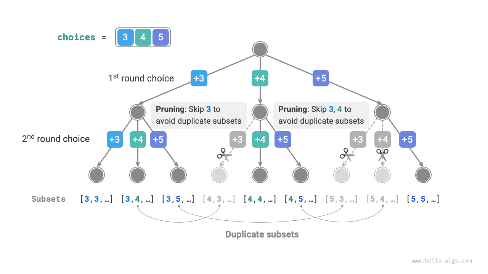

# Bài toán tổng tập con

## Trường hợp không có phần tử trùng lặp

!!! question

    Cho một mảng số nguyên dương `nums` và một số nguyên dương mục tiêu `target` ，hãy tìm ra tất cả các tổ hợp khả dĩ sao cho tổng các phần tử trong tổ hợp bằng `target` 。Mảng cho trước không chứa các phần tử trùng lặp, mỗi phần tử có thể được chọn nhiều lần. Hãy trả về các tổ hợp này dưới dạng danh sách, trong danh sách không được chứa các tổ hợp trùng lặp.

Ví dụ, nhập tập hợp $\{3, 4, 5\}$ và số nguyên mục tiêu $9$ ，lời giải là $\{3, 3, 3\}, \{4, 5\}$ 。Cần lưu ý hai điểm sau:

- Các phần tử trong tập hợp đầu vào có thể được chọn lặp lại vô số lần.
- Tập con không phân biệt thứ tự phần tử, chẳng hạn $\{4, 5\}$ và $\{5, 4\}$ là cùng một tập con.

### Tham khảo cách giải bài toán hoán vị

Tương tự như bài toán hoán vị, chúng ta có thể hình dung quá trình sinh ra tập con là kết quả của một chuỗi các lựa chọn, và liên tục cập nhật "tổng các phần tử" trong quá trình lựa chọn; khi tổng các phần tử bằng `target` ，thì ghi nhận tập con vào danh sách kết quả.

Khác với bài toán hoán vị, **các phần tử trong tập hợp của bài toán này có thể được chọn vô số lần**, do đó không cần nhờ đến danh sách boolean `selected` để ghi lại phần tử đã được chọn hay chưa. Chúng ta có thể sửa đổi đôi chút mã nguồn bài toán hoán vị để thu được mã giải bài toán ban đầu:

```src
[file]{subset_sum_i_naive}-[class]{}-[func]{subset_sum_i_naive}
```

Nhập mảng $[3, 4, 5]$ và phần tử mục tiêu $9$ vào mã nguồn trên, kết quả xuất ra là $[3, 3, 3], [4, 5], [5, 4]$ 。**Mặc dù đã tìm thành công tất cả các tập con có tổng bằng $9$, nhưng trong đó tồn tại các tập con trùng lặp là $[4, 5]$ và $[5, 4]$** 。

Nguyên nhân là do quá trình tìm kiếm có phân biệt thứ tự lựa chọn, trong khi tập con lại không phân biệt thứ tự lựa chọn. Như hình dưới đây, việc chọn $4$ trước rồi chọn $5$ sau và việc chọn $5$ trước rồi chọn $4$ sau là hai nhánh khác nhau, nhưng lại tương ứng với cùng một tập con.


Để loại bỏ các tập con trùng lặp, **một hướng tiếp cận trực tiếp là thực hiện khử trùng lặp trên danh sách kết quả**. Tuy nhiên phương pháp này có hiệu năng rất thấp, vì hai lý do:

- Khi mảng có nhiều phần tử, đặc biệt là khi `target` lớn, quá trình tìm kiếm sẽ sinh ra lượng lớn các tập con trùng lặp.
- Việc so sánh sự giống/khác nhau giữa các tập con (mảng) rất tốn thời gian, cần phải sắp xếp mảng trước, rồi mới so sánh từng phần tử trong mảng.

### Cắt tỉa tập con trùng lặp

**Chúng ta cân nhắc việc khử trùng lặp thông qua cắt tỉa ngay trong quá trình tìm kiếm**. Quan sát hình dưới đây, các tập con trùng lặp được sinh ra khi chọn các phần tử của mảng theo các thứ tự khác nhau, ví dụ các tình huống sau:

1. Khi vòng 1 và vòng 2 lần lượt chọn $3$ và $4$ ，sẽ sinh ra tất cả các tập con chứa hai phần tử này, ký hiệu là $[3, 4, \dots]$ 。
2. Sau đó, khi vòng 1 chọn $4$ ，**thì vòng 2 nên bỏ qua $3$**, bởi vì các tập con $[4, 3, \dots]$ sinh ra từ lựa chọn này hoàn toàn trùng lặp với các tập con đã sinh ra ở bước `1.` 。

Trong quá trình tìm kiếm, các lựa chọn ở mỗi tầng đều được thử lần lượt từ trái sang phải, do đó các nhánh càng nằm về bên phải sẽ càng bị cắt tỉa nhiều hơn:

1. Hai vòng đầu tiên chọn $3$ và $5$ ，sinh ra tập con $[3, 5, \dots]$ 。
2. Hai vòng đầu tiên chọn $4$ và $5$ ，sinh ra tập con $[4, 5, \dots]$ 。
3. Nếu vòng 1 chọn $5$ ，**thì vòng 2 nên bỏ qua $3$ và $4$**, bởi vì các tập con $[5, 3, \dots]$ và $[5, 4, \dots]$ hoàn toàn trùng lặp với các tập con đã mô tả ở bước `1.` và bước `2.` 。



Tổng kết lại, cho mảng đầu vào $[x_1, x_2, \dots, x_n]$ ，đặt chuỗi các lựa chọn trong quá trình tìm kiếm là $[x_{i_1}, x_{i_2}, \dots, x_{i_m}]$ ，khi đó chuỗi lựa chọn này cần thoả mãn $i_1 \leq i_2 \leq \dots \leq i_m$ ；**bất kỳ chuỗi lựa chọn nào không thoả mãn điều kiện này đều sẽ gây ra sự trùng lặp và cần phải cắt tỉa**.

### Hiện thực mã nguồn

Để hiện thực việc cắt tỉa này, chúng ta khởi tạo một biến `start` dùng để chỉ định điểm bắt đầu duyệt. **Sau khi đưa ra lựa chọn $x_{i}$, thiết lập vòng tiếp theo bắt đầu duyệt từ chỉ số $i$**. Làm như vậy có thể khiến chuỗi lựa chọn luôn thoả mãn $i_1 \leq i_2 \leq \dots \leq i_m$ ，từ đó đảm bảo tính duy nhất của tập con.

Ngoài ra, chúng ta còn thực hiện thêm hai tối ưu hoá sau cho mã nguồn:

- Trước khi bắt đầu tìm kiếm, sắp xếp mảng `nums` trước. Khi duyệt qua tất cả các lựa chọn, **nếu tổng tập con vượt quá `target` thì kết thúc vòng lặp ngay lập tức**, bởi vì các phần tử phía sau lớn hơn nên tổng tập con chắc chắn sẽ vượt quá `target` 。
- Lược bỏ biến lưu tổng phần tử `total` ，**thay vào đó thực hiện phép trừ trực tiếp trên `target` để theo dõi tổng phần tử**, khi `target` bằng $0$ thì ghi nhận lời giải.

```src
[file]{subset_sum_i}-[class]{}-[func]{subset_sum_i}
```

Hình dưới đây minh hoạ toàn bộ quá trình quay lui khi nhập mảng $[3, 4, 5]$ và phần tử mục tiêu $9$ vào mã nguồn trên.


## Trường hợp có phần tử trùng lặp

!!! question

    Cho một mảng số nguyên dương `nums` và một số nguyên dương mục tiêu `target` ，hãy tìm ra tất cả các tổ hợp khả dĩ sao cho tổng các phần tử trong tổ hợp bằng `target` 。**Mảng cho trước có thể chứa các phần tử trùng lặp, mỗi phần tử chỉ được chọn đúng một lần**. Hãy trả về các tổ hợp này dưới dạng danh sách, trong danh sách không được chứa các tổ hợp trùng lặp.

So với bài toán trước, **mảng đầu vào của bài này có thể chứa các phần tử trùng lặp**, điều này kéo theo vấn đề mới. Ví dụ, cho mảng $[4, \hat{4}, 5]$ và phần tử mục tiêu $9$ ，kết quả xuất ra của mã nguồn hiện tại sẽ là $[4, 5], [\hat{4}, 5]$ ，xuất hiện các tập con trùng lặp.

**Nguyên nhân gây ra sự trùng lặp này là do các phần tử có giá trị bằng nhau bị chọn nhiều lần trong cùng một vòng**. Trong hình dưới đây, vòng 1 có tổng cộng ba lựa chọn, trong đó có hai lựa chọn đều là số $4$ ，sẽ sinh ra hai nhánh tìm kiếm trùng lặp, từ đó xuất ra tập con trùng lặp; tương tự, hai số $4$ ở vòng 2 cũng sẽ sinh ra các tập con trùng lặp.


### Cắt tỉa phần tử bằng nhau

Để giải quyết vấn đề này, **chúng ta cần giới hạn các phần tử có giá trị bằng nhau chỉ được phép chọn đúng một lần trong mỗi vòng**. Cách hiện thực tương đối khéo léo: do mảng đã được sắp xếp sẵn nên các phần tử bằng nhau sẽ nằm liền kề nhau. Điều này đồng nghĩa với việc trong một vòng lựa chọn, nếu phần tử hiện tại bằng với phần tử bên trái nó, chứng tỏ nó đã từng được chọn qua, do đó trực tiếp bỏ qua phần tử hiện tại.

Đồng thời, **bài toán quy định mỗi phần tử của mảng chỉ được chọn đúng một lần**. May mắn thay, chúng ta cũng có thể tận dụng biến `start` để thoả mãn ràng buộc này: sau khi đưa ra lựa chọn $x_{i}$, thiết lập vòng tiếp theo bắt đầu duyệt từ chỉ số $i + 1$ về sau. Làm như vậy vừa có thể loại bỏ các tập con trùng lặp, vừa tránh được việc chọn lặp lại một phần tử.

### Hiện thực mã nguồn

```src
[file]{subset_sum_ii}-[class]{}-[func]{subset_sum_ii}
```

Hình dưới đây minh hoạ quá trình quay lui của mảng $[4, 4, 5]$ và phần tử mục tiêu $9$ ，bao gồm tổng cộng bốn thao tác cắt tỉa. Mời bạn kết hợp hình vẽ và chú thích trong mã nguồn để thấu hiểu toàn bộ quá trình tìm kiếm cũng như cách thức hoạt động của từng thao tác cắt tỉa.


