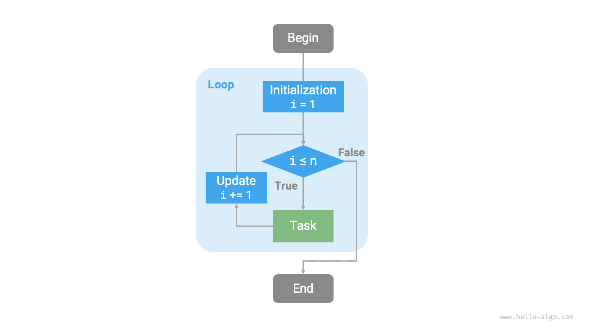
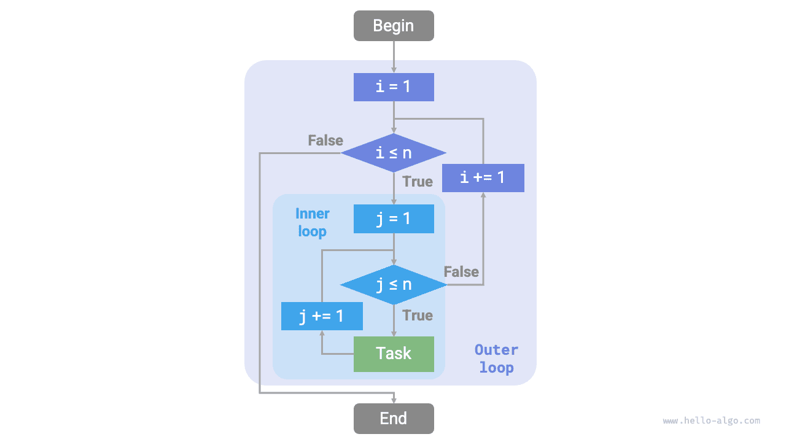
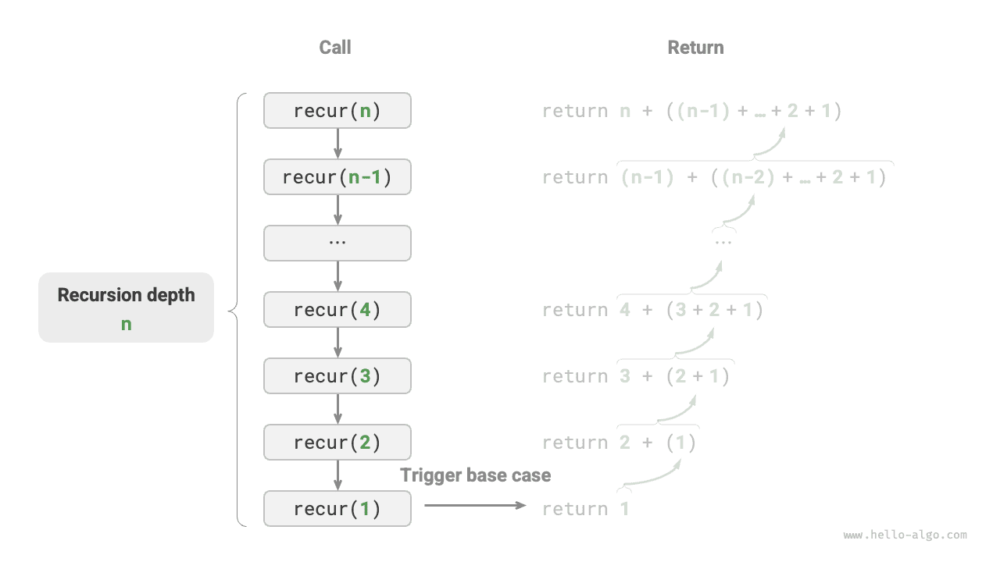
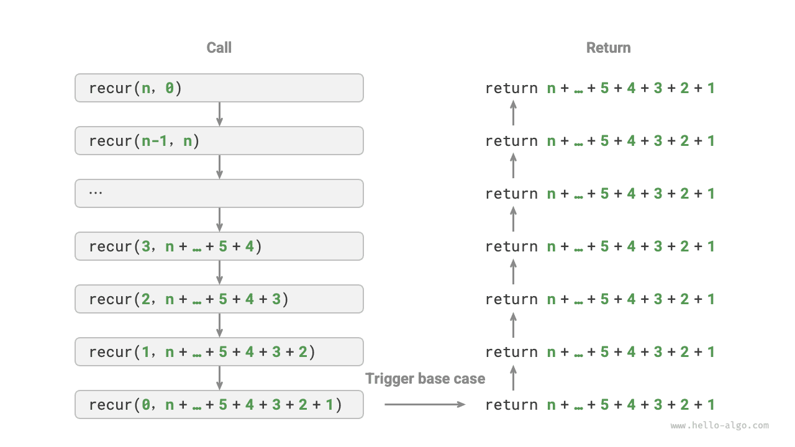

# Vòng lặp và đệ quy

Trong thuật toán, việc thực thi lặp đi lặp lại một tác vụ nào đó là vô cùng phổ biến, và nó gắn bó mật thiết với phân tích độ phức tạp. Vì vậy, trước khi tìm hiểu về độ phức tạp thời gian và độ phức tạp không gian, trước hết chúng ta hãy cùng xem cách hiện thực việc lặp lại tác vụ trong chương trình thông qua hai cấu trúc điều khiển cơ bản: phép lặp (vòng lặp) và đệ quy.

## Phép lặp (Vòng lặp)

<u>Phép lặp (iteration)</u> là một cấu trúc điều khiển thực thi lặp đi lặp lại một tác vụ nhất định. Trong phép lặp, chương trình sẽ lặp lại một đoạn mã khi điều kiện còn được thoả mãn, cho đến khi điều kiện đó không còn đúng nữa.

### Vòng lặp for

Vòng lặp `for` là một trong những dạng lặp phổ biến nhất, **thích hợp sử dụng khi đã biết trước số lần lặp**.

Hàm dưới đây sử dụng vòng lặp `for` để tính tổng $1 + 2 + \dots + n$, kết quả tổng được lưu trong biến `res`. Cần lưu ý rằng trong Python, `range(a, b)` tương ứng với khoảng “đóng bên trái, mở bên phải”, phạm vi duyệt tương ứng là $a, a + 1, \dots, b-1$:

```src
[file]{iteration}-[class]{}-[func]{for_loop}
```

Hình dưới đây là sơ đồ khối quy trình của hàm tính tổng này.



Số lượng thao tác của hàm tính tổng này tỷ lệ thuận với kích thước dữ liệu đầu vào $n$, hay nói cách khác là có “mối quan hệ tuyến tính”. Trên thực tế, **độ phức tạp thời gian chính là để mô tả “mối quan hệ tuyến tính” này**. Nội dung liên quan sẽ được trình bày chi tiết trong phần tiếp theo.

### Vòng lặp while

Tương tự như vòng lặp `for`, vòng lặp `while` cũng là một phương pháp để hiện thực phép lặp. Trong vòng lặp `while`, ở mỗi vòng chương trình sẽ kiểm tra điều kiện trước, nếu điều kiện là đúng (`true`) thì tiếp tục thực thi, ngược lại sẽ kết thúc vòng lặp.

Dưới đây chúng ta sử dụng vòng lặp `while` để tính tổng $1 + 2 + \dots + n$:

```src
[file]{iteration}-[class]{}-[func]{while_loop}
```

**Vòng lặp `while` có độ tự do cao hơn vòng lặp `for`**. Trong vòng lặp `while`, chúng ta có thể thoải mái thiết kế các bước khởi tạo và cập nhật biến điều kiện.

Ví dụ trong đoạn mã dưới đây, biến điều kiện $i$ được cập nhật hai lần trong mỗi vòng lặp, trường hợp này sẽ không thuận tiện nếu dùng vòng lặp `for`:

```src
[file]{iteration}-[class]{}-[func]{while_loop_ii}
```

Nhìn chung, **mã nguồn của vòng lặp `for` gọn gàng hơn, còn vòng lặp `while` linh hoạt hơn**, cả hai đều có thể dùng để xây dựng cấu trúc lặp. Việc lựa chọn phương thức nào nên dựa trên nhu cầu của bài toán cụ thể.

### Vòng lặp lồng nhau

Chúng ta có thể lồng một cấu trúc vòng lặp bên trong một cấu trúc vòng lặp khác, dưới đây lấy vòng lặp `for` làm ví dụ:

```src
[file]{iteration}-[class]{}-[func]{nested_for_loop}
```

Hình dưới đây là sơ đồ khối quy trình của vòng lặp lồng nhau này.



Trong trường hợp này, số lượng thao tác của hàm tỷ lệ thuận với $n^2$, hay nói cách khác thời gian thực thi của thuật toán và kích thước dữ liệu đầu vào $n$ có “mối quan hệ bình phương”.

Chúng ta có thể tiếp tục thêm các vòng lặp lồng nhau; mỗi lần lồng thêm là một lần “tăng bậc”, sẽ khiến độ phức tạp thời gian tăng lên “mối quan hệ bậc ba”, “mối quan hệ bậc bốn”, và cứ thế tiếp tục.

## Đệ quy

<u>Đệ quy (recursion)</u> là một chiến lược thuật toán giải quyết vấn đề bằng cách cho hàm tự gọi lại chính nó. Đệ quy chủ yếu bao gồm hai giai đoạn:

1. **Đi sâu (递 - Gọi đệ quy)**: Chương trình liên tục gọi sâu dần vào chính nó, thông thường truyền vào các tham số nhỏ hơn hoặc đơn giản hơn, cho đến khi chạm tới “điều kiện dừng”.
2. **Quay về (归 - Trả kết quả)**: Sau khi kích hoạt “điều kiện dừng”, chương trình bắt đầu lần lượt trả kết quả từ tầng hàm đệ quy sâu nhất trở về, tổng hợp kết quả của từng tầng.

Đứng từ góc độ hiện thực, mã nguồn đệ quy chủ yếu gồm ba yếu tố:

1. **Điều kiện dừng**: Dùng để quyết định thời điểm chuyển từ giai đoạn “đi sâu” sang giai đoạn “quay về”.
2. **Lời gọi đệ quy**: Tương ứng với giai đoạn “đi sâu”, hàm gọi lại chính nó, thông thường nhận đầu vào là các tham số nhỏ hơn hoặc đơn giản hơn.
3. **Trả về kết quả**: Tương ứng với giai đoạn “quay về”, trả kết quả của tầng đệ quy hiện tại về cho tầng phía trên.

Quan sát đoạn mã dưới đây, chúng ta chỉ cần gọi hàm `recur(n)` là có thể hoàn thành phép tính $1 + 2 + \dots + n$:

```src
[file]{recursion}-[class]{}-[func]{recur}
```

Hình dưới đây minh hoạ quá trình đệ quy của hàm này.


Mặc dù đứng từ góc độ tính toán, phép lặp và đệ quy có thể cho ra cùng một kết quả, **nhưng chúng đại diện cho hai mô thức tư duy và giải quyết vấn đề hoàn toàn khác nhau**:

- **Phép lặp**: “Từ dưới lên” (bottom-up) giải quyết vấn đề. Bắt đầu từ bước cơ sở nhất, sau đó liên tục lặp lại hoặc tích luỹ các bước này cho đến khi hoàn thành tác vụ.
- **Đệ quy**: “Từ trên xuống” (top-down) giải quyết vấn đề. Phân rã bài toán ban đầu thành các bài toán con nhỏ hơn có cùng cấu trúc với bài toán gốc. Tiếp tục phân rã các bài toán con thành các bài toán nhỏ hơn nữa cho đến khi chạm trường hợp cơ sở thì dừng lại (nghiệm của trường hợp cơ sở đã được biết trước).

Lấy hàm tính tổng ở trên làm ví dụ, đặt bài toán là $f(n) = 1 + 2 + \dots + n$.

- **Phép lặp**: Mô phỏng quá trình tính tổng trong vòng lặp, duyệt từ $1$ đến $n$, mỗi vòng thực hiện phép cộng là có thể tính được $f(n)$.
- **Đệ quy**: Phân rã bài toán thành bài toán con $f(n) = n + f(n-1)$, liên tục phân rã (đệ quy) như vậy cho đến khi chạm trường hợp cơ sở $f(1) = 1$ thì dừng lại.

### Ngăn xếp lời gọi hàm

Mỗi lần hàm đệ quy tự gọi lại chính nó, hệ thống sẽ cấp phát bộ nhớ cho hàm mới mở để lưu trữ các biến cục bộ, địa chỉ gọi hàm và các thông tin khác. Điều này dẫn đến hai hệ quả:

- Dữ liệu ngữ cảnh của hàm đều được lưu trữ trong vùng nhớ gọi là “khung ngăn xếp” (stack frame), và chỉ được giải phóng sau khi hàm trả về. Do đó, **đệ quy thường tiêu tốn nhiều không gian bộ nhớ hơn so với vòng lặp**.
- Việc gọi hàm đệ quy sẽ phát sinh thêm chi phí phụ trội (overhead). **Vì vậy, đệ quy thường có hiệu năng thời gian thấp hơn so với vòng lặp**.

Như minh hoạ dưới đây, trước khi chạm điều kiện dừng, đồng thời tồn tại $n$ hàm đệ quy chưa trả về, **độ sâu đệ quy là $n$**.



Trong thực tế, độ sâu đệ quy mà các ngôn ngữ lập trình cho phép thường có giới hạn, đệ quy quá sâu có thể dẫn đến lỗi tràn ngăn xếp (stack overflow).

### Đệ quy đuôi

Điều thú vị là, **nếu lời gọi đệ quy là thao tác cuối cùng trước khi hàm trả về**, thì hàm đó có thể được trình biên dịch hoặc trình thông dịch tối ưu hoá, giúp hiệu năng không gian của nó tương đương với vòng lặp. Trường hợp này được gọi là <u>đệ quy đuôi (tail recursion)</u>.

- **Đệ quy thông thường**: Sau khi hàm trả về tầng phía trên, nó cần tiếp tục thực thi các đoạn mã khác, do đó hệ thống bắt buộc phải lưu lại ngữ cảnh của tầng gọi trước đó.
- **Đệ quy đuôi**: Lời gọi đệ quy là thao tác cuối cùng trước khi hàm trả về, đồng nghĩa với việc sau khi hàm con trả về, không cần thực hiện thêm bất kỳ thao tác nào khác, do đó hệ thống không cần phải lưu lại ngữ cảnh của hàm tầng trên.

Lấy việc tính tổng $1 + 2 + \dots + n$ làm ví dụ, chúng ta có thể đưa biến kết quả `res` vào làm tham số của hàm để hiện thực đệ quy đuôi:

```src
[file]{recursion}-[class]{}-[func]{tail_recur}
```

Quá trình thực thi của đệ quy đuôi được thể hiện như trong hình dưới đây. So sánh giữa đệ quy thông thường và đệ quy đuôi, thời điểm thực hiện phép cộng của cả hai là khác nhau:

- **Đệ quy thông thường**: Phép cộng được thực hiện trong quá trình “quay về”, mỗi tầng sau khi trả về đều phải thực hiện thêm một phép cộng.
- **Đệ quy đuôi**: Phép cộng được thực hiện trong quá trình “đi sâu”, quá trình “quay về” chỉ đơn thuần là lần lượt trả kết quả về.



!!! tip

    Xin lưu ý rằng nhiều trình biên dịch hoặc trình thông dịch không hỗ trợ tối ưu hoá đệ quy đuôi. Ví dụ, Python mặc định không hỗ trợ tối ưu hoá đệ quy đuôi, do đó ngay cả khi hàm được viết dưới dạng đệ quy đuôi thì vẫn có thể gặp lỗi tràn ngăn xếp.

### Cây đệ quy

Khi xử lý các bài toán thuật toán liên quan đến “chia để trị”, tư duy đệ quy thường trực quan hơn và mã nguồn dễ đọc hơn so với vòng lặp. Lấy “dãy Fibonacci” làm ví dụ:

!!! question

    Cho dãy số Fibonacci $0, 1, 1, 2, 3, 5, 8, 13, \dots$, hãy tìm số thứ $n$ của dãy số này.

Đặt số thứ $n$ của dãy Fibonacci là $f(n)$, ta dễ dàng rút ra hai kết luận:

- Hai số đầu tiên của dãy là $f(1) = 0$ và $f(2) = 1$.
- Mỗi số tiếp theo trong dãy là tổng của hai số liền trước, tức là $f(n) = f(n - 1) + f(n - 2)$.

Dựa theo hệ thức truy hồi để thực hiện lời gọi đệ quy, lấy hai số đầu tiên làm điều kiện dừng, ta có thể viết được mã nguồn đệ quy. Gọi `fib(n)` là có thể nhận được số thứ $n$ của dãy Fibonacci:

```src
[file]{recursion}-[class]{}-[func]{fib}
```

Quan sát đoạn mã trên, bên trong hàm chúng ta đã đệ quy gọi hai hàm con, **điều này có nghĩa là từ một lời gọi đã phân nhánh thành hai nhánh gọi**. Như minh hoạ dưới đây, việc liên tục gọi đệ quy như vậy cuối cùng sẽ tạo ra một <u>cây đệ quy (recursion tree)</u> có số tầng là $n$.


Về bản chất, đệ quy thể hiện mô thức tư duy “chia bài toán thành các bài toán con nhỏ hơn”, và chiến lược chia để trị này đóng vai trò vô cùng quan trọng:

- Đứng từ góc độ thuật toán, nhiều chiến lược thuật toán quan trọng như tìm kiếm, sắp xếp, quay lui, chia để trị, quy hoạch động đều trực tiếp hoặc gián tiếp áp dụng phương thức tư duy này.
- Đứng từ góc độ cấu trúc dữ liệu, đệ quy rất thích hợp một cách tự nhiên để xử lý các bài toán liên quan đến danh sách liên kết, cây và đồ thị, vì chúng rất phù hợp để phân tích bằng tư tưởng chia để trị.

## So sánh giữa vòng lặp và đệ quy

Tổng kết các nội dung trên, như trong bảng dưới đây, vòng lặp và đệ quy có sự khác biệt về cách hiện thực, hiệu năng và phạm vi ứng dụng.

<p align="center"> Bảng <id> &nbsp; So sánh đặc điểm giữa vòng lặp và đệ quy </p>

|          | Phép lặp (Vòng lặp)                    | Đệ quy                                                       |
| -------- | -------------------------------------- | ------------------------------------------------------------ |
| Cách hiện thực | Cấu trúc vòng lặp                               | Hàm tự gọi lại chính nó                                                 |
| Hiệu năng thời gian | Hiệu năng thường cao hơn, không tốn chi phí gọi hàm           | Mỗi lần gọi hàm đều phát sinh chi phí phụ trội                                     |
| Sử dụng bộ nhớ | Thường sử dụng không gian bộ nhớ cố định             | Các lời gọi hàm tích luỹ có thể sử dụng lượng lớn khung ngăn xếp                           |
| Bài toán phù hợp | Phù hợp với các tác vụ lặp đơn giản, mã trực quan, dễ đọc | Phù hợp với phân rã bài toán con như cây, đồ thị, chia để trị, quay lui; cấu trúc mã súc tích, rõ ràng |

!!! tip

    Nếu cảm thấy phần nội dung dưới đây khó hiểu, bạn có thể đọc lại sau khi đã học xong chương “Ngăn xếp”.

Vậy giữa vòng lặp và đệ quy có mối liên hệ nội tại nào? Lấy hàm đệ quy ở trên làm ví dụ, phép tính tổng được thực hiện trong giai đoạn “quay về” của đệ quy. Điều này có nghĩa là hàm được gọi đầu tiên thực chất lại là hàm hoàn thành phép tính tổng sau cùng, **cơ chế hoạt động này tương đồng với nguyên lý “vào sau ra trước” (LIFO) của ngăn xếp**.

Trên thực tế, các thuật ngữ đệ quy như “ngăn xếp lời gọi hàm” và “khung ngăn xếp” đã ngầm chỉ ra mối quan hệ mật thiết giữa đệ quy và ngăn xếp:

1. **Đi sâu**: Khi một hàm được gọi, hệ thống sẽ cấp phát một khung ngăn xếp mới trên “ngăn xếp lời gọi hàm” để lưu trữ các biến cục bộ, tham số, địa chỉ trả về, v.v. của hàm đó.
2. **Quay về**: Khi hàm thực thi xong và trả về, khung ngăn xếp tương ứng sẽ được giải phóng khỏi “ngăn xếp lời gọi hàm”, khôi phục lại môi trường thực thi của hàm phía trước.

Do đó, **chúng ta có thể sử dụng một ngăn xếp tường minh để mô phỏng hành vi của ngăn xếp lời gọi hàm**, qua đó chuyển đổi đệ quy thành dạng vòng lặp:

```src
[file]{recursion}-[class]{}-[func]{for_loop_recur}
```

Quan sát đoạn mã trên, khi đệ quy được chuyển thành vòng lặp, mã nguồn trở nên phức tạp hơn nhiều. Mặc dù vòng lặp và đệ quy trong nhiều trường hợp có thể chuyển đổi qua lại, nhưng không phải lúc nào điều đó cũng đáng làm, vì hai lý do sau:

- Mã nguồn sau khi chuyển đổi có thể khó hiểu hơn và tính khả đọc kém hơn.
- Đối với một số bài toán phức tạp, việc mô phỏng hành vi của ngăn xếp lời gọi hệ thống có thể vô cùng khó khăn.

Tóm lại, **việc lựa chọn vòng lặp hay đệ quy phụ thuộc vào bản chất của bài toán cụ thể**. Trong thực hành lập trình, việc cân nhắc ưu nhược điểm của cả hai và lựa chọn phương pháp phù hợp với từng ngữ cảnh là điều hết sức quan trọng.
