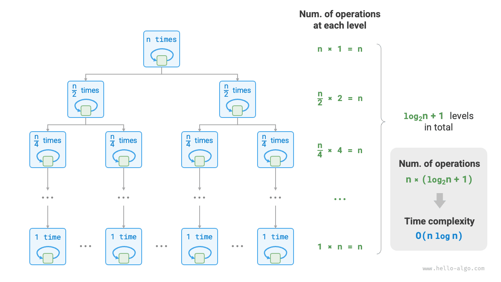
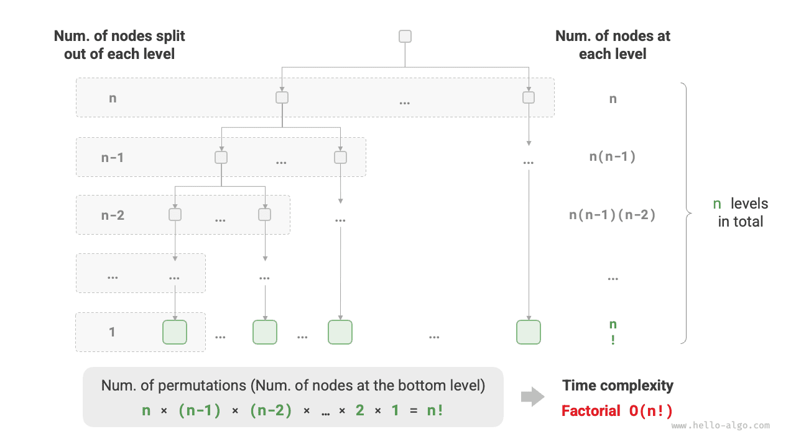

# Độ phức tạp thời gian

Thời gian thực thi có thể phản ánh hiệu năng của thuật toán một cách trực quan và chuẩn xác. Nếu chúng ta muốn ước lượng chính xác thời gian thực thi của một đoạn mã, nên tiến hành như thế nào?

1. **Xác định nền tảng thực thi**, bao gồm cấu hình phần cứng, ngôn ngữ lập trình, môi trường hệ điều hành, v.v., vì những yếu tố này đều ảnh hưởng tới hiệu năng thực thi của mã nguồn.
2. **Đánh giá thời gian thực thi cần thiết cho các phép tính toán**, ví dụ phép cộng `+` mất 1 ns, phép nhân `*` mất 10 ns, thao tác in `print()` mất 5 ns, v.v.
3. **Thống kê toàn bộ các phép tính toán trong đoạn mã**, sau đó tính tổng thời gian thực thi của tất cả các thao tác để có được tổng thời gian chạy.

Ví dụ trong đoạn mã dưới đây, kích thước dữ liệu đầu vào là $n$:

=== "Python"

    ```python title=""
    # Trên một nền tảng thực thi nhất định
    def algorithm(n: int):
        a = 2      # 1 ns
        a = a + 1  # 1 ns
        a = a * 2  # 10 ns
        # Vòng lặp n lần
        for _ in range(n):  # 1 ns
            print(0)        # 5 ns
    ```

=== "C++"

    ```cpp title=""
    // Trên một nền tảng thực thi nhất định
    void algorithm(int n) {
        int a = 2;  // 1 ns
        a = a + 1;  // 1 ns
        a = a * 2;  // 10 ns
        // Vòng lặp n lần
        for (int i = 0; i < n; i++) {  // 1 ns
            cout << 0 << endl;         // 5 ns
        }
    }
    ```

=== "Java"

    ```java title=""
    // Trên một nền tảng thực thi nhất định
    void algorithm(int n) {
        int a = 2;  // 1 ns
        a = a + 1;  // 1 ns
        a = a * 2;  // 10 ns
        // Vòng lặp n lần
        for (int i = 0; i < n; i++) {  // 1 ns
            System.out.println(0);     // 5 ns
        }
    }
    ```

=== "C#"

    ```csharp title=""
    // Trên một nền tảng thực thi nhất định
    void Algorithm(int n) {
        int a = 2;  // 1 ns
        a = a + 1;  // 1 ns
        a = a * 2;  // 10 ns
        // Vòng lặp n lần
        for (int i = 0; i < n; i++) {  // 1 ns
            Console.WriteLine(0);      // 5 ns
        }
    }
    ```

=== "Go"

    ```go title=""
    // Trên một nền tảng thực thi nhất định
    func algorithm(n int) {
        a := 2     // 1 ns
        a = a + 1  // 1 ns
        a = a * 2  // 10 ns
        // Vòng lặp n lần
        for i := 0; i < n; i++ {  // 1 ns
            fmt.Println(a)        // 5 ns
        }
    }
    ```

=== "Swift"

    ```swift title=""
    // Trên một nền tảng thực thi nhất định
    func algorithm(n: Int) {
        var a = 2 // 1 ns
        a = a + 1 // 1 ns
        a = a * 2 // 10 ns
        // Vòng lặp n lần
        for _ in 0 ..< n { // 1 ns
            print(0) // 5 ns
        }
    }
    ```

=== "JS"

    ```javascript title=""
    // Trên một nền tảng thực thi nhất định
    function algorithm(n) {
        var a = 2; // 1 ns
        a = a + 1; // 1 ns
        a = a * 2; // 10 ns
        // Vòng lặp n lần
        for (let i = 0; i < n; i++) { // 1 ns
            console.log(0); // 5 ns
        }
    }
    ```

=== "TS"

    ```typescript title=""
    // Trên một nền tảng thực thi nhất định
    function algorithm(n: number): void {
        var a: number = 2; // 1 ns
        a = a + 1; // 1 ns
        a = a * 2; // 10 ns
        // Vòng lặp n lần
        for (let i = 0; i < n; i++) { // 1 ns
            console.log(0); // 5 ns
        }
    }
    ```

=== "Dart"

    ```dart title=""
    // Trên một nền tảng thực thi nhất định
    void algorithm(int n) {
      int a = 2; // 1 ns
      a = a + 1; // 1 ns
      a = a * 2; // 10 ns
      // Vòng lặp n lần
      for (int i = 0; i < n; i++) { // 1 ns
        print(0); // 5 ns
      }
    }
    ```

=== "Rust"

    ```rust title=""
    // Trên một nền tảng thực thi nhất định
    fn algorithm(n: i32) {
        let mut a = 2; // 1 ns
        a = a + 1;     // 1 ns
        a = a * 2;     // 10 ns
        // Vòng lặp n lần
        for _ in 0..n { // 1 ns
            println!("{}", 0); // 5 ns
        }
    }
    ```

=== "C"

    ```c title=""
    // Trên một nền tảng thực thi nhất định
    void algorithm(int n) {
        int a = 2;  // 1 ns
        a = a + 1;  // 1 ns
        a = a * 2;  // 10 ns
        // Vòng lặp n lần
        for (int i = 0; i < n; i++) {  // 1 ns
            printf("%d", 0);           // 5 ns
        }
    }
    ```

=== "Kotlin"

    ```kotlin title=""
    // Trên một nền tảng thực thi nhất định
    fun algorithm(n: Int) {
        var a = 2 // 1 ns
        a = a + 1 // 1 ns
        a = a * 2 // 10 ns
        // Vòng lặp n lần
        for (i in 0..<n) { // 1 ns
            println(0) // 5 ns
        }
    }
    ```

=== "Ruby"

    ```ruby title=""
    # Trên một nền tảng thực thi nhất định
    def algorithm(n)
        a = 2      # 1 ns
        a = a + 1  # 1 ns
        a = a * 2  # 10 ns
        # Vòng lặp n lần
        (0...n).each do # 1 ns
            puts 0      # 5 ns
        end
    end
    ```

=== "Zig"

    ```zig title=""
    // Trên một nền tảng thực thi nhất định
    fn algorithm(n: usize) void {
        var a: usize = 2; // 1 ns
        a = a + 1; // 1 ns
        a = a * 2; // 10 ns
        // Vòng lặp n lần
        var i: usize = 0;
        while (i < n) : (i += 1) { // 1 ns
            std.debug.print("{}\n", .{0}); // 5 ns
        }
    }
    ```

Theo phương pháp trên, thời gian thực thi của hàm `algorithm()` là $(1 + 1 + 10 + 1 + 5) \times n + (1 + 1 + 10) = 6n + 12$ ns.

Nhưng trên thực tế, **việc thống kê thời gian thực thi của thuật toán vừa không hợp lý vừa không thực tế**. Trước hết, chúng ta không mong muốn việc ước lượng thời gian bị ràng buộc chặt chẽ với một nền tảng thực thi cụ thể, bởi thuật toán cần phải chạy được trên nhiều nền tảng khác nhau. Thứ hai, chúng ta rất khó biết chính xác thời gian thực thi của từng loại thao tác, điều này gây khó khăn cực kỳ lớn cho quá trình ước lượng.

## Thống kê xu hướng tăng trưởng thời gian

Phân tích độ phức tạp thời gian không nhằm thống kê thời gian thực thi thực tế của thuật toán, **mà thống kê xu hướng tăng trưởng của thời gian thực thi khi quy mô dữ liệu ngày càng lớn**.

Khái niệm “xu hướng tăng trưởng thời gian” khá trừu tượng, chúng ta hãy cùng tìm hiểu qua một ví dụ. Giả sử kích thước dữ liệu đầu vào là $n$, cho trước ba thuật toán `A`, `B` và `C`:

=== "Python"

    ```python title=""
    # Độ phức tạp thời gian của thuật toán A: Bậc hằng số
    def algorithm_A(n: int):
        print(0)
    # Độ phức tạp thời gian của thuật toán B: Bậc tuyến tính
    def algorithm_B(n: int):
        for _ in range(n):
            print(0)
    # Độ phức tạp thời gian của thuật toán C: Bậc hằng số
    def algorithm_C(n: int):
        for _ in range(1000000):
            print(0)
    ```

=== "C++"

    ```cpp title=""
    // Độ phức tạp thời gian của thuật toán A: Bậc hằng số
    void algorithm_A(int n) {
        cout << 0 << endl;
    }
    // Độ phức tạp thời gian của thuật toán B: Bậc tuyến tính
    void algorithm_B(int n) {
        for (int i = 0; i < n; i++) {
            cout << 0 << endl;
        }
    }
    // Độ phức tạp thời gian của thuật toán C: Bậc hằng số
    void algorithm_C(int n) {
        for (int i = 0; i < 1000000; i++) {
            cout << 0 << endl;
        }
    }
    ```

=== "Java"

    ```java title=""
    // Độ phức tạp thời gian của thuật toán A: Bậc hằng số
    void algorithm_A(int n) {
        System.out.println(0);
    }
    // Độ phức tạp thời gian của thuật toán B: Bậc tuyến tính
    void algorithm_B(int n) {
        for (int i = 0; i < n; i++) {
            System.out.println(0);
        }
    }
    // Độ phức tạp thời gian của thuật toán C: Bậc hằng số
    void algorithm_C(int n) {
        for (int i = 0; i < 1000000; i++) {
            System.out.println(0);
        }
    }
    ```

=== "C#"

    ```csharp title=""
    // Độ phức tạp thời gian của thuật toán A: Bậc hằng số
    void AlgorithmA(int n) {
        Console.WriteLine(0);
    }
    // Độ phức tạp thời gian của thuật toán B: Bậc tuyến tính
    void AlgorithmB(int n) {
        for (int i = 0; i < n; i++) {
            Console.WriteLine(0);
        }
    }
    // Độ phức tạp thời gian của thuật toán C: Bậc hằng số
    void AlgorithmC(int n) {
        for (int i = 0; i < 1000000; i++) {
            Console.WriteLine(0);
        }
    }
    ```

=== "Go"

    ```go title=""
    // Độ phức tạp thời gian của thuật toán A: Bậc hằng số
    func algorithmA(n int) {
        fmt.Println(0)
    }
    // Độ phức tạp thời gian của thuật toán B: Bậc tuyến tính
    func algorithmB(n int) {
        for i := 0; i < n; i++ {
            fmt.Println(0)
        }
    }
    // Độ phức tạp thời gian của thuật toán C: Bậc hằng số
    func algorithmC(n int) {
        for i := 0; i < 1000000; i++ {
            fmt.Println(0)
        }
    }
    ```

=== "Swift"

    ```swift title=""
    // Độ phức tạp thời gian của thuật toán A: Bậc hằng số
    func algorithmA(n: Int) {
        print(0)
    }

    // Độ phức tạp thời gian của thuật toán B: Bậc tuyến tính
    func algorithmB(n: Int) {
        for _ in 0 ..< n {
            print(0)
        }
    }

    // Độ phức tạp thời gian của thuật toán C: Bậc hằng số
    func algorithmC(n: Int) {
        for _ in 0 ..< 1000000 {
            print(0)
        }
    }
    ```

=== "JS"

    ```javascript title=""
    // Độ phức tạp thời gian của thuật toán A: Bậc hằng số
    function algorithmA(n) {
        console.log(0);
    }
    // Độ phức tạp thời gian của thuật toán B: Bậc tuyến tính
    function algorithmB(n) {
        for (let i = 0; i < n; i++) {
            console.log(0);
        }
    }
    // Độ phức tạp thời gian của thuật toán C: Bậc hằng số
    function algorithmC(n) {
        for (let i = 0; i < 1000000; i++) {
            console.log(0);
        }
    }
    ```

=== "TS"

    ```typescript title=""
    // Độ phức tạp thời gian của thuật toán A: Bậc hằng số
    function algorithmA(n: number): void {
        console.log(0);
    }
    // Độ phức tạp thời gian của thuật toán B: Bậc tuyến tính
    function algorithmB(n: number): void {
        for (let i = 0; i < n; i++) {
            console.log(0);
        }
    }
    // Độ phức tạp thời gian của thuật toán C: Bậc hằng số
    function algorithmC(n: number): void {
        for (let i = 0; i < 1000000; i++) {
            console.log(0);
        }
    }
    ```

=== "Dart"

    ```dart title=""
    // Độ phức tạp thời gian của thuật toán A: Bậc hằng số
    void algorithmA(int n) {
      print(0);
    }
    // Độ phức tạp thời gian của thuật toán B: Bậc tuyến tính
    void algorithmB(int n) {
      for (int i = 0; i < n; i++) {
        print(0);
      }
    }
    // Độ phức tạp thời gian của thuật toán C: Bậc hằng số
    void algorithmC(int n) {
      for (int i = 0; i < 1000000; i++) {
        print(0);
      }
    }
    ```

=== "Rust"

    ```rust title=""
    // Độ phức tạp thời gian của thuật toán A: Bậc hằng số
    fn algorithm_a(n: i32) {
        println!("{}", 0);
    }
    // Độ phức tạp thời gian của thuật toán B: Bậc tuyến tính
    fn algorithm_b(n: i32) {
        for _ in 0..n {
            println!("{}", 0);
        }
    }
    // Độ phức tạp thời gian của thuật toán C: Bậc hằng số
    fn algorithm_c(n: i32) {
        for _ in 0..1000000 {
            println!("{}", 0);
        }
    }
    ```

=== "C"

    ```c title=""
    // Độ phức tạp thời gian của thuật toán A: Bậc hằng số
    void algorithm_A(int n) {
        printf("%d", 0);
    }
    // Độ phức tạp thời gian của thuật toán B: Bậc tuyến tính
    void algorithm_B(int n) {
        for (int i = 0; i < n; i++) {
            printf("%d", 0);
        }
    }
    // Độ phức tạp thời gian của thuật toán C: Bậc hằng số
    void algorithm_C(int n) {
        for (int i = 0; i < 1000000; i++) {
            printf("%d", 0);
        }
    }
    ```

=== "Kotlin"

    ```kotlin title=""
    // Độ phức tạp thời gian của thuật toán A: Bậc hằng số
    fun algorithmA(n: Int) {
        println(0)
    }
    // Độ phức tạp thời gian của thuật toán B: Bậc tuyến tính
    fun algorithmB(n: Int) {
        for (i in 0..<n) {
            println(0)
        }
    }
    // Độ phức tạp thời gian của thuật toán C: Bậc hằng số
    fun algorithmC(n: Int) {
        for (i in 0..<1000000) {
            println(0)
        }
    }
    ```

=== "Ruby"

    ```ruby title=""
    # Độ phức tạp thời gian của thuật toán A: Bậc hằng số
    def algorithm_a(n)
        puts 0
    end
    # Độ phức tạp thời gian của thuật toán B: Bậc tuyến tính
    def algorithm_b(n)
        (0...n).each do
            puts 0
        end
    end
    # Độ phức tạp thời gian của thuật toán C: Bậc hằng số
    def algorithm_c(n)
        (0...1000000).each do
            puts 0
        end
    end
    ```

=== "Zig"

    ```zig title=""
    // Độ phức tạp thời gian của thuật toán A: Bậc hằng số
    fn algorithmA(n: usize) void {
        _ = n;
        std.debug.print("{}\n", .{0});
    }
    // Độ phức tạp thời gian của thuật toán B: Bậc tuyến tính
    fn algorithmB(n: usize) void {
        var i: usize = 0;
        while (i < n) : (i += 1) {
            std.debug.print("{}\n", .{0});
        }
    }
    // Độ phức tạp thời gian của thuật toán C: Bậc hằng số
    fn algorithmC(n: usize) void {
        _ = n;
        var i: usize = 0;
        while (i < 1000000) : (i += 1) {
            std.debug.print("{}\n", .{0});
        }
    }
    ```

Hình dưới đây thể hiện xu hướng tăng trưởng thời gian thực thi của ba thuật toán này theo kích thước dữ liệu đầu vào $n$.

- Thuật toán `A` chỉ thực hiện $1$ thao tác in, thời gian thực thi độc lập với $n$, có xu hướng tăng trưởng thời gian là "bậc hằng số".
- Thuật toán `B` thực hiện $n$ thao tác in, thời gian thực thi tỷ lệ thuận với $n$, có xu hướng tăng trưởng thời gian là "bậc tuyến tính".
- Thuật toán `C` thực hiện $1000000$ thao tác in, tuy số lượng thao tác nhiều nhưng thời gian thực thi độc lập với $n$, có xu hướng tăng trưởng thời gian là "bậc hằng số".


## Cận trên tiệm cận của hàm số

Cho một hàm số với kích thước đầu vào là $n$:

=== "Python"

    ```python title=""
    def algorithm(n: int):
        a = 1      # +1
        a = a + 1  # +1
        a = a * 2  # +1
        # Vòng lặp n lần
        for i in range(n):  # +1
            print(0)        # +1
    ```

=== "C++"

    ```cpp title=""
    void algorithm(int n) {
        int a = 1;  // +1
        a = a + 1;  // +1
        a = a * 2;  // +1
        // Vòng lặp n lần
        for (int i = 0; i < n; i++) { // +1 (mỗi vòng đều thực thi i ++)
            cout << 0 << endl;    // +1
        }
    }
    ```

=== "Java"

    ```java title=""
    void algorithm(int n) {
        int a = 1;  // +1
        a = a + 1;  // +1
        a = a * 2;  // +1
        // Vòng lặp n lần
        for (int i = 0; i < n; i++) { // +1 (mỗi vòng đều thực thi i ++)
            System.out.println(0);    // +1
        }
    }
    ```

=== "C#"

    ```csharp title=""
    void Algorithm(int n) {
        int a = 1;  // +1
        a = a + 1;  // +1
        a = a * 2;  // +1
        // Vòng lặp n lần
        for (int i = 0; i < n; i++) {   // +1 (mỗi vòng đều thực thi i ++)
            Console.WriteLine(0);   // +1
        }
    }
    ```

=== "Go"

    ```go title=""
    func algorithm(n int) {
        a := 1      // +1
        a = a + 1   // +1
        a = a * 2   // +1
        // Vòng lặp n lần
        for i := 0; i < n; i++ {   // +1
            fmt.Println(a)         // +1
        }
    }
    ```

=== "Swift"

    ```swift title=""
    func algorithm(n: Int) {
        var a = 1 // +1
        a = a + 1 // +1
        a = a * 2 // +1
        // Vòng lặp n lần
        for _ in 0 ..< n { // +1
            print(0) // +1
        }
    }
    ```

=== "JS"

    ```javascript title=""
    function algorithm(n) {
        var a = 1; // +1
        a += 1; // +1
        a *= 2; // +1
        // Vòng lặp n lần
        for(let i = 0; i < n; i++){ // +1 (mỗi vòng đều thực thi i ++)
            console.log(0); // +1
        }
    }
    ```

=== "TS"

    ```typescript title=""
    function algorithm(n: number): void{
        var a: number = 1; // +1
        a += 1; // +1
        a *= 2; // +1
        // Vòng lặp n lần
        for(let i = 0; i < n; i++){ // +1 (mỗi vòng đều thực thi i ++)
            console.log(0); // +1
        }
    }
    ```

=== "Dart"

    ```dart title=""
    void algorithm(int n) {
      int a = 1; // +1
      a = a + 1; // +1
      a = a * 2; // +1
      // Vòng lặp n lần
      for (int i = 0; i < n; i++) { // +1 (mỗi vòng đều thực thi i ++)
        print(0); // +1
      }
    }
    ```

=== "Rust"

    ```rust title=""
    fn algorithm(n: i32) {
        let mut a = 1;   // +1
        a = a + 1;      // +1
        a = a * 2;      // +1

        // Vòng lặp n lần
        for _ in 0..n { // +1 (mỗi vòng đều thực thi i ++)
            println!("{}", 0); // +1
        }
    }
    ```

=== "C"

    ```c title=""
    void algorithm(int n) {
        int a = 1;  // +1
        a = a + 1;  // +1
        a = a * 2;  // +1
        // Vòng lặp n lần
        for (int i = 0; i < n; i++) {   // +1 (mỗi vòng đều thực thi i ++)
            printf("%d", 0);            // +1
        }
    }
    ```

=== "Kotlin"

    ```kotlin title=""
    fun algorithm(n: Int) {
        var a = 1 // +1
        a = a + 1 // +1
        a = a * 2 // +1
        // Vòng lặp n lần
        for (i in 0..<n) { // +1 (mỗi vòng đều thực thi i ++)
            println(0) // +1
        }
    }
    ```

=== "Ruby"

    ```ruby title=""
    def algorithm(n)
        a = 1       # +1
        a = a + 1   # +1
        a = a * 2   # +1
        # Vòng lặp n lần
        (0...n).each do # +1
            puts 0      # +1
        end
    end
    ```

=== "Zig"

    ```zig title=""
    fn algorithm(n: usize) void {
        var a: usize = 1; // +1
        a = a + 1; // +1
        a = a * 2; // +1
        // Vòng lặp n lần
        var i: usize = 0;
        while (i < n) : (i += 1) { // +1 (mỗi vòng đều thực thi i ++)
            std.debug.print("{}\n", .{0}); // +1
        }
    }
    ```

Giả sử số lượng thao tác của thuật toán là một hàm số theo kích thước dữ liệu đầu vào $n$, ký hiệu là $T(n)$, thì số lượng thao tác của hàm trên là:

$$
T(n) = 3 + 2n
$$

$T(n)$ là hàm bậc nhất, cho thấy xu hướng tăng trưởng thời gian thực thi của nó là tuyến tính, do đó độ phức tạp thời gian của nó thuộc bậc tuyến tính.

Chúng ta biểu diễn độ phức tạp thời gian bậc tuyến tính là $O(n)$, ký hiệu toán học này được gọi là <u>ký hiệu big-$O$ (big-$O$ notation)</u>, biểu thị <u>cận trên tiệm cận (asymptotic upper bound)</u> của hàm $T(n)$.

Về bản chất, phân tích độ phức tạp thời gian chính là tính toán cận trên tiệm cận của “số lượng thao tác $T(n)$”, và nó có định nghĩa toán học rõ ràng.

!!! note "Cận trên tiệm cận của hàm số"

    Nếu tồn tại số thực dương $c$ và số thực $n_0$ sao cho với mọi $n > n_0$, đều thoả mãn $T(n) \leq c \cdot f(n)$, thì ta coi $f(n)$ là một cận trên tiệm cận của $T(n)$, ký hiệu là $T(n) = O(f(n))$.

Như minh hoạ trong hình dưới đây, việc tính toán cận trên tiệm cận chính là tìm kiếm một hàm số $f(n)$ sao cho khi $n$ tiến dần về vô cùng lớn, $T(n)$ và $f(n)$ có cùng cấp bậc tăng trưởng, chỉ khác nhau ở một hệ số hằng số $c$.


## Phương pháp suy diễn

Định nghĩa toán học về cận trên tiệm cận có phần mang nặng tính lý thuyết, nếu bạn cảm thấy chưa hoàn toàn nắm bắt được thì cũng không cần quá lo lắng. Chúng ta có thể bắt đầu bằng việc nắm vững phương pháp suy diễn; qua quá trình thực hành liên tục, bạn sẽ dần thấu hiểu ý nghĩa toán học đằng sau nó.

Theo định nghĩa, sau khi xác định được $f(n)$, chúng ta sẽ có được độ phức tạp thời gian $O(f(n))$. Vậy làm thế nào để xác định cận trên tiệm cận $f(n)$? Quy trình tổng quát gồm hai bước: đầu tiên là thống kê số lượng thao tác, sau đó xác định cận trên tiệm cận.

### Bước 1: Thống kê số lượng thao tác

Đối với một đoạn mã, chúng ta chỉ cần đếm từng dòng từ trên xuống dưới. Tuy nhiên, vì hệ số hằng số $c$ trong biểu thức $c \cdot f(n)$ nói trên có thể nhận giá trị lớn tuỳ ý, **do đó mọi hệ số và số hạng hằng số trong số lượng thao tác $T(n)$ đều có thể bỏ qua**. Dựa trên nguyên tắc này, chúng ta có thể đúc kết thành các mẹo đơn giản hoá việc đếm như sau:

1. **Bỏ qua các số hạng hằng số trong $T(n)$**. Vì chúng độc lập với $n$, nên không tạo ra bất kỳ ảnh hưởng nào đến độ phức tạp thời gian.
2. **Lược bỏ tất cả các hệ số**. Ví dụ, lặp $2n$ lần, $5n + 1$ lần, v.v., đều có thể đơn giản hoá thành $n$ lần, bởi hệ số đứng trước $n$ không ảnh hưởng tới độ phức tạp thời gian.
3. **Sử dụng phép nhân khi các vòng lặp lồng nhau**. Tổng số lượng thao tác bằng tích số lượng thao tác của vòng lặp bên ngoài và vòng lặp bên trong; mỗi tầng vòng lặp vẫn có thể áp dụng độc lập các mẹo `1.` và `2.` ở trên.

Cho một hàm số, chúng ta có thể áp dụng các mẹo trên để thống kê số lượng thao tác:

=== "Python"

    ```python title=""
    def algorithm(n: int):
        a = 1      # +0 (Mẹo 1)
        a = a + n  # +0 (Mẹo 1)
        # +n (Mẹo 2)
        for i in range(5 * n + 1):
            print(0)
        # +n*n (Mẹo 3)
        for i in range(2 * n):
            for j in range(n + 1):
                print(0)
    ```

=== "C++"

    ```cpp title=""
    void algorithm(int n) {
        int a = 1;  // +0 (Mẹo 1)
        a = a + n;  // +0 (Mẹo 1)
        // +n (Mẹo 2)
        for (int i = 0; i < 5 * n + 1; i++) {
            cout << 0 << endl;
        }
        // +n*n (Mẹo 3)
        for (int i = 0; i < 2 * n; i++) {
            for (int j = 0; j < n + 1; j++) {
                cout << 0 << endl;
            }
        }
    }
    ```

=== "Java"

    ```java title=""
    void algorithm(int n) {
        int a = 1;  // +0 (Mẹo 1)
        a = a + n;  // +0 (Mẹo 1)
        // +n (Mẹo 2)
        for (int i = 0; i < 5 * n + 1; i++) {
            System.out.println(0);
        }
        // +n*n (Mẹo 3)
        for (int i = 0; i < 2 * n; i++) {
            for (int j = 0; j < n + 1; j++) {
                System.out.println(0);
            }
        }
    }
    ```

=== "C#"

    ```csharp title=""
    void Algorithm(int n) {
        int a = 1;  // +0 (Mẹo 1)
        a = a + n;  // +0 (Mẹo 1)
        // +n (Mẹo 2)
        for (int i = 0; i < 5 * n + 1; i++) {
            Console.WriteLine(0);
        }
        // +n*n (Mẹo 3)
        for (int i = 0; i < 2 * n; i++) {
            for (int j = 0; j < n + 1; j++) {
                Console.WriteLine(0);
            }
        }
    }
    ```

=== "Go"

    ```go title=""
    func algorithm(n int) {
        a := 1     // +0 (Mẹo 1)
        a = a + n  // +0 (Mẹo 1)
        // +n (Mẹo 2)
        for i := 0; i < 5*n+1; i++ {
            fmt.Println(0)
        }
        // +n*n (Mẹo 3)
        for i := 0; i < 2*n; i++ {
            for j := 0; j < n+1; j++ {
                fmt.Println(0)
            }
        }
    }
    ```

=== "Swift"

    ```swift title=""
    func algorithm(n: Int) {
        var a = 1 // +0 (Mẹo 1)
        a = a + n // +0 (Mẹo 1)
        // +n (Mẹo 2)
        for _ in 0 ..< (5 * n + 1) {
            print(0)
        }
        // +n*n (Mẹo 3)
        for _ in 0 ..< (2 * n) {
            for _ in 0 ..< (n + 1) {
                print(0)
            }
        }
    }
    ```

=== "JS"

    ```javascript title=""
    function algorithm(n) {
        var a = 1; // +0 (Mẹo 1)
        a = a + n; // +0 (Mẹo 1)
        // +n (Mẹo 2)
        for (let i = 0; i < 5 * n + 1; i++) {
            console.log(0);
        }
        // +n*n (Mẹo 3)
        for (let i = 0; i < 2 * n; i++) {
            for (let j = 0; j < n + 1; j++) {
                console.log(0);
            }
        }
    }
    ```

=== "TS"

    ```typescript title=""
    function algorithm(n: number): void {
        var a: number = 1; // +0 (Mẹo 1)
        a = a + n; // +0 (Mẹo 1)
        // +n (Mẹo 2)
        for (let i = 0; i < 5 * n + 1; i++) {
            console.log(0);
        }
        // +n*n (Mẹo 3)
        for (let i = 0; i < 2 * n; i++) {
            for (let j = 0; j < n + 1; j++) {
                console.log(0);
            }
        }
    }
    ```

=== "Dart"

    ```dart title=""
    void algorithm(int n) {
      int a = 1; // +0 (Mẹo 1)
      a = a + n; // +0 (Mẹo 1)
      // +n (Mẹo 2)
      for (int i = 0; i < 5 * n + 1; i++) {
        print(0);
      }
      // +n*n (Mẹo 3)
      for (int i = 0; i < 2 * n; i++) {
        for (int j = 0; j < n + 1; j++) {
          print(0);
        }
      }
    }
    ```

=== "Rust"

    ```rust title=""
    fn algorithm(n: i32) {
        let mut a = 1; // +0 (Mẹo 1)
        a = a + n;     // +0 (Mẹo 1)
        // +n (Mẹo 2)
        for _ in 0..(5 * n + 1) {
            println!("{}", 0);
        }
        // +n*n (Mẹo 3)
        for _ in 0..(2 * n) {
            for _ in 0..(n + 1) {
                println!("{}", 0);
            }
        }
    }
    ```

=== "C"

    ```c title=""
    void algorithm(int n) {
        int a = 1;  // +0 (Mẹo 1)
        a = a + n;  // +0 (Mẹo 1)
        // +n (Mẹo 2)
        for (int i = 0; i < 5 * n + 1; i++) {
            printf("%d", 0);
        }
        // +n*n (Mẹo 3)
        for (int i = 0; i < 2 * n; i++) {
            for (int j = 0; j < n + 1; j++) {
                printf("%d", 0);
            }
        }
    }
    ```

=== "Kotlin"

    ```kotlin title=""
    fun algorithm(n: Int) {
        var a = 1 // +0 (Mẹo 1)
        a = a + n // +0 (Mẹo 1)
        // +n (Mẹo 2)
        for (i in 0..<5 * n + 1) {
            println(0)
        }
        // +n*n (Mẹo 3)
        for (i in 0..<2 * n) {
            for (j in 0..<n + 1) {
                println(0)
            }
        }
    }
    ```

=== "Ruby"

    ```ruby title=""
    def algorithm(n)
        a = 1      # +0 (Mẹo 1)
        a = a + n  # +0 (Mẹo 1)
        # +n (Mẹo 2)
        (0...(5 * n + 1)).each do
            puts 0
        end
        # +n*n (Mẹo 3)
        (0...(2 * n)).each do
            (0...(n + 1)).each do
                puts 0
            end
        end
    end
    ```

=== "Zig"

    ```zig title=""
    fn algorithm(n: usize) void {
        var a: usize = 1; // +0 (Mẹo 1)
        a = a + n; // +0 (Mẹo 1)
        // +n (Mẹo 2)
        var i: usize = 0;
        while (i < 5 * n + 1) : (i += 1) {
            std.debug.print("{}\n", .{0});
        }
        // +n*n (Mẹo 3)
        i = 0;
        while (i < 2 * n) : (i += 1) {
            var j: usize = 0;
            while (j < n + 1) : (j += 1) {
                std.debug.print("{}\n", .{0});
            }
        }
    }
    ```

Cộng số lượng thao tác của từng phần lại, ta thu được:

$$
\begin{aligned}
T(n) & = 0 + 0 + n + n^2 \newline
& = n^2 + n
\end{aligned}
$$

### Bước 2: Xác định cận trên tiệm cận

**Độ phức tạp thời gian được quyết định bởi số hạng có bậc cao nhất trong $T(n)$**. Điều này là do khi $n$ tiến dần đến vô cùng lớn, số hạng có bậc cao nhất sẽ đóng vai trò chủ đạo tuyệt đối, và ảnh hưởng của các số hạng khác đều có thể bỏ qua.

Bảng dưới đây minh hoạ một số ví dụ, trong đó một số giá trị phóng đại được đưa ra nhằm nhấn mạnh kết luận "hệ số không thể làm thay đổi cấp bậc". Khi $n$ tiến đến vô cùng lớn, các hằng số này trở nên hoàn toàn không đáng kể.

<p align="center"> Bảng <id> &nbsp; Độ phức tạp thời gian tương ứng với các số lượng thao tác khác nhau </p>

| Số lượng thao tác $T(n)$ | Độ phức tạp thời gian $O(f(n))$ |
| ---------------------- | -------------------- |
| $100000$               | $O(1)$               |
| $3n + 2$               | $O(n)$               |
| $2n^2 + 3n + 2$        | $O(n^2)$             |
| $n^3 + 10000n^2$       | $O(n^3)$             |
| $2^n + 10000n^{10000}$ | $O(2^n)$             |

## Các dạng thường gặp

Giả sử kích thước dữ liệu đầu vào là $n$, các dạng độ phức tạp thời gian thường gặp được thể hiện như hình dưới đây (xếp theo thứ tự từ thấp đến cao).

$$
\begin{aligned}
& O(1) < O(\log n) < O(n) < O(n \log n) < O(n^2) < O(2^n) < O(n!) \newline
& \text{Bậc hằng số} < \text{Bậc đối số} < \text{Bậc tuyến tính} < \text{Bậc tuyến tính đối số} < \text{Bậc bình phương} < \text{Bậc mũ} < \text{Bậc giai thừa}
\end{aligned}
$$


### Bậc hằng số $O(1)$

Số lượng thao tác ở bậc hằng số độc lập hoàn toàn với kích thước dữ liệu đầu vào $n$, tức là không thay đổi khi $n$ biến thiên.

Trong hàm dưới đây, mặc dù số lượng thao tác `size` có thể rất lớn, nhưng do nó không phụ thuộc vào kích thước dữ liệu đầu vào $n$, nên độ phức tạp thời gian vẫn là $O(1)$:

```src
[file]{time_complexity}-[class]{}-[func]{constant}
```

### Bậc tuyến tính $O(n)$

Số lượng thao tác ở bậc tuyến tính tăng trưởng theo tỷ lệ thuận tuyến tính so với kích thước dữ liệu đầu vào $n$. Bậc tuyến tính thường xuất hiện trong các vòng lặp đơn:

```src
[file]{time_complexity}-[class]{}-[func]{linear}
```

Các thao tác như duyệt mảng hay duyệt danh sách liên kết đều có độ phức tạp thời gian là $O(n)$, trong đó $n$ là độ dài của mảng hoặc danh sách liên kết:

```src
[file]{time_complexity}-[class]{}-[func]{array_traversal}
```

Cần lưu ý rằng, **kích thước dữ liệu đầu vào $n$ cần được xác định cụ thể dựa trên kiểu dữ liệu đầu vào**. Ví dụ trong trường hợp đầu tiên, biến $n$ chính là kích thước dữ liệu đầu vào; còn trong ví dụ thứ hai, độ dài mảng $n$ mới là kích thước dữ liệu.

### Bậc bình phương $O(n^2)$

Số lượng thao tác ở bậc bình phương (bậc hai) tăng trưởng theo hàm bậc hai so với kích thước dữ liệu đầu vào $n$. Bậc bình phương thường xuất hiện trong các vòng lặp lồng nhau, khi cả vòng lặp ngoài và vòng lặp trong đều có độ phức tạp thời gian là $O(n)$, do đó độ phức tạp thời gian tổng thể là $O(n^2)$:

```src
[file]{time_complexity}-[class]{}-[func]{quadratic}
```

Hình dưới đây so sánh ba dạng độ phức tạp thời gian: bậc hằng số, bậc tuyến tính và bậc bình phương.


Lấy thuật toán sắp xếp nổi bọt làm ví dụ, vòng lặp ngoài thực thi $n - 1$ lần, vòng lặp trong thực thi lần lượt $n-1$, $n-2$, $\dots$, $2$, $1$ lần, trung bình là $n / 2$ lần, do đó độ phức tạp thời gian là $O((n - 1) n / 2) = O(n^2)$:

```src
[file]{time_complexity}-[class]{}-[func]{bubble_sort}
```

### Bậc mũ $O(2^n)$

Hiện tượng "phân chia tế bào" trong sinh học là một ví dụ điển hình cho sự tăng trưởng bậc mũ: trạng thái ban đầu có $1$ tế bào, sau một vòng phân chia thành $2$ tế bào, sau hai vòng thành $4$ tế bào, và cứ thế tiếp tục, sau $n$ vòng sẽ có $2^n$ tế bào.

Hình dưới đây và đoạn mã kèm theo mô phỏng quá trình phân chia tế bào với độ phức tạp thời gian là $O(2^n)$. Xin lưu ý rằng đầu vào $n$ biểu thị số vòng phân chia, còn giá trị trả về `count` biểu thị tổng số lần phân chia.

```src
[file]{time_complexity}-[class]{}-[func]{exponential}
```


Trong các thuật toán thực tế, bậc mũ thường xuất hiện trong các hàm đệ quy. Ví dụ trong đoạn mã dưới đây, hàm đệ quy tự chia làm hai nhánh và dừng lại sau $n$ lần phân nhánh:

```src
[file]{time_complexity}-[class]{}-[func]{exp_recur}
```

Độ phức tạp bậc mũ tăng trưởng cực kỳ nhanh chóng và thường thấy trong các phương pháp vét cạn (tìm kiếm vét cạn, quay lui, v.v.). Đối với các bài toán có quy mô dữ liệu lớn, bậc mũ là không thể chấp nhận được trong thực tế, thông thường cần sử dụng các thuật toán như quy hoạch động hoặc tham lam để giải quyết.

### Bậc đối số $O(\log n)$

Trái ngược với bậc mũ, bậc đối số (logarit) phản ánh tình huống "mỗi vòng quy mô giảm đi một nửa". Đặt kích thước dữ liệu đầu vào là $n$, do mỗi vòng giảm đi một nửa nên số lần lặp là $\log_2 n$, tức là hàm ngược của $2^n$.

Hình dưới đây và đoạn mã kèm theo mô phỏng quá trình "mỗi vòng giảm đi một nửa", có độ phức tạp thời gian là $O(\log_2 n)$, viết gọn là $O(\log n)$:

```src
[file]{time_complexity}-[class]{}-[func]{logarithmic}
```


Tương tự như bậc mũ, bậc đối số cũng thường xuất hiện trong các hàm đệ quy. Đoạn mã dưới đây tạo ra một cây đệ quy có chiều cao là $\log_2 n$:

```src
[file]{time_complexity}-[class]{}-[func]{log_recur}
```

Bậc đối số thường xuất hiện trong các thuật toán dựa trên chiến lược chia để trị, thể hiện tư tưởng thuật toán "chia một thành nhiều" và "biến phức tạp thành đơn giản". Nó tăng trưởng rất chậm và là độ phức tạp thời gian lý tưởng chỉ đứng sau bậc hằng số.

!!! tip "Cơ số của $O(\log n)$ là bao nhiêu?"

    Nói một cách chính xác, việc "chia một thành $m$" tương ứng với độ phức tạp thời gian là $O(\log_m n)$. Nhưng thông qua công thức đổi cơ số logarit, chúng ta có thể chuyển đổi giữa các cơ số khác nhau với cùng độ phức tạp thời gian:

    $$
    O(\log_m n) = O(\log_k n / \log_k m) = O(\log_k n)
    $$

    Nghĩa là, cơ số $m$ có thể được chuyển đổi mà không làm thay đổi bậc độ phức tạp. Do đó chúng ta thường lược bỏ cơ số $m$ và biểu diễn trực tiếp bậc đối số là $O(\log n)$.

### Bậc tuyến tính đối số $O(n \log n)$

Bậc tuyến tính đối số thường xuất hiện trong các vòng lặp lồng nhau, khi hai tầng vòng lặp có độ phức tạp thời gian lần lượt là $O(\log n)$ và $O(n)$. Đoạn mã liên quan như sau:

```src
[file]{time_complexity}-[class]{}-[func]{linear_log_recur}
```

Hình dưới đây minh hoạ cách hình thành bậc tuyến tính đối số. Tổng số thao tác ở mỗi tầng của cây nhị phân đều là $n$, cây có tổng cộng $\log_2 n + 1$ tầng, do đó độ phức tạp thời gian là $O(n \log n)$.



Các thuật toán sắp xếp chủ đạo thường có độ phức tạp thời gian là $O(n \log n)$, ví dụ như sắp xếp nhanh (quicksort), sắp xếp trộn (merge sort), sắp xếp vun đống (heap sort), v.v.

### Bậc giai thừa $O(n!)$

Bậc giai thừa tương ứng với bài toán "hoán vị" trong toán học. Cho $n$ phần tử đôi một khác nhau, hãy tìm tất cả các phương án sắp xếp có thể có, số lượng phương án là:

$$
n! = n \times (n - 1) \times (n - 2) \times \dots \times 2 \times 1
$$

Giai thừa thường được hiện thực bằng đệ quy. Như trong hình dưới đây và đoạn mã kèm theo, tầng thứ nhất phân nhánh thành $n$ phần tử, tầng thứ hai phân nhánh thành $n - 1$ phần tử, và cứ thế tiếp tục cho đến tầng thứ $n$ thì ngừng phân nhánh:

```src
[file]{time_complexity}-[class]{}-[func]{factorial_recur}
```



Xin lưu ý rằng vì khi $n \geq 4$ luôn có $n! > 2^n$, nên bậc giai thừa tăng trưởng còn nhanh hơn cả bậc mũ, và khi $n$ đủ lớn thì cũng hoàn toàn không thể chấp nhận được trong thực tế.

## Độ phức tạp thời gian trường hợp xấu nhất, tốt nhất và trung bình

**Hiệu năng thời gian của thuật toán thường không cố định mà phụ thuộc vào sự phân bố của dữ liệu đầu vào**. Giả sử đầu vào là một mảng `nums` có độ dài $n$ gồm các số từ $1$ đến $n$ và mỗi số chỉ xuất hiện một lần; tuy nhiên thứ tự các phần tử bị xáo trộn ngẫu nhiên, và nhiệm vụ của chúng ta là trả về chỉ số của phần tử mang giá trị $1$. Chúng ta có thể rút ra các kết luận sau:

- Khi `nums = [?, ?, ..., 1]`, tức phần tử cuối cùng mang giá trị $1$, chúng ta phải duyệt qua toàn bộ mảng, **đạt tới độ phức tạp thời gian trường hợp xấu nhất là $O(n)$**.
- Khi `nums = [1, ?, ?, ...]`, tức phần tử đầu tiên mang giá trị $1$, thì dù mảng có dài bao nhiêu đi nữa cũng không cần tiếp tục duyệt, **đạt tới độ phức tạp thời gian trường hợp tốt nhất là $\Omega(1)$**.

"Độ phức tạp thời gian trường hợp xấu nhất" tương ứng với cận trên tiệm cận của hàm số, được biểu diễn bằng ký hiệu Big-$O$. Tương ứng, "độ phức tạp thời gian trường hợp tốt nhất" đại diện cho cận dưới tiệm cận của hàm số, được biểu diễn bằng ký hiệu $\Omega$:

```src
[file]{worst_best_time_complexity}-[class]{}-[func]{find_one}
```

Một điều đáng lưu ý là trong thực tế chúng ta rất ít khi sử dụng độ phức tạp thời gian trường hợp tốt nhất, bởi trường hợp này thường chỉ xảy ra với xác suất cực nhỏ và có thể gây hiểu nhầm. **Trong khi đó, độ phức tạp thời gian trường hợp xấu nhất lại thực tế hơn rất nhiều, bởi nó cung cấp một ngưỡng an toàn về mặt hiệu năng**, giúp chúng ta hoàn toàn yên tâm khi sử dụng thuật toán.

Từ ví dụ trên có thể thấy, độ phức tạp thời gian trường hợp xấu nhất và tốt nhất chỉ xuất hiện ở "những phân bố dữ liệu đặc thù", xác suất xuất hiện của các tình huống này có thể rất nhỏ và không phản ánh đúng hiệu năng thực tế của thuật toán. Ngược lại, **độ phức tạp thời gian trường hợp trung bình có thể phản ánh hiệu năng vận hành của thuật toán dưới dữ liệu đầu vào ngẫu nhiên**, được biểu diễn bằng ký hiệu $\Theta$.

Đối với một số thuật toán, chúng ta có thể dễ dàng suy diễn ra trường hợp trung bình dưới phân bố dữ liệu ngẫu nhiên. Chẳng hạn như ví dụ trên, do mảng đầu vào được xáo trộn ngẫu nhiên nên xác suất phần tử mang giá trị $1$ xuất hiện ở bất kỳ vị trí nào là như nhau; khi đó số lần lặp trung bình của thuật toán chính là một nửa chiều dài mảng $n / 2$, và độ phức tạp thời gian trường hợp trung bình là $\Theta(n / 2) = \Theta(n)$.

Tuy nhiên đối với các thuật toán phức tạp hơn, việc tính toán độ phức tạp thời gian trung bình thường rất khó khăn vì rất khó phân tích được kỳ vọng toán học tổng thể dưới sự phân bố dữ liệu. Trong những trường hợp như vậy, chúng ta thường sử dụng độ phức tạp thời gian trường hợp xấu nhất làm tiêu chuẩn đánh giá hiệu năng thuật toán.

!!! question "Tại sao chúng ta hiếm khi thấy ký hiệu $\Theta$?"

    Có thể do ký hiệu $O$ dễ đọc và quen thuộc hơn nên chúng ta thường dùng nó để biểu thị cả độ phức tạp thời gian trung bình. Tuy nhiên xét về mặt toán học chuẩn mực, cách làm này chưa thật sự chặt chẽ. Trong cuốn sách này và các tài liệu khác, nếu bắt gặp cách diễn đạt như "độ phức tạp thời gian trung bình $O(n)$", xin bạn hãy hiểu trực tiếp đó là $\Theta(n)$.
