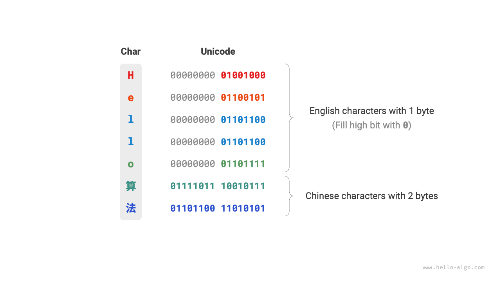

# Mã hoá ký tự *

Trong máy tính, tất cả dữ liệu đều được lưu trữ dưới dạng số nhị phân, và ký tự `char` cũng không phải là ngoại lệ. Để biểu diễn các ký tự, chúng ta cần thiết lập một "bảng mã ký tự" (tập ký tự), quy định mối quan hệ tương ứng 1-1 giữa mỗi ký tự và một số nhị phân. Khi đã có bảng mã ký tự, máy tính có thể thông qua việc tra bảng để thực hiện chuyển đổi giữa số nhị phân và ký tự.

## Bảng mã ASCII

<u>Mã ASCII</u> là bảng mã ký tự xuất hiện sớm nhất, có tên đầy đủ là American Standard Code for Information Interchange (Chuẩn mã trao đổi thông tin Hoa Kỳ). Nó sử dụng 7 bit nhị phân (7 bit thấp của một byte) để biểu diễn một ký tự, có thể biểu diễn tối đa 128 ký tự khác nhau. Như minh hoạ trong hình dưới đây, mã ASCII bao gồm các chữ cái tiếng Anh in hoa và in thường, các chữ số từ 0 đến 9, một số dấu câu, cũng như một số ký tự điều khiển (như ký tự xuống dòng và ký tự tab).

Tuy nhiên, **mã ASCII chỉ có thể biểu diễn tiếng Anh**. Cùng với xu thế toàn cầu hoá của máy tính, một tập ký tự có khả năng biểu diễn nhiều ngôn ngữ hơn mang tên <u>EASCII</u> (Extended ASCII) đã ra đời. Nó mở rộng trên nền tảng 7 bit của ASCII lên thành 8 bit, có thể biểu diễn 256 ký tự khác nhau.

Trên phạm vi toàn thế giới, hàng loạt bảng mã EASCII phù hợp với từng khu vực khác nhau đã lần lượt xuất hiện. 128 ký tự đầu tiên của các bảng mã này thống nhất theo mã ASCII, còn 128 ký tự sau được định nghĩa khác nhau để đáp ứng nhu cầu của các ngôn ngữ riêng biệt.

## Bảng mã GBK

Về sau người ta nhận thấy rằng, **mã EASCII vẫn không thể đáp ứng được số lượng ký tự khổng lồ của nhiều ngôn ngữ**. Chẳng hạn chữ Hán có tới gần mười vạn chữ, riêng chữ dùng trong đời sống hàng ngày đã lên tới vài nghìn chữ. Tổng cục Tiêu chuẩn Quốc gia Trung Quốc năm 1980 đã ban hành bảng mã <u>GB2312</u>, thu thập 6.763 chữ Hán, cơ bản đáp ứng được nhu cầu xử lý chữ Hán trên máy tính.

Tuy nhiên, GB2312 không thể xử lý một số chữ hiếm và chữ phồn thể. Bảng mã <u>GBK</u> được mở rộng dựa trên GB2312, thu thập tổng cộng 21.886 chữ Hán. Trong phương án mã hoá của GBK, các ký tự ASCII sử dụng 1 byte để biểu diễn, còn chữ Hán sử dụng 2 byte để biểu diễn.

## Tập ký tự Unicode

Cùng với sự phát triển bùng nổ của công nghệ máy tính, các bảng mã ký tự và chuẩn mã hoá đua nhau nở rộ, điều này mang lại rất nhiều phiền toái. Một mặt, các bảng mã này thông thường chỉ định nghĩa ký tự cho một ngôn ngữ cụ thể, không thể hoạt động bình thường trong môi trường đa ngôn ngữ. Mặt khác, cùng một ngôn ngữ lại tồn tại nhiều chuẩn bảng mã khác nhau; nếu hai máy tính sử dụng các chuẩn mã hoá khác nhau thì khi truyền tải thông tin sẽ xuất hiện hiện tượng lỗi font, vỡ chữ (mojibake).

Các nhà nghiên cứu thời kỳ đó đã nghĩ rằng: **Nếu đưa ra một tập ký tự đủ hoàn chỉnh, thu thập toàn bộ các ngôn ngữ và biểu tượng trên toàn thế giới vào trong đó, chẳng phải sẽ giải quyết triệt để vấn đề môi trường đa ngôn ngữ và hiện tượng vỡ chữ hay sao**? Dưới sự thúc đẩy của ý tưởng này, một tập ký tự quy mô lớn và toàn diện mang tên Unicode đã ra đời.

<u>Unicode</u> (Mã thống nhất), về mặt lý thuyết có thể chứa được hơn 1 triệu ký tự. Nó hướng tới việc đưa các ký tự trên toàn cầu vào một tập ký tự thống nhất, cung cấp một chuẩn chung để xử lý và hiển thị văn bản của mọi ngôn ngữ, giảm thiểu tối đa các lỗi hiển thị do bất đồng chuẩn mã hoá. Kể từ khi phát hành vào năm 1991, Unicode liên tục mở rộng thêm các ngôn ngữ và ký tự mới. Tính đến tháng 9 năm 2022, Unicode đã chứa 149.186 ký tự, bao gồm chữ viết của các ngôn ngữ, các ký hiệu biểu tượng và thậm chí cả emoji.

Unicode đóng vai trò là một tập ký tự phổ quát, về bản chất là gán cho mỗi ký tự một "điểm mã" (code point - mã định danh ký tự) duy nhất, có phạm vi giá trị từ U+0000 đến U+10FFFF, tạo thành một không gian đánh số ký tự thống nhất. Tuy nhiên, **Unicode không quy định các điểm mã ký tự này phải được lưu trữ trong máy tính như thế nào**. Chúng ta không khỏi băn khoăn: khi các điểm mã Unicode có độ dài khác nhau cùng xuất hiện trong một văn bản, hệ thống sẽ phân giải ký tự như thế nào? Ví dụ cho một mã có độ dài 2 byte, làm thế nào hệ thống xác định được đó là một ký tự dài 2 byte hay là hai ký tự dài 1 byte?

Đối với vấn đề trên, **một giải pháp trực tiếp là lưu trữ tất cả các ký tự thành các mã có độ dài bằng nhau**. Như minh hoạ trong hình dưới đây, mỗi ký tự trong "Hello" chiếm 1 byte, mỗi ký tự trong "算法" (thuật toán) chiếm 2 byte. Chúng ta có thể thông qua việc chèn thêm các số 0 ở phần bit cao để mã hoá toàn bộ các ký tự trong "Hello 算法" thành độ dài 2 byte. Khi đó hệ thống có thể cứ cách 2 byte lại phân giải một ký tự, và khôi phục lại trọn vẹn nội dung của cụm từ này.

Tuy nhiên mã ASCII đã chứng minh cho chúng ta thấy rằng việc mã hoá tiếng Anh chỉ cần 1 byte. Nếu áp dụng phương án trên, dung lượng bộ nhớ mà văn bản tiếng Anh chiếm dụng sẽ gấp đôi so với khi dùng mã ASCII, vô cùng lãng phí không gian bộ nhớ. Vì vậy, chúng ta cần một phương pháp mã hoá Unicode hiệu quả hơn.

## Mã hoá UTF-8

Hiện nay, UTF-8 đã trở thành phương pháp mã hoá Unicode được sử dụng rộng rãi nhất trên thế giới. **Nó là một kiểu mã hoá có độ dài khả biến (variable-length)**, sử dụng từ 1 đến 4 byte để biểu diễn một ký tự, tuỳ thuộc vào độ phức tạp của ký tự đó. Các ký tự ASCII chỉ cần 1 byte, chữ cái Latin và Hy Lạp cần 2 byte, các chữ Hán thông dụng cần 3 byte, và một số ký tự hiếm khác cần 4 byte.

Quy tắc mã hoá của UTF-8 không hề phức tạp, được chia thành hai trường hợp sau:

- Đối với ký tự có độ dài 1 byte, bit cao nhất được gán giá trị $0$, 7 bit còn lại lưu trữ điểm mã Unicode. Cần lưu ý rằng các ký tự ASCII chiếm trọn 128 điểm mã đầu tiên trong tập ký tự Unicode. Nói cách khác, **mã hoá UTF-8 tương thích ngược hoàn toàn với mã ASCII**. Điều này đồng nghĩa với việc chúng ta có thể dùng UTF-8 để phân giải các văn bản dùng mã ASCII từ thời xa xưa một cách trơn tru.
- Đối với ký tự có độ dài $n$ byte (trong đó $n > 1$), $n$ bit cao nhất của byte đầu tiên đều được gán giá trị $1$, bit thứ $n + 1$ gán giá trị $0$; bắt đầu từ byte thứ hai trở đi, 2 bit cao nhất của mỗi byte đều được gán giá trị $10$; toàn bộ các bit còn lại được dùng để điền điểm mã Unicode của ký tự.

Hình dưới đây minh hoạ mã UTF-8 tương ứng với cụm từ "Hello 算法". Quan sát có thể thấy, do $n$ bit cao nhất đều được gán bằng $1$, nên hệ thống có thể đọc số lượng bit $1$ ở đầu để nhận biết độ dài của ký tự đó là $n$ byte.

Nhưng tại sao lại phải đặt 2 bit cao nhất của tất cả các byte còn lại thành $10$? Trên thực tế, chuỗi bit $10$ này đóng vai trò như một ký hiệu kiểm tra (checksum). Giả sử hệ thống bắt đầu phân giải văn bản từ một byte bị sai lệch vị trí, chuỗi $10$ ở đầu byte sẽ giúp hệ thống nhanh chóng phát hiện ra sự bất thường.

Lý do chọn $10$ làm ký hiệu kiểm tra là vì theo quy tắc mã hoá UTF-8, không thể có ký tự nào có hai bit cao nhất là $10$. Kết luận này có thể chứng minh bằng phương pháp phản chứng: giả sử có một ký tự có hai bit cao nhất là $10$, điều đó chứng tỏ độ dài của ký tự đó là $1$ byte, tương ứng với mã ASCII. Nhưng bit cao nhất của mã ASCII bắt buộc phải là $0$, mâu thuẫn với giả thiết.

Bên cạnh UTF-8, các phương thức mã hoá phổ biến khác còn bao gồm hai loại sau:

- **Mã hoá UTF-16**: Sử dụng 2 hoặc 4 byte để biểu diễn một ký tự. Tất cả các ký tự ASCII và các ký tự phi tiếng Anh thông dụng đều được biểu diễn bằng 2 byte; một số ít ký tự cần dùng đến 4 byte. Đối với các ký tự 2 byte, mã UTF-16 trùng với điểm mã Unicode.
- **Mã hoá UTF-32**: Mỗi ký tự đều sử dụng cố định 4 byte. Điều này đồng nghĩa với việc UTF-32 chiếm nhiều không gian hơn UTF-8 và UTF-16, đặc biệt là với các văn bản có tỷ lệ ký tự ASCII cao.

Đứng từ góc độ chiếm dụng không gian lưu trữ, việc dùng UTF-8 để biểu diễn ký tự tiếng Anh vô cùng hiệu quả vì nó chỉ cần 1 byte; dùng UTF-16 để mã hoá một số ký tự phi tiếng Anh (như chữ Hán) sẽ hiệu quả hơn vì nó chỉ cần 2 byte, trong khi UTF-8 có thể cần tới 3 byte.

Đứng từ góc độ tính tương thích, UTF-8 có tính phổ quát tốt nhất, rất nhiều công cụ và thư viện ưu tiên hỗ trợ UTF-8.

## Mã hoá ký tự trong các ngôn ngữ lập trình

Đối với hầu hết các ngôn ngữ lập trình trước đây, chuỗi ký tự trong quá trình chạy chương trình đều áp dụng kiểu mã hoá có độ dài cố định như UTF-16 hoặc UTF-32. Dưới kiểu mã hoá độ dài cố định, chúng ta có thể coi chuỗi ký tự như một mảng để xử lý, cách làm này mang lại các ưu điểm sau:

- **Truy cập ngẫu nhiên (Random access)**: Chuỗi mã hoá UTF-16 có thể thực hiện truy cập ngẫu nhiên rất dễ dàng. UTF-8 là kiểu mã hoá có độ dài biến đổi, muốn tìm ký tự thứ $i$, chúng ta buộc phải duyệt từ đầu chuỗi đến ký tự thứ $i$, mất thời gian $O(n)$.
- **Đếm số lượng ký tự**: Tương tự như truy cập ngẫu nhiên, việc tính độ dài của chuỗi mã hoá UTF-16 là thao tác $O(1)$. Trong khi đó, tính độ dài của chuỗi mã hoá UTF-8 cần phải duyệt qua toàn bộ chuỗi.
- **Thao tác chuỗi**: Trên chuỗi mã hoá UTF-16, nhiều thao tác chuỗi (như cắt chuỗi, nối chuỗi, chèn, xoá, v.v.) dễ thực hiện hơn. Trên chuỗi mã hoá UTF-8, các thao tác này thường đòi hỏi tính toán bổ sung để đảm bảo không tạo ra mã UTF-8 không hợp lệ.

Trên thực tế, việc thiết kế phương án mã hoá ký tự cho ngôn ngữ lập trình là một chủ đề rất thú vị và liên quan đến nhiều yếu tố:

- Kiểu `String` trong Java sử dụng mã hoá UTF-16, mỗi ký tự chiếm 2 byte. Điều này là do vào thời điểm thiết kế ngôn ngữ Java, người ta tin rằng 16 bit là đủ để biểu diễn mọi ký tự có thể có. Tuy nhiên đây là một nhận định chưa chuẩn xác. Về sau chuẩn Unicode được mở rộng vượt quá 16 bit, do đó các ký tự trong Java hiện nay có thể được biểu diễn bởi một cặp giá trị 16-bit (gọi là "cặp đại diện" - surrogate pair).
- Chuỗi ký tự trong JavaScript và TypeScript sử dụng mã hoá UTF-16 vì lý do tương tự như Java. Khi Netscape lần đầu giới thiệu ngôn ngữ JavaScript vào năm 1995, Unicode vẫn đang ở giai đoạn phát triển ban đầu, lúc đó việc sử dụng mã 16 bit là đủ để biểu diễn toàn bộ các ký tự Unicode.
- C# sử dụng mã hoá UTF-16 chủ yếu vì nền tảng .NET được thiết kế bởi Microsoft, và rất nhiều công nghệ của Microsoft (bao gồm cả hệ điều hành Windows) đều sử dụng rộng rãi mã hoá UTF-16.

Do việc đánh giá thấp số lượng ký tự của các ngôn ngữ lập trình trên, chúng buộc phải dùng giải pháp "cặp đại diện" (surrogate pair) để biểu diễn các ký tự Unicode có độ dài vượt quá 16 bit. Đây là một giải pháp tình thế bất đắc dĩ. Một mặt, trong chuỗi ký tự chứa cặp đại diện, một ký tự có thể chiếm 2 byte hoặc 4 byte, làm mất đi ưu thế của kiểu mã hoá độ dài cố định. Mặt khác, việc xử lý cặp đại diện đòi hỏi phải viết thêm mã bổ sung, làm tăng độ phức tạp trong lập trình và gỡ lỗi.

Vì những lý do trên, một số ngôn ngữ lập trình đã đề xuất những phương án mã hoá khác:

- Kiểu `str` trong Python sử dụng mã hoá Unicode và áp dụng một cơ chế biểu diễn chuỗi linh hoạt, độ dài lưu trữ của ký tự phụ thuộc vào điểm mã Unicode lớn nhất trong chuỗi. Nếu chuỗi toàn là ký tự ASCII, mỗi ký tự chiếm 1 byte; nếu có ký tự vượt ra ngoài phạm vi ASCII nhưng vẫn nằm trong Mặt phẳng đa ngôn ngữ cơ bản (Basic Multilingual Plane - BMP), mỗi ký tự chiếm 2 byte; nếu có ký tự vượt ngoài BMP, mỗi ký tự chiếm 4 byte.
- Kiểu `string` trong ngôn ngữ Go sử dụng mã hoá UTF-8 ở tầng nội bộ. Go còn cung cấp kiểu `rune` để biểu diễn một điểm mã Unicode đơn lẻ.
- Kiểu `str` và `String` trong ngôn ngữ Rust cũng sử dụng mã hoá UTF-8 ở tầng nội bộ. Rust cung cấp thêm kiểu `char` để biểu diễn một điểm mã Unicode đơn lẻ.

Cần lưu ý rằng những nội dung thảo luận ở trên đều xoay quanh phương thức lưu trữ của chuỗi ký tự trong ngôn ngữ lập trình, **điều này hoàn toàn khác biệt với việc chuỗi ký tự được lưu trữ trong tệp tin hay truyền tải trên mạng Internet**. Khi lưu trữ tệp hoặc truyền qua mạng, chúng ta thường mã hoá chuỗi ký tự dưới định dạng UTF-8 để đạt được tính tương thích và hiệu quả không gian tối ưu nhất.
