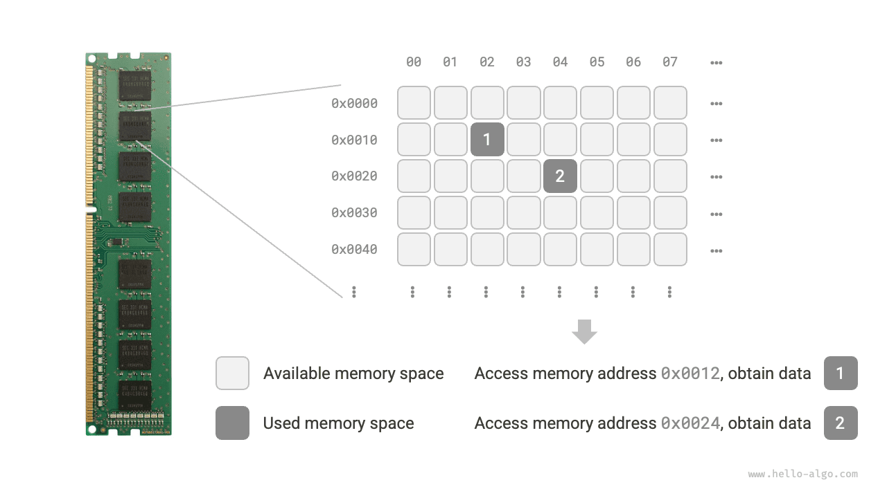

# Phân loại cấu trúc dữ liệu

Các cấu trúc dữ liệu phổ biến bao gồm mảng, danh sách liên kết, ngăn xếp, hàng đợi, bảng băm, cây, đống (heap), đồ thị. Chúng có thể được phân loại từ hai chiều kích: “cấu trúc logic” và “cấu trúc vật lý”.

## Cấu trúc logic: Tuyến tính và phi tuyến tính

**Cấu trúc logic thể hiện mối quan hệ logic giữa các phần tử dữ liệu**. Trong mảng và danh sách liên kết, dữ liệu được sắp xếp theo một thứ tự nhất định, thể hiện mối quan hệ tuyến tính giữa các phần tử; trong cây, dữ liệu được sắp xếp phân tầng từ trên xuống dưới, thể hiện mối quan hệ giữa “tổ tiên” và “hậu duệ”; còn đồ thị được cấu thành từ các nút (đỉnh) và cạnh, phản ánh các mối quan hệ mạng lưới phức tạp.

Như minh hoạ trong hình dưới đây, cấu trúc logic có thể chia thành hai nhóm lớn: “tuyến tính” và “phi tuyến tính”. Cấu trúc tuyến tính khá trực quan, chỉ dữ liệu được sắp xếp tuyến tính về mặt quan hệ logic; cấu trúc phi tuyến tính thì ngược lại, được sắp xếp phi tuyến tính.

- **Cấu trúc dữ liệu tuyến tính**: Mảng, danh sách liên kết, ngăn xếp, hàng đợi, bảng băm; các phần tử có mối quan hệ tuần tự một-một.
- **Cấu trúc dữ liệu phi tuyến tính**: Cây, đống (heap), đồ thị, bảng băm.

Cấu trúc dữ liệu phi tuyến tính có thể tiếp tục phân chia thành cấu trúc dạng cây và cấu trúc dạng mạng.

- **Cấu trúc dạng cây**: Cây, đống (heap), bảng băm; các phần tử có mối quan hệ một-nhiều.
- **Cấu trúc dạng mạng**: Đồ thị; các phần tử có mối quan hệ nhiều-nhiều.

## Cấu trúc vật lý: Liên tục và phân tán

**Khi chương trình thuật toán đang chạy, dữ liệu đang được xử lý chủ yếu được lưu trữ trong bộ nhớ RAM**. Hình dưới đây thể hiện một thanh RAM máy tính, trong đó mỗi khối vuông màu đen chứa một khoảng không gian bộ nhớ. Chúng ta có thể hình dung bộ nhớ như một bảng tính Excel khổng lồ, nơi mỗi ô đều có thể lưu trữ một lượng dữ liệu nhất định.

**Hệ thống truy cập dữ liệu tại vị trí đích thông qua địa chỉ bộ nhớ**. Như minh hoạ dưới đây, máy tính gán số thứ tự cho mỗi ô trong bảng theo những quy tắc nhất định, đảm bảo mỗi không gian bộ nhớ đều có một địa chỉ bộ nhớ duy nhất. Nhờ có các địa chỉ này, chương trình có thể truy cập dữ liệu trong bộ nhớ.

!!! tip

    Cần lưu ý rằng việc ví bộ nhớ như bảng tính Excel chỉ là một phép so sánh đơn giản hoá. Cơ chế hoạt động thực tế của bộ nhớ phức tạp hơn nhiều, liên quan đến các khái niệm như không gian địa chỉ, quản lý bộ nhớ, cơ chế bộ nhớ đệm (cache), bộ nhớ ảo và bộ nhớ vật lý.

Bộ nhớ là tài nguyên dùng chung của mọi chương trình. Khi một vùng nhớ bị một chương trình nào đó chiếm dụng, thông thường các chương trình khác sẽ không thể đồng thời sử dụng vùng nhớ đó nữa. **Vì vậy, trong thiết kế cấu trúc dữ liệu và giải thuật, tài nguyên bộ nhớ là một yếu tố quan trọng cần cân nhắc**. Ví dụ, mức bộ nhớ đỉnh điểm mà thuật toán chiếm dụng không được vượt quá dung lượng bộ nhớ khả dụng còn lại của hệ thống; nếu thiếu các khối bộ nhớ liên tục có kích thước lớn, cấu trúc dữ liệu được lựa chọn bắt buộc phải có khả năng lưu trữ được trong các khoảng không gian bộ nhớ phân tán.

Như minh hoạ dưới đây, **cấu trúc vật lý phản ánh phương thức lưu trữ của dữ liệu trong bộ nhớ máy tính**, có thể chia thành lưu trữ trong không gian liên tục (mảng) và lưu trữ trong không gian phân tán (danh sách liên kết). Cấu trúc vật lý quyết định từ tầng bên dưới phương thức truy cập, cập nhật, thêm/xoá dữ liệu; hai cấu trúc vật lý này thể hiện những đặc tính bù trừ lẫn nhau về mặt hiệu năng thời gian và hiệu năng không gian.

Điều đáng chú ý là **tất cả các cấu trúc dữ liệu đều được hiện thực hoá dựa trên mảng, danh sách liên kết hoặc sự kết hợp của cả hai**. Ví dụ, ngăn xếp và hàng đợi vừa có thể hiện thực bằng mảng, vừa có thể hiện thực bằng danh sách liên kết; trong khi hiện thực của bảng băm có thể bao gồm đồng thời cả mảng và danh sách liên kết.

- **Có thể hiện thực dựa trên mảng**: Ngăn xếp, hàng đợi, bảng băm, cây, đống (heap), đồ thị, ma trận, tensor (mảng có số chiều $\geq 3$), v.v.
- **Có thể hiện thực dựa trên danh sách liên kết**: Ngăn xếp, hàng đợi, bảng băm, cây, đống (heap), đồ thị, v.v.

Danh sách liên kết sau khi khởi tạo vẫn có thể điều chỉnh độ dài trong quá trình chương trình chạy, do đó còn được gọi là “cấu trúc dữ liệu động”. Mảng sau khi khởi tạo thì độ dài không thể thay đổi, nên còn gọi là “cấu trúc dữ liệu tĩnh”. Cần lưu ý rằng mảng có thể thay đổi độ dài thông qua việc cấp phát lại bộ nhớ, nhờ đó vẫn có tính “động” ở một mức độ nhất định.

!!! tip

    Nếu bạn cảm thấy cấu trúc vật lý khó hiểu, nên đọc trước chương tiếp theo rồi sau đó quay lại ôn tập nội dung phần này.
