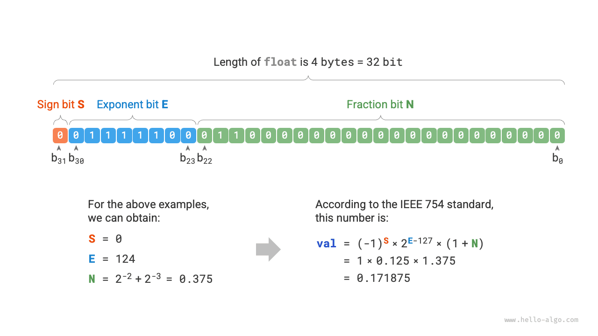

# Mã hoá số *

!!! tip

    Trong cuốn sách này, các tiêu đề có dấu * là các chương đọc thêm. Nếu bạn có ít thời gian hoặc cảm thấy khó hiểu, bạn có thể tạm bỏ qua và quay lại tìm hiểu sau khi đã học xong các chương cốt lõi.

## Mã dấu-độ lớn, mã bù một và mã bù hai

Trong bảng ở phần trước, chúng ta nhận thấy rằng tất cả các kiểu số nguyên đều có thể biểu diễn số âm nhiều hơn số dương một đơn vị, ví dụ như kiểu `byte` có phạm vi giá trị là $[-128, 127]$ 。Hiện tượng này khá phản trực giác, và nguyên nhân sâu xa của nó liên quan đến kiến thức về mã dấu-độ lớn (nguyên mã), mã bù một (phản mã) và mã bù hai (bổ mã).

Trước hết cần chỉ ra rằng, **các con số được lưu trữ trong máy tính dưới dạng “mã bù hai”**。Trước khi đi sâu phân tích lý do, trước hết hãy cùng xem định nghĩa của cả ba khái niệm này:

- **Mã dấu-độ lớn (Sign-magnitude)**: Chúng ta coi bit có trọng số cao nhất (bit đầu tiên bên trái) trong biểu diễn nhị phân của một số là bit dấu, trong đó $0$ biểu thị số dương, $1$ biểu thị số âm, và các bit còn lại biểu thị giá trị tuyệt đối của số đó.
- **Mã bù một (1's complement)**: Mã bù một của số dương giống hệt như mã dấu-độ lớn của nó; mã bù một của số âm nhận được bằng cách đảo ngược tất cả các bit (từ 0 thành 1 và ngược lại) ngoại trừ bit dấu của mã dấu-độ lớn.
- **Mã bù hai (2's complement)**: Mã bù hai của số dương giống hệt như mã dấu-độ lớn của nó; mã bù hai của số âm nhận được bằng cách cộng thêm $1$ vào mã bù một của nó.

Hình dưới đây minh hoạ phương pháp chuyển đổi qua lại giữa mã dấu-độ lớn, mã bù một và mã bù hai.

<u>Biểu diễn dấu và độ lớn (sign-magnitude)</u> tuy trực quan nhất nhưng lại tồn tại một số hạn chế. Một mặt, **mã dấu-độ lớn của số âm không thể trực tiếp tham gia vào các phép tính toán**。Ví dụ khi tính $1 + (-2)$ dưới dạng mã dấu-độ lớn, kết quả thu được là $-3$ ，điều này rõ ràng không chính xác.

$$
\begin{aligned}
& 1 + (-2) \newline
& \rightarrow 0000 \; 0001 + 1000 \; 0010 \newline
& = 1000 \; 0011 \newline
& \rightarrow -3
\end{aligned}
$$

Để giải quyết vấn đề này, máy tính đã đưa vào <u>mã bù một (1's complement)</u>。Nếu chúng ta chuyển đổi mã dấu-độ lớn sang mã bù một trước, rồi thực hiện phép tính $1 + (-2)$ trên mã bù một, cuối cùng chuyển kết quả từ mã bù một ngược về mã dấu-độ lớn, ta sẽ thu được kết quả chính xác là $-1$ 。

$$
\begin{aligned}
& 1 + (-2) \newline
& \rightarrow 0000 \; 0001 \; \text{(Mã dấu-độ lớn)} + 1000 \; 0010 \; \text{(Mã dấu-độ lớn)} \newline
& = 0000 \; 0001 \; \text{(Mã bù một)} + 1111  \; 1101 \; \text{(Mã bù một)} \newline
& = 1111 \; 1110 \; \text{(Mã bù một)} \newline
& = 1000 \; 0001 \; \text{(Mã dấu-độ lớn)} \newline
& \rightarrow -1
\end{aligned}
$$

Mặt khác, **số không trong mã dấu-độ lớn có hai cách biểu diễn là $+0$ và $-0$** 。Điều này đồng nghĩa với việc số không tương ứng với hai mã nhị phân khác nhau, có thể gây ra sự nhập nhằng. Chẳng hạn trong câu lệnh điều kiện, nếu không phân biệt số không dương và số không âm thì có thể dẫn đến kết quả phán đoán bị sai. Còn nếu muốn xử lý sự nhập nhằng giữa số không dương và số không âm, chúng ta buộc phải thêm vào các phép kiểm tra bổ sung, điều này có thể làm giảm hiệu năng tính toán của máy tính.

$$
\begin{aligned}
+0 & \rightarrow 0000 \; 0000 \newline
-0 & \rightarrow 1000 \; 0000
\end{aligned}
$$

Tương tự như mã dấu-độ lớn, mã bù một cũng tồn tại vấn đề nhập nhằng giữa số không âm và số không dương, do đó máy tính tiếp tục đưa vào <u>mã bù hai (2's complement)</u>。Trước tiên chúng ta hãy cùng quan sát quá trình chuyển đổi của số không âm từ mã dấu-độ lớn sang mã bù một và mã bù hai:

$$
\begin{aligned}
-0 \rightarrow \; & 1000 \; 0000 \; \text{(Mã dấu-độ lớn)} \newline
= \; & 1111 \; 1111 \; \text{(Mã bù một)} \newline
= 1 \; & 0000 \; 0000 \; \text{(Mã bù hai)} \newline
\end{aligned}
$$

Khi cộng thêm $1$ vào mã bù một của số không âm sẽ tạo ra bit nhớ tràn, nhưng do kiểu `byte` chỉ có độ dài 8 bit, nên bit $1$ bị tràn sang bit thứ 9 sẽ bị loại bỏ. Nói cách khác, **mã bù hai của số không âm là $0000 \; 0000$ ，hoàn toàn trùng khớp với mã bù hai của số không dương**。Điều này đồng nghĩa với việc trong biểu diễn mã bù hai chỉ tồn tại duy nhất một số không, nhờ đó vấn đề nhập nhằng giữa số không âm và dương đã được giải quyết triệt để.

Vẫn còn một thắc mắc cuối cùng: kiểu `byte` có phạm vi giá trị là $[-128, 127]$ ，vậy số âm $-128$ dôi ra thêm này được tạo ra như thế nào? Chúng ta nhận thấy rằng tất cả các số nguyên trong khoảng $[-127, +127]$ đều có mã dấu-độ lớn, mã bù một và mã bù hai tương ứng, và có thể chuyển đổi qua lại giữa mã dấu-độ lớn và mã bù hai.

Tuy nhiên, **mã bù hai $1000 \; 0000$ là một trường hợp ngoại lệ, nó không có mã dấu-độ lớn tương ứng**。Nếu áp dụng quy tắc chuyển đổi ngược lại, ta sẽ thu được mã dấu-độ lớn của nó là $0000 \; 0000$ 。Điều này rõ ràng là mâu thuẫn, bởi mã dấu-độ lớn đó biểu diễn số $0$ và mã bù hai của nó phải là chính nó. Máy tính quy ước rằng mã bù hai đặc biệt $1000 \; 0000$ này đại diện cho số $-128$ 。Trên thực tế, phép tính $(-1) + (-127)$ dưới dạng mã bù hai cho ra kết quả chính xác là $-128$ 。

$$
\begin{aligned}
& (-127) + (-1) \newline
& \rightarrow 1111 \; 1111 \; \text{(Mã dấu-độ lớn)} + 1000 \; 0001 \; \text{(Mã dấu-độ lớn)} \newline
& = 1000 \; 0000 \; \text{(Mã bù một)} + 1111  \; 1110 \; \text{(Mã bù một)} \newline
& = 1000 \; 0001 \; \text{(Mã bù hai)} + 1111  \; 1111 \; \text{(Mã bù hai)} \newline
& = 1000 \; 0000 \; \text{(Mã bù hai)} \newline
& \rightarrow -128
\end{aligned}
$$

Có thể bạn đã nhận ra rằng tất cả các phép tính toán ở trên đều là phép cộng. Điều này hé lộ một sự thật quan trọng: **mạch phần cứng bên trong máy tính chủ yếu được thiết kế dựa trên phép cộng**。Đó là vì phép cộng so với các phép toán khác (như phép nhân, phép chia và phép trừ) thì dễ hiện thực bằng phần cứng hơn, dễ xử lý song song hơn và tốc độ tính toán nhanh hơn nhiều.

Xin lưu ý rằng điều này không có nghĩa là máy tính chỉ có thể làm phép cộng. **Bằng cách kết hợp phép cộng với một số phép toán logic cơ bản, máy tính có thể thực hiện mọi phép toán toán học khác**。Ví dụ, phép trừ $a - b$ có thể chuyển đổi thành phép cộng $a + (-b)$ ；phép nhân và phép chia có thể chuyển đổi thành việc thực hiện nhiều lần phép cộng hoặc phép trừ.

Bây giờ chúng ta có thể tổng kết lý do máy tính sử dụng mã bù hai: dựa trên biểu diễn mã bù hai, máy tính có thể dùng chung một mạch điện và thao tác duy nhất để xử lý phép cộng giữa cả số dương và số âm, không cần thiết kế mạch phần cứng chuyên dụng cho phép trừ, và không cần xử lý riêng sự nhập nhằng giữa số không âm và không dương. Điều này giúp đơn giản hoá tối đa thiết kế phần cứng và nâng cao hiệu suất tính toán.

Thiết kế của mã bù hai vô cùng tinh tế; do dung lượng bài viết có hạn nên chúng ta chỉ dừng lại ở đây, bạn đọc quan tâm có thể tìm hiểu thêm ở các tài liệu chuyên sâu.

## Mã hoá số thực dấu phẩy động

Nếu để ý kỹ, bạn có thể nhận ra: `int` và `float` có cùng độ dài là 4 byte, nhưng tại sao phạm vi giá trị của `float` lại lớn hơn `int` rất nhiều? Điều này có vẻ rất phản trực giác, vì theo lý thuyết `float` còn phải biểu diễn các chữ số thập phân thì phạm vi giá trị đáng lẽ phải thu hẹp lại mới đúng.

Trên thực tế, **đó là do số thực dấu phẩy động `float` sử dụng một phương thức biểu diễn hoàn toàn khác**。Biểu diễn một số nhị phân có độ dài 32 bit như sau:

$$
b_{31} b_{30} b_{29} \ldots b_2 b_1 b_0
$$

Theo chuẩn IEEE 754, kiểu `float` có độ dài 32-bit được cấu thành từ ba phần sau:

- Bit dấu $\mathrm{S}$: chiếm 1 bit, tương ứng với $b_{31}$ 。
- Bit mũ $\mathrm{E}$: chiếm 8 bit, tương ứng với $b_{30} b_{29} \ldots b_{23}$ 。
- Bit định trị (phân số) $\mathrm{N}$: chiếm 23 bit, tương ứng với $b_{22} b_{21} \ldots b_0$ 。

Giá trị tương ứng của số nhị phân `float` được tính theo công thức:

$$
\text {val} = (-1)^{b_{31}} \times 2^{\left(b_{30} b_{29} \ldots b_{23}\right)_2-127} \times\left(1 . b_{22} b_{21} \ldots b_0\right)_2
$$

Chuyển đổi sang công thức tính trong hệ thập phân là:

$$
\text {val}=(-1)^{\mathrm{S}} \times 2^{\mathrm{E} -127} \times (1 + \mathrm{N})
$$

Trong đó phạm vi giá trị của từng thành phần là:

$$
\begin{aligned}
\mathrm{S} \in & \{ 0, 1\}, \quad \mathrm{E} \in \{ 1, 2, \dots, 254 \} \newline
(1 + \mathrm{N}) = & (1 + \sum_{i=1}^{23} b_{23-i} 2^{-i}) \subset [1, 2 - 2^{-23}]
\end{aligned}
$$

Quan sát hình trên, cho một dữ liệu ví dụ $\mathrm{S} = 0$ ， $\mathrm{E} = 124$ ，$\mathrm{N} = 2^{-2} + 2^{-3} = 0.375$ ，ta có:

$$
\text { val } = (-1)^0 \times 2^{124 - 127} \times (1 + 0.375) = 0.171875
$$

Bây giờ chúng ta có thể trả lời câu hỏi ban đầu: **phương thức biểu diễn của `float` có chứa bit mũ, khiến phạm vi giá trị của nó lớn hơn `int` rất nhiều**。Theo phép tính ở trên, số dương lớn nhất mà `float` có thể biểu diễn là $2^{254 - 127} \times (2 - 2^{-23}) \approx 3.4 \times 10^{38}$ ，chỉ cần đổi bit dấu là sẽ nhận được số âm nhỏ nhất.

**Mặc dù số thực dấu phẩy động `float` mở rộng phạm vi giá trị, nhưng cái giá phải trả là sự hy sinh về độ chính xác**。Kiểu số nguyên `int` dùng toàn bộ 32 bit để biểu diễn các con số phân bố đồng đều; trong khi do sự hiện diện của bit mũ, giá trị của `float` càng lớn thì khoảng cách chênh lệch giữa hai số liền kề sẽ càng có xu hướng mở rộng.

Như trong bảng dưới đây, bit mũ $\mathrm{E} = 0$ và $\mathrm{E} = 255$ mang ý nghĩa đặc biệt, **dùng để biểu diễn số không, vô cùng ($\infty$), $\mathrm{NaN}$ (Not a Number), v.v.**

 Bảng <id> &nbsp; Ý nghĩa của bit mũ 

| Bit mũ E           | Bit định trị $\mathrm{N} = 0$ | Bit định trị $\mathrm{N} \ne 0$ | Công thức tính                                                         |
| ------------------ | ----------------------- | ------------------------- | ---------------------------------------------------------------------- |
| $0$                | $\pm 0$                 | Số cận chuẩn (subnormal)  | $(-1)^{\mathrm{S}} \times 2^{-126} \times (0.\mathrm{N})$              |
| $1, 2, \dots, 254$ | Số chuẩn (normal)       | Số chuẩn (normal)         | $(-1)^{\mathrm{S}} \times 2^{(\mathrm{E} -127)} \times (1.\mathrm{N})$ |
| $255$              | $\pm \infty$            | $\mathrm{NaN}$            |                                                                        |

Điều đáng nói là số cận chuẩn đã cải thiện đáng kể độ chính xác của số thực dấu phẩy động. Số chuẩn dương nhỏ nhất là $2^{-126}$ ，trong khi số cận chuẩn dương nhỏ nhất là $2^{-126} \times 2^{-23}$ 。

Kiểu độ chính xác kép `double` cũng áp dụng phương pháp biểu diễn tương tự như `float`, nên chúng ta sẽ không nhắc lại chi tiết ở đây.
