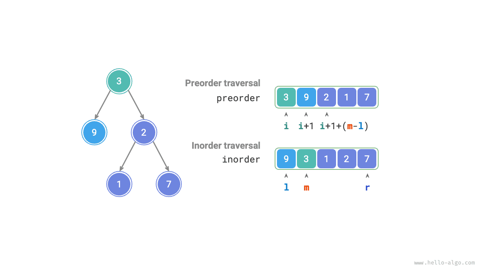
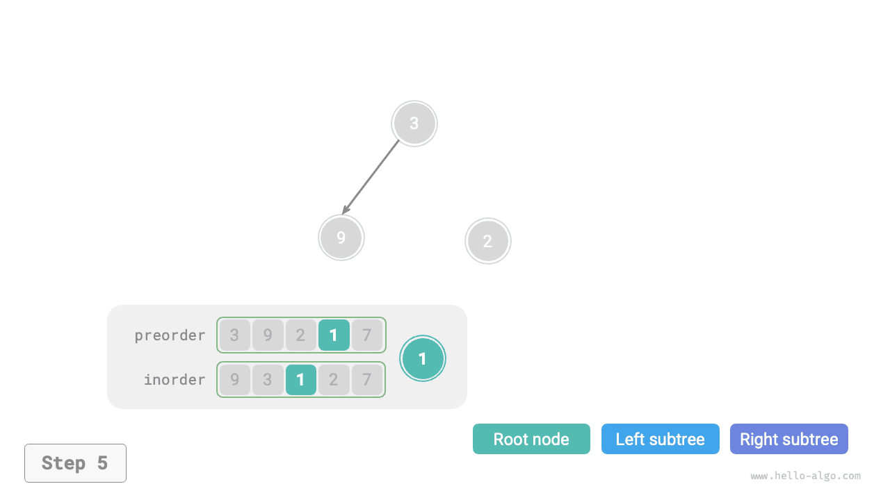
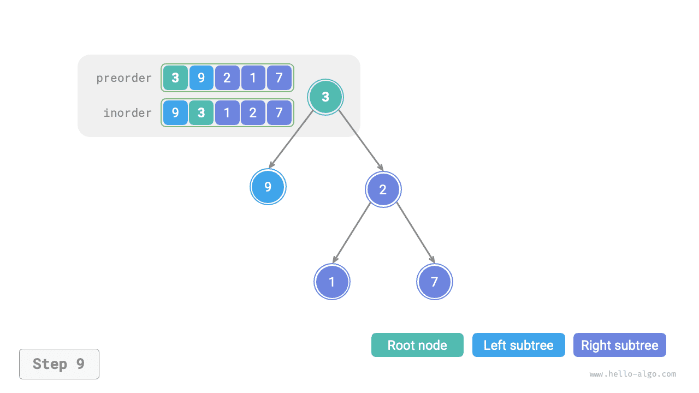

# Bài toán dựng cây nhị phân

!!! question

    Cho mảng duyệt tiền thứ tự `preorder` và duyệt trung thứ tự `inorder` của một cây nhị phân, hãy dựng lại cây nhị phân từ hai mảng này và trả về nút gốc của cây nhị phân. Giả sử trong cây nhị phân không có các nút trùng lặp giá trị (như hình dưới đây).


### Xác định xem có phải bài toán chia để trị không

Bài toán ban đầu được định nghĩa là dựng cây nhị phân từ `preorder` và `inorder`, đây là một bài toán chia để trị điển hình:

- **Bài toán có thể phân rã**: Tiếp cận từ góc độ chia để trị, chúng ta có thể chia bài toán ban đầu thành hai bài toán con: dựng cây con trái, dựng cây con phải, cộng thêm một thao tác: khởi tạo nút gốc. Và đối với mỗi cây con (bài toán con), chúng ta vẫn có thể tái sử dụng phương pháp phân chia ở trên, chia nó thành các cây con nhỏ hơn (bài toán con), cho đến khi chạm tới bài toán con nhỏ nhất (cây con rỗng) thì dừng lại.
- **Các bài toán con mang tính độc lập**: Cây con trái và cây con phải hoàn toàn độc lập với nhau, giữa chúng không có phần giao. Khi dựng cây con trái, chúng ta chỉ cần quan tâm đến phần tương ứng với cây con trái trong duyệt trung thứ tự và duyệt tiền thứ tự. Cây con phải cũng tương tự như vậy.
- **Lời giải của các bài toán con có thể hợp nhất được**: Một khi đã thu được cây con trái và cây con phải (lời giải của bài toán con), chúng ta có thể liên kết chúng vào nút gốc để thu được lời giải của bài toán ban đầu.

### Làm thế nào để phân chia các cây con?

Dựa theo phân tích ở trên, bài toán này có thể dùng chia để trị để giải quyết, **nhưng làm thế nào để thông qua duyệt tiền thứ tự `preorder` và duyệt trung thứ tự `inorder` phân chia ra cây con trái và cây con phải**?

Theo định nghĩa, cả `preorder` và `inorder` đều có thể chia thành ba phần:

- Duyệt tiền thứ tự: `[ Nút gốc | Cây con trái | Cây con phải ]`, ví dụ cây trong hình trên tương ứng với `[ 3 | 9 | 2 1 7 ]`.
- Duyệt trung thứ tự: `[ Cây con trái | Nút gốc | Cây con phải ]`, ví dụ cây trong hình trên tương ứng với `[ 9 | 3 | 1 2 7 ]`.

Lấy dữ liệu trong hình trên làm ví dụ, chúng ta có thể thu được kết quả phân chia thông qua các bước minh hoạ ở hình dưới đây:

1. Phần tử đầu tiên 3 trong duyệt tiền thứ tự chính là giá trị của nút gốc.
2. Tìm kiếm chỉ số của nút gốc 3 trong `inorder`, sử dụng chỉ số này có thể chia `inorder` thành `[ 9 | 3 | 1 2 7 ]`.
3. Dựa vào kết quả phân chia của `inorder`, dễ dàng thấy số lượng nút của cây con trái và cây con phải lần lượt là 1 và 3, từ đó có thể chia `preorder` thành `[ 3 | 9 | 2 1 7 ]`.


### Biểu diễn khoảng chỉ số cây con dựa trên các biến

Dựa vào phương pháp phân chia ở trên, **chúng ta đã thu được các khoảng chỉ số của nút gốc, cây con trái và cây con phải trong `preorder` và `inorder`**. Để mô tả các khoảng chỉ số này, chúng ta cần nhờ đến một vài biến con trỏ:

- Ghi nhận chỉ số của nút gốc cây hiện tại trong `preorder` là $i$.
- Ghi nhận chỉ số của nút gốc cây hiện tại trong `inorder` là $m$.
- Ghi nhận khoảng chỉ số của cây hiện tại trong `inorder` là $[l, r]$.

Như bảng dưới đây, thông qua các biến trên có thể biểu diễn chỉ số của nút gốc trong `preorder` cũng như khoảng chỉ số của các cây con trong `inorder`:

<p align="center"> Bảng <id> &nbsp; Chỉ số của nút gốc và cây con trong duyệt tiền thứ tự và duyệt trung thứ tự </p>

|        | Chỉ số nút gốc trong `preorder` | Khoảng chỉ số cây con trong `inorder` |
| ------ | ------------------------------- | ------------------------------------- |
| Cây hiện tại | $i$                       | $[l, r]$                              |
| Cây con trái | $i + 1$                   | $[l, m-1]$                            |
| Cây con phải | $i + 1 + (m - l)$         | $[m+1, r]$                            |

Xin lưu ý rằng, ý nghĩa của $(m-l)$ trong chỉ số nút gốc của cây con phải chính là "số lượng nút của cây con trái", khuyến nghị bạn kết hợp với hình dưới đây để thấu hiểu rõ hơn.



### Hiện thực mã nguồn

Để nâng cao hiệu năng tìm kiếm $m$, chúng ta nhờ một bảng băm `hmap` để lưu trữ ánh xạ từ phần tử sang chỉ số trong mảng `inorder`:

```src
[file]{build_tree}-[class]{}-[func]{build_tree}
```

Hình dưới đây minh hoạ quá trình đệ quy dựng cây nhị phân, các nút được tạo ra trong quá trình đệ quy đi xuống ("tiền quy"), trong khi các cạnh (tham chiếu liên kết) được thiết lập trong quá trình đệ quy quay về ("hậu quy").

=== "<1>"
    

=== "<2>"
    

=== "<3>"
    

=== "<4>"
    

=== "<5>"
    

=== "<6>"
    

=== "<7>"
    

=== "<8>"
    

=== "<9>"
    

Kết quả phân chia của duyệt tiền thứ tự `preorder` và duyệt trung thứ tự `inorder` bên trong mỗi hàm đệ quy được thể hiện như hình dưới đây:


Đặt số lượng nút của cây là $n$, khởi tạo mỗi một nút (thực thi một hàm đệ quy `dfs()` ) mất thời gian $O(1)$. **Do đó tổng độ phức tạp thời gian là $O(n)$**.

Bảng băm lưu trữ ánh xạ từ phần tử `inorder` sang chỉ số, có độ phức tạp không gian là $O(n)$. Trong trường hợp xấu nhất, tức là cây nhị phân thoái hoá thành danh sách liên kết, độ sâu đệ quy đạt tới $n$, chiếm dụng $O(n)$ không gian khung ngăn xếp. **Do đó tổng độ phức tạp không gian là $O(n)$**.
