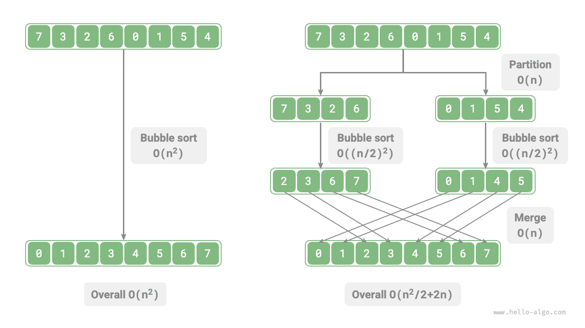
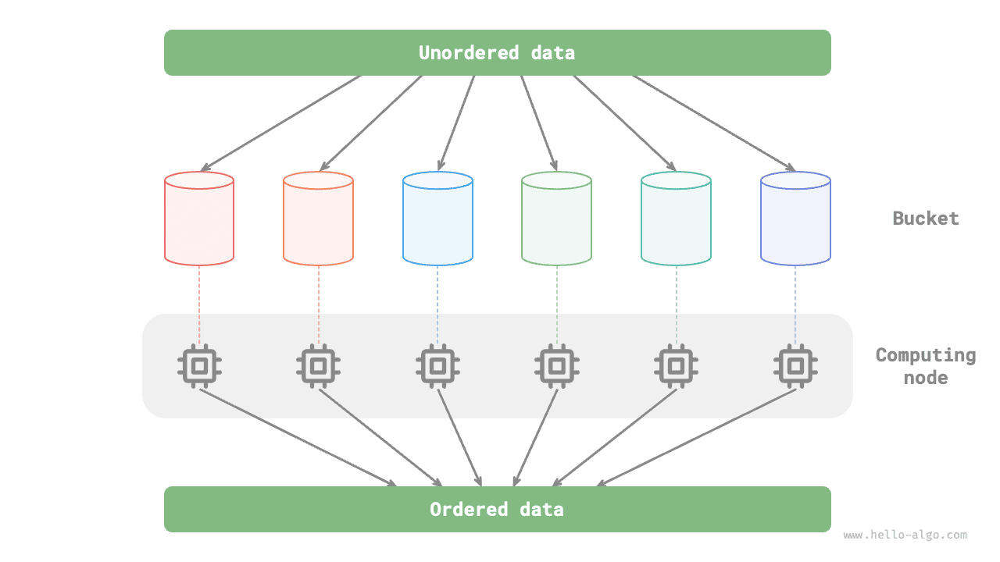

# Thuật toán chia để trị

<u>Chia để trị (divide and conquer)</u>, tên đầy đủ là phân chia và trị vì (chia để quản lý và giải quyết), là một chiến lược thuật toán vô cùng quan trọng và phổ biến. Chia để trị thường được hiện thực dựa trên đệ quy, bao gồm hai bước "chia" (divide) và "trị" (conquer):

1. **Chia (giai đoạn phân chia)**: Đệ quy chia nhỏ bài toán ban đầu thành hai hoặc nhiều bài toán con tương tự, cho đến khi chạm tới bài toán con nhỏ nhất thì dừng lại.
2. **Trị (giai đoạn hợp nhất)**: Bắt đầu từ những bài toán con nhỏ nhất đã biết lời giải, hợp nhất các lời giải của bài toán con từ đáy lên đỉnh, từ đó kiến tạo nên lời giải của bài toán ban đầu.

Như hình dưới đây, "sắp xếp trộn" là một trong những ứng dụng tiêu biểu của chiến lược chia để trị:

1. **Chia**: Đệ quy chia đôi mảng ban đầu (bài toán ban đầu) thành hai mảng con (bài toán con), cho đến khi mảng con chỉ còn lại một phần tử (bài toán con nhỏ nhất).
2. **Trị**: Hợp nhất các mảng con đã sắp xếp (lời giải bài toán con) từ đáy lên đỉnh để thu được mảng ban đầu đã được sắp xếp (lời giải bài toán ban đầu).

## Cách nhận biết bài toán chia để trị

Một bài toán có phù hợp để giải quyết bằng chia để trị hay không, thông thường có thể dựa vào các tiêu chí đánh giá sau:

1. **Bài toán có thể phân rã**: Bài toán ban đầu có thể chia thành các bài toán con tương tự với quy mô nhỏ hơn, và có thể tiếp tục phân chia đệ quy theo cùng một phương thức.
2. **Các bài toán con mang tính độc lập**: Giữa các bài toán con không có sự trùng lặp (không có bài toán con gối nhau), không phụ thuộc lẫn nhau và có thể giải quyết một cách độc lập.
3. **Lời giải của các bài toán con có thể hợp nhất được**: Lời giải của bài toán ban đầu thu được từ việc gộp các lời giải của bài toán con lại.

Rõ ràng, sắp xếp trộn thoả mãn đầy đủ ba tiêu chí trên:

1. **Bài toán có thể phân rã**: Đệ quy chia mảng (bài toán ban đầu) thành hai mảng con (bài toán con).
2. **Các bài toán con mang tính độc lập**: Mỗi mảng con đều có thể tiến hành sắp xếp độc lập (bài toán con có thể giải quyết độc lập).
3. **Lời giải của các bài toán con có thể hợp nhất được**: Hai mảng con đã sắp xếp (lời giải bài toán con) có thể gộp thành một mảng đã sắp xếp (lời giải bài toán ban đầu).

## Nâng cao hiệu năng thông qua chia để trị

**Chia để trị không chỉ giải quyết hiệu quả các bài toán thuật toán mà còn thường giúp nâng cao hiệu năng của thuật toán**. Trong các thuật toán sắp xếp, sắp xếp nhanh, sắp xếp trộn và sắp xếp vun đống chạy nhanh hơn sắp xếp chọn, sắp xếp nổi bọt và sắp xếp chèn chính là nhờ chúng đã áp dụng chiến lược chia để trị.

Vậy chúng ta tự hỏi: **Tại sao chia để trị lại có thể nâng cao hiệu năng thuật toán, bản chất logic bên dưới là gì**? Nói cách khác, việc chia bài toán lớn thành nhiều bài toán con, giải các bài toán con rồi gộp lời giải bài toán con thành lời giải bài toán ban đầu, tại sao các bước này lại có hiệu năng cao hơn việc trực tiếp giải bài toán ban đầu? Câu hỏi này có thể được thảo luận từ hai khía cạnh: tối ưu số lượng thao tác và tính toán song song.

### Tối ưu số lượng thao tác

Lấy "sắp xếp nổi bọt" làm ví dụ, việc xử lý một mảng có độ dài $n$ cần thời gian $O(n^2)$. Giả sử chúng ta làm theo cách minh hoạ trong hình dưới đây, chia mảng tại điểm giữa thành hai mảng con, khi đó việc phân chia mất thời gian $O(n)$, sắp xếp mỗi mảng con mất thời gian $O((n / 2)^2)$, và gộp hai mảng con mất thời gian $O(n)$, tổng độ phức tạp thời gian là:

$$
O(n + (\frac{n}{2})^2 \times 2 + n) = O(\frac{n^2}{2} + 2n)
$$

Tiếp theo, chúng ta tính toán bất đẳng thức dưới đây, trong đó vế trái và vế phải lần lượt là tổng số thao tác trước và sau khi phân chia:

$$
\begin{aligned}
n^2 & > \frac{n^2}{2} + 2n \newline
n^2 - \frac{n^2}{2} - 2n & > 0 \newline
n(n - 4) & > 0
\end{aligned}
$$

**Điều này có nghĩa là khi $n > 4$, số lượng thao tác sau khi phân chia sẽ ít hơn, hiệu năng sắp xếp sẽ cao hơn**. Xin lưu ý rằng độ phức tạp thời gian sau khi phân chia vẫn là bậc hai $O(n^2)$, chỉ có điều hệ số hằng số trong độ phức tạp đã nhỏ đi.

Nghĩ xa hơn một chút, **nếu chúng ta liên tục chia các mảng con làm đôi tại điểm giữa**, cho đến khi mảng con chỉ còn lại một phần tử thì mới dừng lại? Hướng tư duy này trên thực tế chính là "sắp xếp trộn", với độ phức tạp thời gian là $O(n \log n)$.

Lại suy ngẫm tiếp, **nếu chúng ta thiết lập nhiều điểm phân chia hơn**, chia mảng ban đầu đều thành $k$ mảng con thì sao? Tình huống này rất giống với "sắp xếp theo ngăn", nó cực kỳ phù hợp để sắp xếp lượng dữ liệu khổng lồ, về lý thuyết độ phức tạp thời gian có thể đạt tới $O(n + k)$.

### Tối ưu tính toán song song

Chúng ta biết rằng các bài toán con sinh ra từ chia để trị là độc lập với nhau, **do đó thông thường có thể giải quyết song song**. Nói cách khác, chia để trị không chỉ có thể làm giảm độ phức tạp thời gian của thuật toán, **mà còn rất có lợi cho việc tối ưu hoá song song của hệ điều hành**.

Tối ưu hoá song song đặc biệt hiệu quả trong môi trường đa nhân (multi-core) hoặc đa bộ xử lý (multi-processor), bởi vì hệ thống có thể đồng thời xử lý nhiều bài toán con, tận dụng triệt để hơn các tài nguyên tính toán, từ đó giảm đáng kể tổng thời gian chạy.

Ví dụ trong "sắp xếp theo ngăn" minh hoạ ở hình dưới đây, chúng ta phân phối đều lượng dữ liệu khổng lồ vào từng ngăn, khi đó có thể phân tán nhiệm vụ sắp xếp của tất cả các ngăn sang các đơn vị tính toán khác nhau, sau khi hoàn tất mới hợp nhất kết quả lại.

## Các ứng dụng phổ biến của chia để trị

Một mặt, chia để trị có thể dùng để giải quyết rất nhiều bài toán thuật toán kinh điển:

- **Tìm cặp điểm gần nhất**: Thuật toán này trước tiên chia tập hợp điểm thành hai phần, sau đó lần lượt tìm cặp điểm gần nhất trong mỗi phần, cuối cùng tìm cặp điểm gần nhất nằm vắt ngang qua hai phần.
- **Nhân số nguyên lớn**: Ví dụ như thuật toán Karatsuba, phân rã phép nhân số nguyên lớn thành phép nhân và phép cộng của các số nguyên nhỏ hơn.
- **Nhân ma trận**: Ví dụ như thuật toán Strassen, phân rã phép nhân ma trận kích thước lớn thành nhiều phép nhân và phép cộng của các ma trận nhỏ.
- **Bài toán tháp Hà Nội**: Bài toán tháp Hà Nội có thể giải quyết thông qua đệ quy, đây là ứng dụng chia để trị vô cùng điển hình.
- **Đếm số cặp nghịch thế (inversion pairs)**: Trong một dãy số, nếu số đứng trước lớn hơn số đứng sau thì hai số đó tạo thành một cặp nghịch thế. Việc giải bài toán tìm số cặp nghịch thế có thể vận dụng tư tưởng chia để trị thông qua sắp xếp trộn.

Mặt khác, chia để trị được ứng dụng cực kỳ rộng rãi trong thiết kế các thuật toán và cấu trúc dữ liệu:

- **Tìm kiếm nhị phân**: Tìm kiếm nhị phân chia mảng có thứ tự làm hai phần từ vị trí trung điểm, sau đó dựa vào kết quả so sánh giữa giá trị mục tiêu và phần tử ở giữa để quyết định loại trừ nửa khoảng nào, rồi tiếp tục thực hiện thao tác nhị phân tương tự trên nửa khoảng còn lại.
- **Sắp xếp trộn**: Đã được giới thiệu ở phần đầu bài này, không nhắc lại thêm.
- **Sắp xếp nhanh**: Sắp xếp nhanh chọn một giá trị làm phần tử chốt, sau đó chia mảng thành hai mảng con (một mảng gồm các phần tử nhỏ hơn chốt và một mảng gồm các phần tử lớn hơn chốt), rồi tiếp tục thực hiện thao tác phân hoạch tương tự trên hai phần này cho đến khi mảng con chỉ còn 1 phần tử.
- **Sắp xếp theo ngăn**: Tư tưởng cơ bản của sắp xếp theo ngăn là phân tán dữ liệu vào nhiều ngăn, sau đó sắp xếp các phần tử trong từng ngăn, cuối cùng lần lượt lấy các phần tử từ mỗi ngăn ra để thu được mảng có thứ tự.
- **Cây**: Ví dụ như cây tìm kiếm nhị phân, cây AVL, cây đỏ-đen, cây B, cây B+, v.v., các thao tác tìm kiếm, chèn và xoá của chúng đều có thể coi là những ứng dụng của chiến lược chia để trị.
- **Đống**: Đống là một cây nhị phân hoàn chỉnh đặc biệt, các thao tác khác nhau của nó như chèn, xoá và vun đống thực chất đều hàm chứa tư tưởng chia để trị.
- **Bảng băm**: Mặc dù bảng băm không trực tiếp áp dụng chia để trị, nhưng một số giải pháp xử lý xung đột băm lại gián tiếp ứng dụng chiến lược này. Ví dụ, danh sách liên kết dài trong phương pháp địa chỉ liên kết (chaining) sẽ được chuyển đổi thành cây đỏ-đen nhằm nâng cao hiệu năng truy vấn.

Có thể thấy rằng, **chia để trị là một tư tưởng thuật toán "thấm nhuần một cách tự nhiên và sâu sắc"**, ẩn hiện bên trong rất nhiều thuật toán và cấu trúc dữ liệu khác nhau.
