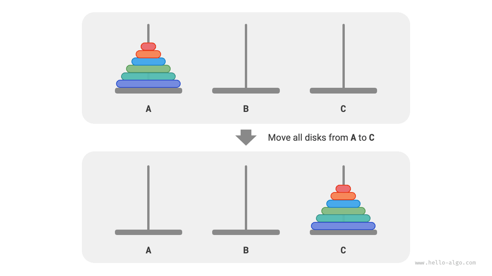
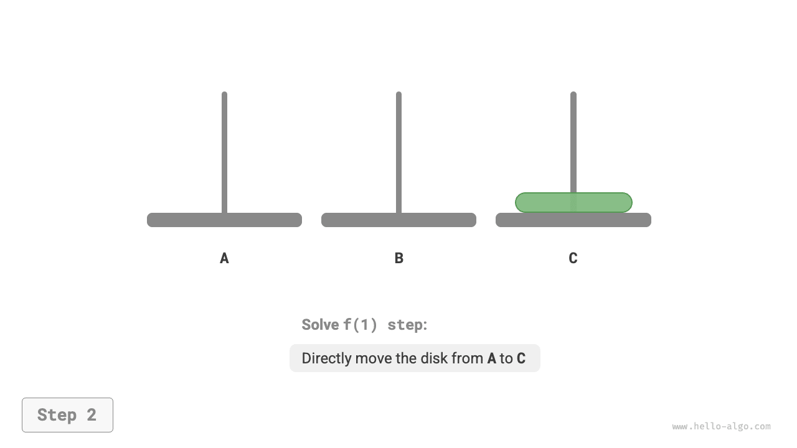
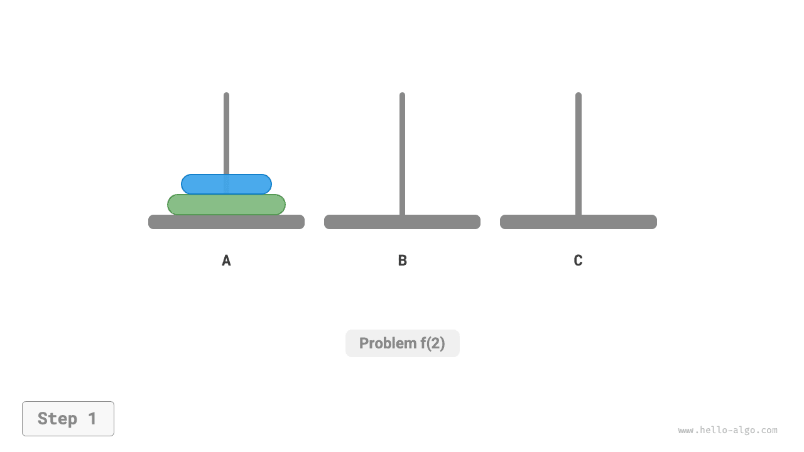
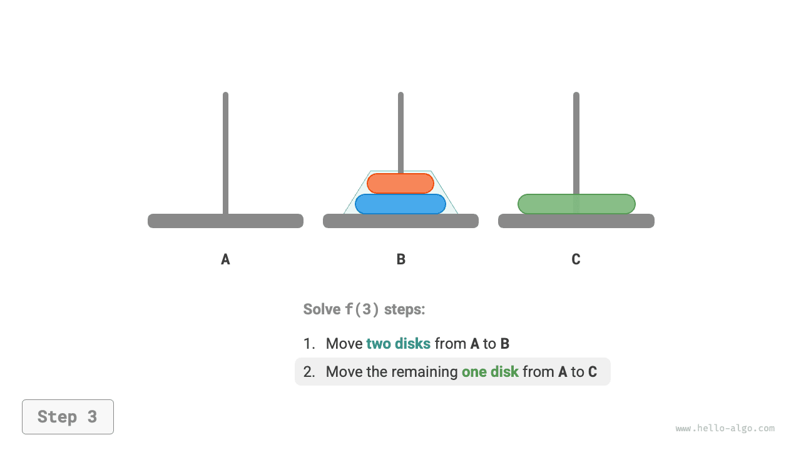
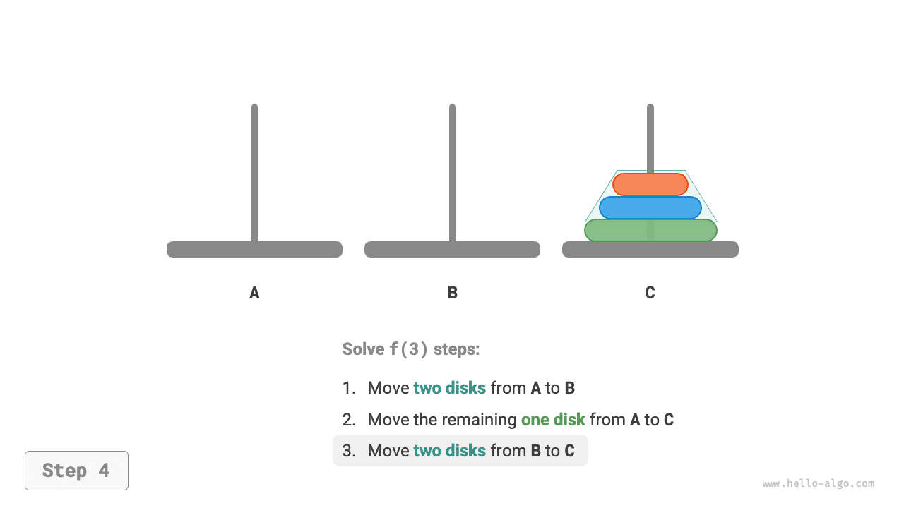

# Bài toán tháp Hà Nội

Trong sắp xếp trộn và bài toán dựng cây nhị phân, chúng ta đều phân rã bài toán ban đầu thành hai bài toán con có quy mô bằng một nửa bài toán ban đầu. Tuy nhiên đối với bài toán tháp Hà Nội, chúng ta áp dụng một chiến lược phân rã hoàn toàn khác.

!!! question

    Cho ba chiếc cọc, ký hiệu là `A`、`B` và `C` 。Ở trạng thái ban đầu, trên cọc `A` có lồng $n$ chiếc đĩa, chúng được xếp từ trên xuống dưới theo thứ tự kích thước từ nhỏ đến lớn. Nhiệm vụ của chúng ta là phải chuyển toàn bộ $n$ chiếc đĩa này sang cọc `C` ，đồng thời duy trì thứ tự ban đầu của chúng không đổi (như hình dưới đây). Trong quá trình di chuyển đĩa, cần tuân thủ các quy tắc sau:
    
    1. Mỗi lần chỉ được lấy một đĩa từ đỉnh một cọc ra và đặt vào đỉnh một cọc khác.
    2. Mỗi lần chỉ được di chuyển đúng một đĩa.
    3. Đĩa nhỏ phải luôn luôn nằm trên đĩa lớn.



**Chúng ta ký hiệu bài toán tháp Hà Nội quy mô $i$ là $f(i)$** 。Ví dụ $f(3)$ đại diện cho bài toán tháp Hà Nội di chuyển $3$ chiếc đĩa từ `A` sang `C` 。

### Xem xét các trường hợp cơ sở

Như hình dưới đây, đối với bài toán $f(1)$ ，tức là khi chỉ có một đĩa, chúng ta chỉ cần trực tiếp chuyển nó từ `A` sang `C` là xong.

=== "<1>"
    

=== "<2>"
    

Như hình dưới đây, đối với bài toán $f(2)$ ，tức là khi có hai đĩa, **do luôn phải thoả mãn điều kiện đĩa nhỏ nằm trên đĩa lớn, nên cần phải nhờ cọc `B` làm trung gian để hoàn thành việc di chuyển**:

1. Đầu tiên chuyển chiếc đĩa nhỏ ở trên từ `A` sang `B` 。
2. Sau đó chuyển chiếc đĩa lớn từ `A` sang `C` 。
3. Cuối cùng chuyển chiếc đĩa nhỏ từ `B` sang `C` 。

=== "<1>"
    

=== "<2>"
    

=== "<3>"
    

=== "<4>"
    

Quá trình giải bài toán $f(2)$ có thể đúc kết thành: **chuyển hai chiếc đĩa từ `A` sang `C` nhờ cọc đệm `B`** 。Trong đó, `C` được gọi là cọc đích (target pillar), `B` được gọi là cọc đệm (buffer pillar).

### Phân rã bài toán con

Đối với bài toán $f(3)$ ，tức là khi có ba chiếc đĩa, tình huống trở nên phức tạp hơn một chút.

Bởi vì đã biết lời giải của $f(1)$ và $f(2)$ ，nên chúng ta có thể tư duy theo góc độ chia để trị, **coi hai chiếc đĩa trên cùng của `A` như một khối thống nhất**, thực hiện các bước như hình dưới đây. Như vậy ba chiếc đĩa sẽ được chuyển một cách suôn sẻ từ `A` sang `C` ：

1. Lấy `B` làm cọc đích, `C` làm cọc đệm, chuyển hai chiếc đĩa từ `A` sang `B` 。
2. Chuyển một chiếc đĩa còn lại trong `A` trực tiếp từ `A` sang `C` 。
3. Lấy `C` làm cọc đích, `A` làm cọc đệm, chuyển hai chiếc đĩa từ `B` sang `C` 。

=== "<1>"
    

=== "<2>"
    

=== "<3>"
    

=== "<4>"
    

Xét về mặt bản chất, **chúng ta đã chia bài toán $f(3)$ thành hai bài toán con $f(2)$ và một bài toán con $f(1)$** 。Sau khi giải quyết ba bài toán con này theo đúng thứ tự, bài toán ban đầu cũng theo đó mà được giải quyết xong. Điều này chứng minh rằng các bài toán con là độc lập với nhau, và lời giải của chúng có thể hợp nhất được.

Đến đây, chúng ta có thể đúc kết ra chiến lược chia để trị để giải bài toán tháp Hà Nội như hình dưới đây: chia bài toán ban đầu $f(n)$ thành hai bài toán con $f(n-1)$ và một bài toán con $f(1)$ ，đồng thời giải quyết ba bài toán con này theo thứ tự sau:

1. Chuyển $n-1$ chiếc đĩa từ `A` sang `B` nhờ cọc đệm `C` 。
2. Chuyển $1$ chiếc đĩa còn lại trực tiếp từ `A` sang `C` 。
3. Chuyển $n-1$ chiếc đĩa từ `B` sang `C` nhờ cọc đệm `A` 。

Đối với hai bài toán con $f(n-1)$ này, **có thể tiếp tục phân chia đệ quy theo cách thức hoàn toàn tương tự**, cho đến khi chạm tới bài toán con nhỏ nhất $f(1)$ 。Mà lời giải của $f(1)$ đã biết rõ, chỉ cần đúng một thao tác di chuyển là xong.


### Hiện thực mã nguồn

Trong mã nguồn, chúng ta khai báo một hàm đệ quy `dfs(i, src, buf, tar)` ，nó có nhiệm vụ di chuyển $i$ chiếc đĩa trên cùng của cọc nguồn `src` sang cọc đích `tar` nhờ cọc đệm `buf` ：

```src
[file]{hanota}-[class]{}-[func]{solve_hanota}
```

Như hình dưới đây, bài toán tháp Hà Nội tạo thành một cây đệ quy có chiều cao là $n$ ，mỗi nút đại diện cho một bài toán con, tương ứng với một lần gọi hàm `dfs()` ，**do đó độ phức tạp thời gian là $O(2^n)$ ，độ phức tạp không gian là $O(n)$** 。


!!! quote

    Bài toán tháp Hà Nội bắt nguồn từ một truyền thuyết cổ xưa. Trong một ngôi đền ở Ấn Độ cổ đại, các nhà sư có ba chiếc cọc kim cương cao lớn cùng $64$ chiếc đĩa bằng vàng với kích thước khác nhau. Các nhà sư không ngừng di chuyển các đĩa, họ tin rằng vào khoảnh khắc chiếc đĩa cuối cùng được đặt đúng vị trí, thế giới này sẽ đi đến hồi kết thúc.

    Tuy nhiên, ngay cả khi các nhà sư di chuyển đĩa với tốc độ 1 lần mỗi giây, thì tổng cộng cũng cần khoảng $2^{64} \approx 1{,}84 \times 10^{19}$ giây, tương đương khoảng $585$ tỷ năm, vượt xa ước tính hiện tại về tuổi thọ của vũ trụ. Vì vậy, dẫu cho truyền thuyết này có là thật thì chúng ta cũng hoàn toàn không cần phải lo lắng về ngày tận thế.
