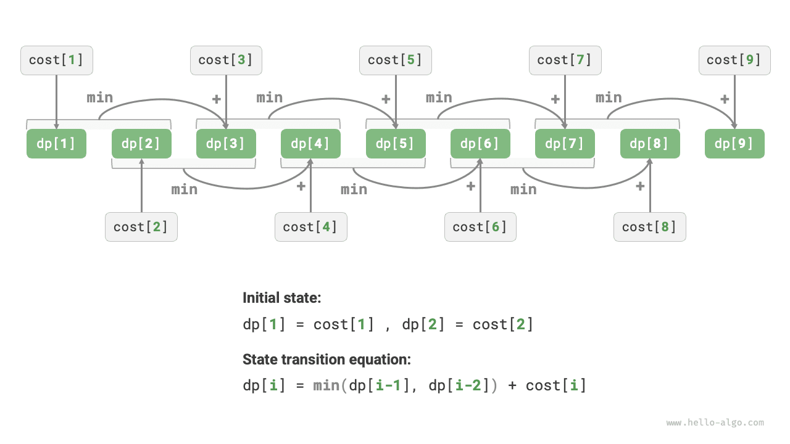

# Đặc trưng của bài toán quy hoạch động

Trong phần trước, chúng ta đã học cách quy hoạch động giải quyết bài toán ban đầu thông qua việc phân rã bài toán con. Trên thực tế, phân rã bài toán con là một tư tưởng thuật toán mang tính tổng quát, nhưng có trọng tâm khác nhau giữa chia để trị, quy hoạch động và quay lui:

- Thuật toán chia để trị đệ quy chia bài toán ban đầu thành nhiều bài toán con độc lập với nhau cho đến khi chạm tới bài toán con nhỏ nhất, và gộp lời giải các bài toán con trong quá trình quay về để cuối cùng thu được lời giải của bài toán ban đầu.
- Quy hoạch động cũng thực hiện phân rã đệ quy bài toán, nhưng điểm khác biệt chính so với thuật toán chia để trị là các bài toán con trong quy hoạch động phụ thuộc lẫn nhau, và trong quá trình phân rã sẽ xuất hiện rất nhiều bài toán con gối nhau (trùng lặp).
- Thuật toán quay lui vét cạn tất cả các lời giải khả dĩ thông qua thử nghiệm và quay lui, đồng thời tránh các nhánh tìm kiếm không cần thiết thông qua cắt tỉa. Lời giải của bài toán ban đầu được cấu thành từ một chuỗi các bước ra quyết định, chúng ta có thể coi chuỗi con trước mỗi bước ra quyết định là một bài toán con.

Trên thực tế, quy hoạch động thường được dùng để giải quyết các bài toán tối ưu hoá, chúng không chỉ chứa các bài toán con gối nhau mà còn sở hữu hai đặc trưng lớn khác: cấu trúc con tối ưu và tính không nhớ (không hệ luỵ).

## Cấu trúc con tối ưu (Optimal Substructure)

Chúng ta sửa đổi bài toán leo cầu thang một chút để nó phù hợp hơn trong việc thể hiện khái niệm cấu trúc con tối ưu.

!!! question "Chi phí tối thiểu khi leo cầu thang"

    Cho một chiếc cầu thang, mỗi bước bạn có thể bước $1$ bậc hoặc $2$ bậc, trên mỗi bậc cầu thang đều dán một số nguyên không âm biểu thị chi phí bạn cần phải trả khi đặt chân lên bậc thang đó. Cho một mảng số nguyên không âm $cost$, trong đó $cost[i]$ biểu thị chi phí cần trả tại bậc thang thứ $i$, $cost[0]$ là mặt đất (điểm xuất phát). Hãy tính toán cần trả chi phí tối thiểu là bao nhiêu để leo lên đến đỉnh?

Như hình dưới đây, nếu chi phí của các bậc $1$, $2$, $3$ lần lượt là $1$, $10$, $1$, thì chi phí tối thiểu để leo từ mặt đất lên bậc thứ $3$ là $2$.


Đặt $dp[i]$ là tổng chi phí tích luỹ để leo lên đến bậc thứ $i$. Do bậc thứ $i$ chỉ có thể đi từ bậc $i - 1$ hoặc bậc $i - 2$ lên, vì vậy $dp[i]$ chỉ có thể bằng $dp[i - 1] + cost[i]$ hoặc $dp[i - 2] + cost[i]$. Để chi phí là nhỏ nhất có thể, chúng ta nên chọn giá trị nhỏ hơn trong hai giá trị đó:

$$
dp[i] = \min(dp[i-1], dp[i-2]) + cost[i]
$$

Từ đó dẫn tới ý nghĩa của cấu trúc con tối ưu: **lời giải tối ưu của bài toán ban đầu được kiến tạo từ lời giải tối ưu của các bài toán con**.

Bài toán này hiển nhiên sở hữu cấu trúc con tối ưu: chúng ta chọn ra lời giải tốt hơn từ hai lời giải tối ưu của bài toán con là $dp[i-1]$ và $dp[i-2]$, và dùng nó để kiến tạo lời giải tối ưu cho bài toán ban đầu $dp[i]$.

Vậy thì, bài toán leo cầu thang ở phần trước có cấu trúc con tối ưu không? Mục tiêu của nó là tính số lượng phương án, thoạt nhìn là một bài toán đếm, nhưng nếu đổi sang một cách hỏi khác: "Tìm số lượng phương án lớn nhất". Chúng ta bất ngờ nhận ra rằng, **mặc dù trước và sau khi sửa đổi bài toán là tương đương nhau, nhưng cấu trúc con tối ưu đã hiển hiện**: số phương án lớn nhất ở bậc thứ $n$ bằng tổng số phương án lớn nhất ở bậc thứ $n-1$ và bậc thứ $n-2$. Do đó, cách giải thích cấu trúc con tối ưu tương đối linh hoạt, trong các bài toán khác nhau sẽ mang những ý nghĩa khác nhau.

Dựa trên phương trình chuyển trạng thái cùng trạng thái ban đầu $dp[1] = cost[1]$ và $dp[2] = cost[2]$, chúng ta có thể thu được mã nguồn quy hoạch động:

```src
[file]{min_cost_climbing_stairs_dp}-[class]{}-[func]{min_cost_climbing_stairs_dp}
```

Hình dưới đây minh hoạ quá trình quy hoạch động của mã nguồn trên.



Bài này cũng có thể thực hiện tối ưu hoá không gian, nén từ một chiều về không chiều (biến đơn lẻ), giúp độ phức tạp không gian giảm từ $O(n)$ xuống $O(1)$:

```src
[file]{min_cost_climbing_stairs_dp}-[class]{}-[func]{min_cost_climbing_stairs_dp_comp}
```

## Tính không nhớ / Không hệ luỵ (No Aftereffect)

Tính không nhớ là một trong những đặc trưng quan trọng giúp quy hoạch động có thể giải quyết hiệu quả các bài toán, định nghĩa của nó là: **cho một trạng thái xác định, sự phát triển trong tương lai của nó chỉ liên quan tới trạng thái hiện tại, mà không liên quan tới toàn bộ các trạng thái đã trải qua trong quá khứ**.

Lấy bài toán leo cầu thang làm ví dụ, cho trạng thái $i$, nó sẽ phát triển thành trạng thái $i+1$ và trạng thái $i+2$, lần lượt tương ứng với việc bước $1$ bậc và bước $2$ bậc. Khi đưa ra hai lựa chọn này, chúng ta hoàn toàn không cần bận tâm tới các trạng thái đứng trước trạng thái $i$, chúng không có bất kỳ ảnh hưởng nào tới tương lai của trạng thái $i$.

Tuy nhiên, nếu chúng ta bổ sung một điều kiện ràng buộc vào bài toán leo cầu thang thì tình thế sẽ hoàn toàn thay đổi.

!!! question "Leo cầu thang có ràng buộc"

    Cho một chiếc cầu thang có tổng cộng $n$ bậc, mỗi bước bạn có thể bước $1$ bậc hoặc $2$ bậc, **nhưng không được bước $1$ bậc trong hai vòng liên tiếp**, hỏi có bao nhiêu phương án để leo lên đến đỉnh?

Như hình dưới đây, để leo lên bậc thứ $3$ chỉ còn lại $2$ phương án khả thi, trong đó phương án bước $1$ bậc liên tiếp ba lần không thoả mãn điều kiện ràng buộc nên bị loại bỏ.


Trong bài toán này, nếu vòng trước bước $1$ bậc để lên, thì vòng tiếp theo bắt buộc phải bước $2$ bậc. Điều này đồng nghĩa với việc: **lựa chọn bước tiếp theo không thể do trạng thái hiện tại (bậc cầu thang hiện tại) quyết định độc lập, mà còn liên quan tới trạng thái trước đó (bậc cầu thang ở vòng trước)**.

Không khó để nhận ra rằng, bài toán này đã không còn thoả mãn tính không nhớ nữa, phương trình chuyển trạng thái $dp[i] = dp[i-1] + dp[i-2]$ cũng bị vô hiệu hoá, bởi vì $dp[i-1]$ đại diện cho việc vòng này bước $1$ bậc, nhưng trong đó lại bao gồm rất nhiều phương án "ở vòng trước cũng bước $1$ bậc để lên", mà để thoả mãn ràng buộc thì chúng ta không thể trực tiếp cộng $dp[i-1]$ vào $dp[i]$ được.

Vì vậy, chúng ta cần phải mở rộng định nghĩa trạng thái: **trạng thái $[i, j]$ biểu thị đang đứng ở bậc thứ $i$ và vòng trước đã bước $j$ bậc**, trong đó $j \in \{1, 2\}$. Định nghĩa trạng thái này phân biệt hiệu quả vòng trước đã bước $1$ bậc hay $2$ bậc, chúng ta có thể dựa vào đó để xác định trạng thái hiện tại được chuyển đến từ đâu:

- Khi vòng trước bước $1$ bậc, thì vòng trước nữa chỉ có thể chọn bước $2$ bậc, tức $dp[i, 1]$ chỉ có thể chuyển trạng thái từ $dp[i-1, 2]$ sang.
- Khi vòng trước bước $2$ bậc, thì vòng trước nữa có thể chọn bước $1$ bậc hoặc bước $2$ bậc, tức $dp[i, 2]$ có thể chuyển trạng thái từ $dp[i-2, 1]$ hoặc $dp[i-2, 2]$ sang.

Như hình dưới đây, dưới định nghĩa này, $dp[i, j]$ biểu thị số phương án tương ứng với trạng thái $[i, j]$. Lúc này phương trình chuyển trạng thái là:

$$
\begin{cases}
dp[i, 1] = dp[i-1, 2] \\
dp[i, 2] = dp[i-2, 1] + dp[i-2, 2]
\end{cases}
$$


Cuối cùng, chỉ cần trả về $dp[n, 1] + dp[n, 2]$ là xong, tổng của cả hai đại diện cho tổng số phương án leo lên đến bậc thứ $n$:

```src
[file]{climbing_stairs_constraint_dp}-[class]{}-[func]{climbing_stairs_constraint_dp}
```

Trong ví dụ trên, do chỉ cần xét thêm một trạng thái liền trước, nên chúng ta vẫn có thể thông qua việc mở rộng định nghĩa trạng thái để khiến bài toán tái thoả mãn tính không nhớ. Tuy nhiên, một số bài toán lại có tính "có hệ luỵ / có nhớ" rất nghiêm trọng.

!!! question "Leo cầu thang và sinh chướng ngại vật"

    Cho một chiếc cầu thang có tổng cộng $n$ bậc, mỗi bước bạn có thể bước $1$ bậc hoặc $2$ bậc. **Quy định rằng khi leo đến bậc thứ $i$, hệ thống sẽ tự động đặt chướng ngại vật lên bậc thứ $2i$, và toàn bộ các vòng sau đó đều không được phép bước vào bậc thứ $2i$**. Ví dụ, hai vòng đầu tiên lần lượt bước tới bậc $2$ và $3$, thì sau đó không được bước tới bậc $4$ và $6$. Hỏi có bao nhiêu phương án để leo lên đến đỉnh?

Trong bài toán này, bước nhảy tiếp theo phụ thuộc vào toàn bộ các trạng thái trong quá khứ, bởi vì mỗi lần nhảy đều sẽ đặt chướng ngại vật lên các bậc thang cao hơn và làm ảnh hưởng tới các bước nhảy trong tương lai. Đối với những dạng bài toán này, quy hoạch động thường khó có thể giải quyết được.

Trên thực tế, rất nhiều bài toán tối ưu hoá tổ hợp phức tạp (chẳng hạn như bài toán người du lịch TSP) không thoả mãn tính không nhớ. Đối với dạng bài toán này, chúng ta thường sẽ chọn sử dụng các phương pháp khác, chẳng hạn như tìm kiếm heuristic, thuật toán di truyền, học tăng cường (reinforcement learning), v.v., từ đó thu được lời giải tối ưu cục bộ có thể chấp nhận được trong thời gian hữu hạn.
