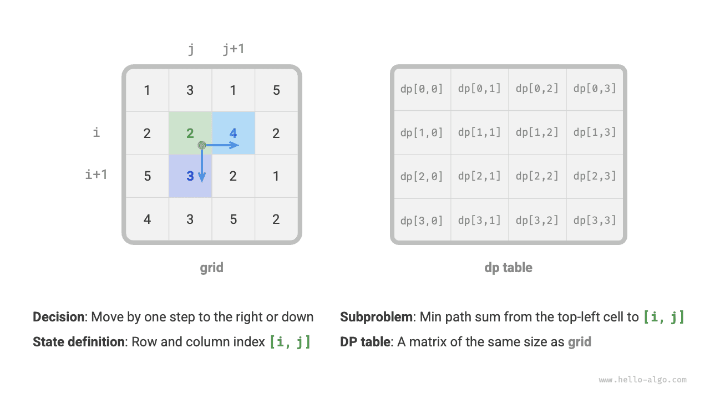
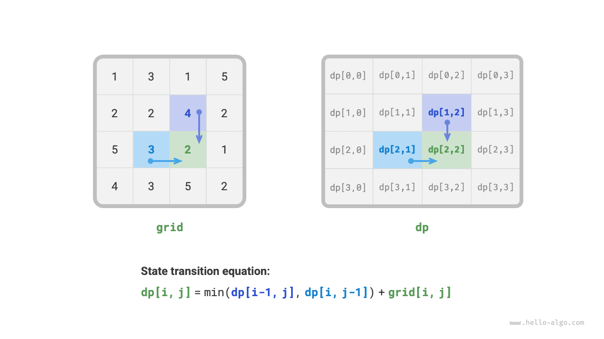
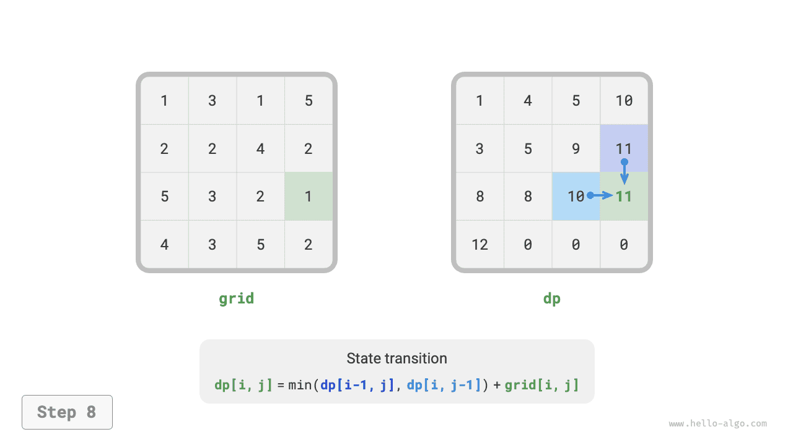

# Phương pháp giải bài toán quy hoạch động

Hai phần trước đã giới thiệu các đặc trưng chủ yếu của bài toán quy hoạch động, tiếp theo chúng ta sẽ cùng nhau khám phá hai vấn đề mang tính thực hành cao hơn:

1. Làm thế nào để nhận biết một bài toán có phải là bài toán quy hoạch động hay không?
2. Bắt đầu giải một bài toán quy hoạch động từ đâu, và các bước hoàn chỉnh là gì?

## Nhận biết bài toán

Tổng thể mà nói, nếu một bài toán chứa các bài toán con gối nhau, sở hữu cấu trúc con tối ưu và thoả mãn tính không nhớ, thì thông thường nó rất thích hợp để giải bằng quy hoạch động. Tuy nhiên, chúng ta rất khó trực tiếp bóc tách những đặc tính này từ mô tả của đề bài. Vì vậy chúng ta thường nới lỏng điều kiện, **trước tiên quan sát xem bài toán có thích hợp để giải bằng quay lui (vét cạn) hay không**.

**Các bài toán thích hợp giải bằng quay lui thường thoả mãn "mô hình cây quyết định"**, loại bài toán này có thể mô tả bằng cấu trúc cây, trong đó mỗi nút đại diện cho một quyết định, và mỗi đường đi đại diện cho một chuỗi các quyết định.

Nói cách khác, nếu bài toán chứa khái niệm quyết định rõ ràng, và lời giải được sinh ra thông qua một chuỗi các quyết định, thì nó thoả mãn mô hình cây quyết định, thông thường có thể giải bằng quay lui.

Trên cơ sở đó, bài toán quy hoạch động còn có thêm một số "điểm cộng" để nhận biết:

- Đề bài chứa các mô tả mang tính tối ưu hoá như lớn (nhỏ) nhất hoặc nhiều (ít) nhất.
- Trạng thái của bài toán có thể biểu diễn bằng một danh sách, ma trận nhiều chiều hoặc cây, và giữa một trạng thái với các trạng thái xung quanh nó tồn tại quan hệ truy hồi.

Tương ứng với đó, cũng tồn tại một số "điểm trừ":

- Mục tiêu của bài toán là tìm tất cả các phương án giải quyết khả dĩ, chứ không phải tìm một lời giải tối ưu.
- Mô tả bài toán mang đặc trưng rõ rệt của bài toán chỉnh hợp và tổ hợp, đòi hỏi phải trả về nhiều phương án cụ thể.

Nếu một bài toán thoả mãn mô hình cây quyết định và có các "điểm cộng" tương đối rõ nét, chúng ta có thể giả định nó là một bài toán quy hoạch động, và tiến hành kiểm chứng giả định đó trong quá trình giải bài.

## Các bước giải bài toán

Quy trình giải bài toán quy hoạch động sẽ có sự khác biệt tuỳ theo tính chất và độ khó của bài toán, nhưng thông thường đều tuân theo các bước sau: mô tả quyết định, định nghĩa trạng thái, thiết lập bảng $dp$, suy diễn phương trình chuyển trạng thái, xác định các điều kiện biên, v.v.

Để minh hoạ các bước giải bài một cách trực quan và sinh động hơn, chúng ta lấy bài toán kinh điển "Tổng đường đi nhỏ nhất" làm ví dụ.

!!! question

    Cho một lưới hai chiều $n \times m$ `grid`, mỗi ô trong lưới chứa một số nguyên không âm biểu thị chi phí của ô đó. Robot lấy ô trên cùng bên trái làm điểm xuất phát, mỗi bước chỉ có thể di chuyển xuống dưới hoặc sang phải một ô, cho đến khi tới ô dưới cùng bên phải. Hãy trả về tổng đường đi nhỏ nhất từ góc trên bên trái đến góc dưới bên phải.

Hình dưới đây minh hoạ một ví dụ, tổng đường đi nhỏ nhất của lưới cho trước là $13$.


**Bước 1: Suy ngẫm quyết định ở mỗi vòng, định nghĩa trạng thái, từ đó thu được bảng $dp$**

Quyết định ở mỗi vòng của bài này là từ ô hiện tại bước một bước xuống dưới hoặc sang phải. Đặt chỉ số hàng và cột của ô hiện tại là $[i, j]$, khi đó sau khi bước xuống dưới hoặc sang phải một bước, chỉ số trở thành $[i+1, j]$ hoặc $[i, j+1]$. Do đó, trạng thái nên chứa hai biến chỉ số hàng và chỉ số cột, ký hiệu là $[i, j]$.

Trạng thái $[i, j]$ tương ứng với bài toán con: tổng đường đi nhỏ nhất từ điểm xuất phát $[0, 0]$ đi đến $[i, j]$, lời giải ký hiệu là $dp[i, j]$.

Đến đây, chúng ta thu được ma trận $dp$ hai chiều như hình dưới đây, kích thước của nó giống hệt lưới đầu vào $grid$.



!!! note

    Quá trình quy hoạch động và quay lui có thể mô tả như một chuỗi các quyết định, và trạng thái được cấu thành từ toàn bộ các biến quyết định. Nó phải chứa tất cả các biến mô tả tiến độ giải bài, chứa đủ thông tin để có thể suy diễn ra trạng thái tiếp theo.
    
    Mỗi trạng thái đều tương ứng với một bài toán con, chúng ta định nghĩa một bảng $dp$ để lưu trữ lời giải của toàn bộ các bài toán con, mỗi biến độc lập của trạng thái là một chiều của bảng $dp$. Về bản chất, bảng $dp$ là ánh xạ giữa trạng thái và lời giải của bài toán con.

**Bước 2: Tìm ra cấu trúc con tối ưu, từ đó suy diễn ra phương trình chuyển trạng thái**

Đối với trạng thái $[i, j]$, nó chỉ có thể chuyển từ ô phía trên $[i-1, j]$ hoặc ô bên trái $[i, j-1]$ sang. Do đó cấu trúc con tối ưu là: tổng đường đi nhỏ nhất để đến $[i, j]$ được quyết định bởi giá trị nhỏ hơn giữa tổng đường đi nhỏ nhất của $[i, j-1]$ và tổng đường đi nhỏ nhất của $[i-1, j]$.

Dựa trên phân tích trên, có thể rút ra phương trình chuyển trạng thái như hình dưới đây:

$$
dp[i, j] = \min(dp[i-1, j], dp[i, j-1]) + grid[i, j]
$$



!!! note

    Căn cứ vào bảng $dp$ đã định nghĩa, suy ngẫm mối quan hệ giữa bài toán ban đầu và các bài toán con, tìm ra phương pháp kiến tạo lời giải tối ưu của bài toán ban đầu từ lời giải tối ưu của bài toán con, đó chính là cấu trúc con tối ưu.
    
    Một khi chúng ta đã tìm ra cấu trúc con tối ưu thì có thể dùng nó để xây dựng phương trình chuyển trạng thái.

**Bước 3: Xác định các điều kiện biên và thứ tự chuyển trạng thái**

Trong bài này, các trạng thái ở hàng đầu tiên chỉ có thể chuyển từ trạng thái bên trái sang, các trạng thái ở cột đầu tiên chỉ có thể chuyển từ trạng thái bên trên xuống, do đó hàng đầu tiên $i = 0$ và cột đầu tiên $j = 0$ là các điều kiện biên.

Như hình dưới đây, do mỗi ô đều được chuyển trạng thái từ ô bên trái và ô bên trên, vì vậy chúng ta dùng vòng lặp để duyệt ma trận, vòng ngoài duyệt qua các hàng, vòng trong duyệt qua các cột.


!!! note

    Điều kiện biên trong quy hoạch động dùng để khởi tạo bảng $dp$, trong tìm kiếm dùng cho cắt tỉa.
    
    Mấu chốt của thứ tự chuyển trạng thái là phải đảm bảo khi tính toán lời giải của bài toán hiện tại thì toàn bộ lời giải của các bài toán con nhỏ hơn mà nó phụ thuộc đều đã được tính toán chính xác từ trước.

Dựa trên phân tích ở trên, chúng ta đã có thể trực tiếp viết mã nguồn quy hoạch động. Tuy nhiên phân rã bài toán con là tư tưởng từ đỉnh xuống đáy, do đó hiện thực theo thứ tự "tìm kiếm vét cạn $\rightarrow$ tìm kiếm có nhớ $\rightarrow$ quy hoạch động" sẽ phù hợp hơn với thói quen tư duy.

### Phương pháp 1: Tìm kiếm vét cạn

Bắt đầu tìm kiếm từ trạng thái $[i, j]$, liên tục phân rã thành các trạng thái nhỏ hơn $[i-1, j]$ và $[i, j-1]$, hàm đệ quy bao gồm các yếu tố sau:

- **Tham số đệ quy**: Trạng thái $[i, j]$.
- **Giá trị trả về**: Tổng đường đi nhỏ nhất $dp[i, j]$ từ $[0, 0]$ đến $[i, j]$.
- **Điều kiện dừng**: Khi $i = 0$ và $j = 0$, trả về chi phí $grid[0, 0]$.
- **Cắt tỉa**: Khi $i < 0$ hoặc $j < 0$ thì chỉ số bị vượt biên, lúc này trả về chi phí $+\infty$, đại diện cho phương án không khả thi.

Mã nguồn hiện thực như sau:

```src
[file]{min_path_sum}-[class]{}-[func]{min_path_sum_dfs}
```

Hình dưới đây đưa ra cây đệ quy lấy $dp[2, 1]$ làm nút gốc, trong đó chứa một số bài toán con gối nhau, số lượng của chúng sẽ tăng vọt khi kích thước lưới `grid` mở rộng.

Xét về mặt bản chất, nguyên nhân gây ra các bài toán con gối nhau là: **tồn tại nhiều đường đi khác nhau có thể đi từ góc trên bên trái đến cùng một ô lưới**.


Mỗi trạng thái đều có hai lựa chọn đi xuống và sang phải, để đi từ góc trên bên trái đến góc dưới bên phải cần tổng cộng $m + n - 2$ bước, vì vậy độ phức tạp thời gian trong trường hợp xấu nhất là $O(2^{m + n})$, trong đó $n$ và $m$ lần lượt là số hàng và số cột của lưới. Xin lưu ý rằng cách tính này chưa xét đến tình huống tiếp cận biên của lưới, khi chạm tới biên của lưới thì chỉ còn lại một lựa chọn duy nhất, do đó số lượng đường đi thực tế sẽ ít hơn một chút.

### Phương pháp 2: Tìm kiếm có nhớ

Chúng ta đưa vào một danh sách ghi nhớ `mem` có cùng kích thước với lưới `grid` để ghi lại lời giải của từng bài toán con, và cắt tỉa các bài toán con gối nhau:

```src
[file]{min_path_sum}-[class]{}-[func]{min_path_sum_dfs_mem}
```

Như hình dưới đây, sau khi đưa vào ghi nhớ, lời giải của tất cả các bài toán con đều chỉ cần tính đúng một lần, do đó độ phức tạp thời gian phụ thuộc vào tổng số trạng thái, tức kích thước lưới $O(nm)$.


### Phương pháp 3: Quy hoạch động

Hiện thực cách giải quy hoạch động dựa trên suy diễn lặp, mã nguồn như sau:

```src
[file]{min_path_sum}-[class]{}-[func]{min_path_sum_dp}
```

Hình dưới đây minh hoạ quá trình chuyển trạng thái của tổng đường đi nhỏ nhất, nó duyệt qua toàn bộ lưới, **do đó độ phức tạp thời gian là $O(nm)$**.

Mảng `dp` có kích thước là $n \times m$, **do đó độ phức tạp không gian là $O(nm)$**.

=== "<1>"
    

=== "<2>"
    

=== "<3>"
    

=== "<4>"
    

=== "<5>"
    

=== "<6>"
    

=== "<7>"
    

=== "<8>"
    

=== "<9>"
    

=== "<10>"
    

=== "<11>"
    

=== "<12>"
    

### Tối ưu hoá không gian

Do mỗi ô chỉ liên quan tới ô bên trái và ô bên trên nó, vì vậy chúng ta có thể chỉ dùng một mảng một hàng duy nhất để hiện thực bảng $dp$.

Xin lưu ý rằng, vì mảng `dp` chỉ có thể biểu diễn trạng thái của một hàng, nên chúng ta không thể khởi tạo trước trạng thái cột đầu tiên mà phải cập nhật nó trong quá trình duyệt qua từng hàng:

```src
[file]{min_path_sum}-[class]{}-[func]{min_path_sum_dp_comp}
```
