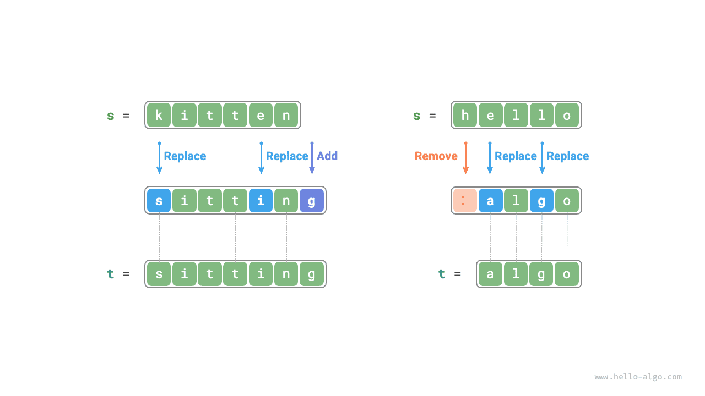
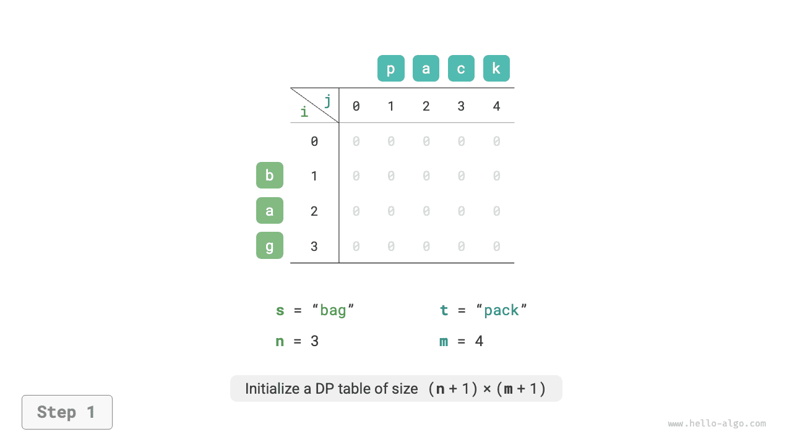
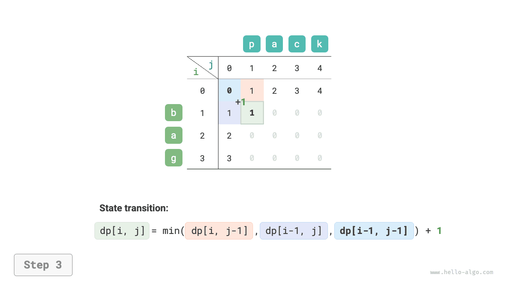
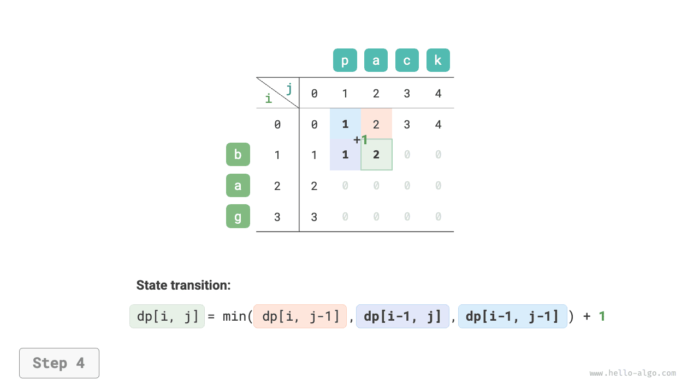
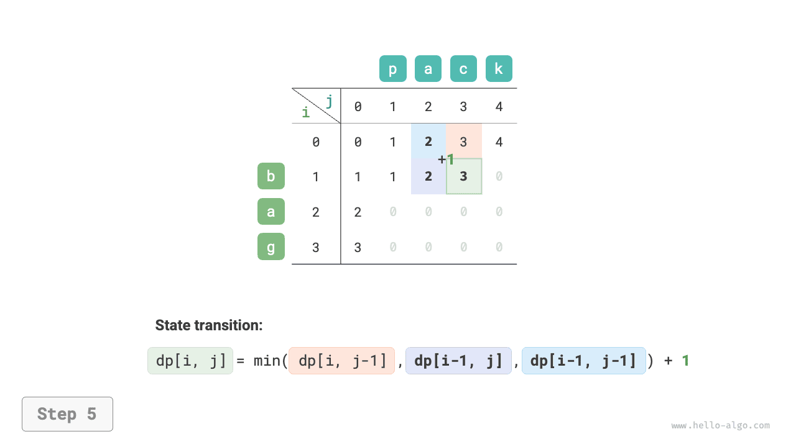
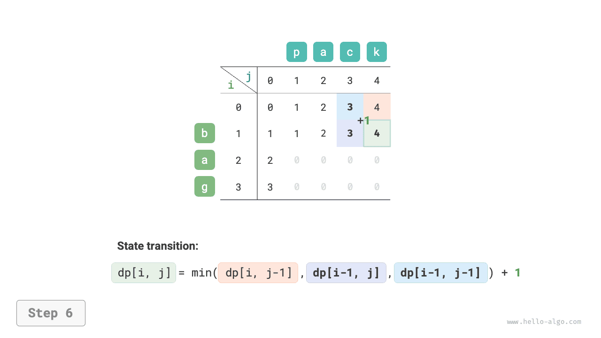
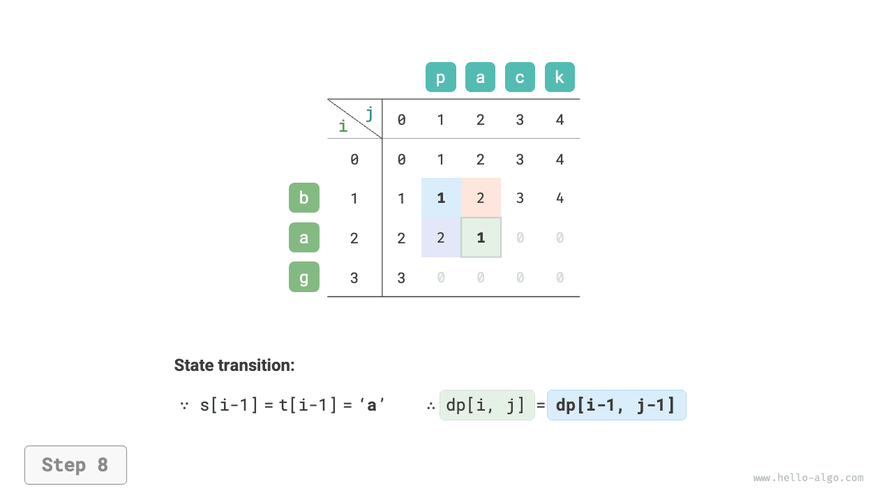
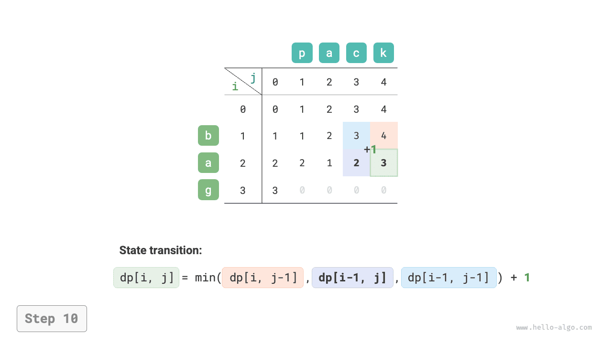
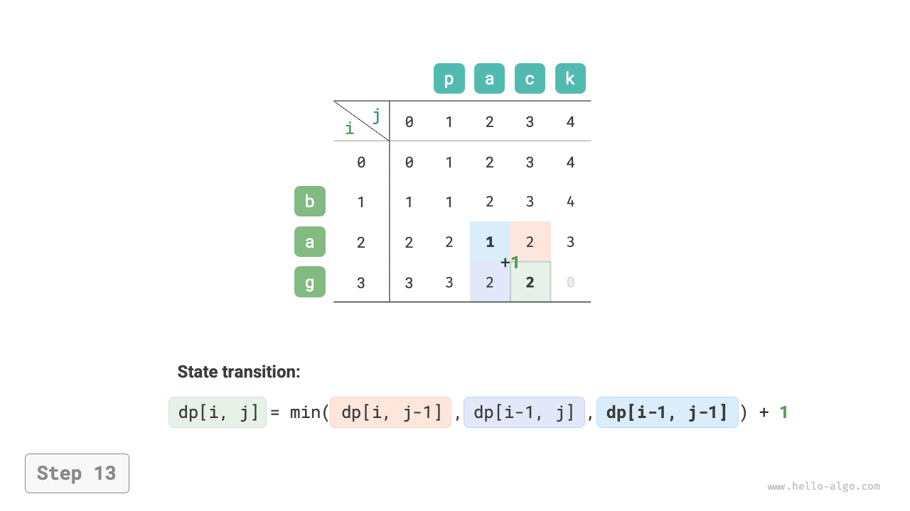
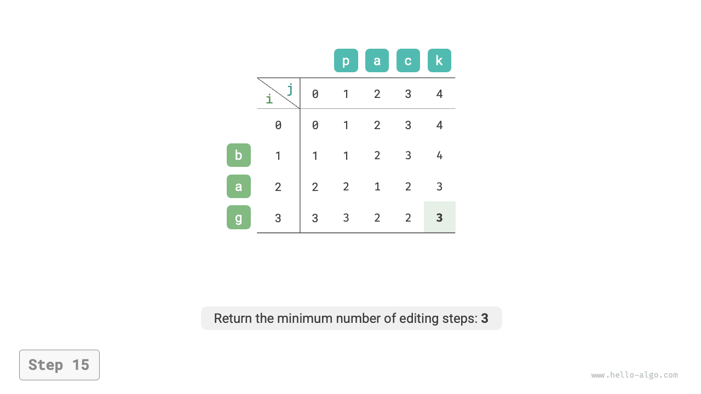

# Bài toán khoảng cách chỉnh sửa

Khoảng cách chỉnh sửa (Edit distance), còn gọi là khoảng cách Levenshtein (Levenshtein distance), chỉ số lần sửa đổi ít nhất để chuyển đổi qua lại giữa hai chuỗi ký tự, thường được sử dụng trong truy xuất thông tin (Information Retrieval) và xử lý ngôn ngữ tự nhiên (NLP) để đo lường độ tương đồng giữa hai chuỗi.

!!! question

    Nhập vào hai chuỗi ký tự $s$ và $t$, hãy trả về số bước chỉnh sửa ít nhất cần thiết để chuyển đổi chuỗi $s$ thành chuỗi $t$.
    
    Bạn có thể thực hiện ba thao tác chỉnh sửa trên một chuỗi: chèn một ký tự, xoá một ký tự, thay thế một ký tự bằng một ký tự bất kỳ.

Như hình dưới đây, để chuyển đổi `kitten` thành `sitting` cần 3 bước chỉnh sửa, bao gồm 2 thao tác thay thế và 1 thao tác chèn thêm; để chuyển đổi `hello` thành `algo` cần 3 bước, bao gồm 2 thao tác thay thế và 1 thao tác xoá.



**Bài toán khoảng cách chỉnh sửa có thể giải thích một cách rất tự nhiên bằng mô hình cây quyết định**. Chuỗi ký tự tương ứng với nút trên cây, một vòng quyết định (một thao tác chỉnh sửa) tương ứng với một cạnh của cây.

Như hình dưới đây, trong trường hợp không giới hạn thao tác, mỗi nút đều có thể phân nhánh ra nhiều cạnh, mỗi cạnh tương ứng với một thao tác, điều này đồng nghĩa với việc từ `hello` chuyển sang `algo` có rất nhiều đường đi khả dĩ.

Xét từ góc độ cây quyết định, mục tiêu của bài này là tìm đường đi ngắn nhất giữa nút `hello` và nút `algo`.


### Tư tưởng quy hoạch động

**Bước 1: Suy ngẫm quyết định ở mỗi vòng, định nghĩa trạng thái, từ đó thu được bảng $dp$**

Quyết định ở mỗi vòng là thực hiện một thao tác chỉnh sửa trên chuỗi $s$.

Chúng ta mong muốn trong quá trình thực hiện các thao tác chỉnh sửa, quy mô bài toán sẽ thu hẹp dần dần, như vậy mới có thể kiến tạo bài toán con. Đặt độ dài của chuỗi $s$ và $t$ lần lượt là $n$ và $m$, trước hết chúng ta xem xét ký tự ở phần đuôi của hai chuỗi là $s[n-1]$ và $t[m-1]$:

- Nếu $s[n-1]$ và $t[m-1]$ giống nhau, chúng ta có thể bỏ qua chúng, trực tiếp xét tiếp $s[n-2]$ và $t[m-2]$.
- Nếu $s[n-1]$ và $t[m-1]$ khác nhau, chúng ta cần thực hiện một lần chỉnh sửa trên $s$ (chèn, xoá, thay thế) để ký tự đuôi của hai chuỗi giống nhau, từ đó có thể bỏ qua chúng và xét bài toán có quy mô nhỏ hơn.

Nói cách khác, mỗi vòng quyết định (thao tác chỉnh sửa) chúng ta thực hiện trên chuỗi $s$ đều sẽ khiến các ký tự còn lại cần so khớp trong $s$ và $t$ thay đổi. Vì vậy, trạng thái là ký tự thứ $i$ và thứ $j$ hiện đang xét trong $s$ và $t$, ký hiệu là $[i, j]$.

Trạng thái $[i, j]$ tương ứng với bài toán con: **số bước chỉnh sửa ít nhất cần thiết để sửa $i$ ký tự đầu tiên của $s$ thành $j$ ký tự đầu tiên của $t$**.

Đến đây, chúng ta thu được một bảng $dp$ hai chiều kích thước $(n+1) \times (m+1)$.

**Bước 2: Tìm ra cấu trúc con tối ưu, từ đó suy diễn ra phương trình chuyển trạng thái**

Xét bài toán con $dp[i, j]$, ký tự đuôi của hai chuỗi tương ứng là $s[i-1]$ và $t[j-1]$, có thể chia thành ba trường hợp tương ứng với các thao tác chỉnh sửa khác nhau như hình dưới đây:

1. Chèn thêm $t[j-1]$ vào sau $s[i-1]$, khi đó bài toán con còn lại là $dp[i, j-1]$.
2. Xoá $s[i-1]$, khi đó bài toán con còn lại là $dp[i-1, j]$.
3. Thay thế $s[i-1]$ bằng $t[j-1]$, khi đó bài toán con còn lại là $dp[i-1, j-1]$.


Dựa trên phân tích ở trên, có thể thu được cấu trúc con tối ưu: số bước chỉnh sửa ít nhất của $dp[i, j]$ bằng giá trị nhỏ nhất trong ba giá trị $dp[i, j-1]$, $dp[i-1, j]$, $dp[i-1, j-1]$ cộng thêm chi phí $1$ bước chỉnh sửa lần này. Phương trình chuyển trạng thái tương ứng là:

$$
dp[i, j] = \min(dp[i, j-1], dp[i-1, j], dp[i-1, j-1]) + 1
$$

Xin lưu ý rằng, **khi $s[i-1]$ và $t[j-1]$ giống nhau, không cần chỉnh sửa ký tự hiện tại**, phương trình chuyển trạng thái trong trường hợp này là:

$$
dp[i, j] = dp[i-1, j-1]
$$

**Bước 3: Xác định các điều kiện biên và thứ tự chuyển trạng thái**

Khi cả hai chuỗi đều rỗng thì số bước chỉnh sửa bằng $0$, tức $dp[0, 0] = 0$. Khi $s$ rỗng nhưng $t$ không rỗng, số bước chỉnh sửa ít nhất bằng độ dài của $t$, tức hàng đầu tiên $dp[0, j] = j$. Khi $s$ không rỗng nhưng $t$ rỗng, số bước chỉnh sửa ít nhất bằng độ dài của $s$, tức cột đầu tiên $dp[i, 0] = i$.

Quan sát phương trình chuyển trạng thái, lời giải $dp[i, j]$ phụ thuộc vào lời giải bên trái, bên trên và phía trên bên trái, do đó chỉ cần dùng hai vòng lặp duyệt xuôi toàn bộ bảng $dp$ là được.

### Hiện thực mã nguồn

```src
[file]{edit_distance}-[class]{}-[func]{edit_distance_dp}
```

Như hình dưới đây, quá trình chuyển trạng thái của bài toán khoảng cách chỉnh sửa rất giống với bài toán cái túi, đều có thể xem như quá trình điền vào một lưới hai chiều.

=== "<1>"
    

=== "<2>"
    

=== "<3>"
    

=== "<4>"
    

=== "<5>"
    

=== "<6>"
    

=== "<7>"
    

=== "<8>"
    

=== "<9>"
    

=== "<10>"
    

=== "<11>"
    

=== "<12>"
    

=== "<13>"
    

=== "<14>"
    

=== "<15>"
    

### Tối ưu hoá không gian

Do $dp[i,j]$ được chuyển trạng thái từ phía trên $dp[i-1, j]$, bên trái $dp[i, j-1]$ và phía trên bên trái $dp[i-1, j-1]$, trong khi duyệt xuôi sẽ làm mất giá trị phía trên bên trái $dp[i-1, j-1]$, còn duyệt ngược thì không thể xây dựng trước $dp[i, j-1]$, vì vậy cả hai thứ tự duyệt đều không khả thi nếu chỉ dùng mảng 1 chiều đơn thuần.

Để giải quyết, chúng ta có thể sử dụng một biến `leftup` để lưu tạm thời lời giải phía trên bên trái $dp[i-1, j-1]$, nhờ đó chỉ cần xét lời giải bên trái và bên trên. Lúc này tình huống tương tự với bài toán cái túi hoàn toàn, có thể dùng duyệt xuôi. Mã nguồn như sau:

```src
[file]{edit_distance}-[class]{}-[func]{edit_distance_dp_comp}
```
