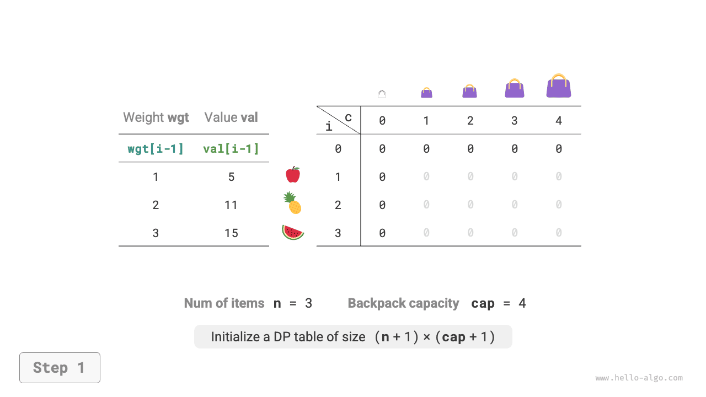
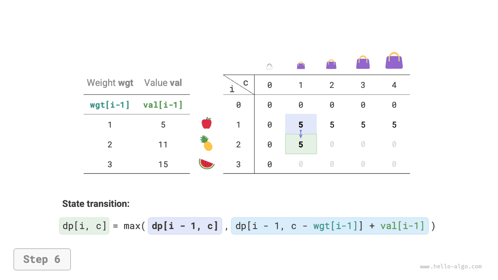
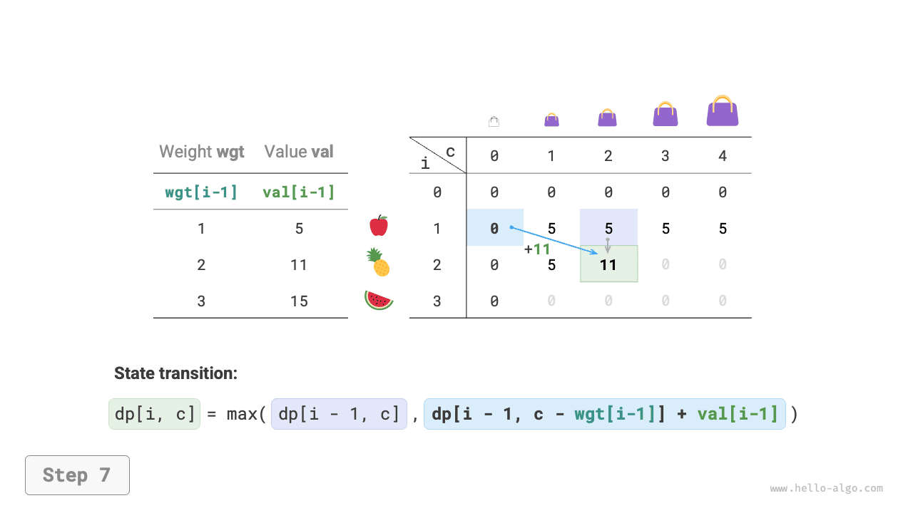
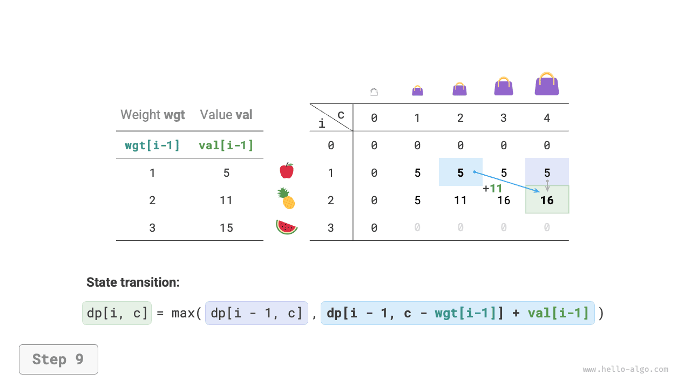
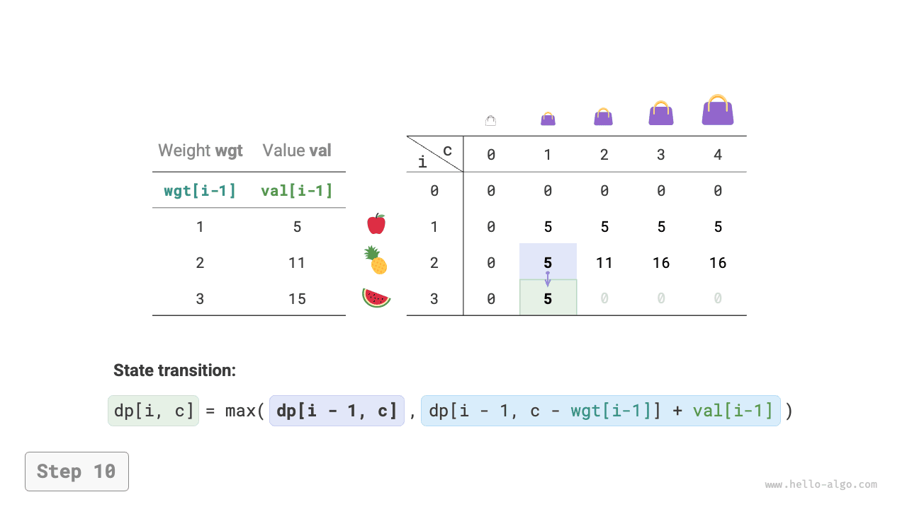
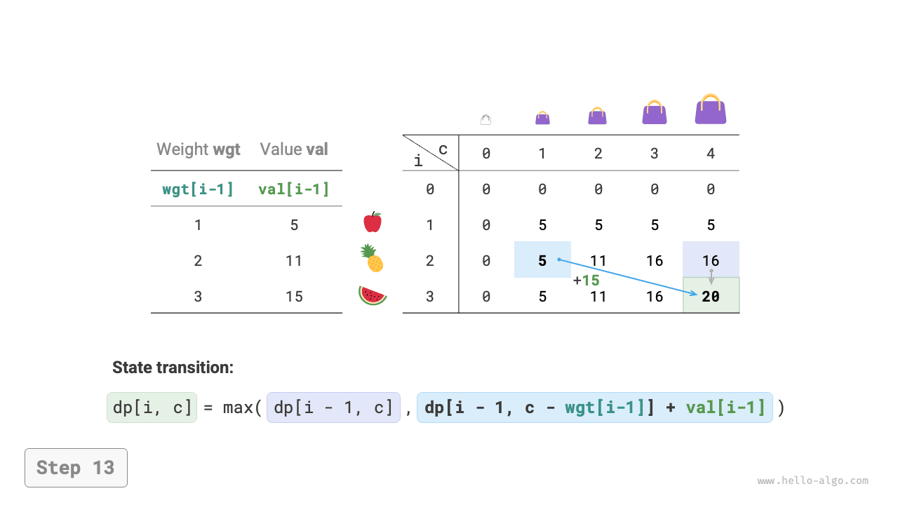
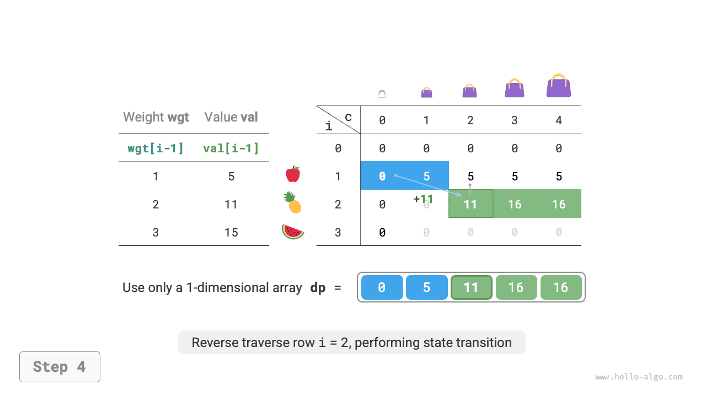

# Bài toán cái túi 0-1

Bài toán cái túi (Knapsack problem) là một bài toán nhập môn quy hoạch động vô cùng xuất sắc, là dạng bài toán phổ biến nhất trong quy hoạch động. Nó có rất nhiều biến thể, chẳng hạn như bài toán cái túi 0-1, bài toán cái túi hoàn toàn (unbounded knapsack), bài toán cái túi nhiều lựa chọn (multiple knapsack), v.v.

Trong phần này, trước hết chúng ta sẽ giải quyết bài toán cái túi 0-1 phổ biến nhất.

!!! question

    Cho $n$ đồ vật, đồ vật thứ $i$ có trọng lượng là $wgt[i-1]$、giá trị là $val[i-1]$ ，và một chiếc túi có dung tích (sức chứa) là $cap$ 。Mỗi đồ vật chỉ được chọn tối đa một lần, hỏi trong giới hạn dung tích túi cho phép có thể đặt vào các đồ vật có tổng giá trị lớn nhất là bao nhiêu?

Quan sát hình dưới đây, do số thứ tự đồ vật $i$ bắt đầu đếm từ $1$ ，trong khi chỉ số mảng bắt đầu đếm từ $0$ ，vì vậy đồ vật $i$ tương ứng với trọng lượng $wgt[i-1]$ và giá trị $val[i-1]$ 。


Chúng ta có thể coi bài toán cái túi 0-1 như một quá trình cấu thành từ $n$ vòng quyết định, đối với mỗi đồ vật đều có hai quyết định: không cho vào túi và cho vào túi, do đó bài toán này thoả mãn mô hình cây quyết định.

Mục tiêu của bài toán là tìm "tổng giá trị lớn nhất của các đồ vật có thể cho vào túi trong giới hạn dung tích", vì vậy khả năng rất cao đây là một bài toán quy hoạch động.

**Bước 1: Suy ngẫm quyết định ở mỗi vòng, định nghĩa trạng thái, từ đó thu được bảng $dp$**

Đối với mỗi đồ vật, nếu không cho vào túi thì dung tích túi không đổi; nếu cho vào túi thì dung tích túi giảm đi. Từ đó có được định nghĩa trạng thái: số thứ tự đồ vật hiện tại $i$ và dung tích túi $c$ ，ký hiệu là $[i, c]$ 。

Trạng thái $[i, c]$ tương ứng với bài toán con: **giá trị lớn nhất khi xét $i$ đồ vật đầu tiên trong túi có dung tích là $c$**, ký hiệu là $dp[i, c]$ 。

Giá trị cần tìm là $dp[n, cap]$ ，do đó cần một bảng $dp$ hai chiều kích thước $(n+1) \times (cap+1)$ 。

**Bước 2: Tìm ra cấu trúc con tối ưu, từ đó suy diễn ra phương trình chuyển trạng thái**

Sau khi chúng ta đưa ra quyết định cho đồ vật $i$ ，phần còn lại là bài toán con quyết định cho $i-1$ đồ vật trước đó, có thể chia thành hai trường hợp sau:

- **Không cho đồ vật $i$ vào túi**: Dung tích túi không đổi, trạng thái chuyển thành $[i-1, c]$ 。
- **Cho đồ vật $i$ vào túi**: Dung tích túi giảm đi $wgt[i-1]$ ，giá trị tăng thêm $val[i-1]$ ，trạng thái chuyển thành $[i-1, c-wgt[i-1]]$ 。

Phân tích trên mở ra cho chúng ta cấu trúc con tối ưu của bài toán: **giá trị lớn nhất $dp[i, c]$ bằng giá trị lớn hơn giữa hai phương án: không cho đồ vật $i$ vào túi và cho đồ vật $i$ vào túi**. Từ đó có thể suy diễn ra phương trình chuyển trạng thái:

$$
dp[i, c] = \max(dp[i-1, c], dp[i-1, c - wgt[i-1]] + val[i-1])
$$

Cần lưu ý rằng, nếu trọng lượng đồ vật hiện tại $wgt[i - 1]$ vượt quá dung tích còn lại của túi $c$ ，thì chỉ có thể chọn không cho đồ vật đó vào túi.

**Bước 3: Xác định các điều kiện biên và thứ tự chuyển trạng thái**

Khi không có đồ vật nào hoặc dung tích túi bằng $0$ thì giá trị lớn nhất bằng $0$ ，tức là cột đầu tiên $dp[i, 0]$ và hàng đầu tiên $dp[0, c]$ đều bằng $0$ 。

Trạng thái hiện tại $[i, c]$ chuyển từ trạng thái phía trên $[i-1, c]$ và trạng thái phía trên bên trái $[i-1, c-wgt[i-1]]$ sang, do đó chỉ cần dùng hai vòng lặp duyệt xuôi toàn bộ bảng $dp$ là được.

Dựa trên phân tích ở trên, tiếp theo chúng ta lần lượt hiện thực các cách giải: tìm kiếm vét cạn, tìm kiếm có nhớ, và quy hoạch động.

### Phương pháp 1: Tìm kiếm vét cạn

Mã nguồn tìm kiếm bao gồm các yếu tố sau:

- **Tham số đệ quy**: Trạng thái $[i, c]$ 。
- **Giá trị trả về**: Lời giải bài toán con $dp[i, c]$ 。
- **Điều kiện dừng**: Khi số thứ tự đồ vật chạm $i = 0$ hoặc dung tích còn lại của túi bằng $0$ ，dừng đệ quy và trả về giá trị $0$ 。
- **Cắt tỉa**: Nếu trọng lượng của đồ vật hiện tại vượt quá dung tích còn lại của túi, thì chỉ có thể chọn không cho đồ vật vào túi.

```src
[file]{knapsack}-[class]{}-[func]{knapsack_dfs}
```

Như hình dưới đây, do mỗi đồ vật đều sinh ra hai nhánh tìm kiếm: không chọn và chọn, vì vậy độ phức tạp thời gian là $O(2^n)$ 。

Quan sát cây đệ quy, dễ dàng nhận thấy trong đó tồn tại các bài toán con gối nhau, ví dụ như $dp[1, 10]$ v.v. Và khi số lượng đồ vật nhiều hơn, dung tích túi lớn hơn, đặc biệt là khi có nhiều đồ vật cùng trọng lượng, số lượng bài toán con gối nhau sẽ tăng vọt.


### Phương pháp 2: Tìm kiếm có nhớ

Để đảm bảo các bài toán con gối nhau chỉ được tính toán đúng một lần, chúng ta nhờ danh sách ghi nhớ `mem` để ghi lại lời giải bài toán con, trong đó `mem[i][c]` tương ứng với $dp[i, c]$ 。

Sau khi đưa vào ghi nhớ, **độ phức tạp thời gian phụ thuộc vào số lượng bài toán con**, tức $O(n \times cap)$ 。Mã nguồn hiện thực như sau:

```src
[file]{knapsack}-[class]{}-[func]{knapsack_dfs_mem}
```

Hình dưới đây minh hoạ các nhánh tìm kiếm được cắt tỉa trong tìm kiếm có nhớ.


### Phương pháp 3: Quy hoạch động

Quy hoạch động về bản chất chính là quá trình điền vào bảng $dp$ trong quá trình chuyển trạng thái, mã nguồn như sau:

```src
[file]{knapsack}-[class]{}-[func]{knapsack_dp}
```

Như hình dưới đây, độ phức tạp thời gian và không gian đều do kích thước mảng `dp` quyết định, tức là $O(n \times cap)$ 。

=== "<1>"
    

=== "<2>"
    

=== "<3>"
    

=== "<4>"
    

=== "<5>"
    

=== "<6>"
    

=== "<7>"
    

=== "<8>"
    

=== "<9>"
    

=== "<10>"
    

=== "<11>"
    

=== "<12>"
    

=== "<13>"
    

=== "<14>"
    

### Tối ưu hoá không gian

Do mỗi trạng thái chỉ liên quan tới trạng thái ở hàng liền trên nó, vì vậy chúng ta có thể dùng hai mảng cuộn tịnh tiến để giảm độ phức tạp không gian từ $O(n \times cap)$ xuống $O(cap)$ 。

Suy nghĩ sâu hơn một chút, liệu chúng ta có thể chỉ dùng một mảng duy nhất để tối ưu không gian hay không? Quan sát thấy mỗi trạng thái đều được chuyển từ ô ngay phía trên hoặc ô phía trên bên trái sang. Giả sử chỉ có một mảng duy nhất, khi bắt đầu duyệt hàng thứ $i$ ，mảng này vẫn đang lưu trữ trạng thái của hàng thứ $i-1$ ：

- Nếu áp dụng duyệt xuôi, thì khi duyệt đến $dp[i, j]$ ，các giá trị ở phía trên bên trái $dp[i-1, 1]$ ~ $dp[i-1, j-1]$ có thể đã bị ghi đè mất, lúc này sẽ không thể thu được kết quả chuyển trạng thái chính xác.
- Nếu áp dụng duyệt ngược, thì sẽ không xảy ra vấn đề bị ghi đè, quá trình chuyển trạng thái có thể diễn ra hoàn toàn chính xác.

Hình dưới đây minh hoạ quá trình chuyển đổi từ hàng $i = 1$ sang hàng $i = 2$ dưới một mảng duy nhất. Mời bạn suy ngẫm về sự khác biệt giữa duyệt xuôi và duyệt ngược.

=== "<1>"
    

=== "<2>"
    

=== "<3>"
    

=== "<4>"
    

=== "<5>"
    

=== "<6>"
    

Trong mã nguồn hiện thực, chúng ta chỉ cần trực tiếp xoá chiều thứ nhất $i$ của mảng `dp` ，đồng thời đổi vòng lặp bên trong thành duyệt ngược là xong:

```src
[file]{knapsack}-[class]{}-[func]{knapsack_dp_comp}
```
