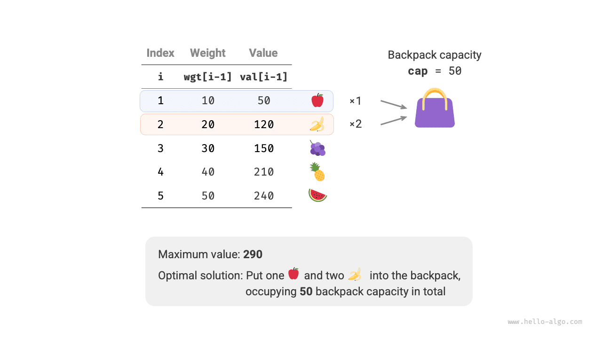
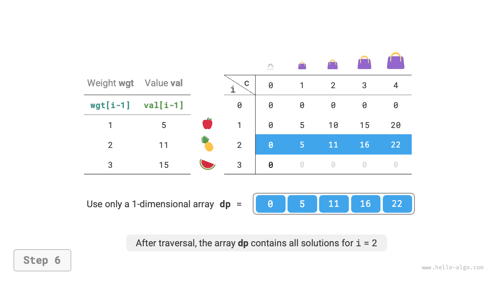
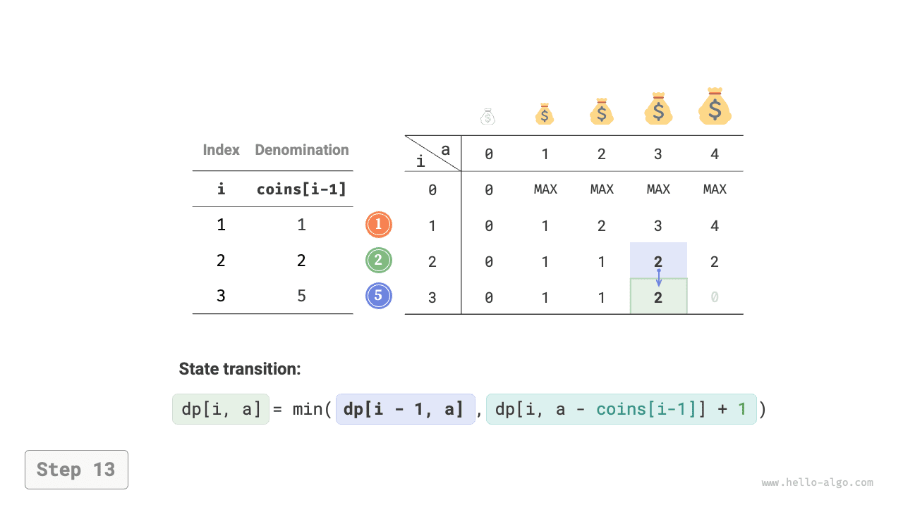
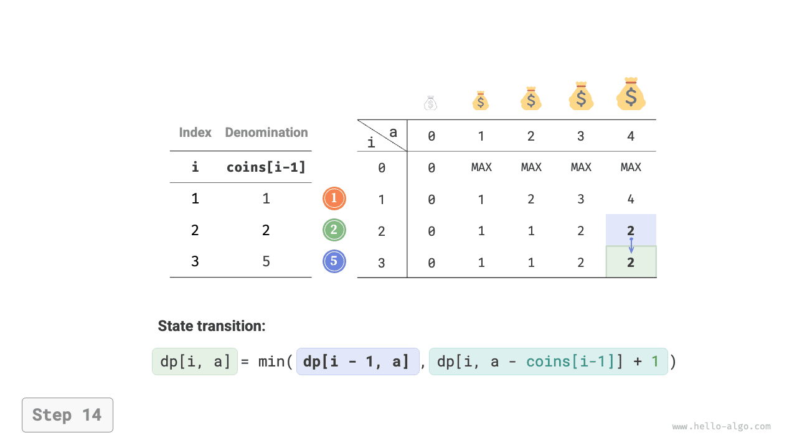
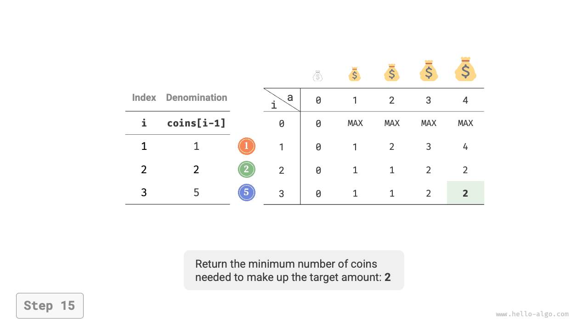

# Bài toán cái túi hoàn toàn

Trong phần này, trước hết chúng ta sẽ giải quyết một dạng bài toán cái túi phổ biến khác: cái túi hoàn toàn (unbounded knapsack), sau đó tìm hiểu một trường hợp đặc biệt của nó: bài toán đổi tiền xu (coin change).

## Bài toán cái túi hoàn toàn

!!! question

    Cho $n$ đồ vật, đồ vật thứ $i$ có trọng lượng là $wgt[i-1]$、giá trị là $val[i-1]$ ，và một chiếc túi có dung tích là $cap$ 。**Mỗi đồ vật có thể được chọn lặp lại nhiều lần**, hỏi trong giới hạn dung tích túi cho phép có thể đặt vào các đồ vật có tổng giá trị lớn nhất là bao nhiêu? Ví dụ như hình dưới đây.



### Tư tưởng quy hoạch động

Bài toán cái túi hoàn toàn và bài toán cái túi 0-1 rất giống nhau, **điểm khác biệt duy nhất là không giới hạn số lần chọn đồ vật**:

- Trong bài toán cái túi 0-1, mỗi loại đồ vật chỉ có duy nhất một cái, vì vậy sau khi cho đồ vật $i$ vào túi, ta chỉ có thể tiếp tục chọn từ $i-1$ đồ vật đầu tiên.
- Trong bài toán cái túi hoàn toàn, số lượng của mỗi loại đồ vật là vô hạn, vì vậy sau khi cho đồ vật $i$ vào túi, **chúng ta vẫn có thể tiếp tục chọn từ $i$ đồ vật đầu tiên**.

Dưới quy định của bài toán cái túi hoàn toàn, sự biến đổi của trạng thái $[i, c]$ chia thành hai trường hợp:

- **Không cho đồ vật $i$ vào túi**: Giống với bài toán cái túi 0-1, chuyển sang $[i-1, c]$ 。
- **Cho đồ vật $i$ vào túi**: Khác với bài toán cái túi 0-1, chuyển sang $[i, c-wgt[i-1]]$ 。

Từ đó phương trình chuyển trạng thái trở thành:

$$
dp[i, c] = \max(dp[i-1, c], dp[i, c - wgt[i-1]] + val[i-1])
$$

### Hiện thực mã nguồn

So sánh mã nguồn của hai bài toán, trong phương trình chuyển trạng thái chỉ có một chỗ thay đổi từ $i-1$ thành $i$ ，toàn bộ phần còn lại hoàn toàn giống nhau:

```src
[file]{unbounded_knapsack}-[class]{}-[func]{unbounded_knapsack_dp}
```

### Tối ưu hoá không gian

Do trạng thái hiện tại được chuyển từ trạng thái bên trái và phía trên sang, **vì vậy sau khi tối ưu hoá không gian, chúng ta nên duyệt xuôi qua từng hàng của bảng $dp$** 。

Thứ tự duyệt này hoàn toàn trái ngược với cái túi 0-1. Mời bạn nhờ hình dưới đây để thấu hiểu sự khác biệt giữa hai bài toán.

=== "<1>"
    

=== "<2>"
    

=== "<3>"
    

=== "<4>"
    

=== "<5>"
    

=== "<6>"
    

Mã nguồn hiện thực tương đối đơn giản, chỉ cần xoá bỏ chiều thứ nhất của mảng `dp` ：

```src
[file]{unbounded_knapsack}-[class]{}-[func]{unbounded_knapsack_dp_comp}
```

## Bài toán đổi tiền xu

Bài toán cái túi là đại diện cho một lớp bài toán quy hoạch động rất lớn, nó sở hữu nhiều biến thể, chẳng hạn như bài toán đổi tiền xu (Coin Change).

!!! question

    Cho $n$ loại đồng xu, đồng xu thứ $i$ có mệnh giá là $coins[i - 1]$ ，số tiền mục tiêu là $amt$ ，**mỗi loại đồng xu có thể chọn lặp lại nhiều lần**, hỏi số lượng đồng xu ít nhất có thể đổi được số tiền mục tiêu là bao nhiêu? Nếu không thể đổi được số tiền mục tiêu thì trả về $-1$ 。Ví dụ như hình dưới đây.


### Tư tưởng quy hoạch động

**Bài toán đổi tiền xu có thể coi là một trường hợp đặc biệt của bài toán cái túi hoàn toàn**, giữa chúng có những điểm liên hệ và khác biệt sau:

- Hai bài toán có thể chuyển đổi qua lại lẫn nhau: "đồ vật" tương ứng với "đồng xu", "trọng lượng đồ vật" tương ứng với "mệnh giá đồng xu", "dung tích túi" tương ứng với "số tiền mục tiêu".
- Mục tiêu tối ưu hoá trái ngược nhau: bài toán cái túi hoàn toàn là tối đa hoá giá trị đồ vật, bài toán đổi tiền xu là tối thiểu hoá số lượng đồng xu.
- Bài toán cái túi hoàn toàn tìm lời giải "không vượt quá" dung tích túi, bài toán đổi tiền xu tìm lời giải "chính xác" bằng số tiền mục tiêu.

**Bước 1: Suy ngẫm quyết định ở mỗi vòng, định nghĩa trạng thái, từ đó thu được bảng $dp$**

Trạng thái $[i, a]$ tương ứng với bài toán con: **số lượng đồng xu ít nhất để $i$ loại đồng xu đầu tiên có thể đổi được số tiền $a$**, ký hiệu là $dp[i, a]$ 。

Bảng $dp$ hai chiều có kích thước là $(n+1) \times (amt+1)$ 。

**Bước 2: Tìm ra cấu trúc con tối ưu, từ đó suy diễn ra phương trình chuyển trạng thái**

Phương trình chuyển trạng thái của bài toán này và bài toán cái túi hoàn toàn có hai điểm khác biệt sau:

- Bài này yêu cầu giá trị nhỏ nhất, do đó cần đổi toán tử $\max()$ thành $\min()$ 。
- Đối tượng tối ưu là số lượng đồng xu chứ không phải giá trị đồ vật, do đó khi chọn một đồng xu ta thực hiện $+1$ là được.

$$
dp[i, a] = \min(dp[i-1, a], dp[i, a - coins[i-1]] + 1)
$$

**Bước 3: Xác định các điều kiện biên và thứ tự chuyển trạng thái**

Khi số tiền mục tiêu là $0$ ，số lượng đồng xu ít nhất để đổi được nó là $0$ ，tức toàn bộ cột đầu tiên $dp[i, 0]$ đều bằng $0$ 。

Khi không có đồng xu nào, **không thể đổi được bất kỳ số tiền mục tiêu nào $> 0$** ，tức là lời giải không hợp lệ. Để hàm $\min()$ trong phương trình chuyển trạng thái có thể nhận diện và lọc bỏ lời giải không hợp lệ, chúng ta cân nhắc dùng $+ \infty$ để biểu thị chúng, tức cho toàn bộ hàng đầu tiên $dp[0, a]$ đều bằng $+ \infty$ 。

### Hiện thực mã nguồn

Đa số ngôn ngữ lập trình không cung cấp biến $+ \infty$ ，chỉ có thể dùng giá trị lớn nhất của kiểu số nguyên `int` để thay thế. Nhưng điều này lại dẫn đến vấn đề tràn số nguyên: thao tác $+ 1$ trong phương trình chuyển trạng thái có thể bị tràn số.

Vì vậy, chúng ta sử dụng con số $amt + 1$ để biểu thị lời giải không hợp lệ, bởi vì số lượng đồng xu để đổi được $amt$ tối đa chỉ là $amt$ (khi dùng toàn đồng xu mệnh giá 1). Trước khi trả về kết quả cuối cùng, kiểm tra xem $dp[n, amt]$ có bằng $amt + 1$ hay không; nếu có thì trả về $-1$ ，đại diện cho việc không thể đổi được số tiền mục tiêu. Mã nguồn như sau:

```src
[file]{coin_change}-[class]{}-[func]{coin_change_dp}
```

Hình dưới đây minh hoạ quá trình quy hoạch động của bài toán đổi tiền xu, rất giống với bài toán cái túi hoàn toàn.

=== "<1>"
    

=== "<2>"
    

=== "<3>"
    

=== "<4>"
    

=== "<5>"
    

=== "<6>"
    

=== "<7>"
    

=== "<8>"
    

=== "<9>"
    

=== "<10>"
    

=== "<11>"
    

=== "<12>"
    

=== "<13>"
    

=== "<14>"
    

=== "<15>"
    

### Tối ưu hoá không gian

Cách xử lý tối ưu không gian của bài toán đổi tiền xu hoàn toàn tương tự bài toán cái túi hoàn toàn:

```src
[file]{coin_change}-[class]{}-[func]{coin_change_dp_comp}
```

## Bài toán đổi tiền xu II

!!! question

    Cho $n$ loại đồng xu, đồng xu thứ $i$ có mệnh giá là $coins[i - 1]$ ，số tiền mục tiêu là $amt$ ，mỗi loại đồng xu có thể chọn lặp lại nhiều lần, **hỏi có bao nhiêu tổ hợp đồng xu có thể ghép thành số tiền mục tiêu**. Ví dụ như hình dưới đây.


### Tư tưởng quy hoạch động

So với bài toán trước, mục tiêu của bài này là tính số lượng tổ hợp, vì vậy bài toán con chuyển thành: **số lượng tổ hợp của $i$ loại đồng xu đầu tiên có thể ghép thành số tiền $a$** 。Bảng $dp$ vẫn là ma trận hai chiều kích thước $(n+1) \times (amt + 1)$ 。

Số lượng tổ hợp của trạng thái hiện tại bằng tổng số lượng tổ hợp của hai quyết định: không chọn đồng xu hiện tại và chọn đồng xu hiện tại. Phương trình chuyển trạng thái là:

$$
dp[i, a] = dp[i-1, a] + dp[i, a - coins[i-1]]
$$

Khi số tiền mục tiêu là $0$ ，không cần chọn bất kỳ đồng xu nào cũng có thể ghép thành số tiền mục tiêu, vì vậy nên khởi tạo toàn bộ cột đầu tiên $dp[i, 0]$ bằng $1$ 。Khi không có đồng xu nào, không thể ghép thành bất kỳ số tiền mục tiêu nào $>0$ ，vì vậy toàn bộ hàng đầu tiên $dp[0, a]$ đều bằng $0$ 。

### Hiện thực mã nguồn

```src
[file]{coin_change_ii}-[class]{}-[func]{coin_change_ii_dp}
```

### Tối ưu hoá không gian

Cách xử lý tối ưu không gian hoàn toàn tương tự, chỉ cần xoá bỏ chiều đồng xu là xong:

```src
[file]{coin_change_ii}-[class]{}-[func]{coin_change_ii_dp_comp}
```
