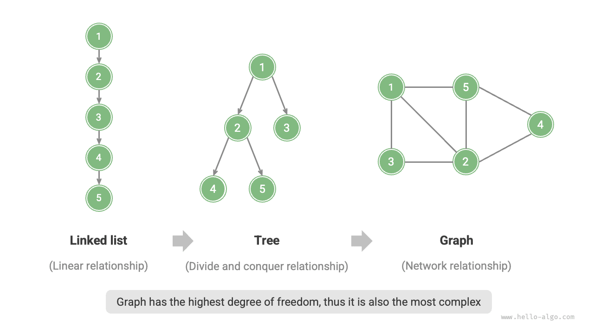
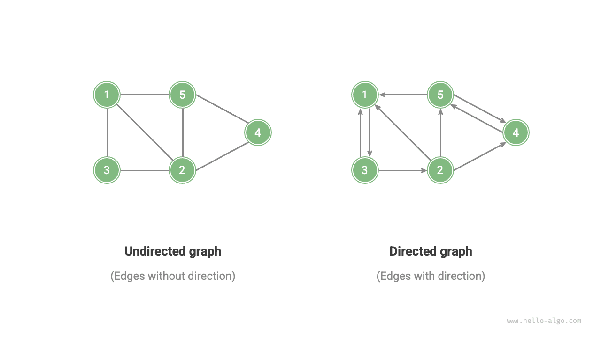
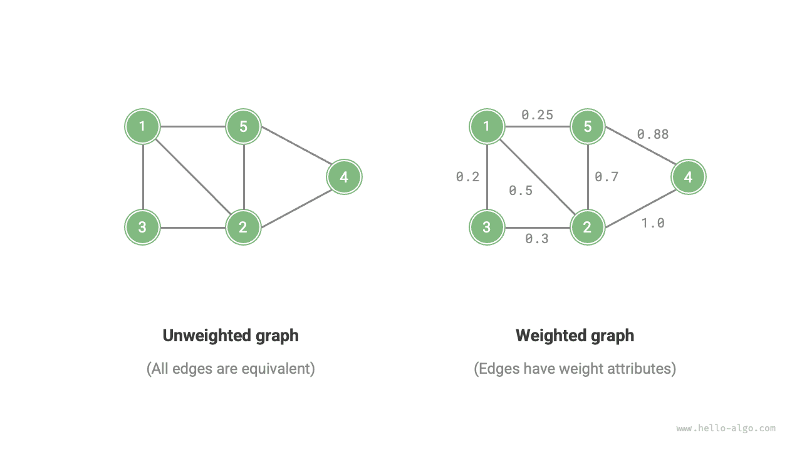
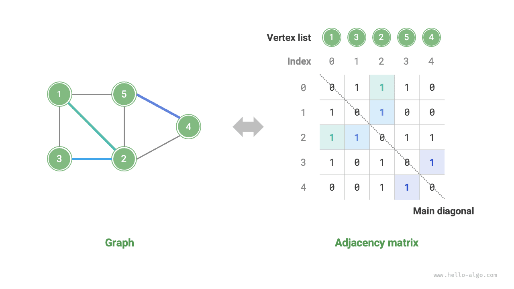

# Đồ thị

<u>Đồ thị (graph)</u> là một cấu trúc dữ liệu phi tuyến tính, được cấu thành từ các <u>đỉnh (vertex)</u> và các <u>cạnh (edge)</u>. Chúng ta có thể biểu diễn trừu tượng đồ thị $G$ dưới dạng một tập hợp các đỉnh $V$ và một tập hợp các cạnh $E$. Ví dụ dưới đây minh hoạ một đồ thị chứa 5 đỉnh và 7 cạnh:

$$
\begin{aligned}
V & = \{ 1, 2, 3, 4, 5 \} \newline
E & = \{ (1,2), (1,3), (1,5), (2,3), (2,4), (2,5), (4,5) \} \newline
G & = \{ V, E \} \newline
\end{aligned}
$$

Nếu coi các đỉnh là các nút và coi các cạnh là các tham chiếu (con trỏ) kết nối giữa các nút, chúng ta có thể xem đồ thị như một cấu trúc dữ liệu được mở rộng từ danh sách liên kết. Như minh hoạ trong hình dưới đây, **so với mối quan hệ tuyến tính (danh sách liên kết) và mối quan hệ chia để trị (cây), mối quan hệ mạng lưới (đồ thị) có độ tự do cao hơn**, do đó cũng phức tạp hơn nhiều.

## Các loại đồ thị và thuật ngữ thường gặp

Dựa vào việc các cạnh có hướng hay không, đồ thị được chia thành <u>đồ thị vô hướng (undirected graph)</u> và <u>đồ thị có hướng (directed graph)</u> như hình dưới đây:

- Trong đồ thị vô hướng, cạnh biểu thị mối quan hệ kết nối "hai chiều" giữa hai đỉnh, ví dụ như "quan hệ bạn bè" trên Facebook hay Zalo.
- Trong đồ thị có hướng, cạnh mang tính định hướng, tức là hai cạnh $A \rightarrow B$ và $A \leftarrow B$ hoàn toàn độc lập với nhau, ví dụ như quan hệ "theo dõi" (following) và "được theo dõi" (follower) trên TikTok hoặc Twitter/X.

Dựa vào việc tất cả các đỉnh có liên thông với nhau hay không, đồ thị được chia thành <u>đồ thị liên thông (connected graph)</u> và <u>đồ thị không liên thông (disconnected graph)</u> như hình dưới đây:

- Đối với đồ thị liên thông, từ một đỉnh bất kỳ xuất phát, đều có thể đi tới mọi đỉnh còn lại.
- Đối với đồ thị không liên thông, từ một đỉnh nào đó xuất phát, có ít nhất một đỉnh không thể đi tới được.

Chúng ta còn có thể gán thêm biến "trọng số" cho các cạnh, từ đó thu được <u>đồ thị có trọng số (weighted graph)</u> như hình dưới đây. Ví dụ trong các trò chơi trực tuyến, hệ thống sẽ dựa vào thời gian cùng chơi để tính toán "độ thân mật" giữa các game thủ, mạng lưới độ thân mật này có thể được biểu diễn bằng đồ thị có trọng số.

Cấu trúc dữ liệu đồ thị bao gồm các thuật ngữ thường dùng sau:

- <u>Tính kề (adjacency)</u>: Khi giữa hai đỉnh tồn tại cạnh nối liền, ta gọi hai đỉnh đó là "kề nhau". Trong hình trên, các đỉnh kề của đỉnh 1 là đỉnh 2, 3, 5.
- <u>Đường đi (path)</u>: Dãy các cạnh đi qua từ đỉnh A đến đỉnh B được gọi là "đường đi" từ A đến B. Trong hình trên, dãy cạnh 1-5-2-4 là một đường đi từ đỉnh 1 đến đỉnh 4.
- <u>Bậc (degree)</u>: Số lượng cạnh gắn với một đỉnh. Đối với đồ thị có hướng, <u>bậc vào (in-degree)</u> biểu thị có bao nhiêu cạnh trỏ vào đỉnh đó, và <u>bậc ra (out-degree)</u> biểu thị có bao nhiêu cạnh xuất phát từ đỉnh đó trỏ ra ngoài.

## Biểu diễn đồ thị

Các phương thức biểu diễn đồ thị phổ biến bao gồm "ma trận kề" và "danh sách kề". Dưới đây lấy đồ thị vô hướng làm ví dụ.

### Ma trận kề

Giả sử số lượng đỉnh của đồ thị là $n$ ，<u>ma trận kề (adjacency matrix)</u> sử dụng một ma trận kích thước $n \times n$ để biểu diễn đồ thị, mỗi hàng (cột) đại diện cho một đỉnh, các phần tử trong ma trận đại diện cho cạnh, sử dụng $1$ hoặc $0$ để biểu thị giữa hai đỉnh có tồn tại cạnh nối hay không.

Như minh hoạ trong hình dưới đây, giả sử ma trận kề là $M$ và danh sách đỉnh là $V$ ，khi đó phần tử ma trận $M[i, j] = 1$ biểu thị giữa đỉnh $V[i]$ và đỉnh $V[j]$ có cạnh nối, ngược lại $M[i, j] = 0$ biểu thị giữa hai đỉnh không có cạnh nối.

Ma trận kề sở hữu các đặc tính sau:

- Trong đồ thị đơn giản (simple graph), đỉnh không tự nối với chính nó, lúc này các phần tử trên đường chéo chính của ma trận kề không có ý nghĩa (bằng 0).
- Đối với đồ thị vô hướng, cạnh ở hai chiều là tương đương, do đó ma trận kề đối xứng qua đường chéo chính.
- Khi thay thế các phần tử $1$ và $0$ trong ma trận kề bằng các giá trị trọng số, ma trận kề có thể biểu diễn đồ thị có trọng số.

Khi dùng ma trận kề để biểu diễn đồ thị, chúng ta có thể trực tiếp truy cập vào phần tử ma trận để lấy thông tin cạnh, vì vậy hiệu năng của các thao tác thêm, xoá, sửa, tra cứu cạnh đều rất cao với độ phức tạp thời gian $O(1)$ 。Tuy nhiên, độ phức tạp không gian của ma trận kề là $O(n^2)$ ，tiêu tốn khá nhiều bộ nhớ.

### Danh sách kề

<u>Danh sách kề (adjacency list)</u> sử dụng $n$ danh sách liên kết để biểu diễn đồ thị, mỗi nút trong danh sách liên kết đại diện cho một đỉnh. Danh sách liên kết thứ $i$ tương ứng với đỉnh $i$ ，lưu trữ toàn bộ các đỉnh kề của đỉnh đó (các đỉnh có cạnh nối với đỉnh đó). Hình dưới đây minh hoạ một ví dụ về đồ thị được lưu trữ bằng danh sách kề.

Danh sách kề chỉ lưu trữ các cạnh thực sự tồn tại, mà tổng số cạnh thường nhỏ hơn rất nhiều so với $n^2$ ，do đó nó tiết kiệm không gian bộ nhớ hơn. Tuy nhiên, trong danh sách kề cần phải duyệt danh sách liên kết để tìm kiếm cạnh, do đó hiệu năng thời gian của nó không bằng ma trận kề.

Quan sát hình trên, **cấu trúc danh sách kề rất giống với phương pháp "nối chuỗi" trong bảng băm, vì vậy chúng ta cũng có thể áp dụng các phương pháp tương tự để tối ưu hoá hiệu năng**. Ví dụ khi danh sách liên kết quá dài, có thể chuyển đổi danh sách liên kết thành cây AVL hoặc cây đỏ-đen, từ đó tối ưu hoá thời gian tìm kiếm từ $O(n)$ xuống $O(\log n)$ ；hoặc có thể chuyển đổi danh sách liên kết thành bảng băm (hoặc tập hợp băm), từ đó giảm độ phức tạp thời gian xuống $O(1)$ 。

## Các ứng dụng phổ biến của đồ thị

Như bảng dưới đây, rất nhiều hệ thống trong thế giới thực có thể được mô hình hoá bằng đồ thị, và các bài toán tương ứng cũng có thể quy về các bài toán tính toán trên đồ thị.

 Bảng <id> &nbsp; Các mô hình đồ thị phổ biến trong đời sống thực tế 

|          | Đỉnh | Cạnh | Bài toán tính toán trên đồ thị |
| -------- | ---- | -------------------- | ------------ |
| Mạng xã hội | Người dùng | Quan hệ bạn bè | Gợi ý bạn bè tiềm năng |
| Mạng lưới tàu điện ngầm | Nhà ga | Tính liên thông giữa các ga | Gợi ý lộ trình ngắn nhất |
| Hệ Mặt Trời | Các thiên thể | Lực hấp dẫn giữa các thiên thể | Tính toán quỹ đạo hành tinh |
