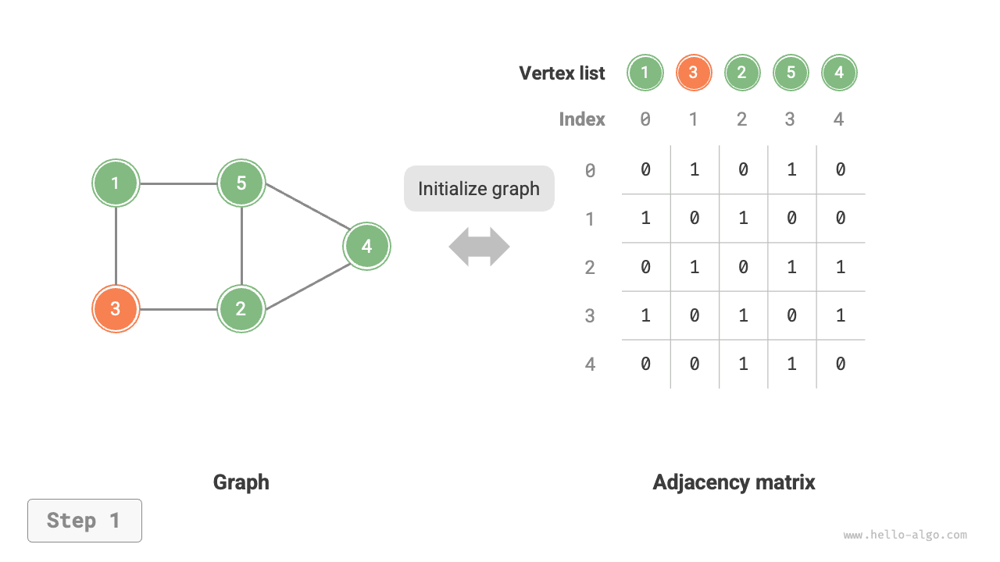
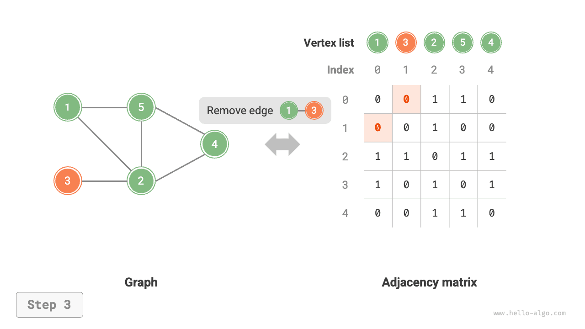
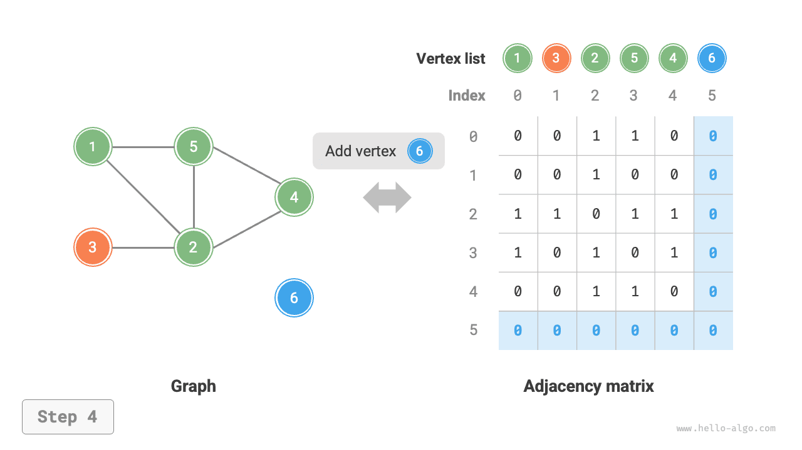
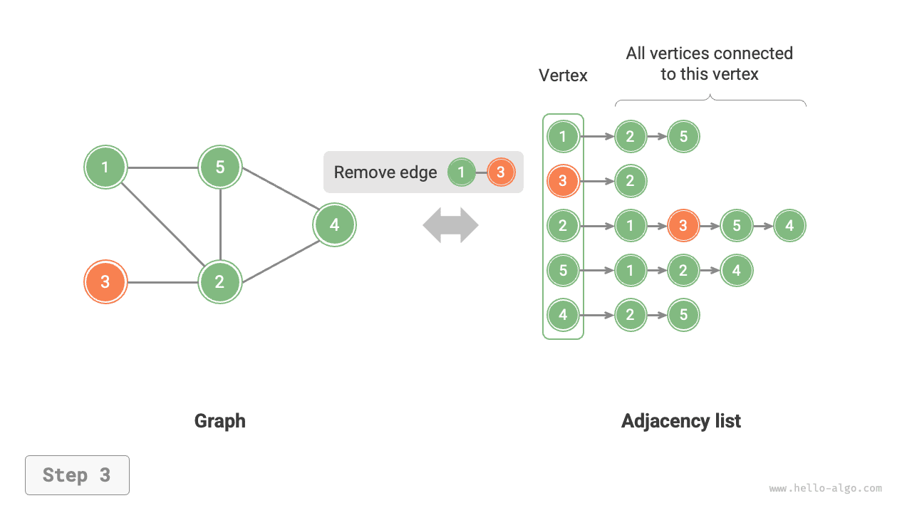

# Các thao tác cơ bản trên đồ thị

Các thao tác cơ bản trên đồ thị có thể chia thành thao tác trên "cạnh" và thao tác trên "đỉnh". Dưới hai phương thức biểu diễn là "ma trận kề" và "danh sách kề", cách thức hiện thực của chúng có những điểm khác nhau.

## Hiện thực dựa trên ma trận kề

Cho một đồ thị vô hướng có số lượng đỉnh là $n$ ，cách thức hiện thực các thao tác khác nhau được thể hiện như hình dưới đây:

- **Thêm hoặc xoá cạnh**: Trực tiếp sửa đổi giá trị của cạnh chỉ định trong ma trận kề, mất thời gian $O(1)$ 。Do là đồ thị vô hướng, nên cần phải cập nhật đồng thời cạnh ở cả hai chiều.
- **Thêm đỉnh**: Thêm một hàng và một cột vào cuối ma trận kề, và điền toàn bộ giá trị $0$ vào đó, mất thời gian $O(n)$ 。
- **Xoá đỉnh**: Xoá một hàng và một cột trong ma trận kề. Trường hợp xấu nhất xảy ra khi xoá hàng đầu và cột đầu, đòi hỏi phải "dịch chuyển $(n-1)^2$ phần tử về phía trên bên trái", từ đó mất thời gian $O(n^2)$ 。
- **Khởi tạo**: Nhận vào $n$ đỉnh, khởi tạo danh sách đỉnh `vertices` có độ dài $n$ ，mất thời gian $O(n)$ ；khởi tạo ma trận kề `adjMat` kích thước $n \times n$ ，mất thời gian $O(n^2)$ 。

=== "<1>"
    

=== "<2>"
    

=== "<3>"
    

=== "<4>"
    

=== "<5>"
    

Dưới đây là mã nguồn hiện thực biểu diễn đồ thị dựa trên ma trận kề:

```src
[file]{graph_adjacency_matrix}-[class]{graph_adj_mat}-[func]{}
```

## Hiện thực dựa trên danh sách kề

Giả sử tổng số đỉnh của đồ thị vô hướng là $n$ và tổng số cạnh là $m$ ，chúng ta có thể hiện thực các thao tác theo phương pháp thể hiện trong hình dưới đây:

- **Thêm cạnh**: Thêm cạnh vào cuối danh sách liên kết tương ứng với đỉnh, mất thời gian $O(1)$ 。Vì là đồ thị vô hướng, nên cần phải thêm đồng thời cạnh ở cả hai chiều.
- **Xoá cạnh**: Tìm kiếm và xoá cạnh chỉ định trong danh sách liên kết tương ứng với đỉnh, mất thời gian $O(m)$ 。Trong đồ thị vô hướng, cần phải xoá đồng thời cạnh ở cả hai chiều.
- **Thêm đỉnh**: Thêm một danh sách liên kết vào danh sách kề, và lấy đỉnh mới thêm làm nút đầu của danh sách liên kết đó, mất thời gian $O(1)$ 。
- **Xoá đỉnh**: Cần phải duyệt qua toàn bộ danh sách kề để xoá toàn bộ các cạnh có chứa đỉnh chỉ định, mất thời gian $O(n + m)$ 。
- **Khởi tạo**: Tạo $n$ đỉnh và $2m$ cạnh trong danh sách kề, mất thời gian $O(n + m)$ 。

=== "<1>"
    

=== "<2>"
    

=== "<3>"
    

=== "<4>"
    

=== "<5>"
    

Dưới đây là mã nguồn hiện thực danh sách kề. So với hình minh hoạ ở trên, mã nguồn thực tế có một số điểm khác biệt sau:

- Để thuận tiện cho việc thêm và xoá đỉnh, cũng như đơn giản hoá mã nguồn, chúng ta sử dụng danh sách (mảng động) thay thế cho danh sách liên kết.
- Sử dụng bảng băm để lưu trữ danh sách kề, với `key` là thể hiện đối tượng đỉnh (Vertex), và `value` là danh sách các đỉnh kề (danh sách liên kết) của đỉnh đó.

Ngoài ra, chúng ta sử dụng lớp `Vertex` trong danh sách kề để biểu diễn đỉnh. Lý do làm như vậy là: nếu giống như ma trận kề dùng chỉ số danh sách để phân biệt các đỉnh khác nhau, thì giả sử muốn xoá đỉnh có chỉ số $i$ ，chúng ta sẽ phải duyệt toàn bộ danh sách kề và giảm toàn bộ các chỉ số lớn hơn $i$ đi $1$ ，hiệu năng rất thấp. Trong khi nếu mỗi đỉnh là một thể hiện `Vertex` duy nhất, sau khi xoá một đỉnh nào đó ta hoàn toàn không cần phải sửa đổi các đỉnh còn lại.

```src
[file]{graph_adjacency_list}-[class]{graph_adj_list}-[func]{}
```

## So sánh hiệu năng

Giả sử trong đồ thị có tổng cộng $n$ đỉnh và $m$ cạnh, bảng dưới đây so sánh hiệu năng thời gian và không gian giữa ma trận kề và danh sách kề. Xin lưu ý rằng danh sách kề (danh sách liên kết) tương ứng với hiện thực trong bài viết, còn danh sách kề (bảng băm) chỉ việc thay thế toàn bộ danh sách liên kết bằng bảng băm.

<p align="center"> Bảng <id> &nbsp; So sánh giữa ma trận kề và danh sách kề </p>

|              | Ma trận kề | Danh sách kề (danh sách liên kết) | Danh sách kề (bảng băm) |
| ------------ | -------- | -------------- | ---------------- |
| Kiểm tra kề nhau | $O(1)$   | $O(n)$         | $O(1)$           |
| Thêm cạnh       | $O(1)$   | $O(1)$         | $O(1)$           |
| Xoá cạnh       | $O(1)$   | $O(n)$         | $O(1)$           |
| Thêm đỉnh     | $O(n)$   | $O(1)$         | $O(1)$           |
| Xoá đỉnh     | $O(n^2)$ | $O(n + m)$     | $O(n)$           |
| Không gian bộ nhớ chiếm dụng | $O(n^2)$ | $O(n + m)$     | $O(n + m)$       |

Quan sát bảng trên, dường như danh sách kề (bảng băm) có hiệu năng thời gian và không gian tối ưu nhất. Nhưng trên thực tế, thao tác trên cạnh trong ma trận kề có hiệu năng thực thi cao hơn nhiều, chỉ cần một lần truy cập hoặc gán mảng đơn giản. Tổng quan lại, ma trận kề thể hiện nguyên lý "đổi không gian lấy thời gian", trong khi danh sách kề thể hiện nguyên lý "đổi thời gian lấy không gian".
