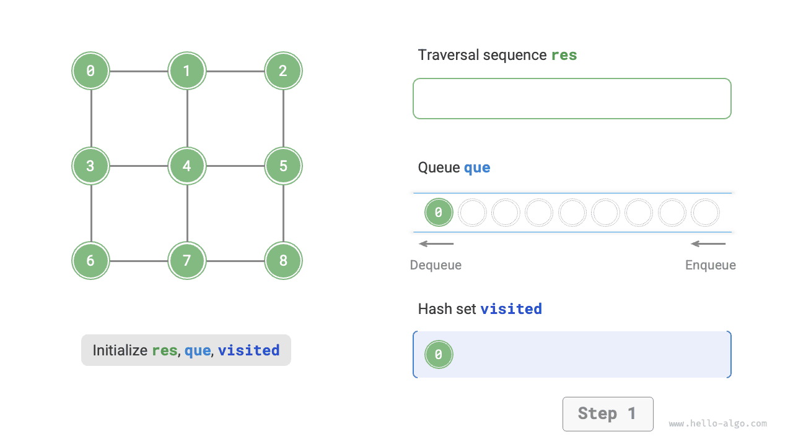
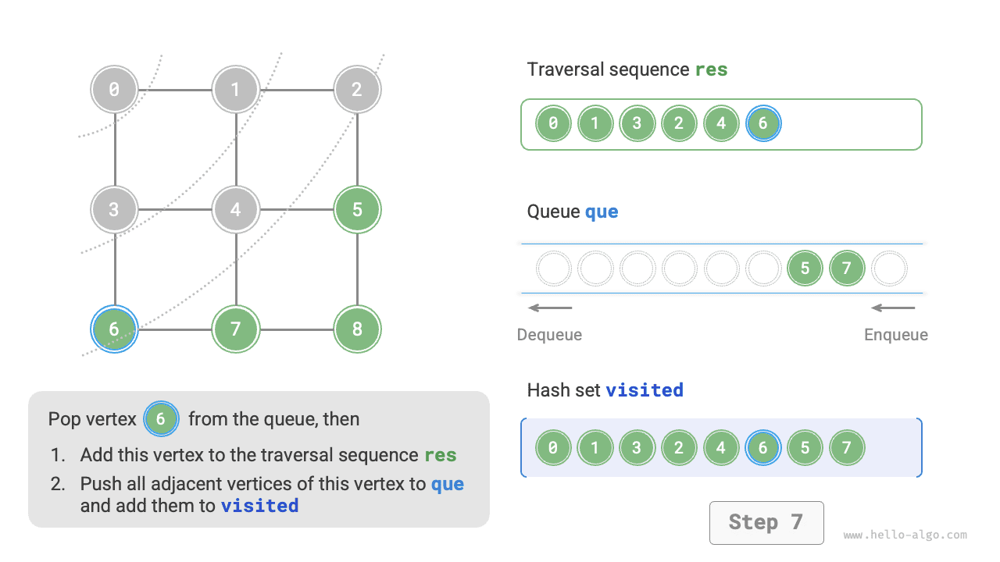
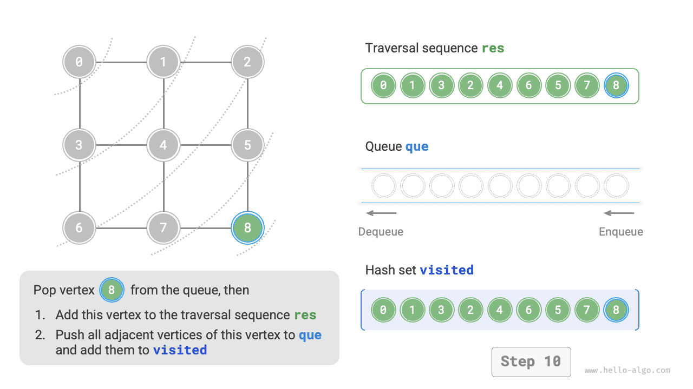
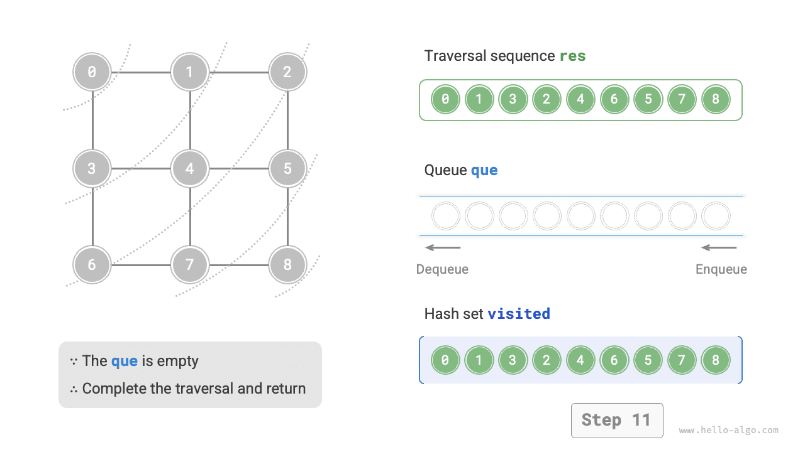
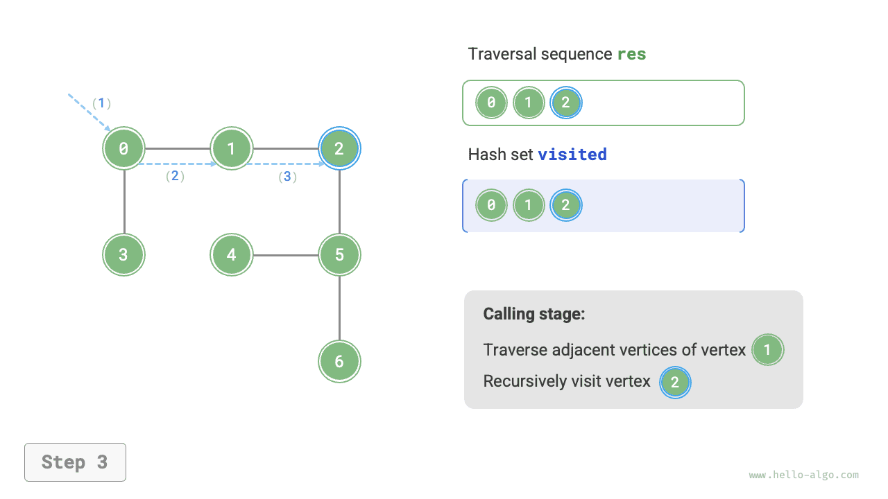
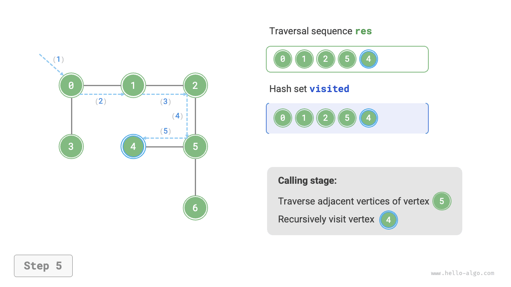
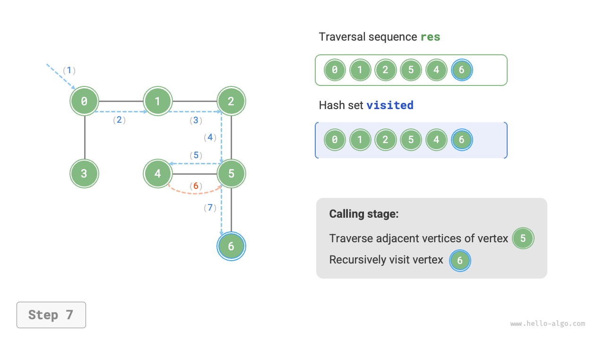
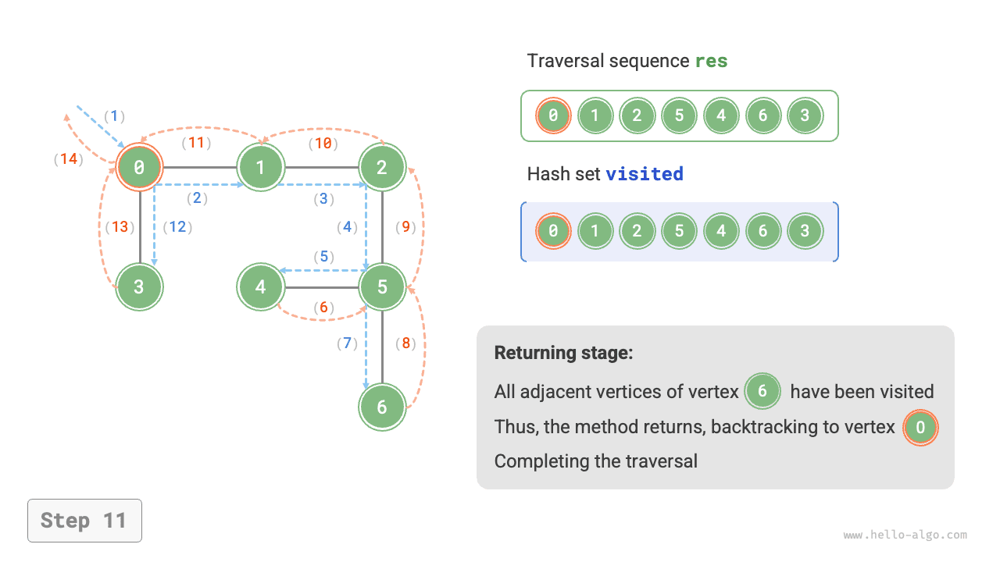

# Duyệt đồ thị

Cây đại diện cho mối quan hệ "một - nhiều", trong khi đồ thị có độ tự do cao hơn và có thể biểu diễn bất kỳ mối quan hệ "nhiều - nhiều" nào. Do đó, chúng ta có thể coi cây là một trường hợp đặc biệt của đồ thị. Rõ ràng, **thao tác duyệt cây cũng là một trường hợp đặc biệt của thao tác duyệt đồ thị**.

Cả đồ thị và cây đều cần áp dụng các thuật toán tìm kiếm để hiện thực thao tác duyệt. Các phương thức duyệt đồ thị cũng được chia thành hai loại: <u>duyệt theo chiều rộng (BFS)</u> và <u>duyệt theo chiều sâu (DFS)</u>.

## Duyệt theo chiều rộng

**Duyệt theo chiều rộng là một phương thức duyệt từ gần đến xa: bắt đầu từ một nút bất kỳ, luôn ưu tiên truy cập các đỉnh gần nhất trước và mở rộng ra ngoài theo từng lớp**. Như minh hoạ trong hình dưới đây, bắt đầu từ đỉnh ở góc trên bên trái, đầu tiên duyệt toàn bộ các đỉnh kề của đỉnh đó, sau đó duyệt toàn bộ các đỉnh kề của đỉnh tiếp theo, cứ thế tiếp tục cho đến khi toàn bộ các đỉnh đều đã được truy cập.


### Hiện thực thuật toán

BFS thường nhờ vào hàng đợi để hiện thực, mã nguồn như dưới đây. Hàng đợi có tính chất "vào trước ra trước", điều này hoàn toàn trùng khớp với tư tưởng "từ gần đến xa" của BFS:

1. Đưa đỉnh bắt đầu duyệt `startVet` vào hàng đợi và bắt đầu vòng lặp.
2. Trong mỗi vòng lặp, lấy đỉnh ở đầu hàng đợi ra và ghi nhận đã truy cập, sau đó đưa toàn bộ các đỉnh kề của đỉnh đó vào cuối hàng đợi.
3. Lặp lại bước `2.` cho đến khi toàn bộ các đỉnh đều được truy cập xong thì kết thúc.

Để tránh việc duyệt lặp lại các đỉnh, chúng ta cần nhờ một tập hợp băm `visited` để ghi lại những đỉnh nào đã được truy cập.

!!! tip

    Tập hợp băm (hash set) có thể coi là một bảng băm chỉ lưu trữ `key` mà không lưu trữ `value`, nó có thể thực hiện các thao tác thêm, xoá, tra cứu `key` trong thời gian $O(1)$ 。Dựa vào tính duy nhất của `key` ，tập hợp băm thường được ứng dụng trong các bài toán lọc trùng lặp dữ liệu.

```src
[file]{graph_bfs}-[class]{}-[func]{graph_bfs}
```

Mã nguồn tương đối trừu tượng, bạn đọc nên kết hợp đối chiếu với hình ảnh dưới đây để hiểu sâu hơn:

=== "<1>"
    

=== "<2>"
    

=== "<3>"
    

=== "<4>"
    

=== "<5>"
    

=== "<6>"
    

=== "<7>"
    

=== "<8>"
    

=== "<9>"
    

=== "<10>"
    

=== "<11>"
    

!!! question "Chuỗi duyệt theo chiều rộng có phải là duy nhất không?"

    Không duy nhất. Duyệt theo chiều rộng chỉ yêu cầu duyệt theo thứ tự "từ gần đến xa", **còn thứ tự duyệt giữa nhiều đỉnh có cùng khoảng cách thì có thể xáo trộn tuỳ ý**. Lấy ví dụ hình trên, thứ tự truy cập giữa đỉnh $1$ và $3$ có thể hoán đổi cho nhau, thứ tự truy cập giữa các đỉnh $2$、$4$、$6$ cũng có thể tuỳ ý hoán đổi.

### Phân tích độ phức tạp

**Độ phức tạp thời gian**: Toàn bộ các đỉnh đều vào và ra khỏi hàng đợi đúng 1 lần, mất thời gian $O(|V|)$ ；trong quá trình duyệt các đỉnh kề, do là đồ thị vô hướng nên toàn bộ các cạnh đều được truy cập $2$ lần, mất thời gian $O(2|E|)$ ；tổng thể mất thời gian $O(|V| + |E|)$ 。

**Độ phức tạp không gian**: Số lượng đỉnh tối đa trong danh sách `res` ，tập hợp băm `visited` và hàng đợi `que` đều là $|V|$ ，chiếm dụng không gian $O(|V|)$ 。

## Duyệt theo chiều sâu

**Duyệt theo chiều sâu là một phương thức duyệt ưu tiên đi tới tận cùng, khi không còn đường đi nữa mới quay đầu lại**. Như minh hoạ trong hình dưới đây, bắt đầu từ đỉnh ở góc trên bên trái, truy cập một đỉnh kề nào đó của đỉnh hiện tại, cho đến khi đi tới ngõ cụt thì quay lui lại, rồi tiếp tục đi tới ngõ cụt và quay lui lại, cứ thế tiếp tục cho đến khi toàn bộ các đỉnh được duyệt xong.


### Hiện thực thuật toán

Mô hình thuật toán "đi tới tận cùng rồi quay lui" này thường được hiện thực dựa trên đệ quy. Tương tự như duyệt theo chiều rộng, trong duyệt theo chiều sâu chúng ta cũng cần nhờ một tập hợp băm `visited` để ghi lại các đỉnh đã được truy cập, nhằm tránh việc truy cập lặp lại các đỉnh.

```src
[file]{graph_dfs}-[class]{}-[func]{graph_dfs}
```

Quy trình thuật toán của duyệt theo chiều sâu được thể hiện như hình dưới đây:

- **Đường nét đứt thẳng biểu thị đệ quy đi tới**, đại diện cho việc bắt đầu gọi một hàm đệ quy mới để truy cập đỉnh mới.
- **Đường nét đứt cong biểu thị quay lui (backtracking)**, đại diện cho việc hàm đệ quy này đã trả về, quay lui về vị trí đã gọi nó ban đầu.

Để hiểu sâu hơn, bạn đọc nên kết hợp hình minh hoạ dưới đây với mã nguồn, mô phỏng trong đầu (hoặc vẽ ra giấy) toàn bộ tiến trình DFS, bao gồm từng hàm đệ quy được gọi khi nào và trả về khi nào.

=== "<1>"
    

=== "<2>"
    

=== "<3>"
    

=== "<4>"
    

=== "<5>"
    

=== "<6>"
    

=== "<7>"
    

=== "<8>"
    

=== "<9>"
    

=== "<10>"
    

=== "<11>"
    

!!! question "Chuỗi duyệt theo chiều sâu có phải là duy nhất không?"

    Tương tự như duyệt theo chiều rộng, thứ tự của chuỗi duyệt theo chiều sâu cũng không phải là duy nhất. Cho một đỉnh bất kỳ, bắt đầu khám phá theo hướng nào trước cũng đều được, tức là thứ tự các đỉnh kề có thể tuỳ ý xáo trộn và vẫn là duyệt theo chiều sâu.

    Lấy việc duyệt cây làm ví dụ, "gốc $\rightarrow$ trái $\rightarrow$ phải", "trái $\rightarrow$ gốc $\rightarrow$ phải", "trái $\rightarrow$ phải $\rightarrow$ gốc" lần lượt tương ứng với duyệt tiền thứ tự, trung thứ tự và hậu thứ tự, chúng thể hiện ba mức độ ưu tiên duyệt khác nhau, nhưng cả ba đều thuộc về duyệt theo chiều sâu.

### Phân tích độ phức tạp

**Độ phức tạp thời gian**: Toàn bộ các đỉnh đều được truy cập đúng $1$ lần, mất thời gian $O(|V|)$ ；toàn bộ các cạnh đều được truy cập $2$ lần, mất thời gian $O(2|E|)$ ；tổng thể mất thời gian $O(|V| + |E|)$ 。

**Độ phức tạp không gian**: Số lượng đỉnh tối đa trong danh sách `res` và tập hợp băm `visited` là $|V|$ ，độ sâu đệ quy tối đa là $|V|$ ，do đó chiếm dụng không gian $O(|V|)$ 。
