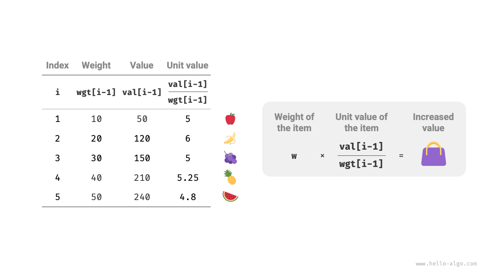

# Bài toán cái túi phân số

!!! question

    Cho $n$ đồ vật, đồ vật thứ $i$ có trọng lượng là $wgt[i-1]$、giá trị là $val[i-1]$ ，và một chiếc túi có dung tích là $cap$ 。Mỗi đồ vật chỉ được chọn một lần, **nhưng có thể chọn một phần của đồ vật, giá trị được tính theo tỷ lệ trọng lượng đã chọn**, hỏi trong giới hạn dung tích túi cho phép thì tổng giá trị các đồ vật trong túi là lớn nhất bằng bao nhiêu? Ví dụ như hình dưới đây.


Bài toán cái túi phân số (Fractional knapsack problem) nhìn chung rất giống với bài toán cái túi 0-1, trạng thái chứa đồ vật hiện tại $i$ và dung tích $c$ ，mục tiêu là tìm giá trị lớn nhất trong giới hạn dung tích túi.

Điểm khác biệt nằm ở chỗ, bài toán này cho phép chỉ chọn một phần của đồ vật. Như hình dưới đây, **chúng ta có thể chia cắt đồ vật một cách tuỳ ý, và tính toán giá trị tương ứng theo tỷ lệ trọng lượng**:

1. Đối với đồ vật $i$ ，giá trị của nó trên một đơn vị trọng lượng là $val[i-1] / wgt[i-1]$ ，gọi tắt là đơn giá (giá trị đơn vị / unit value).
2. Giả sử cho một phần của đồ vật $i$ vào túi với trọng lượng là $w$ ，thì giá trị tăng thêm trong túi là $w \times val[i-1] / wgt[i-1]$ 。



### Xác định chiến lược tham lam

Tối đa hoá tổng giá trị đồ vật trong túi, **về bản chất là tối đa hoá giá trị của đồ vật trên mỗi đơn vị trọng lượng**. Từ đó có thể suy ra chiến lược tham lam như hình dưới đây:

1. Sắp xếp các đồ vật theo thứ tự đơn giá từ cao xuống thấp.
2. Duyệt qua tất cả các đồ vật, **mỗi vòng tham lam chọn đồ vật có đơn giá cao nhất**.
3. Nếu dung tích còn lại của túi không đủ, thì dùng một phần của đồ vật hiện tại để lấp đầy túi.


### Hiện thực mã nguồn

Chúng ta xây dựng một lớp đồ vật `Item` để tiện cho việc sắp xếp các đồ vật theo đơn giá. Vòng lặp tiến hành các lựa chọn tham lam, khi túi đã đầy thì thoát ra và trả về lời giải:

```src
[file]{fractional_knapsack}-[class]{}-[func]{fractional_knapsack}
```

Thuật toán sắp xếp tích hợp sẵn thường có độ phức tạp thời gian là $O(n \log n)$ ，độ phức tạp không gian thường là $O(\log n)$ hoặc $O(n)$ ，tuỳ thuộc vào cách hiện thực cụ thể của từng ngôn ngữ lập trình.

Ngoài việc sắp xếp, trong trường hợp xấu nhất cần duyệt qua toàn bộ danh sách đồ vật, **do đó độ phức tạp thời gian là $O(n)$** ，trong đó $n$ là số lượng đồ vật.

Do khởi tạo một danh sách các đối tượng `Item` ，**vì vậy độ phức tạp không gian là $O(n)$** 。

### Chứng minh tính đúng đắn

Áp dụng phương pháp phản chứng. Giả sử đồ vật $x$ là đồ vật có đơn giá cao nhất, sử dụng một thuật toán nào đó thu được giá trị lớn nhất là `res` ，nhưng trong lời giải này không chứa đồ vật $x$ 。

Bây giờ lấy ra một đơn vị trọng lượng của một đồ vật bất kỳ trong túi, và thay thế bằng một đơn vị trọng lượng của đồ vật $x$ 。Do đồ vật $x$ có đơn giá cao nhất, vì vậy tổng giá trị sau khi thay thế chắc chắn lớn hơn `res` 。**Điều này mâu thuẫn với giả thiết `res` là lời giải tối ưu, chứng tỏ lời giải tối ưu bắt buộc phải chứa đồ vật $x$** 。

Đối với các đồ vật khác trong lời giải này, chúng ta cũng có thể xây dựng mâu thuẫn tương tự như trên. Tóm lại, **đồ vật có đơn giá lớn hơn luôn là lựa chọn tối ưu hơn**, điều này chứng minh chiến lược tham lam là hoàn toàn đúng đắn.

Như hình dưới đây, nếu xem trọng lượng đồ vật và đơn giá đồ vật lần lượt là trục hoành và trục tung của một biểu đồ hai chiều, thì bài toán cái túi phân số có thể chuyển thành "tìm diện tích bao quanh lớn nhất dưới một khoảng trục hoành giới hạn". Phép so sánh mang tính hình học này có thể giúp chúng ta thấu hiểu tính hiệu quả của chiến lược tham lam một cách trực quan.


