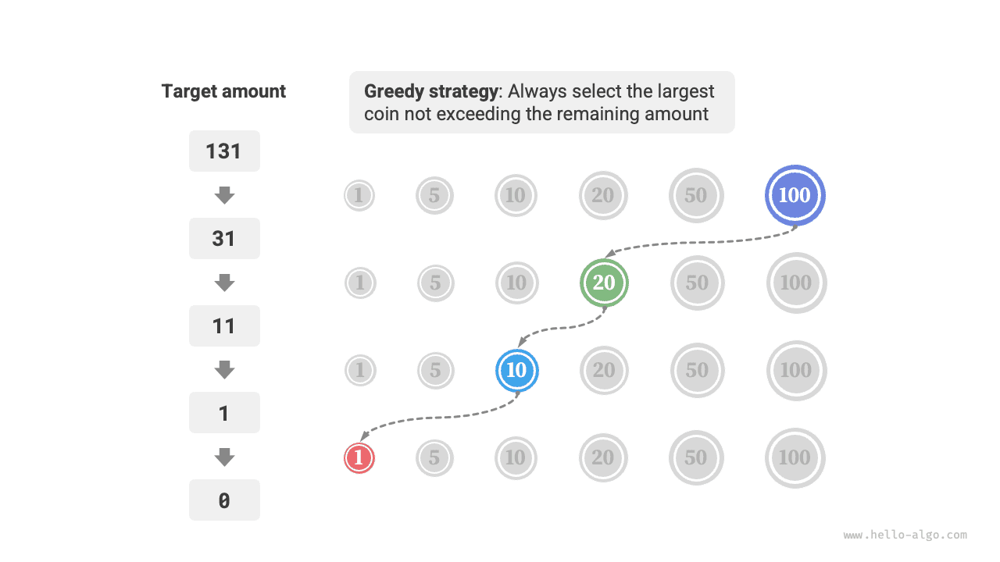

# Thuật toán tham lam

<u>Thuật toán tham lam (greedy algorithm)</u> là một phương pháp phổ biến để giải quyết các bài toán tối ưu hoá. Tư tưởng cơ bản của nó là tại mỗi giai đoạn ra quyết định của bài toán, đều đưa ra lựa chọn có vẻ là tối ưu nhất ở thời điểm hiện tại, tức là tham lam đưa ra quyết định tối ưu cục bộ, với kỳ vọng thu được lời giải tối ưu toàn cục. Thuật toán tham lam ngắn gọn và có hiệu năng cao, được ứng dụng rộng rãi trong nhiều bài toán thực tế.

Cả thuật toán tham lam và quy hoạch động đều thường dùng để giải quyết bài toán tối ưu hoá. Giữa chúng có một số điểm tương đồng, chẳng hạn như đều phụ thuộc vào tính chất cấu trúc con tối ưu, nhưng nguyên lý hoạt động lại khác nhau:

- Quy hoạch động dựa trên toàn bộ các quyết định ở các giai đoạn trước đó để cân nhắc quyết định hiện tại, và sử dụng lời giải của các bài toán con trong quá khứ để kiến tạo lời giải cho bài toán con hiện tại.
- Thuật toán tham lam không bận tâm tới các quyết định trong quá khứ, mà tiến thẳng về phía trước để đưa ra các lựa chọn tham lam, liên tục thu hẹp phạm vi bài toán cho đến khi bài toán được giải quyết hoàn toàn.

Trước tiên, chúng ta cùng tìm hiểu nguyên lý hoạt động của thuật toán tham lam qua ví dụ "Đổi tiền xu". Bài toán này đã được giới thiệu trong chương "Bài toán cái túi hoàn toàn", tin rằng bạn đã không còn xa lạ với nó.

!!! question

    Cho $n$ loại đồng xu, đồng xu thứ $i$ có mệnh giá là $coins[i - 1]$, số tiền mục tiêu là $amt$, mỗi loại đồng xu có thể chọn lặp lại nhiều lần, hỏi số lượng đồng xu ít nhất có thể đổi được số tiền mục tiêu là bao nhiêu? Nếu không thể đổi được số tiền mục tiêu thì trả về $-1$.

Chiến lược tham lam áp dụng cho bài toán này được minh hoạ như hình dưới đây. Cho một số tiền mục tiêu, **chúng ta tham lam chọn đồng xu lớn nhất không vượt quá nó và gần nó nhất**, lặp lại liên tục bước này cho đến khi đổi đủ số tiền mục tiêu.



Mã nguồn hiện thực như sau:

```src
[file]{coin_change_greedy}-[class]{}-[func]{coin_change_greedy}
```

Có thể bạn sẽ phải thốt lên: Quá gọn gàng (So clean)! Thuật toán tham lam chỉ cần khoảng 10 dòng mã là đã giải quyết xong bài toán đổi tiền xu.

## Ưu điểm và hạn chế của thuật toán tham lam

**Thuật toán tham lam không chỉ thao tác trực tiếp, dễ hiện thực mà thông thường còn có hiệu năng rất cao**. Trong đoạn mã trên, đặt mệnh giá đồng xu nhỏ nhất là $\min(coins)$, thì vòng lặp lựa chọn tham lam chạy tối đa $amt / \min(coins)$ lần, độ phức tạp thời gian là $O(amt / \min(coins))$. Con số này nhỏ hơn một bậc độ lớn so với độ phức tạp thời gian $O(n \times amt)$ của cách giải bằng quy hoạch động.

Tuy nhiên, **đối với một số bộ mệnh giá tiền xu nhất định, thuật toán tham lam không thể tìm ra lời giải tối ưu**. Hình dưới đây đưa ra hai ví dụ:

- **Ví dụ đúng $coins = [1, 5, 10, 20, 50, 100]$**: Dưới bộ mệnh giá tiền xu này, với bất kỳ số tiền $amt$ nào, thuật toán tham lam đều tìm được lời giải tối ưu.
- **Phản ví dụ $coins = [1, 20, 50]$**: Giả sử $amt = 60$, thuật toán tham lam chỉ tìm được tổ hợp đổi tiền là $50 + 1 \times 10$, gồm tổng cộng $11$ đồng xu, nhưng quy hoạch động có thể tìm ra lời giải tối ưu là $20 + 20 + 20$, chỉ cần đúng $3$ đồng xu.
- **Phản ví dụ $coins = [1, 49, 50]$**: Giả sử $amt = 98$, thuật toán tham lam chỉ tìm được tổ hợp đổi tiền là $50 + 1 \times 48$, gồm tổng cộng $49$ đồng xu, nhưng quy hoạch động có thể tìm ra lời giải tối ưu là $49 + 49$, chỉ cần đúng $2$ đồng xu.


Nói cách khác, đối với bài toán đổi tiền xu, thuật toán tham lam không thể đảm bảo tìm ra lời giải tối ưu toàn cục, và thậm chí có khả năng tìm ra một lời giải rất tệ. Bài toán này thích hợp giải bằng quy hoạch động hơn.

Nhìn chung, các tình huống áp dụng của thuật toán tham lam chia làm hai trường hợp sau:

1. **Có thể đảm bảo tìm ra lời giải tối ưu**: Thuật toán tham lam trong trường hợp này thường là lựa chọn tối ưu nhất, bởi vì nó thường có hiệu năng vượt trội hơn so với quay lui và quy hoạch động.
2. **Có thể tìm ra lời giải xấp xỉ tối ưu**: Thuật toán tham lam trong trường hợp này vẫn rất hữu dụng. Đối với nhiều bài toán phức tạp, việc tìm lời giải tối ưu toàn cục là cực kỳ khó khăn, việc tìm được một lời giải thứ tối ưu (gần tối ưu) với hiệu năng cao đã là một kết quả rất tốt.

## Đặc tính của thuật toán tham lam

Vậy câu hỏi đặt ra là: dạng bài toán nào thích hợp để giải bằng thuật toán tham lam? Hay nói cách khác, trong trường hợp nào thuật toán tham lam có thể đảm bảo tìm ra lời giải tối ưu?

So với quy hoạch động, điều kiện sử dụng của thuật toán tham lam khắt khe hơn nhiều, nó chủ yếu chú trọng vào hai tính chất của bài toán:

- **Tính chất lựa chọn tham lam (Greedy choice property)**: Chỉ khi các lựa chọn tối ưu cục bộ luôn có thể dẫn đến lời giải tối ưu toàn cục thì thuật toán tham lam mới có thể đảm bảo thu được lời giải tối ưu.
- **Cấu trúc con tối ưu (Optimal substructure)**: Lời giải tối ưu của bài toán ban đầu chứa lời giải tối ưu của các bài toán con.

Cấu trúc con tối ưu đã được giới thiệu trong chương "Quy hoạch động", ở đây chúng ta không nhắc lại nữa. Cần lưu ý rằng cấu trúc con tối ưu của một số bài toán không quá rõ ràng, nhưng vẫn có thể dùng thuật toán tham lam để giải quyết.

Chúng ta chủ yếu tìm hiểu phương pháp phán đoán tính chất lựa chọn tham lam. Mặc dù mô tả của nó trông có vẻ đơn giản, **nhưng trên thực tế đối với nhiều bài toán, việc chứng minh tính chất lựa chọn tham lam hoàn toàn không hề dễ dàng**.

Chẳng hạn như bài toán đổi tiền xu, mặc dù chúng ta có thể dễ dàng đưa ra phản ví dụ để bác bỏ tính chất lựa chọn tham lam, nhưng việc chứng minh nó đúng lại khó khăn hơn nhiều. Nếu đặt câu hỏi: **bộ mệnh giá tiền xu thoả mãn điều kiện nào thì có thể dùng thuật toán tham lam để giải**? Chúng ta thường chỉ có thể dựa vào trực giác hoặc đưa ra các ví dụ cụ thể để đưa ra một câu trả lời mang tính ước chừng, chứ khó có thể đưa ra một chứng minh toán học chặt chẽ.

!!! quote

    Có một bài báo khoa học đã đưa ra thuật toán có độ phức tạp thời gian $O(n^3)$ dùng để phán đoán xem một bộ mệnh giá tiền xu có thể dùng thuật toán tham lam để tìm ra lời giải tối ưu cho số tiền bất kỳ hay không:

    Pearson, D. A polynomial-time algorithm for the change-making problem[J]. Operations Research Letters, 2005, 33(3): 231-234.

## Các bước giải bài toán tham lam

Quy trình giải quyết bài toán tham lam nhìn chung có thể chia thành ba bước sau:

1. **Phân tích bài toán**: Rà soát và thấu hiểu các đặc tính của bài toán, bao gồm định nghĩa trạng thái, mục tiêu tối ưu hoá và điều kiện ràng buộc. Bước này cũng đều xuất hiện trong quay lui và quy hoạch động.
2. **Xác định chiến lược tham lam**: Xác định cách thức đưa ra lựa chọn tham lam ở mỗi bước. Chiến lược này có khả năng thu hẹp quy mô của bài toán ở mỗi bước và cuối cùng giải quyết toàn bộ bài toán.
3. **Chứng minh tính đúng đắn**: Thông thường cần chứng minh bài toán sở hữu tính chất lựa chọn tham lam và cấu trúc con tối ưu. Bước này có thể cần dùng đến các phương pháp chứng minh toán học, chẳng hạn như quy nạp hoặc phản chứng.

Xác định chiến lược tham lam là bước cốt lõi để giải bài toán, nhưng khi thực hiện có thể không hề đơn giản, chủ yếu vì những lý do sau:

- **Chiến lược tham lam của các bài toán khác nhau có sự khác biệt rất lớn**. Đối với nhiều bài toán, chiến lược tham lam tương đối trực quan, chúng ta có thể rút ra sau một vài suy nghĩ và thử nghiệm sơ bộ. Nhưng đối với một số bài toán phức tạp, chiến lược tham lam có thể rất khó thấy, tình huống này đòi hỏi rất nhiều kinh nghiệm giải bài và năng lực thuật toán của người làm.
- **Một số chiến lược tham lam mang tính đánh lừa rất cao**. Khi chúng ta tràn đầy tự tin thiết kế xong chiến lược tham lam, viết mã giải và nộp chạy thử, rất có thể sẽ phát hiện một số trường hợp kiểm thử (test case) không vượt qua được. Đó là vì chiến lược tham lam được thiết kế chỉ "đúng một phần", bài toán đổi tiền xu đã giới thiệu ở trên là một ví dụ điển hình.

Để đảm bảo tính đúng đắn, chúng ta nên tiến hành chứng minh toán học chặt chẽ cho chiến lược tham lam, **thông thường cần dùng đến phương pháp phản chứng hoặc quy nạp toán học**.

Tuy nhiên, việc chứng minh tính đúng đắn cũng rất có thể không phải là chuyện dễ dàng. Nếu chưa có manh mối rõ ràng, chúng ta thường chọn cách gỡ lỗi mã nguồn dựa trên các trường hợp kiểm thử, từng bước sửa đổi và kiểm chứng chiến lược tham lam.

## Các dạng bài toán tham lam điển hình

Thuật toán tham lam thường được áp dụng trong các bài toán tối ưu hoá thoả mãn tính chất lựa chọn tham lam và cấu trúc con tối ưu, dưới đây liệt kê một số bài toán tham lam kinh điển:

- **Bài toán đổi tiền xu**: Dưới một số bộ mệnh giá tiền xu nhất định, thuật toán tham lam luôn có thể thu được lời giải tối ưu.
- **Bài toán lập lịch khoảng thời gian (Interval Scheduling)**: Giả sử bạn có một số nhiệm vụ, mỗi nhiệm vụ diễn ra trong một khoảng thời gian, mục tiêu của bạn là hoàn thành nhiều nhiệm vụ nhất có thể. Nếu mỗi lần đều chọn nhiệm vụ có thời gian kết thúc sớm nhất, thì thuật toán tham lam có thể thu được lời giải tối ưu.
- **Bài toán cái túi phân số (Fractional Knapsack)**: Cho một tập hợp đồ vật và một sức chứa trọng lượng, mục tiêu của bạn là chọn một tập hợp đồ vật sao cho tổng trọng lượng không vượt quá sức chứa và tổng giá trị là lớn nhất. Nếu mỗi lần đều chọn đồ vật có tỷ suất giá trị / trọng lượng cao nhất, thì thuật toán tham lam trong một số tình huống có thể thu được lời giải tối ưu.
- **Bài toán mua bán cổ phiếu**: Cho một chuỗi giá lịch sử của cổ phiếu, bạn có thể thực hiện mua bán nhiều lần, nhưng nếu bạn đã nắm giữ cổ phiếu thì trước khi bán ra không được mua thêm, mục tiêu là thu được lợi nhuận lớn nhất.
- **Mã hoá Huffman**: Mã hoá Huffman là một thuật toán tham lam dùng cho nén dữ liệu không tổn hao. Bằng cách xây dựng cây Huffman, mỗi lần chọn hai nút có tần suất xuất hiện thấp nhất để gộp lại, cây Huffman thu được cuối cùng sẽ có tổng độ dài đường đi có trọng số (độ dài mã hoá) là nhỏ nhất.
- **Thuật toán Dijkstra**: Trong đồ thị mà mọi trọng số của các cạnh đều không âm, đây là một thuật toán tham lam giải quyết bài toán tìm đường đi ngắn nhất từ một đỉnh nguồn cho trước tới tất cả các đỉnh còn lại.
