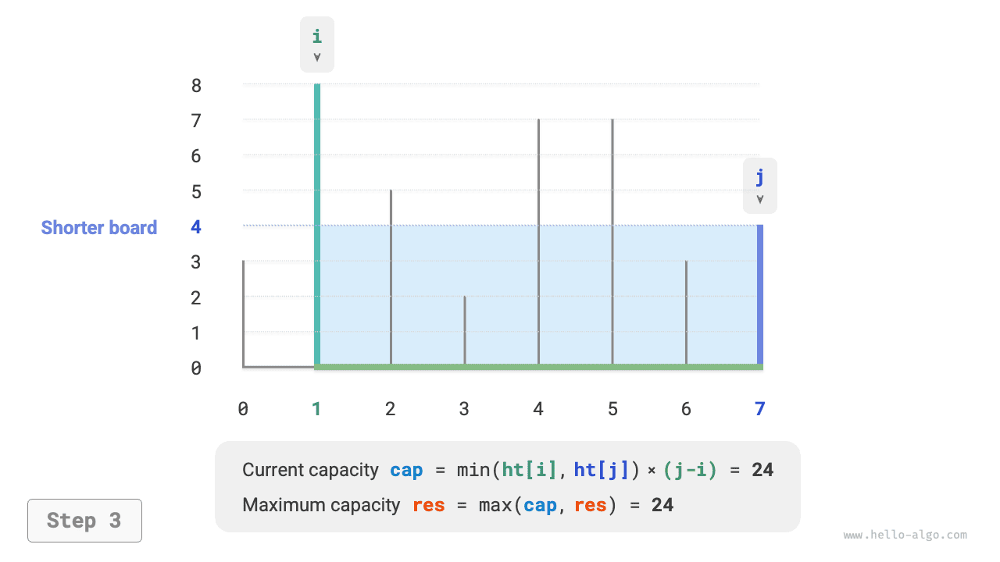
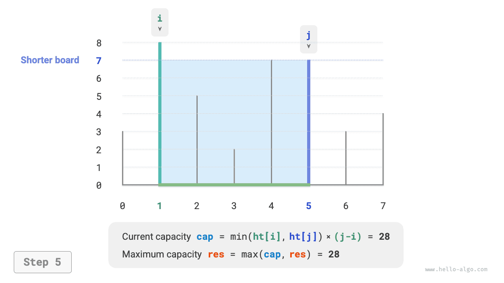
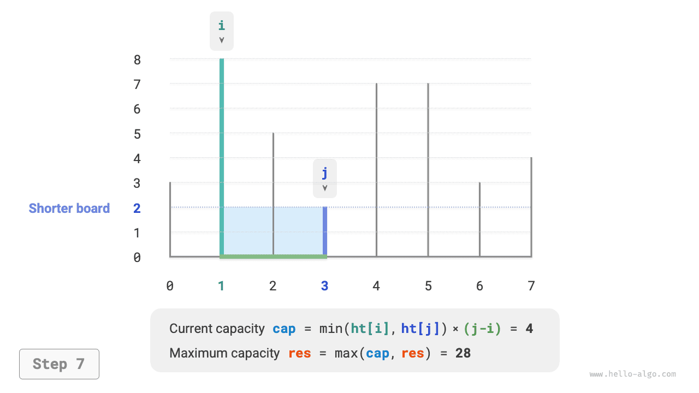
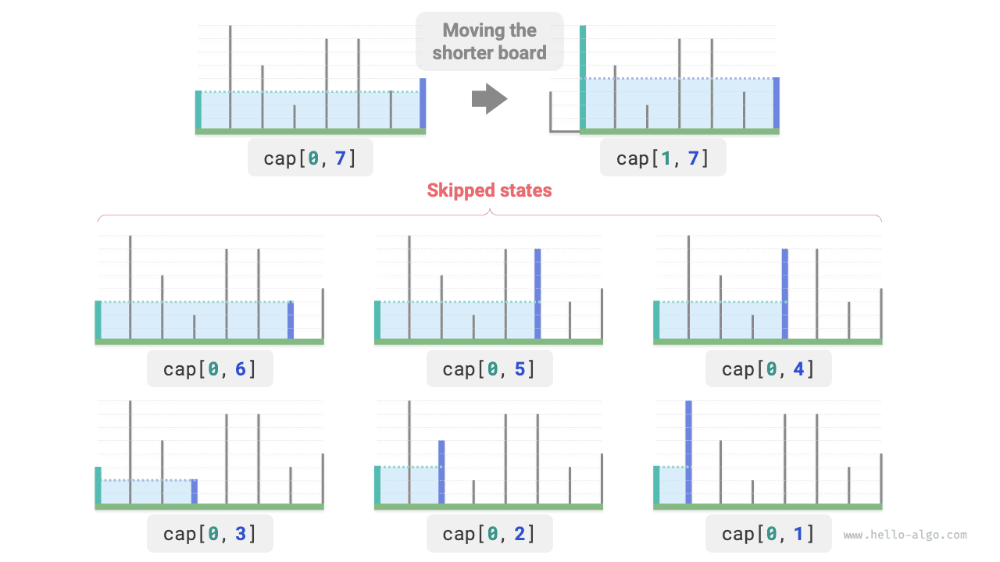

# Bài toán dung lượng cực đại

!!! question

    Nhập vào một mảng $ht$ ，mỗi phần tử trong đó đại diện cho chiều cao của một tấm vách ngăn thẳng đứng. Hai vách ngăn bất kỳ trong mảng cùng với khoảng không gian giữa chúng có thể tạo thành một chiếc bình chứa (container).
    
    Dung tích của bình chứa bằng tích của chiều cao và chiều rộng (diện tích), trong đó chiều cao được quyết định bởi vách ngăn ngắn hơn, chiều rộng là hiệu giữa các chỉ số mảng của hai vách ngăn.
    
    Hãy chọn hai vách ngăn trong mảng sao cho dung tích bình chứa tạo thành là lớn nhất, trả về dung tích lớn nhất đó. Ví dụ như hình dưới đây.


Bình chứa được tạo thành bởi hai vách ngăn bất kỳ, **do đó trạng thái của bài này là chỉ số của hai vách ngăn, ký hiệu là $[i, j]$** 。

Theo yêu cầu đề bài, dung tích bằng chiều cao nhân với chiều rộng, trong đó chiều cao do vách ngăn ngắn quyết định, chiều rộng là hiệu của hai chỉ số mảng. Đặt dung tích là $cap[i, j]$ ，ta có công thức tính:

$$
cap[i, j] = \min(ht[i], ht[j]) \times (j - i)
$$

Đặt độ dài mảng là $n$ ，số lượng tổ hợp của hai vách ngăn (tổng số trạng thái) là $C_n^2 = \frac{n(n - 1)}{2}$ 。Cách tiếp cận trực tiếp nhất là **chúng ta duyệt vét cạn toàn bộ các trạng thái** để tìm dung tích lớn nhất, độ phức tạp thời gian là $O(n^2)$ 。

### Xác định chiến lược tham lam

Bài toán này còn có cách giải hiệu năng cao hơn nhiều. Như hình dưới đây, hiện chọn một trạng thái $[i, j]$ thoả mãn chỉ số $i < j$ và chiều cao $ht[i] < ht[j]$ ，tức $i$ là vách ngăn ngắn và $j$ là vách ngăn dài.


Như hình dưới đây, **nếu lúc này dịch chuyển vách ngăn dài $j$ lại gần vách ngăn ngắn $i$, thì dung tích chắc chắn sẽ nhỏ đi**.

Nguyên nhân là do sau khi dịch chuyển vách ngăn dài $j$, chiều rộng $j-i$ chắc chắn sẽ giảm; trong khi chiều cao lại do vách ngăn ngắn quyết định, vì vậy chiều cao chỉ có thể giữ nguyên ($i$ vẫn là vách ngắn) hoặc giảm đi (vách $j$ sau khi dịch chuyển trở thành vách ngắn hơn).


Suy nghĩ theo hướng ngược lại, **chúng ta chỉ có thu hẹp vách ngắn $i$ vào trong thì mới có khả năng làm cho dung tích tăng lên**. Bởi vì mặc dù chiều rộng chắc chắn giảm đi, **nhưng chiều cao có thể sẽ tăng lên** (vách $i$ sau khi dịch chuyển có thể cao hơn). Ví dụ trong hình dưới đây, sau khi dịch chuyển vách ngắn thì diện tích đã tăng lên.


Từ đó có thể rút ra chiến lược tham lam của bài này: khởi tạo hai con trỏ nằm ở hai đầu của bình chứa, mỗi vòng thu hẹp con trỏ tương ứng với vách ngắn hơn vào trong, cho đến khi hai con trỏ gặp nhau.

Hình dưới đây minh hoạ quá trình thực thi của chiến lược tham lam:

1. Ở trạng thái ban đầu, hai con trỏ $i$ và $j$ phân bố ở hai đầu của mảng.
2. Tính dung tích của trạng thái hiện tại $cap[i, j]$ và cập nhật dung tích lớn nhất.
3. So sánh chiều cao của vách $i$ và vách $j$ ，dịch chuyển vách ngắn hơn vào trong một ô.
4. Lặp lại bước `2.` và bước `3.` ，cho đến khi $i$ và $j$ gặp nhau thì kết thúc.

=== "<1>"
    

=== "<2>"
    

=== "<3>"
    

=== "<4>"
    

=== "<5>"
    

=== "<6>"
    

=== "<7>"
    

=== "<8>"
    

=== "<9>"
    

### Hiện thực mã nguồn

Vòng lặp trong mã chạy tối đa $n$ vòng, **do đó độ phức tạp thời gian là $O(n)$** 。

Các biến $i$、$j$、$res$ sử dụng không gian bộ nhớ bổ sung kích thước hằng số, **vì vậy độ phức tạp không gian là $O(1)$** 。

```src
[file]{max_capacity}-[class]{}-[func]{max_capacity}
```

### Chứng minh tính đúng đắn

Sở dĩ tham lam nhanh hơn duyệt vét cạn là vì mỗi vòng lựa chọn tham lam đều đã "bỏ qua" một số trạng thái.

Chẳng hạn tại trạng thái $cap[i, j]$ ，$i$ là vách ngắn và $j$ là vách dài. Nếu tham lam dịch chuyển vách ngắn $i$ vào trong một ô, sẽ dẫn đến các trạng thái trong hình dưới đây bị "bỏ qua". **Điều này đồng nghĩa với việc về sau sẽ không kiểm chứng kích thước dung tích của các trạng thái này nữa**.

$$
cap[i, i+1], cap[i, i+2], \dots, cap[i, j-2], cap[i, j-1]
$$



Quan sát nhận thấy, **các trạng thái bị bỏ qua này trên thực tế chính là toàn bộ các trạng thái khi dịch chuyển vách dài $j$ vào trong**. Ở phần trước chúng ta đã chứng minh việc dịch chuyển vách dài vào trong chắc chắn làm dung tích nhỏ đi. Nói cách khác, các trạng thái bị bỏ qua đều không thể là lời giải tối ưu, **việc bỏ qua chúng sẽ không làm bỏ sót lời giải tối ưu**.

Phân tích trên chứng minh thao tác dịch chuyển vách ngắn là hoàn toàn "an toàn", chiến lược tham lam là hoàn toàn đúng đắn.
