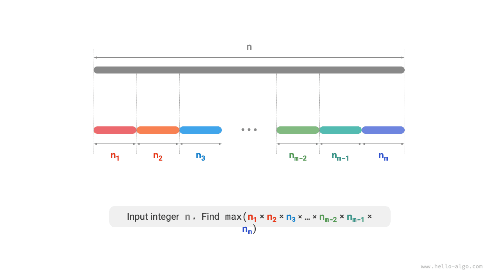
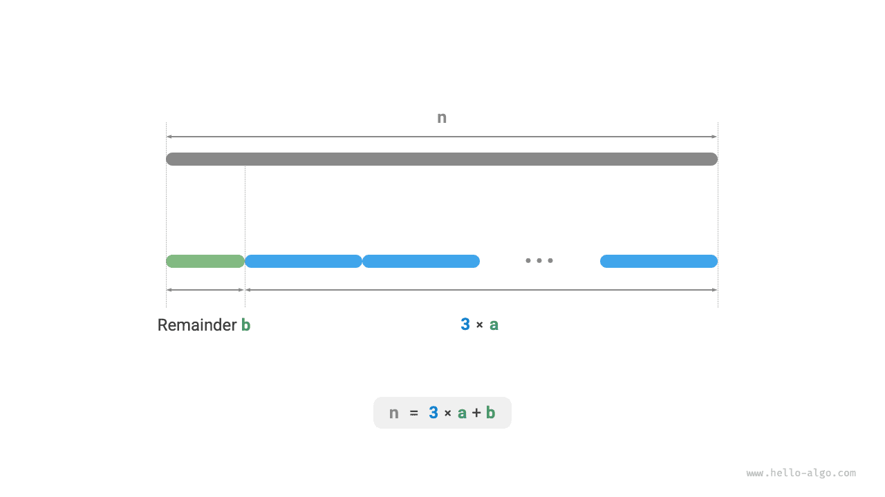

# Bài toán cắt đoạn tích cực đại

!!! question

    Cho một số nguyên dương $n$, hãy chia nó thành tổng của ít nhất hai số nguyên dương, tìm giá trị lớn nhất của tích các số nguyên sau khi chia, như hình dưới đây.



Giả sử chúng ta chia $n$ thành $m$ thừa số nguyên, trong đó thừa số thứ $i$ ký hiệu là $n_i$, tức

$$
n = \sum_{i=1}^{m}n_i
$$

Mục tiêu của bài này là tìm tích lớn nhất của toàn bộ các thừa số nguyên, tức

$$
\max(\prod_{i=1}^{m}n_i)
$$

Điều chúng ta cần suy nghĩ là: số lượng phần chia $m$ nên lớn cỡ nào, và mỗi thừa số $n_i$ nên bằng bao nhiêu?

### Xác định chiến lược tham lam

Theo kinh nghiệm, tích của hai số nguyên thường lớn hơn tổng của chúng. Giả sử từ $n$ tách ra một thừa số $2$, thì tích của chúng là $2(n-2)$. Chúng ta đem so sánh tích này với $n$:

$$
\begin{aligned}
2(n-2) & \geq n \newline
2n - n - 4 & \geq 0 \newline
n & \geq 4
\end{aligned}
$$

Như hình dưới đây, khi $n \geq 4$, sau khi tách ra một số $2$ thì tích sẽ lớn hơn, **điều này chứng tỏ các số nguyên lớn hơn hoặc bằng $4$ đều nên được tiếp tục chia nhỏ**.

**Chiến lược tham lam 1**: Nếu trong phương án chia có chứa thừa số $\geq 4$, thì nó nên được tiếp tục chia nhỏ. Phương án chia cuối cùng chỉ nên xuất hiện ba loại thừa số $1$, $2$, $3$.


Tiếp theo, suy ngẫm xem thừa số nào là tối ưu nhất. Trong ba thừa số $1$, $2$, $3$, hiển nhiên $1$ là tệ nhất, bởi vì $1 \times (n-1) < n$ luôn đúng, tức là tách ra số $1$ trái lại sẽ làm tích giảm đi.

Như hình dưới đây, khi $n = 6$, ta có $3 \times 3 > 2 \times 2 \times 2$. **Điều này đồng nghĩa với việc tách ra số $3$ sẽ tối ưu hơn tách ra số $2$**.

**Chiến lược tham lam 2**: Trong phương án chia, tối đa chỉ nên tồn tại hai số $2$. Bởi vì ba số $2$ luôn có thể thay thế bằng hai số $3$ để thu được tích lớn hơn.


Tổng hợp lại, có thể suy ra chiến lược tham lam sau:

1. Nhập vào số nguyên $n$, liên tục tách thừa số $3$ từ nó ra, cho đến khi phần dư là $0$, $1$, $2$.
2. Khi phần dư là $0$, đại diện cho $n$ là bội số của $3$, vì vậy không cần xử lý thêm gì.
3. Khi phần dư là $2$, không tiếp tục chia nữa, giữ nguyên.
4. Khi phần dư là $1$, do $2 \times 2 > 1 \times 3$, vì vậy nên thay thế số $3$ cuối cùng và phần dư $1$ thành hai số $2$.

### Hiện thực mã nguồn

Như hình dưới đây, chúng ta không cần dùng vòng lặp để chia số nguyên, mà có thể tận dụng phép chia lấy phần nguyên để tìm số lượng số $3$ ký hiệu là $a$, dùng phép chia lấy dư để tìm phần dư $b$, lúc này ta có:

$$
n = 3 a + b
$$

Xin lưu ý rằng, đối với trường hợp biên $n \leq 3$, bắt buộc phải tách ra một số $1$, tích là $1 \times (n - 1)$.

```src
[file]{max_product_cutting}-[class]{}-[func]{max_product_cutting}
```



**Độ phức tạp thời gian phụ thuộc vào phương thức hiện thực phép luỹ thừa của từng ngôn ngữ lập trình**. Lấy Python làm ví dụ, các hàm tính luỹ thừa thường dùng có ba loại:

- Toán tử `**` và hàm `pow()` đều có độ phức tạp thời gian là $O(\log a)$.
- Hàm `math.pow()` bên dưới gọi hàm `pow()` của thư viện ngôn ngữ C, thực hiện luỹ thừa số thực dấu phẩy động, độ phức tạp thời gian là $O(1)$.

Các biến $a$ và $b$ sử dụng không gian bộ nhớ bổ sung kích thước hằng số, **vì vậy độ phức tạp không gian là $O(1)$**.

### Chứng minh tính đúng đắn

Sử dụng phương pháp phản chứng, chỉ phân tích trường hợp $n \geq 4$:

1. **Mọi thừa số $\leq 3$**: Giả sử trong phương án chia tối ưu tồn tại thừa số $x \geq 4$, khi đó chắc chắn có thể tiếp tục chia nó thành $2(x-2)$ để thu được tích lớn hơn (hoặc bằng). Điều này mâu thuẫn với giả thiết.
2. **Phương án chia không chứa số $1$**: Giả sử trong phương án chia tối ưu tồn tại một thừa số $1$, khi đó nó chắc chắn có thể gộp vào một thừa số khác để thu được tích lớn hơn. Điều này mâu thuẫn với giả thiết.
3. **Phương án chia chứa tối đa hai số $2$**: Giả sử trong phương án chia tối ưu chứa ba số $2$, khi đó chắc chắn có thể thay thế bằng hai số $3$ để có tích lớn hơn. Điều này mâu thuẫn với giả thiết.
