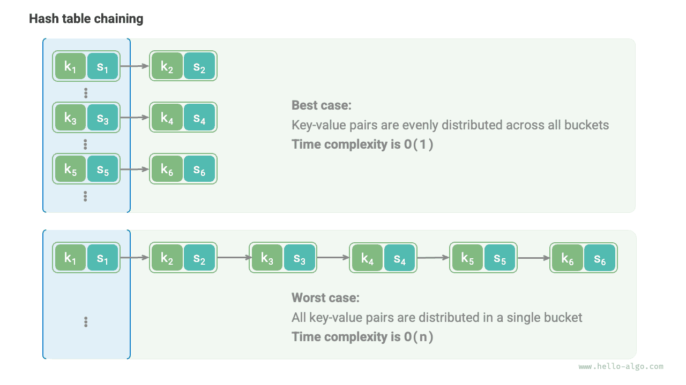

# Thuật toán băm

Hai phần trước đã giới thiệu nguyên lý hoạt động của bảng băm và các phương pháp xử lý đụng độ băm. Tuy nhiên dù là địa chỉ mở hay nối chuỗi, **chúng cũng chỉ có thể đảm bảo bảng băm vẫn hoạt động bình thường khi xảy ra đụng độ, chứ không thể làm giảm tần suất xuất hiện đụng độ băm**.

Nếu đụng độ băm diễn ra quá thường xuyên, hiệu năng của bảng băm sẽ suy giảm nghiêm trọng. Như hình dưới đây, đối với bảng băm nối chuỗi, trong điều kiện lý tưởng, các cặp khoá - giá trị được phân bố đồng đều giữa các ngăn, đạt hiệu quả tra cứu tối ưu; trong trường hợp xấu nhất, toàn bộ các cặp khoá - giá trị đều dồn vào cùng một ngăn duy nhất, khiến độ phức tạp thời gian thoái hoá về $O(n)$.



**Sự phân bố của các cặp khoá - giá trị do hàm băm quyết định**. Nhắc lại các bước tính toán của hàm băm: trước tiên tính giá trị băm, sau đó lấy dư với độ dài mảng:

```shell
index = hash(key) % capacity
```

Quan sát công thức trên, khi dung lượng `capacity` của bảng băm là cố định, **thuật toán băm `hash()` sẽ quyết định giá trị đầu ra**, từ đó quyết định sự phân bố của các cặp khoá - giá trị trong bảng băm.

Điều này có nghĩa là, để giảm thiểu xác suất xảy ra đụng độ băm, chúng ta cần tập trung sự chú ý vào việc thiết kế thuật toán băm `hash()`.

## Mục tiêu của thuật toán băm

Để xây dựng một cấu trúc dữ liệu bảng băm "vừa nhanh vừa ổn định", thuật toán băm cần đáp ứng các đặc tính sau:

- **Tính xác định (Determinism)**: Đối với cùng một đầu vào, thuật toán băm phải luôn tạo ra cùng một đầu ra duy nhất. Có như vậy mới đảm bảo bảng băm hoạt động đáng tin cậy.
- **Hiệu năng cao (High efficiency)**: Quá trình tính toán giá trị băm phải đủ nhanh. Chi phí tính toán càng nhỏ thì tính thực tiễn của bảng băm càng cao.
- **Phân bố đồng đều (Uniform distribution)**: Thuật toán băm cần đảm bảo các cặp khoá - giá trị được phân bố đồng đều trong bảng băm. Phân bố càng đồng đều thì xác suất đụng độ băm càng thấp.

Trên thực tế, ngoài việc dùng để hiện thực bảng băm, thuật toán băm còn được ứng dụng rộng rãi trong nhiều lĩnh vực khác:

- **Lưu trữ mật khẩu**: Để bảo vệ an toàn cho mật khẩu người dùng, hệ thống thường không lưu trữ trực tiếp mật khẩu dạng văn bản rõ (plaintext), mà lưu giá trị băm của mật khẩu. Khi người dùng nhập mật khẩu, hệ thống sẽ tính giá trị băm của mật khẩu vừa nhập rồi so sánh với giá trị băm đã lưu. Nếu cả hai khớp nhau thì mật khẩu được coi là chính xác.
- **Kiểm tra tính toàn vẹn của dữ liệu**: Bên gửi dữ liệu có thể tính toán giá trị băm của dữ liệu và gửi kèm theo; bên nhận có thể tính lại giá trị băm của dữ liệu nhận được và so sánh với giá trị băm gửi kèm. Nếu khớp nhau thì dữ liệu được coi là toàn vẹn, không bị chỉnh sửa.

Đối với các ứng dụng liên quan đến mật mã học, nhằm ngăn chặn việc suy diễn ngược ra mật khẩu gốc từ giá trị băm, thuật toán băm cần sở hữu các đặc tính an toàn ở cấp độ cao hơn:

- **Tính một chiều (Unidirectionality)**: Không thể suy diễn ngược bất kỳ thông tin nào về dữ liệu đầu vào từ giá trị băm.
- **Tính kháng va chạm (Collision resistance)**: Cực kỳ khó khăn để tìm ra hai đầu vào khác nhau có cùng một giá trị băm.
- **Hiệu ứng thác đổ (Avalanche effect)**: Một sự thay đổi nhỏ ở đầu vào cũng sẽ dẫn đến sự thay đổi rõ rệt và không thể đoán trước ở đầu ra.

Xin lưu ý rằng, **"phân bố đồng đều" và "tính kháng va chạm" là hai khái niệm hoàn toàn độc lập**. Đáp ứng phân bố đồng đều chưa chắc đã đáp ứng tính kháng va chạm. Ví dụ, dưới đầu vào ngẫu nhiên `key`, hàm băm `key % 100` có thể tạo ra đầu ra phân bố đồng đều. Tuy nhiên thuật toán băm này quá đơn giản, tất cả các `key` có hai chữ số cuối giống nhau đều cho ra kết quả như nhau, do đó chúng ta có thể dễ dàng suy ngược từ giá trị băm ra các `key` khả dĩ, từ đó bẻ khoá mật khẩu.

## Thiết kế thuật toán băm

Thiết kế thuật toán băm là một vấn đề phức tạp đòi hỏi phải cân nhắc nhiều yếu tố. Tuy nhiên đối với một số tình huống yêu cầu không quá khắt khe, chúng ta cũng có thể thiết kế một số thuật toán băm đơn giản:

- **Băm cộng (Additive hash)**: Cộng dồn mã ASCII của từng ký tự đầu vào, lấy tổng thu được làm giá trị băm.
- **Băm nhân (Multiplicative hash)**: Tận dụng tính không tương quan của phép nhân, mỗi vòng nhân với một hằng số, tích luỹ mã ASCII của các ký tự vào giá trị băm.
- **Băm XOR (XOR hash)**: Tích luỹ từng phần tử của dữ liệu đầu vào vào giá trị băm thông qua phép toán XOR.
- **Băm xoay (Rotating hash)**: Tích luỹ mã ASCII của từng ký tự vào giá trị băm, trước mỗi lần tích luỹ đều thực hiện thao tác xoay bit trên giá trị băm.

```src
[file]{simple_hash}-[class]{}-[func]{rot_hash}
```

Quan sát thấy rằng, bước cuối cùng của mỗi thuật toán băm đều là lấy dư với số nguyên tố lớn $1000000007$ để đảm bảo giá trị băm nằm trong phạm vi thích hợp. Đáng suy ngẫm là: tại sao lại nhấn mạnh việc chia lấy dư cho số nguyên tố, hay nói cách khác tác hại của việc lấy dư cho hợp số là gì? Đây là một câu hỏi rất thú vị.

Đưa ra kết luận trước: **Sử dụng số nguyên tố lớn làm số chia (modulus) có thể tối đa hoá việc đảm bảo sự phân bố đồng đều của giá trị băm**. Vì số nguyên tố không có ước chung với các số khác, nó có thể giảm thiểu các chu kỳ lặp lại do phép chia lấy dư tạo ra, từ đó hạn chế đụng độ băm.

Lấy ví dụ, giả sử chúng ta chọn hợp số $9$ làm số chia, nó có thể chia hết cho $3$, khi đó toàn bộ các `key` chia hết cho $3$ đều sẽ bị ánh xạ vào ba giá trị băm là $0, 3, 6$:

$$
\begin{aligned}
\text{modulus} & = 9 \newline
\text{key} & = \{ 0, 3, 6, 9, 12, 15, 18, 21, 24, 27, 30, 33, \dots \} \newline
\text{hash} & = \{ 0, 3, 6, 0, 3, 6, 0, 3, 6, 0, 3, 6,\dots \}
\end{aligned}
$$

Nếu đầu vào `key` tình cờ thoả mãn phân bố dữ liệu theo cấp số cộng này, thì các giá trị băm sẽ bị tụ cụm dày đặc, làm trầm trọng thêm đụng độ băm. Bây giờ, giả sử thay thế `modulus` bằng số nguyên tố $13$, do giữa `key` và `modulus` không có ước số chung, tính đồng đều của các giá trị băm đầu ra sẽ được nâng cao rõ rệt:

$$
\begin{aligned}
\text{modulus} & = 13 \newline
\text{key} & = \{ 0, 3, 6, 9, 12, 15, 18, 21, 24, 27, 30, 33, \dots \} \newline
\text{hash} & = \{ 0, 3, 6, 9, 12, 2, 5, 8, 11, 1, 4, 7, \dots \}
\end{aligned}
$$

Cần lưu ý thêm rằng, nếu có thể đảm bảo `key` phân bố ngẫu nhiên đồng đều, thì chọn số nguyên tố hay hợp số làm số chia đều được, chúng đều có thể xuất ra các giá trị băm phân bố đồng đều. Nhưng khi sự phân bố của `key` tồn tại tính chu kỳ nào đó, việc lấy dư cho hợp số sẽ rất dễ gây ra hiện tượng tụ cụm.

Tóm lại, chúng ta thường chọn số nguyên tố làm số chia, và số nguyên tố này tốt nhất nên đủ lớn để triệt tiêu tối đa các quy luật chu kỳ, nâng cao tính vững chắc (robustness) của thuật toán băm.

## Các thuật toán băm phổ biến

Dễ nhận thấy rằng, các thuật toán băm đơn giản được giới thiệu ở trên khá "mong manh", còn cách rất xa so với mục tiêu thiết kế của thuật toán băm. Ví dụ do phép cộng và phép XOR có tính giao hoán, nên băm cộng và băm XOR không thể phân biệt được các chuỗi ký tự có cùng nội dung nhưng khác thứ tự, điều này có thể làm gia tăng đụng độ băm và dẫn đến một số vấn đề bảo mật.

Trong thực tế, chúng ta thường sử dụng một số thuật toán băm chuẩn mực như MD5, SHA-1, SHA-2 và SHA-3, v.v. Chúng có thể ánh xạ dữ liệu đầu vào có độ dài tuỳ ý thành giá trị băm có độ dài cố định.

Trong gần một thế kỷ qua, các thuật toán băm liên tục trải qua quá trình nâng cấp và tối ưu hoá. Một bộ phận các nhà nghiên cứu nỗ lực nâng cao hiệu năng của thuật toán băm, trong khi bộ phận khác cùng các hacker thì tập trung tìm kiếm các lỗ hổng bảo mật của chúng. Bảng dưới đây thể hiện các thuật toán băm phổ biến trong ứng dụng thực tế:

- MD5 và SHA-1 đã nhiều lần bị tấn công thành công (tìm ra va chạm), do đó chúng đã bị loại bỏ khỏi các ứng dụng bảo mật.
- SHA-256 trong dòng SHA-2 là một trong những thuật toán băm an toàn nhất hiện nay, chưa từng bị tấn công thành công, do đó được sử dụng phổ biến trong các ứng dụng bảo mật và giao thức mạng.
- SHA-3 so với SHA-2 có chi phí hiện thực phần cứng thấp hơn và hiệu năng tính toán cao hơn, nhưng mức độ phủ sóng hiện tại chưa rộng rãi bằng dòng SHA-2.

<p align="center"> Bảng <id> &nbsp; Các thuật toán băm phổ biến </p>

|          | MD5                            | SHA-1            | SHA-2                        | SHA-3               |
| -------- | ------------------------------ | ---------------- | ---------------------------- | ------------------- |
| Thời điểm ra đời | 1992                           | 1995             | 2002                         | 2008                |
| Độ dài đầu ra | 128 bit                        | 160 bit          | 256/512 bit                  | 224/256/384/512 bit |
| Đụng độ băm | Nhiều                           | Nhiều             | Rất ít                         | Rất ít                |
| Cấp độ an toàn | Thấp, đã bị tấn công thành công | Thấp, đã bị tấn công thành công | Cao                           | Cao                  |
| Ứng dụng     | Đã bị loại bỏ trong bảo mật, vẫn dùng kiểm tra toàn vẹn dữ liệu | Đã bị loại bỏ trong bảo mật | Xác thực giao dịch tiền mã hoá, chữ ký số, v.v. | Có thể dùng thay thế SHA-2    |

## Giá trị băm của cấu trúc dữ liệu

Chúng ta biết rằng, `key` của bảng băm có thể là các kiểu dữ liệu như số nguyên, số thực hoặc chuỗi ký tự, v.v. Các ngôn ngữ lập trình thường cung cấp các thuật toán băm tích hợp sẵn cho những kiểu dữ liệu này để tính toán chỉ số ngăn trong bảng băm. Lấy Python làm ví dụ, chúng ta có thể gọi hàm `hash()` để tính giá trị băm của các kiểu dữ liệu khác nhau:

- Giá trị băm của số nguyên và giá trị boolean chính là bản thân nó.
- Việc tính giá trị băm của số thực và chuỗi ký tự phức tạp hơn, bạn đọc quan tâm có thể tự tìm hiểu thêm.
- Giá trị băm của tuple là thực hiện băm từng phần tử bên trong, sau đó kết hợp các giá trị băm đó lại để tạo thành một giá trị băm duy nhất.
- Giá trị băm của đối tượng được tạo ra dựa trên địa chỉ bộ nhớ của nó. Bằng cách ghi đè phương thức băm của đối tượng, có thể hiện thực hoá việc tạo giá trị băm dựa trên nội dung.

!!! tip

    Xin lưu ý rằng định nghĩa và phương thức của hàm tính giá trị băm tích hợp sẵn trong các ngôn ngữ lập trình khác nhau có thể khác nhau.

=== "Python"

    ```python title="built_in_hash.py"
    num = 3
    hash_num = hash(num)
    # Giá trị băm của số nguyên 3 là 3

    bol = True
    hash_bol = hash(bol)
    # Giá trị băm của Boolean True là 1

    dec = 3.14159
    hash_dec = hash(dec)
    # Giá trị băm của số thực 3.14159 là 326484311674566659

    str = "Hello Algo"
    hash_str = hash(str)
    # Giá trị băm của chuỗi "Hello Algo" là 4617003410720528961

    tup = (12836, "Tiểu Cáp")
    hash_tup = hash(tup)
    # Giá trị băm của tuple (12836, 'Tiểu Cáp') là 1029005403108185979

    obj = ListNode(0)
    hash_obj = hash(obj)
    # Giá trị băm của đối tượng nút <ListNode object at 0x1058fd810> là 274267521
    ```

=== "C++"

    ```cpp title="built_in_hash.cpp"
    int num = 3;
    size_t hashNum = hash<int>()(num);
    // Giá trị băm của số nguyên 3 là 3

    bool bol = true;
    size_t hashBol = hash<bool>()(bol);
    // Giá trị băm của Boolean 1 là 1

    double dec = 3.14159;
    size_t hashDec = hash<double>()(dec);
    // Giá trị băm của số thực 3.14159 là 4614256650576692846

    string str = "Hello Algo";
    size_t hashStr = hash<string>()(str);
    // Giá trị băm của chuỗi "Hello Algo" là 15466937326284535026

    // Trong C++, std::hash() tích hợp sẵn chỉ cung cấp tính toán giá trị băm cho các kiểu dữ liệu cơ bản
    // Việc tính toán giá trị băm của mảng, đối tượng cần phải tự hiện thực
    ```

=== "Java"

    ```java title="built_in_hash.java"
    int num = 3;
    int hashNum = Integer.hashCode(num);
    // Giá trị băm của số nguyên 3 là 3

    boolean bol = true;
    int hashBol = Boolean.hashCode(bol);
    // Giá trị băm của Boolean true là 1231

    double dec = 3.14159;
    int hashDec = Double.hashCode(dec);
    // Giá trị băm của số thực 3.14159 là -1340954729

    String str = "Hello Algo";
    int hashStr = str.hashCode();
    // Giá trị băm của chuỗi "Hello Algo" là -727081396

    Object[] arr = { 12836, "Tiểu Cáp" };
    int hashTup = Arrays.hashCode(arr);
    // Giá trị băm của mảng [12836, Tiểu Cáp] là 1151158

    ListNode obj = new ListNode(0);
    int hashObj = obj.hashCode();
    // Giá trị băm của đối tượng nút utils.ListNode@7dc5e7b4 là 2110121908
    ```

=== "C#"

    ```csharp title="built_in_hash.cs"
    int num = 3;
    int hashNum = num.GetHashCode();
    // Giá trị băm của số nguyên 3 là 3;

    bool bol = true;
    int hashBol = bol.GetHashCode();
    // Giá trị băm của Boolean true là 1

    double dec = 3.14159;
    int hashDec = dec.GetHashCode();
    // Giá trị băm của số thực 3.14159 là -1340954729

    string str = "Hello Algo";
    int hashStr = str.GetHashCode();
    // Giá trị băm của chuỗi "Hello Algo" là -727081396

    int[] arr = [ 12836 ];
    int hashTup = arr.GetHashCode();
    // Giá trị băm của mảng [12836] là 54267293

    ListNode obj = new(0);
    int hashObj = obj.GetHashCode();
    // Giá trị băm của đối tượng nút ListNode là 33139414
    ```

=== "Go"

    ```go title="built_in_hash_test.go"
    // Go không cung cấp hàm băm tích hợp sẵn cho các kiểu dữ liệu cơ bản
    ```

=== "Swift"

    ```swift title="built_in_hash.swift"
    let num = 3
    let hashNum = num.hashValue
    // Giá trị băm của số nguyên 3 là -4184984570659648616

    let bol = true
    let hashBol = bol.hashValue
    // Giá trị băm của Boolean true là 4310574044561009139

    let dec = 3.14159
    let hashDec = dec.hashValue
    // Giá trị băm của số thực 3.14159 là 1242337775086842858

    let str = "Hello Algo"
    let hashStr = str.hashValue
    // Giá trị băm của chuỗi "Hello Algo" là 2445899479361099684

    let obj = ListNode(x: 0)
    let hashObj = obj.hashValue
    // Giá trị băm của đối tượng nút ListNode là -2774944888120610332
    ```

=== "JS"

    ```javascript title="built_in_hash.js"
    // JavaScript không cung cấp hàm băm tích hợp sẵn cho các kiểu dữ liệu cơ bản
    ```

=== "TS"

    ```typescript title="built_in_hash.ts"
    // TypeScript không cung cấp hàm băm tích hợp sẵn cho các kiểu dữ liệu cơ bản
    ```

=== "Dart"

    ```dart title="built_in_hash.dart"
    int num = 3;
    int hashNum = num.hashCode;
    // Giá trị băm của số nguyên 3 là 3

    bool bol = true;
    int hashBol = bol.hashCode;
    // Giá trị băm của Boolean true là 1231

    double dec = 3.14159;
    int hashDec = dec.hashCode;
    // Giá trị băm của số thực 3.14159 là 340954729

    String str = "Hello Algo";
    int hashStr = str.hashCode;
    // Giá trị băm của chuỗi "Hello Algo" là 417003410

    List<Object> arr = [12836, "Tiểu Cáp"];
    int hashTup = Object.hashAll(arr);
    // Giá trị băm của mảng [12836, Tiểu Cáp] là 1029005403

    ListNode obj = ListNode(0);
    int hashObj = obj.hashCode;
    // Giá trị băm của đối tượng nút ListNode là 274267521
    ```

=== "Rust"

    ```rust title="built_in_hash.rs"
    use std::collections::hash_map::DefaultHasher;
    use std::hash::{Hash, Hasher};

    let mut hasher = DefaultHasher::new();

    let num = 3;
    num.hash(&mut hasher);
    let hash_num = hasher.finish();
    // Giá trị băm của số nguyên 3 là 14833210777083056801

    let bol = true;
    bol.hash(&mut hasher);
    let hash_bol = hasher.finish();
    // Giá trị băm của Boolean true là 2496739986348421063

    let str = "Hello Algo";
    str.hash(&mut hasher);
    let hash_str = hasher.finish();
    // Giá trị băm của chuỗi "Hello Algo" là 7208447814406180630

    let tup = (12836, "Tiểu Cáp");
    tup.hash(&mut hasher);
    let hash_tup = hasher.finish();
    // Giá trị băm của tuple (12836, 'Tiểu Cáp') là 12745749212000305886
    ```

=== "C"

    ```c title="built_in_hash.c"
    // C không cung cấp hàm băm tích hợp sẵn
    ```

=== "Kotlin"

    ```kotlin title="built_in_hash.kt"
    val num = 3
    val hashNum = num.hashCode()
    // Giá trị băm của số nguyên 3 là 3

    val bol = true
    val hashBol = bol.hashCode()
    // Giá trị băm của Boolean true là 1231

    val dec = 3.14159
    val hashDec = dec.hashCode()
    // Giá trị băm của số thực 3.14159 là -1340954729

    val str = "Hello Algo"
    val hashStr = str.hashCode()
    // Giá trị băm của chuỗi "Hello Algo" là -727081396

    val arr = arrayOf(12836, "Tiểu Cáp")
    val hashTup = arr.contentHashCode()
    // Giá trị băm của mảng [12836, Tiểu Cáp] là 1151158

    val obj = ListNode(0)
    val hashObj = obj.hashCode()
    // Giá trị băm của đối tượng nút ListNode là 2110121908
    ```

=== "Ruby"

    ```ruby title="built_in_hash.rb"
    num = 3
    hash_num = num.hash
    # Giá trị băm của số nguyên 3 là 1667448375836254041

    bol = true
    hash_bol = bol.hash
    # Giá trị băm của Boolean true là -1617938112149317027

    dec = 3.14159
    hash_dec = dec.hash
    # Giá trị băm của số thực 3.14159 là -1479186995943067893

    str = "Hello Algo"
    hash_str = str.hash
    # Giá trị băm của chuỗi "Hello Algo" là -4075943250025831763

    tup = [12836, 'Tiểu Cáp']
    hash_tup = tup.hash
    # Giá trị băm của tuple (12836, 'Tiểu Cáp') là 1999544809202288822

    obj = ListNode.new(0)
    hash_obj = obj.hash
    # Giá trị băm của đối tượng nút #<ListNode:0x000078133140ab70> là 4302940560806366381
    ```

??? pythontutor "Trực quan hoá thực thi"

    https://pythontutor.com/render.html#code=class%20ListNode%3A%0A%20%20%20%20%22%22%22%E9%93%BE%E8%A1%A8%E8%8A%82%E7%82%B9%E7%B1%BB%22%22%22%0A%20%20%20%20def%20__init__%28self,%20val%3A%20int%29%3A%0A%20%20%20%20%20%20%20%20self.val%3A%20int%20%3D%20val%20%20%23%20%E8%8A%82%E7%82%B9%E5%80%BC%0A%20%20%20%20%20%20%20%20self.next%3A%20ListNode%20%7C%20None%20%3D%20None%20%20%23%20%E5%90%8E%E7%BB%A7%E8%8A%82%E7%82%B9%E5%BC%95%E7%94%A8%0A%0A%22%22%22Driver%20Code%22%22%22%0Aif%20__name__%20%3D%3D%20%22__main__%22%3A%0A%20%20%20%20num%20%3D%203%0A%20%20%20%20hash_num%20%3D%20hash%28num%29%0A%20%20%20%20%23%20%E6%95%B4%E6%95%B0%203%20%E7%9A%84%E5%93%88%E5%B8%8C%E5%80%BC%E4%B8%BA%203%0A%0A%20%20%20%20bol%20%3D%20True%0A%20%20%20%20hash_bol%20%3D%20hash%28bol%29%0A%20%20%20%20%23%20%E5%B8%83%E5%B0%94%E9%87%8F%20True%20%E7%9A%84%E5%93%88%E5%B8%8C%E5%80%BC%E4%B8%BA%201%0A%0A%20%20%20%20dec%20%3D%203.14159%0A%20%20%20%20hash_dec%20%3D%20hash%28dec%29%0A%20%20%20%20%23%20%E5%B0%8F%E6%95%B0%203.14159%20%E7%9A%84%E5%93%88%E5%B8%8C%E5%80%BC%E4%B8%BA%20326484311674566659%0A%0A%20%20%20%20str%20%3D%20%22Hello%20%E7%AE%97%E6%B3%95%22%0A%20%20%20%20hash_str%20%3D%20hash%28str%29%0A%20%20%20%20%23%20%E5%AD%97%E7%AC%A6%E4%B8%B2%E2%80%9CHello%20%E7%AE%97%E6%B3%95%E2%80%9D%E7%9A%84%E5%93%88%E5%B8%8C%E5%80%BC%E4%B8%BA%204617003410720528961%0A%0A%20%20%20%20tup%20%3D%20%2812836,%20%22%E5%B0%8F%E5%93%88%22%29%0A%20%20%20%20hash_tup%20%3D%20hash%28tup%29%0A%20%20%20%20%23%20%E5%85%83%E7%BB%84%20%2812836,%20'%E5%B0%8F%E5%93%88'%29%20%E7%9A%84%E5%93%88%E5%B8%8C%E5%80%BC%E4%B8%BA%201029005403108185979%0A%0A%20%20%20%20obj%20%3D%20ListNode%280%29%0A%20%20%20%20hash_obj%20%3D%20hash%28obj%29%0A%20%20%20%20%23%20%E8%8A%82%E7%82%B9%E5%AF%B9%E8%B1%A1%20%3CListNode%20object%20at%200x1058fd810%3E%20%E7%9A%84%E5%93%88%E5%B8%8C%E5%80%BC%E4%B8%BA%20274267521&cumulative=false&curInstr=19&heapPrimitives=nevernest&mode=display&origin=opt-frontend.js&py=311&rawInputLstJSON=%5B%5D&textReferences=false

Trong nhiều ngôn ngữ lập trình, **chỉ có các đối tượng bất biến (immutable object) mới có thể dùng làm `key` của bảng băm**. Giả sử chúng ta dùng danh sách (mảng động) làm `key`, khi nội dung của danh sách thay đổi, giá trị băm của nó cũng sẽ thay đổi theo, khiến chúng ta không thể tra cứu lại được `value` ban đầu trong bảng băm.

Mặc dù các biến thành viên của một đối tượng tuỳ biến (ví dụ như nút danh sách liên kết) là khả biến, nhưng bản thân nó vẫn là đối tượng có thể băm được (hashable). **Điều này là do giá trị băm của đối tượng thường được tạo ra dựa trên địa chỉ bộ nhớ của nó**, ngay cả khi nội dung đối tượng thay đổi nhưng địa chỉ bộ nhớ không đổi thì giá trị băm vẫn giữ nguyên không đổi.

Người đọc tinh ý có thể nhận thấy khi chạy chương trình trên các terminal khác nhau, giá trị băm xuất ra sẽ khác nhau. **Điều này là do trình thông dịch Python trong mỗi lần khởi động đều sẽ thêm một giá trị muối (salt) ngẫu nhiên vào hàm băm chuỗi ký tự**. Cách làm này có thể ngăn chặn hiệu quả các cuộc tấn công HashDoS, nâng cao tính an toàn cho thuật toán băm.
