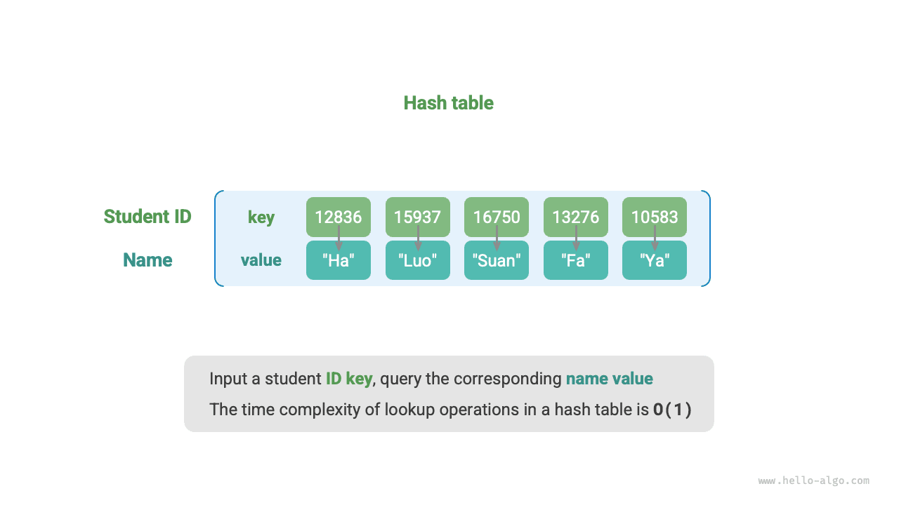
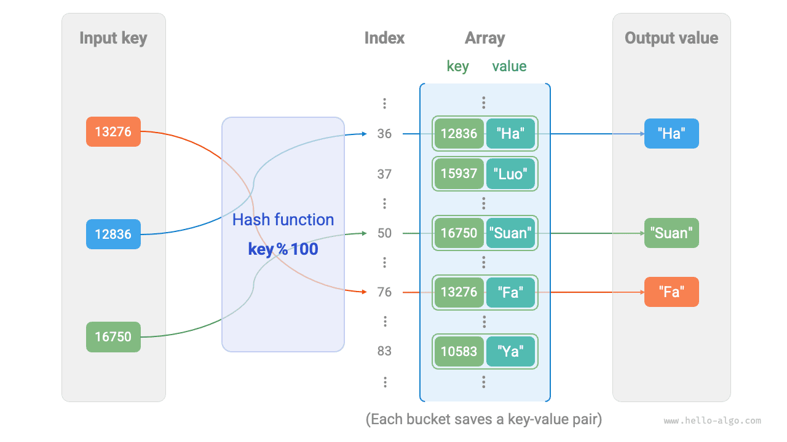
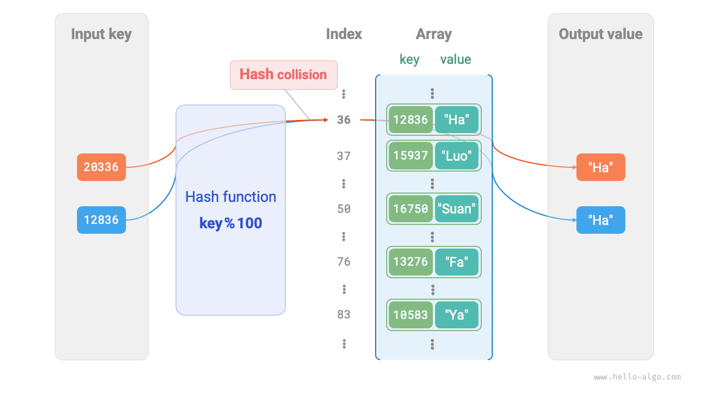

# Bảng băm

<u>Bảng băm (hash table)</u>, còn được gọi là <u>bảng phân tán</u>, thiết lập một ánh xạ giữa khoá `key` và giá trị `value`, giúp việc tra cứu phần tử đạt hiệu năng cực cao. Cụ thể, khi chúng ta đưa một khoá `key` vào bảng băm, ta có thể lấy được giá trị `value` tương ứng trong thời gian $O(1)$.

Như minh hoạ trong hình dưới đây, giả sử có $n$ học sinh, mỗi học sinh đều có hai thông tin là "họ tên" và "mã số học sinh". Nếu chúng ta muốn hiện thực chức năng "nhập vào một mã số học sinh, trả về họ tên tương ứng", chúng ta có thể sử dụng bảng băm như hình bên dưới.



Ngoài bảng băm, mảng và danh sách liên kết cũng có thể hiện thực chức năng tra cứu, hiệu năng của chúng được so sánh trong bảng dưới đây:

- **Thêm phần tử**: Chỉ cần thêm phần tử vào cuối mảng (danh sách liên kết), mất thời gian $O(1)$.
- **Tra cứu phần tử**: Do mảng (danh sách liên kết) không có thứ tự theo khoá, nên cần phải duyệt qua toàn bộ các phần tử, mất thời gian $O(n)$.
- **Xoá phần tử**: Cần phải tra cứu phần tử trước rồi mới xoá khỏi mảng (danh sách liên kết), mất thời gian $O(n)$.

<p align="center"> Bảng <id> &nbsp; So sánh hiệu năng tra cứu phần tử </p>

|          | Mảng   | Danh sách liên kết   | Bảng băm |
| -------- | ------ | ------ | ------ |
| Tìm kiếm phần tử | $O(n)$ | $O(n)$ | $O(1)$ |
| Thêm phần tử | $O(1)$ | $O(1)$ | $O(1)$ |
| Xoá phần tử | $O(n)$ | $O(n)$ | $O(1)$ |

Quan sát thấy rằng, **độ phức tạp thời gian của các thao tác thêm, xoá, sửa, tra cứu trong bảng băm đều là $O(1)$**, vô cùng hiệu quả.

## Các thao tác thường dùng trên bảng băm

Các thao tác thường dùng trên bảng băm bao gồm: khởi tạo, tra cứu, thêm cặp khoá - giá trị và xoá cặp khoá - giá trị, v.v. Mã nguồn ví dụ như sau:

=== "Python"

    ```python title="hash_map.py"
    # Khởi tạo bảng băm
    hmap: dict = {}

    # Thao tác thêm
    # Thêm cặp khoá - giá trị (key, value) vào bảng băm
    hmap[12836] = "Tiểu Cáp"
    hmap[15937] = "Tiểu La"
    hmap[16750] = "Tiểu Toán"
    hmap[13276] = "Tiểu Pháp"
    hmap[10583] = "Tiểu Vịt"

    # Thao tác tra cứu
    # Nhập khoá key vào bảng băm để lấy giá trị value
    name: str = hmap[15937]

    # Thao tác xoá
    # Xoá cặp khoá - giá trị (key, value) khỏi bảng băm
    hmap.pop(10583)
    ```

=== "C++"

    ```cpp title="hash_map.cpp"
    /* Khởi tạo bảng băm */
    unordered_map<int, string> map;

    /* Thao tác thêm */
    // Thêm cặp khoá - giá trị (key, value) vào bảng băm
    map[12836] = "Tiểu Cáp";
    map[15937] = "Tiểu La";
    map[16750] = "Tiểu Toán";
    map[13276] = "Tiểu Pháp";
    map[10583] = "Tiểu Vịt";

    /* Thao tác tra cứu */
    // Nhập khoá key vào bảng băm để lấy giá trị value
    string name = map[15937];

    /* Thao tác xoá */
    // Xoá cặp khoá - giá trị (key, value) khỏi bảng băm
    map.erase(10583);
    ```

=== "Java"

    ```java title="hash_map.java"
    /* Khởi tạo bảng băm */
    Map<Integer, String> map = new HashMap<>();

    /* Thao tác thêm */
    // Thêm cặp khoá - giá trị (key, value) vào bảng băm
    map.put(12836, "Tiểu Cáp");
    map.put(15937, "Tiểu La");
    map.put(16750, "Tiểu Toán");
    map.put(13276, "Tiểu Pháp");
    map.put(10583, "Tiểu Vịt");

    /* Thao tác tra cứu */
    // Nhập khoá key vào bảng băm để lấy giá trị value
    String name = map.get(15937);

    /* Thao tác xoá */
    // Xoá cặp khoá - giá trị (key, value) khỏi bảng băm
    map.remove(10583);
    ```

=== "C#"

    ```csharp title="hash_map.cs"
    /* Khởi tạo bảng băm */
    Dictionary<int, string> map = new() {
        /* Thao tác thêm */
        // Thêm cặp khoá - giá trị (key, value) vào bảng băm
        { 12836, "Tiểu Cáp" },
        { 15937, "Tiểu La" },
        { 16750, "Tiểu Toán" },
        { 13276, "Tiểu Pháp" },
        { 10583, "Tiểu Vịt" }
    };

    /* Thao tác tra cứu */
    // Nhập khoá key vào bảng băm để lấy giá trị value
    string name = map[15937];

    /* Thao tác xoá */
    // Xoá cặp khoá - giá trị (key, value) khỏi bảng băm
    map.Remove(10583);
    ```

=== "Go"

    ```go title="hash_map_test.go"
    /* Khởi tạo bảng băm */
    hmap := make(map[int]string)

    /* Thao tác thêm */
    // Thêm cặp khoá - giá trị (key, value) vào bảng băm
    hmap[12836] = "Tiểu Cáp"
    hmap[15937] = "Tiểu La"
    hmap[16750] = "Tiểu Toán"
    hmap[13276] = "Tiểu Pháp"
    hmap[10583] = "Tiểu Vịt"

    /* Thao tác tra cứu */
    // Nhập khoá key vào bảng băm để lấy giá trị value
    name := hmap[15937]

    /* Thao tác xoá */
    // Xoá cặp khoá - giá trị (key, value) khỏi bảng băm
    delete(hmap, 10583)
    ```

=== "Swift"

    ```swift title="hash_map.swift"
    /* Khởi tạo bảng băm */
    var map: [Int: String] = [:]

    /* Thao tác thêm */
    // Thêm cặp khoá - giá trị (key, value) vào bảng băm
    map[12836] = "Tiểu Cáp"
    map[15937] = "Tiểu La"
    map[16750] = "Tiểu Toán"
    map[13276] = "Tiểu Pháp"
    map[10583] = "Tiểu Vịt"

    /* Thao tác tra cứu */
    // Nhập khoá key vào bảng băm để lấy giá trị value
    let name = map[15937]!

    /* Thao tác xoá */
    // Xoá cặp khoá - giá trị (key, value) khỏi bảng băm
    map.removeValue(forKey: 10583)
    ```

=== "JS"

    ```javascript title="hash_map.js"
    /* Khởi tạo bảng băm */
    const map = new Map();

    /* Thao tác thêm */
    // Thêm cặp khoá - giá trị (key, value) vào bảng băm
    map.set(12836, "Tiểu Cáp");
    map.set(15937, "Tiểu La");
    map.set(16750, "Tiểu Toán");
    map.set(13276, "Tiểu Pháp");
    map.set(10583, "Tiểu Vịt");

    /* Thao tác tra cứu */
    // Nhập khoá key vào bảng băm để lấy giá trị value
    let name = map.get(15937);

    /* Thao tác xoá */
    // Xoá cặp khoá - giá trị (key, value) khỏi bảng băm
    map.delete(10583);
    ```

=== "TS"

    ```typescript title="hash_map.ts"
    /* Khởi tạo bảng băm */
    const map = new Map<number, string>();

    /* Thao tác thêm */
    // Thêm cặp khoá - giá trị (key, value) vào bảng băm
    map.set(12836, "Tiểu Cáp");
    map.set(15937, "Tiểu La");
    map.set(16750, "Tiểu Toán");
    map.set(13276, "Tiểu Pháp");
    map.set(10583, "Tiểu Vịt");

    /* Thao tác tra cứu */
    // Nhập khoá key vào bảng băm để lấy giá trị value
    let name: string = map.get(15937)!;

    /* Thao tác xoá */
    // Xoá cặp khoá - giá trị (key, value) khỏi bảng băm
    map.delete(10583);
    ```

=== "Dart"

    ```dart title="hash_map.dart"
    /* Khởi tạo bảng băm */
    Map<int, String> map = {};

    /* Thao tác thêm */
    // Thêm cặp khoá - giá trị (key, value) vào bảng băm
    map[12836] = "Tiểu Cáp";
    map[15937] = "Tiểu La";
    map[16750] = "Tiểu Toán";
    map[13276] = "Tiểu Pháp";
    map[10583] = "Tiểu Vịt";

    /* Thao tác tra cứu */
    // Nhập khoá key vào bảng băm để lấy giá trị value
    String name = map[15937]!;

    /* Thao tác xoá */
    // Xoá cặp khoá - giá trị (key, value) khỏi bảng băm
    map.remove(10583);
    ```

=== "Rust"

    ```rust title="hash_map.rs"
    use std::collections::HashMap;

    /* Khởi tạo bảng băm */
    let mut map: HashMap<i32, String> = HashMap::new();

    /* Thao tác thêm */
    // Thêm cặp khoá - giá trị (key, value) vào bảng băm
    map.insert(12836, "Tiểu Cáp".to_string());
    map.insert(15937, "Tiểu La".to_string());
    map.insert(16750, "Tiểu Toán".to_string());
    map.insert(13276, "Tiểu Pháp".to_string());
    map.insert(10583, "Tiểu Vịt".to_string());

    /* Thao tác tra cứu */
    // Nhập khoá key vào bảng băm để lấy giá trị value
    let name: Option<&String> = map.get(&15937);

    /* Thao tác xoá */
    // Xoá cặp khoá - giá trị (key, value) khỏi bảng băm
    let _ = map.remove(&10583);
    ```

=== "C"

    ```c title="hash_map.c"
    // C chưa cung cấp cấu trúc bảng băm tích hợp sẵn
    ```

=== "Kotlin"

    ```kotlin title="hash_map.kt"
    /* Khởi tạo bảng băm */
    val map = HashMap<Int, String>()

    /* Thao tác thêm */
    // Thêm cặp khoá - giá trị (key, value) vào bảng băm
    map[12836] = "Tiểu Cáp"
    map[15937] = "Tiểu La"
    map[16750] = "Tiểu Toán"
    map[13276] = "Tiểu Pháp"
    map[10583] = "Tiểu Vịt"

    /* Thao tác tra cứu */
    // Nhập khoá key vào bảng băm để lấy giá trị value
    val name = map[15937]

    /* Thao tác xoá */
    // Xoá cặp khoá - giá trị (key, value) khỏi bảng băm
    map.remove(10583)
    ```

=== "Ruby"

    ```ruby title="hash_map.rb"
    # Khởi tạo bảng băm
    map = Hash.new

    # Thao tác thêm
    # Thêm cặp khoá - giá trị (key, value) vào bảng băm
    map[12836] = "Tiểu Cáp"
    map[15937] = "Tiểu La"
    map[16750] = "Tiểu Toán"
    map[13276] = "Tiểu Pháp"
    map[10583] = "Tiểu Vịt"

    # Thao tác tra cứu
    # Nhập khoá key vào bảng băm để lấy giá trị value
    name = map[15937]

    # Thao tác xoá
    # Xoá cặp khoá - giá trị (key, value) khỏi bảng băm
    map.delete(10583)
    ```

=== "Zig"

    ```zig title="hash_map.zig"
    // Khởi tạo bảng băm
    var map = std.AutoHashMap(i32, []const u8).init(std.heap.page_allocator);
    defer map.deinit();

    // Thao tác thêm
    // Thêm cặp khoá - giá trị (key, value) vào bảng băm
    try map.put(12836, "Tiểu Cáp");
    try map.put(15937, "Tiểu La");
    try map.put(16750, "Tiểu Toán");
    try map.put(13276, "Tiểu Pháp");
    try map.put(10583, "Tiểu Vịt");

    // Thao tác tra cứu
    // Nhập khoá key vào bảng băm để lấy giá trị value
    const name = map.get(15937).?;

    // Thao tác xoá
    // Xoá cặp khoá - giá trị (key, value) khỏi bảng băm
    _ = map.remove(10583);
    ```

??? pythontutor "Trực quan hoá thực thi"

    https://pythontutor.com/render.html#code=%22%22%22Driver%20Code%22%22%22%0Aif%20__name__%20%3D%3D%20%22__main__%22%3A%0A%20%20%20%20#%20%E5%88%9D%E5%A7%8B%E5%8C%96%E5%93%88%E5%B8%8C%E8%A1%A8%0A%20%20%20%20hmap%20%3D%20%7B%7D%0A%20%20%20%20%0A%20%20%20%20#%20%E6%B7%BB%E5%8A%A0%E6%93%8D%E4%BD%9C%0A%20%20%20%20#%20%E5%9C%A8%E5%93%88%E5%B8%8C%E8%A1%A8%E4%B8%AD%E6%B7%BB%E5%8A%A0%E9%94%AE%E5%80%BC%E5%AF%B9%20%28key,%20value%29%0A%20%20%20%20hmap%5B12836%5D%20%3D%20%22%E5%B0%8F%E5%93%88%22%0A%20%20%20%20hmap%5B15937%5D%20%3D%20%22%E5%B0%8F%E5%95%B0%22%0A%20%20%20%20hmap%5B16750%5D%20%3D%20%22%E5%B0%8F%E7%AE%97%22%0A%20%20%20%20hmap%5B13276%5D%20%3D%20%22%E5%B0%8F%E6%B3%95%22%0A%20%20%20%20hmap%5B10583%5D%20%3D%20%22%E5%B0%8F%E9%B8%AD%22%0A%20%20%20%20%0A%20%20%20%20#%20%E6%9F%A5%E8%AF%A2%E6%93%8D%E4%BD%9C%0A%20%20%20%20#%20%E5%90%91%E5%93%88%E5%B8%8C%E8%A1%A8%E4%B8%AD%E8%BE%93%E5%85%A5%E9%94%AE%20key%20%EF%BC%8C%E5%BE%97%E5%88%B0%E5%80%BC%20value%0A%20%20%20%20name%20%3D%20hmap%5B15937%5D%0A%20%20%20%20%0A%20%20%20%20#%20%E5%88%A0%E9%99%A4%E6%93%8D%E4%BD%9C%0A%20%20%20%20#%20%E5%9C%A8%E5%93%88%E5%B8%8C%E8%A1%A8%E4%B8%AD%E5%88%A0%E9%99%A4%E9%94%AE%E5%80%BC%E5%AF%B9%20%28key,%20value%29%0A%20%20%20%20hmap.pop%2810583%29&cumulative=false&curInstr=3&heapPrimitives=nevernest&mode=display&origin=opt-frontend.js&py=311&rawInputLstJSON=%5B%5D&textReferences=false

Bảng băm cũng có thể duyệt theo ba cách: duyệt toàn bộ cặp khoá - giá trị, duyệt riêng từng khoá, hoặc duyệt riêng từng giá trị:

=== "Python"

    ```python title="hash_map.py"
    # Duyệt bảng băm
    # Duyệt các cặp khoá - giá trị key -> value
    for key, value in hmap.items():
        print(key, "->", value)
    # Duyệt riêng từng khoá key
    for key in hmap.keys():
        print(key)
    # Duyệt riêng từng giá trị value
    for value in hmap.values():
        print(value)
    ```

=== "C++"

    ```cpp title="hash_map.cpp"
    /* Duyệt bảng băm */
    // Duyệt các cặp khoá - giá trị key -> value
    for (auto kv: map) {
        cout << kv.first << " -> " << kv.second << endl;
    }
    // Sử dụng iterator để duyệt key -> value
    for (auto iter = map.begin(); iter != map.end(); iter++) {
        cout << iter->first << "->" << iter->second << endl;
    }
    ```

=== "Java"

    ```java title="hash_map.java"
    /* Duyệt bảng băm */
    // Duyệt các cặp khoá - giá trị key -> value
    for (Map.Entry <Integer, String> kv: map.entrySet()) {
        System.out.println(kv.getKey() + " -> " + kv.getValue());
    }
    // Duyệt riêng từng khoá key
    for (int key: map.keySet()) {
        System.out.println(key);
    }
    // Duyệt riêng từng giá trị value
    for (String val: map.values()) {
        System.out.println(val);
    }
    ```

=== "C#"

    ```csharp title="hash_map.cs"
    /* Duyệt bảng băm */
    // Duyệt các cặp khoá - giá trị key -> value
    foreach (var kv in map) {
        Console.WriteLine(kv.Key + " -> " + kv.Value);
    }
    // Duyệt riêng từng khoá key
    foreach (int key in map.Keys) {
        Console.WriteLine(key);
    }
    // Duyệt riêng từng giá trị value
    foreach (string val in map.Values) {
        Console.WriteLine(val);
    }
    ```

=== "Go"

    ```go title="hash_map_test.go"
    /* Duyệt bảng băm */
    // Duyệt các cặp khoá - giá trị key -> value
    for key, value := range hmap {
        fmt.Println(key, "->", value)
    }
    // Duyệt riêng từng khoá key
    for key := range hmap {
        fmt.Println(key)
    }
    ```

=== "Swift"

    ```swift title="hash_map.swift"
    /* Duyệt bảng băm */
    // Duyệt các cặp khoá - giá trị key -> value
    for (key, value) in map {
        print("\(key) -> \(value)")
    }
    // Duyệt riêng từng khoá key
    for key in map.keys {
        print(key)
    }
    // Duyệt riêng từng giá trị value
    for value in map.values {
        print(value)
    }
    ```

=== "JS"

    ```javascript title="hash_map.js"
    /* Duyệt bảng băm */
    // Duyệt các cặp khoá - giá trị key -> value
    for (let [key, value] of map.entries()) {
        console.log(key + " -> " + value);
    }
    // Duyệt riêng từng khoá key
    for (let key of map.keys()) {
        console.log(key);
    }
    // Duyệt riêng từng giá trị value
    for (let val of map.values()) {
        console.log(val);
    }
    ```

=== "TS"

    ```typescript title="hash_map.ts"
    /* Duyệt bảng băm */
    // Duyệt các cặp khoá - giá trị key -> value
    for (let [key, value] of map.entries()) {
        console.log(key + " -> " + value);
    }
    // Duyệt riêng từng khoá key
    for (let key of map.keys()) {
        console.log(key);
    }
    // Duyệt riêng từng giá trị value
    for (let val of map.values()) {
        console.log(val);
    }
    ```

=== "Dart"

    ```dart title="hash_map.dart"
    /* Duyệt bảng băm */
    // Duyệt các cặp khoá - giá trị key -> value
    map.forEach((key, value) {
        print('$key -> $value');
    });
    // Duyệt riêng từng khoá key
    for (var key in map.keys) {
        print(key);
    }
    // Duyệt riêng từng giá trị value
    for (var val in map.values) {
        print(val);
    }
    ```

=== "Rust"

    ```rust title="hash_map.rs"
    /* Duyệt bảng băm */
    // Duyệt các cặp khoá - giá trị key -> value
    for (key, value) in &map {
        println!("{key} -> {value}");
    }
    // Duyệt riêng từng khoá key
    for key in map.keys() {
        println!("{key}");
    }
    // Duyệt riêng từng giá trị value
    for val in map.values() {
        println!("{val}");
    }
    ```

=== "C"

    ```c title="hash_map.c"
    // C chưa cung cấp cấu trúc bảng băm tích hợp sẵn
    ```

=== "Kotlin"

    ```kotlin title="hash_map.kt"
    /* Duyệt bảng băm */
    // Duyệt các cặp khoá - giá trị key -> value
    for ((key, value) in map) {
        println("$key -> $value")
    }
    // Duyệt riêng từng khoá key
    for (key in map.keys) {
        println(key)
    }
    // Duyệt riêng từng giá trị value
    for (`val` in map.values) {
        println(`val`)
    }
    ```

=== "Ruby"

    ```ruby title="hash_map.rb"
    # Duyệt bảng băm
    # Duyệt các cặp khoá - giá trị key -> value
    map.each do |key, value|
        puts "#{key} -> #{value}"
    end
    # Duyệt riêng từng khoá key
    map.each_key do |key|
        puts key
    end
    # Duyệt riêng từng giá trị value
    map.each_value do |value|
        puts value
    end
    ```

=== "Zig"

    ```zig title="hash_map.zig"
    // Duyệt bảng băm
    // Duyệt các cặp khoá - giá trị key -> value
    var iter = map.iterator();
    while (iter.next()) |kv| {
        std.debug.print("{d} -> {s}\n", .{ kv.key_ptr.*, kv.value_ptr.* });
    }
    // Duyệt riêng từng khoá key
    var key_iter = map.keyIterator();
    while (key_iter.next()) |k| {
        std.debug.print("{d}\n", .{k.*});
    }
    // Duyệt riêng từng giá trị value
    var val_iter = map.valueIterator();
    while (val_iter.next()) |v| {
        std.debug.print("{s}\n", .{v.*});
    }
    ```

??? pythontutor "Trực quan hoá thực thi"

    https://pythontutor.com/render.html#code=%22%22%22Driver%20Code%22%22%22%0Aif%20__name__%20%3D%3D%20%22__main__%22%3A%0A%20%20%20%20#%20%E5%88%9D%E5%A7%8B%E5%8C%96%E5%93%88%E5%B8%8C%E8%A1%A8%0A%20%20%20%20hmap%20%3D%20%7B%7D%0A%20%20%20%20%0A%20%20%20%20#%20%E6%B7%BB%E5%8A%A0%E6%93%8D%E4%BD%9C%0A%20%20%20%20#%20%E5%9C%A8%E5%93%88%E5%B8%8C%E8%A1%A8%E4%B8%AD%E6%B7%BB%E5%8A%A0%E9%94%AE%E5%80%BC%E5%AF%B9%20%28key,%20value%29%0A%20%20%20%20hmap%5B12836%5D%20%3D%20%22%E5%B0%8F%E5%93%88%22%0A%20%20%20%20hmap%5B15937%5D%20%3D%20%22%E5%B0%8F%E5%95%B0%22%0A%20%20%20%20hmap%5B16750%5D%20%3D%20%22%E5%B0%8F%E7%AE%97%22%0A%20%20%20%20hmap%5B13276%5D%20%3D%20%22%E5%B0%8F%E6%B3%95%22%0A%20%20%20%20hmap%5B10583%5D%20%3D%20%22%E5%B0%8F%E9%B8%AD%22%0A%20%20%20%20%0A%20%20%20%20#%20%E9%81%8D%E5%8E%86%E5%93%88%E5%B8%8C%E8%A1%A8%0A%20%20%20%20#%20%E9%81%8D%E5%8E%86%E9%94%AE%E5%80%BC%E5%AF%B9%20key-%3Evalue%0A%20%20%20%20for%20key,%20value%20in%20hmap.items%28%29%3A%0A%20%20%20%20%20%20%20%20print%28key,%20%22-%3E%22,%20value%29%0A%20%20%20%20#%20%E5%8D%95%E7%8B%AC%E9%81%8D%E5%8E%86%E9%94%AE%20key%0A%20%20%20%20for%20key%20in%20hmap.keys%28%29%3A%0A%20%20%20%20%20%20%20%20print%28key%29%0A%20%20%20%20#%20%E5%8D%95%E7%8B%AC%E9%81%8D%E5%8E%86%E5%80%BC%20value%0A%20%20%20%20for%20value%20in%20hmap.values%28%29%3A%0A%20%20%20%20%20%20%20%20print%28value%29&cumulative=false&curInstr=8&heapPrimitives=nevernest&mode=display&origin=opt-frontend.js&py=311&rawInputLstJSON=%5B%5D&textReferences=false

## Hiện thực đơn giản bảng băm

Trước tiên chúng ta xét trường hợp đơn giản nhất: **chỉ dùng một mảng duy nhất để hiện thực bảng băm**. Trong bảng băm, chúng ta gọi mỗi vị trí ô trong mảng là một <u>ngăn (bucket)</u>, mỗi ngăn có thể lưu trữ một cặp khoá - giá trị. Do đó, thao tác tra cứu thực chất là tìm ra ngăn tương ứng với `key` và lấy ra `value` trong ngăn đó.

Vậy làm thế nào để định vị ngăn tương ứng dựa trên `key`? Điều này được thực hiện thông qua <u>hàm băm (hash function)</u>. Tác dụng của hàm băm là ánh xạ một không gian đầu vào lớn thành một không gian đầu ra nhỏ hơn. Trong bảng băm, không gian đầu vào là toàn bộ các `key` khả dĩ, còn không gian đầu ra là toàn bộ các ngăn (chỉ số của mảng). Nói cách khác, khi nhập vào một `key`, **chúng ta có thể thông qua hàm băm để tính ra vị trí lưu trữ của cặp khoá - giá trị tương ứng trong mảng**.

Khi nhập một `key`, quá trình tính toán của hàm băm bao gồm hai bước sau:

1. Thông qua một thuật toán băm `hash()` nào đó để tính ra giá trị băm (hash value).
2. Lấy giá trị băm chia lấy dư cho số lượng ngăn (độ dài mảng) `capacity`, từ đó thu được chỉ số ngăn (chỉ số mảng) `index` tương ứng với `key` đó.

```shell
index = hash(key) % capacity
```

Sau đó, chúng ta có thể dùng `index` để truy cập vào ngăn tương ứng trong bảng băm và lấy ra `value`.

Giả sử độ dài mảng `capacity = 100`, thuật toán băm `hash(key) = key`, dễ dàng có được hàm băm là `key % 100`. Hình dưới đây lấy `key` là mã số học sinh và `value` là họ tên làm ví dụ minh hoạ nguyên lý hoạt động của hàm băm.



Đoạn mã dưới đây hiện thực một bảng băm đơn giản. Trong đó, chúng ta đóng gói `key` và `value` thành một lớp `Pair` để biểu diễn cặp khoá - giá trị.

```src
[file]{array_hash_map}-[class]{array_hash_map}-[func]{}
```

## Đụng độ băm và mở rộng dung lượng

Về bản chất, tác dụng của hàm băm là ánh xạ không gian đầu vào tạo bởi mọi `key` sang không gian đầu ra tạo bởi các chỉ số của mảng, mà không gian đầu vào thường lớn hơn rất nhiều so với không gian đầu ra. Do đó, **về mặt lý thuyết chắc chắn sẽ tồn tại tình huống "nhiều đầu vào khác nhau cùng tạo ra một đầu ra duy nhất"**.

Đối với hàm băm trong ví dụ trên, khi hai chữ số cuối của các `key` nhập vào giống nhau, kết quả đầu ra của hàm băm cũng sẽ giống nhau. Ví dụ khi tra cứu hai học sinh có mã số 12836 và 20336, chúng ta thu được:

```shell
12836 % 100 = 36
20336 % 100 = 36
```

Như minh hoạ trong hình dưới đây, hai mã số học sinh khác nhau lại cùng trỏ vào một vị trí họ tên duy nhất, điều này rõ ràng là sai sót. Chúng ta gọi hiện tượng nhiều đầu vào khác nhau cùng cho ra một đầu ra duy nhất này là <u>đụng độ băm (hash collision)</u>.



Dễ nhận thấy rằng sức chứa $n$ của bảng băm càng lớn thì xác suất nhiều `key` bị phân bổ vào cùng một ngăn càng thấp, số lượng đụng độ càng ít. Vì vậy, **chúng ta có thể giảm thiểu đụng độ băm bằng cách mở rộng dung lượng bảng băm**.

Như hình dưới đây, trước khi mở rộng dung lượng, hai cặp khoá - giá trị `(136, A)` và `(236, D)` xảy ra đụng độ; sau khi mở rộng dung lượng, đụng độ đã biến mất.


Tương tự như mở rộng dung lượng mảng, việc mở rộng bảng băm đòi hỏi phải di chuyển toàn bộ các cặp khoá - giá trị từ bảng băm cũ sang bảng băm mới, rất tốn thời gian; hơn nữa do sức chứa `capacity` của bảng băm đã thay đổi, chúng ta cần phải dùng hàm băm để tính toán lại vị trí lưu trữ (rehash) cho tất cả các cặp khoá - giá trị, điều này làm tăng thêm chi phí tính toán trong quá trình mở rộng. Do đó, các ngôn ngữ lập trình thường sẽ dự trữ sẵn một dung lượng bảng băm đủ lớn để tránh việc phải mở rộng quá thường xuyên.

<u>Hệ số tải (load factor)</u> là một khái niệm quan trọng của bảng băm, được định nghĩa là số lượng phần tử trong bảng băm chia cho số lượng ngăn. Hệ số tải dùng để đo lường mức độ nghiêm trọng của đụng độ băm, **đồng thời cũng thường được dùng làm điều kiện kích hoạt việc mở rộng dung lượng bảng băm**. Ví dụ trong Java, khi hệ số tải vượt quá $0.75$, hệ thống sẽ tự động mở rộng dung lượng bảng băm lên gấp $2$ lần kích thước ban đầu.
