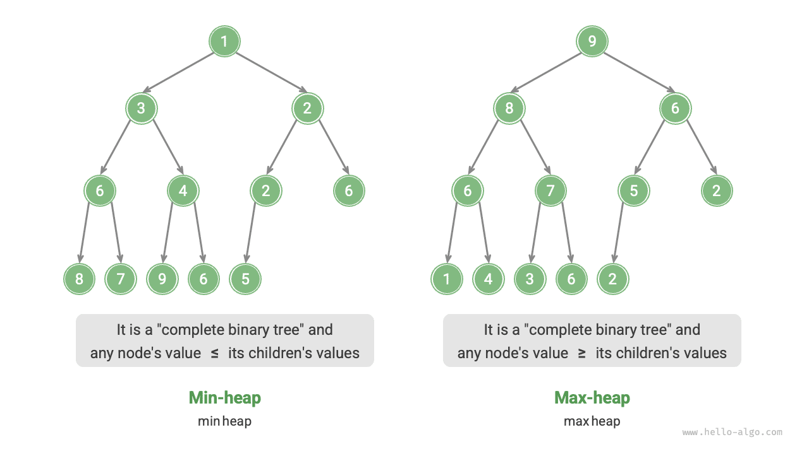
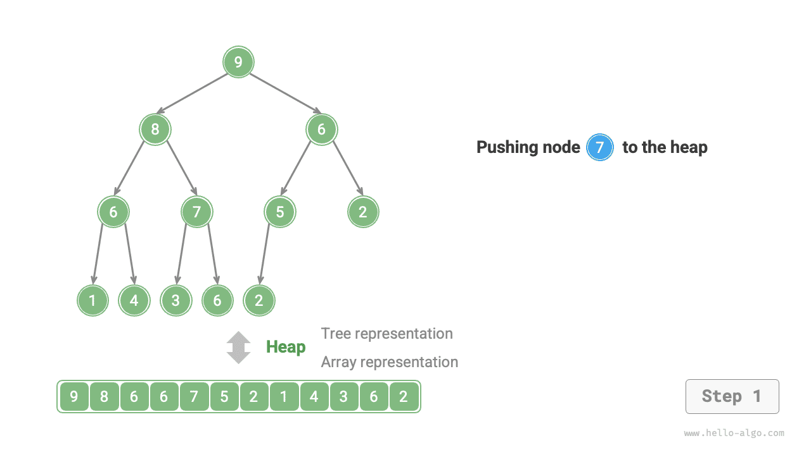
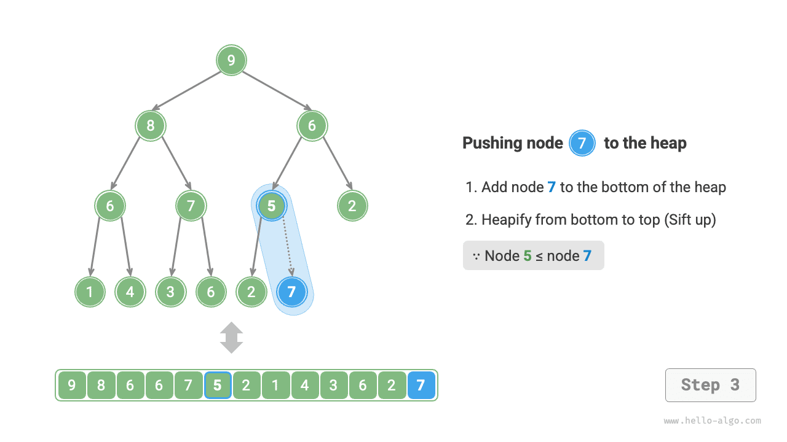
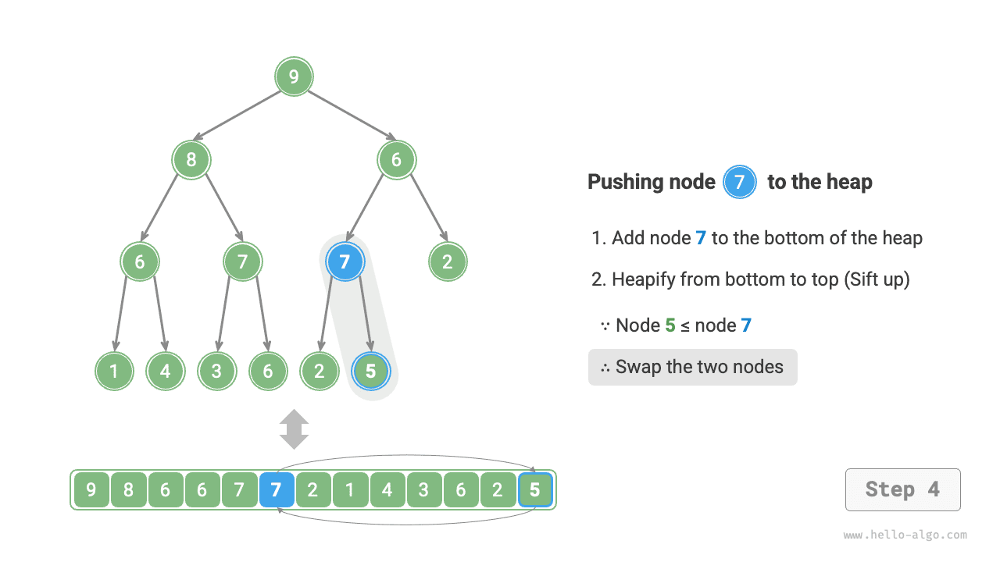
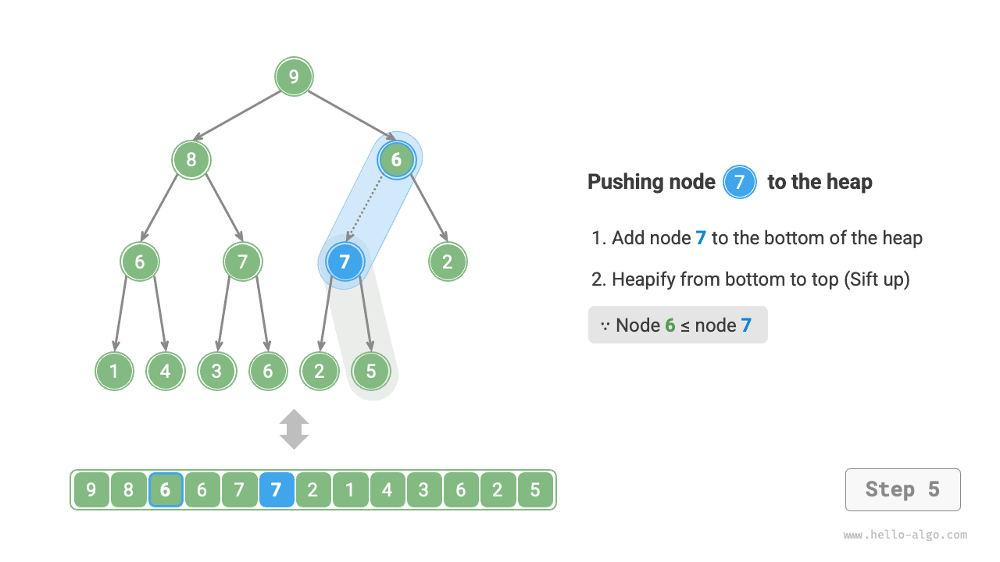
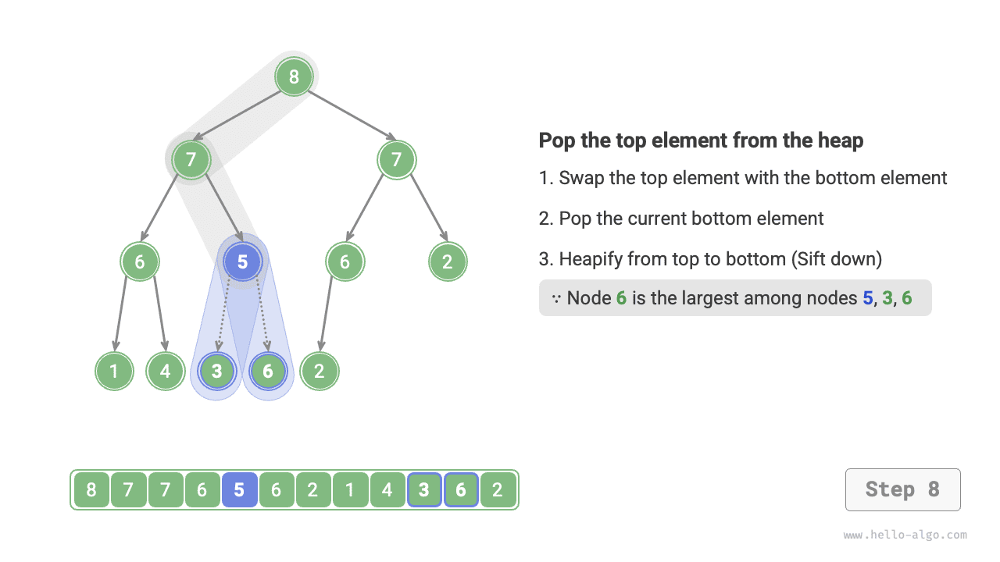
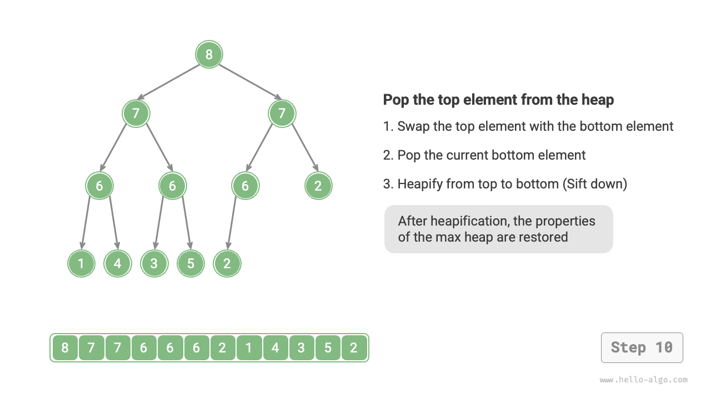

# Đống

<u>Đống (heap)</u> là một cây nhị phân hoàn chỉnh thoả mãn các điều kiện đặc thù, chủ yếu được chia thành hai loại như minh hoạ trong hình dưới đây:

- <u>Đống cực tiểu (min heap)</u>: Giá trị của một nút bất kỳ $\leq$ giá trị các nút con của nó.
- <u>Đống cực đại (max heap)</u>: Giá trị của một nút bất kỳ $\geq$ giá trị các nút con của nó.



Là một trường hợp đặc biệt của cây nhị phân hoàn chỉnh, đống sở hữu các đặc tính sau:

- Các nút ở tầng đáy cùng được lấp đầy từ trái sang phải, các tầng khác đều được lấp đầy hoàn toàn.
- Chúng ta gọi nút gốc của cây nhị phân là "đỉnh đống" (heap top), và gọi nút ở góc dưới cùng bên phải là "đáy đống" (heap bottom).
- Đối với đống cực đại (đống cực tiểu), giá trị của phần tử đỉnh đống (nút gốc) luôn là lớn nhất (nhỏ nhất).

## Các thao tác thường dùng trên đống

Cần chỉ ra rằng, nhiều ngôn ngữ lập trình cung cấp <u>hàng đợi ưu tiên (priority queue)</u>, đây là một cấu trúc dữ liệu trừu tượng được định nghĩa là hàng đợi có sắp xếp theo mức độ ưu tiên.

Trên thực tế, **đống thường được sử dụng để hiện thực hàng đợi ưu tiên, đống cực đại tương đương với hàng đợi ưu tiên mà các phần tử được lấy ra theo thứ tự từ lớn đến nhỏ**. Xét từ góc độ sử dụng, chúng ta có thể coi "hàng đợi ưu tiên" và "đống" là hai cấu trúc dữ liệu tương đương nhau. Do đó, cuốn sách này không phân biệt quá rạch ròi giữa hai khái niệm mà gọi chung là "đống".

Các thao tác thường dùng trên đống được liệt kê trong bảng dưới đây, tên phương thức cụ thể phụ thuộc vào ngôn ngữ lập trình sử dụng.

<p align="center"> Bảng <id> &nbsp; Hiệu năng thao tác của đống </p>

| Tên phương thức | Mô tả | Độ phức tạp thời gian |
| ----------- | ------------------------------------------------ | ----------- |
| `push()`    | Thêm phần tử vào đống | $O(\log n)$ |
| `pop()`     | Lấy phần tử đỉnh đống ra khỏi đống | $O(\log n)$ |
| `peek()`    | Truy cập phần tử đỉnh đống (lớn nhất / nhỏ nhất đối với đống cực đại / cực tiểu) | $O(1)$ |
| `size()`    | Lấy số lượng phần tử trong đống | $O(1)$ |
| `isEmpty()` | Kiểm tra đống có rỗng không | $O(1)$ |

Trong ứng dụng thực tế, chúng ta có thể sử dụng trực tiếp các lớp đống (hoặc lớp hàng đợi ưu tiên) do ngôn ngữ lập trình cung cấp sẵn.

Tương tự như việc sắp xếp "từ nhỏ đến lớn" và "từ lớn đến nhỏ" trong các thuật toán sắp xếp, chúng ta có thể chuyển đổi qua lại giữa "đống cực tiểu" và "đống cực đại" bằng cách thiết lập một biến cờ `flag` hoặc tuỳ biến bộ so sánh `Comparator`. Mã nguồn như sau:

=== "Python"

    ```python title="heap.py"
    # Khởi tạo đống cực tiểu
    min_heap, flag = [], 1
    # Khởi tạo đống cực đại
    max_heap, flag = [], -1

    # Module heapq của Python mặc định hiện thực đống cực tiểu
    # Cân nhắc "lấy giá trị đối (đổi dấu)" của phần tử trước khi đẩy vào đống để đảo ngược quan hệ độ lớn, từ đó hiện thực đống cực đại
    # Trong ví dụ này, flag = 1 tương ứng với đống cực tiểu, flag = -1 tương ứng với đống cực đại

    # Thêm phần tử vào đống
    heapq.heappush(max_heap, flag * 1)
    heapq.heappush(max_heap, flag * 3)
    heapq.heappush(max_heap, flag * 2)
    heapq.heappush(max_heap, flag * 5)
    heapq.heappush(max_heap, flag * 4)

    # Lấy phần tử đỉnh đống
    peek: int = flag * max_heap[0] # 5

    # Lấy phần tử đỉnh đống ra khỏi đống
    # Các phần tử lấy ra sẽ tạo thành một dãy số từ lớn đến nhỏ
    val = flag * heapq.heappop(max_heap) # 5
    val = flag * heapq.heappop(max_heap) # 4
    val = flag * heapq.heappop(max_heap) # 3
    val = flag * heapq.heappop(max_heap) # 2
    val = flag * heapq.heappop(max_heap) # 1

    # Lấy kích thước đống
    size: int = len(max_heap)

    # Kiểm tra đống có rỗng không
    is_empty: bool = not max_heap

    # Nhập danh sách và thiết lập đống (vun đống)
    min_heap = [1, 3, 2, 5, 4]
    heapq.heapify(min_heap)
    ```

=== "C++"

    ```cpp title="heap.cpp"
    /* Khởi tạo đống cực tiểu */
    priority_queue<int, vector<int>, greater<int>> minHeap;
    /* Khởi tạo đống cực đại */
    priority_queue<int, vector<int>, less<int>> maxHeap;

    /* Thêm phần tử vào đống */
    maxHeap.push(1);
    maxHeap.push(3);
    maxHeap.push(2);
    maxHeap.push(5);
    maxHeap.push(4);

    /* Lấy phần tử đỉnh đống */
    int peek = maxHeap.top(); // 5

    /* Lấy phần tử đỉnh đống ra khỏi đống */
    // Các phần tử lấy ra sẽ tạo thành một dãy số từ lớn đến nhỏ
    maxHeap.pop(); // 5
    maxHeap.pop(); // 4
    maxHeap.pop(); // 3
    maxHeap.pop(); // 2
    maxHeap.pop(); // 1

    /* Lấy kích thước đống */
    int size = maxHeap.size();

    /* Kiểm tra đống có rỗng không */
    bool isEmpty = maxHeap.empty();

    /* Nhập danh sách và thiết lập đống (vun đống) */
    vector<int> input{1, 3, 2, 5, 4};
    priority_queue<int, vector<int>, greater<int>> minHeapInputs{input.begin(), input.end()};
    ```

=== "Java"

    ```java title="heap.java"
    /* Khởi tạo đống cực tiểu */
    Queue<Integer> minHeap = new PriorityQueue<>();
    /* Khởi tạo đống cực đại (sử dụng biểu thức lambda để đảo ngược quy tắc so sánh của Comparator) */
    Queue<Integer> maxHeap = new PriorityQueue<>((a, b) -> b - a);

    /* Thêm phần tử vào đống */
    maxHeap.offer(1);
    maxHeap.offer(3);
    maxHeap.offer(2);
    maxHeap.offer(5);
    maxHeap.offer(4);

    /* Lấy phần tử đỉnh đống */
    int peek = maxHeap.peek(); // 5

    /* Lấy phần tử đỉnh đống ra khỏi đống */
    // Các phần tử lấy ra sẽ tạo thành một dãy số từ lớn đến nhỏ
    peek = maxHeap.poll(); // 5
    peek = maxHeap.poll(); // 4
    peek = maxHeap.poll(); // 3
    peek = maxHeap.poll(); // 2
    peek = maxHeap.poll(); // 1

    /* Lấy kích thước đống */
    int size = maxHeap.size();

    /* Kiểm tra đống có rỗng không */
    boolean isEmpty = maxHeap.isEmpty();

    /* Nhập danh sách và thiết lập đống (vun đống) */
    minHeap = new PriorityQueue<>(Arrays.asList(1, 3, 2, 5, 4));
    ```

=== "C#"

    ```csharp title="heap.cs"
    /* Khởi tạo đống cực tiểu */
    PriorityQueue<int, int> minHeap = new();
    /* Khởi tạo đống cực đại (sử dụng bộ so sánh tuỳ biến) */
    PriorityQueue<int, int> maxHeap = new(Comparer<int>.Create((x, y) => y - x));

    /* Thêm phần tử vào đống */
    // Phần tử thứ hai của hàm Enqueue là độ ưu tiên, ở đây dùng chính giá trị phần tử làm độ ưu tiên
    maxHeap.Enqueue(1, 1);
    maxHeap.Enqueue(3, 3);
    maxHeap.Enqueue(2, 2);
    maxHeap.Enqueue(5, 5);
    maxHeap.Enqueue(4, 4);

    /* Lấy phần tử đỉnh đống */
    int peek = maxHeap.Peek(); // 5

    /* Lấy phần tử đỉnh đống ra khỏi đống */
    // Các phần tử lấy ra sẽ tạo thành một dãy số từ lớn đến nhỏ
    peek = maxHeap.Dequeue(); // 5
    peek = maxHeap.Dequeue(); // 4
    peek = maxHeap.Dequeue(); // 3
    peek = maxHeap.Dequeue(); // 2
    peek = maxHeap.Dequeue(); // 1

    /* Lấy kích thước đống */
    int size = maxHeap.Count;

    /* Kiểm tra đống có rỗng không */
    bool isEmpty = maxHeap.Count == 0;

    /* Nhập danh sách và thiết lập đống (vun đống) */
    int[] input = [1, 3, 2, 5, 4];
    minHeap = new(input.Select(x => (x, x)));
    ```

=== "Go"

    ```go title="heap_test.go"
    // Trong Go, cấu trúc đống có thể được hiện thực thông qua interface heap trong package container/heap
    // Bạn đọc quan tâm có thể xem mã nguồn hiện thực liên quan
    ```

=== "Swift"

    ```swift title="heap.swift"
    // Swift không có cấu trúc Heap tích hợp sẵn
    ```

=== "JS"

    ```javascript title="heap.js"
    // JavaScript không có cấu trúc Heap tích hợp sẵn
    ```

=== "TS"

    ```typescript title="heap.ts"
    // TypeScript không có cấu trúc Heap tích hợp sẵn
    ```

=== "Dart"

    ```dart title="heap.dart"
    // Khởi tạo đống cực tiểu
    // Dart cần import package:collection/collection.dart để sử dụng HeapPriorityQueue
    HeapPriorityQueue<int> minHeap = HeapPriorityQueue<int>();
    // Khởi tạo đống cực đại
    HeapPriorityQueue<int> maxHeap = HeapPriorityQueue<int>((a, b) => b.compareTo(a));

    /* Thêm phần tử vào đống */
    maxHeap.add(1);
    maxHeap.add(3);
    maxHeap.add(2);
    maxHeap.add(5);
    maxHeap.add(4);

    /* Lấy phần tử đỉnh đống */
    int peek = maxHeap.first; // 5

    /* Lấy phần tử đỉnh đống ra khỏi đống */
    // Các phần tử lấy ra sẽ tạo thành một dãy số từ lớn đến nhỏ
    peek = maxHeap.removeFirst(); // 5
    peek = maxHeap.removeFirst(); // 4
    peek = maxHeap.removeFirst(); // 3
    peek = maxHeap.removeFirst(); // 2
    peek = maxHeap.removeFirst(); // 1

    /* Lấy kích thước đống */
    int size = maxHeap.length;

    /* Kiểm tra đống có rỗng không */
    bool isEmpty = maxHeap.isEmpty;

    /* Nhập danh sách và thiết lập đống (vun đống) */
    minHeap = HeapPriorityQueue<int>()..addAll([1, 3, 2, 5, 4]);
    ```

=== "Rust"

    ```rust title="heap.rs"
    use std::cmp::Reverse;
    use std::collections::BinaryHeap;

    /* Khởi tạo đống cực đại */
    let mut max_heap = BinaryHeap::new();
    /* Khởi tạo đống cực tiểu (sử dụng Reverse để đảo ngược quy tắc so sánh) */
    let mut min_heap = BinaryHeap::new();

    /* Thêm phần tử vào đống */
    max_heap.push(1);
    max_heap.push(3);
    max_heap.push(2);
    max_heap.push(5);
    max_heap.push(4);

    /* Lấy phần tử đỉnh đống */
    let peek = max_heap.peek().unwrap(); // 5

    /* Lấy phần tử đỉnh đống ra khỏi đống */
    // Các phần tử lấy ra sẽ tạo thành một dãy số từ lớn đến nhỏ
    let val = max_heap.pop().unwrap(); // 5
    let val = max_heap.pop().unwrap(); // 4
    let val = max_heap.pop().unwrap(); // 3
    let val = max_heap.pop().unwrap(); // 2
    let val = max_heap.pop().unwrap(); // 1

    /* Lấy kích thước đống */
    let size = max_heap.len();

    /* Kiểm tra đống có rỗng không */
    let is_empty = max_heap.is_empty();

    /* Nhập danh sách và thiết lập đống (vun đống) */
    let min_heap: BinaryHeap<_> = [1, 3, 2, 5, 4].into_iter().map(Reverse).collect();
    ```

=== "C"

    ```c title="heap.c"
    // C chưa cung cấp cấu trúc đống tích hợp sẵn
    ```

=== "Kotlin"

    ```kotlin title="heap.kt"
    /* Khởi tạo đống cực tiểu */
    val minHeap = PriorityQueue<Int>()
    /* Khởi tạo đống cực đại */
    val maxHeap = PriorityQueue<Int> { a, b -> b - a }

    /* Thêm phần tử vào đống */
    maxHeap.offer(1)
    maxHeap.offer(3)
    maxHeap.offer(2)
    maxHeap.offer(5)
    maxHeap.offer(4)

    /* Lấy phần tử đỉnh đống */
    var peek = maxHeap.peek() // 5

    /* Lấy phần tử đỉnh đống ra khỏi đống */
    // Các phần tử lấy ra sẽ tạo thành một dãy số từ lớn đến nhỏ
    peek = maxHeap.poll() // 5
    peek = maxHeap.poll() // 4
    peek = maxHeap.poll() // 3
    peek = maxHeap.poll() // 2
    peek = maxHeap.poll() // 1

    /* Lấy kích thước đống */
    val size = maxHeap.size

    /* Kiểm tra đống có rỗng không */
    val isEmpty = maxHeap.isEmpty()

    /* Nhập danh sách và thiết lập đống (vun đống) */
    val minHeapInputs = PriorityQueue(listOf(1, 3, 2, 5, 4))
    ```

=== "Ruby"

    ```ruby title="heap.rb"
    # Ruby không có cấu trúc Heap tích hợp sẵn
    ```

=== "Zig"

    ```zig title="heap.zig"
    // Zig cung cấp cấu trúc đống thông qua std.PriorityQueue
    // Bạn đọc quan tâm có thể xem mã nguồn hiện thực liên quan
    ```

??? pythontutor "Trực quan hoá thực thi"

    https://pythontutor.com/render.html#code=import%20heapq%0A%0A%22%22%22Driver%20Code%22%22%22%0Aif%20__name__%20%3D%3D%20%22__main__%22%3A%0A%20%20%20%20#%20%E5%88%9D%E5%A7%8B%E5%8C%96%E5%B0%8F%E9%A1%B6%E5%A0%86%0A%20%20%20%20min_heap,%20flag%20%3D%20%5B%5D,%201%0A%20%20%20%20#%20%E5%88%9D%E5%A7%8B%E5%8C%96%E5%A4%A7%E9%A1%B6%E5%A0%86%0A%20%20%20%20max_heap,%20flag%20%3D%20%5B%5D,%20-1%0A%20%20%20%20%0A%20%20%20%20#%20Python%20%E7%9A%84%20heapq%20%E6%A8%A1%E5%9D%97%E9%BB%98%E8%AE%A4%E5%AE%9E%E7%8E%B0%E5%B0%8F%E9%A1%B6%E5%A0%86%0A%20%20%20%20#%20%E8%80%83%E8%99%91%E5%B0%86%E2%80%9C%E5%85%83%E7%B4%A0%E5%8F%96%E8%B4%9F%E2%80%9D%E5%90%8E%E5%86%8D%E5%85%A5%E5%A0%86%EF%BC%8C%E8%BF%99%E6%A0%B7%E5%B0%B1%E5%8F%AF%E4%BB%A5%E5%B0%86%E5%A4%A7%E5%B0%8F%E5%85%B3%E7%B3%BB%E9%A2%A0%E5%80%92%EF%BC%8C%E4%BB%8E%E8%80%8C%E5%AE%9E%E7%8E%B0%E5%A4%A7%E9%A1%B6%E5%A0%86%0A%20%20%20%20#%20%E5%9C%A8%E6%9C%AC%E7%A4%BA%E4%BE%8B%E4%B8%AD%EF%BC%8Cflag%20%3D%201%20%E6%97%B6%E5%AF%B9%E5%BA%94%E5%B0%8F%E9%A1%B6%E5%A0%86%EF%BC%8Cflag%20%3D%20-1%20%E6%97%B6%E5%AF%B9%E5%BA%94%E5%A4%A7%E9%A1%B6%E5%A0%86%0A%20%20%20%20%0A%20%20%20%20#%20%E5%85%83%E7%B4%A0%E5%85%A5%E5%A0%86%0A%20%20%20%20heapq.heappush%28max_heap,%20flag%20*%201%29%0A%20%20%20%20heapq.heappush%28max_heap,%20flag%20*%203%29%0A%20%20%20%20heapq.heappush%28max_heap,%20flag%20*%202%29%0A%20%20%20%20heapq.heappush%28max_heap,%20flag%20*%205%29%0A%20%20%20%20heapq.heappush%28max_heap,%20flag%20*%204%29%0A%20%20%20%20%0A%20%20%20%20#%20%E8%8E%B7%E5%8F%96%E5%A0%86%E9%A1%B6%E5%85%83%E7%B4%A0%0A%20%20%20%20peek%20%3D%20flag%20*%20max_heap%5B0%5D%20#%205%0A%20%20%20%20%0A%20%20%20%20#%20%E5%A0%86%E9%A1%B6%E5%85%83%E7%B4%A0%E5%87%BA%E5%A0%86%0A%20%20%20%20#%20%E5%87%BA%E5%A0%86%E5%85%83%E7%B4%A0%E4%BC%9A%E5%BD%A2%E6%88%90%E4%B8%80%E4%B8%AA%E4%BB%8E%E5%A4%A7%E5%88%B0%E5%B0%8F%E7%9A%84%E5%BA%8F%E5%88%97%0A%20%20%20%20val%20%3D%20flag%20*%20heapq.heappop%28max_heap%29%20#%205%0A%20%20%20%20val%20%3D%20flag%20*%20heapq.heappop%28max_heap%29%20#%204%0A%20%20%20%20val%20%3D%20flag%20*%20heapq.heappop%28max_heap%29%20#%203%0A%20%20%20%20val%20%3D%20flag%20*%20heapq.heappop%28max_heap%29%20#%202%0A%20%20%20%20val%20%3D%20flag%20*%20heapq.heappop%28max_heap%29%20#%201%0A%20%20%20%20%0A%20%20%20%20#%20%E8%8E%B7%E5%8F%96%E5%A0%86%E5%A4%A7%E5%B0%8F%0A%20%20%20%20size%20%3D%20len%28max_heap%29%0A%20%20%20%20%0A%20%20%20%20#%20%E5%88%A4%E6%96%AD%E5%A0%86%E6%98%AF%E5%90%A6%E4%B8%BA%E7%A9%BA%0A%20%20%20%20is_empty%20%3D%20not%20max_heap%0A%20%20%20%20%0A%20%20%20%20#%20%E8%BE%93%E5%85%A5%E5%88%97%E8%A1%A8%E5%B9%B6%E5%BB%BA%E5%A0%86%0A%20%20%20%20min_heap%20%3D%20%5B1,%203,%202,%205,%204%5D%0A%20%20%20%20heapq.heapify%28min_heap%29&cumulative=false&curInstr=3&heapPrimitives=nevernest&mode=display&origin=opt-frontend.js&py=311&rawInputLstJSON=%5B%5D&textReferences=false

## Hiện thực đống

Dưới đây hiện thực đống cực đại. Nếu muốn chuyển thành đống cực tiểu, chỉ cần đảo ngược toàn bộ các phép so sánh quan hệ độ lớn (ví dụ thay thế $\geq$ bằng $\leq$ ). Bạn đọc quan tâm có thể tự mình hiện thực.

### Biểu diễn và lưu trữ đống

Trong phần "Cây nhị phân" đã nói, cây nhị phân hoàn chỉnh rất thích hợp để biểu diễn bằng mảng. Do bản thân đống chính là một cây nhị phân hoàn chỉnh, **vì vậy chúng ta sẽ áp dụng mảng để lưu trữ đống**.

Khi dùng mảng biểu diễn cây nhị phân, các phần tử đại diện cho giá trị nút, còn chỉ số đại diện cho vị trí của nút trong cây nhị phân. **Các con trỏ nút được hiện thực thông qua công thức ánh xạ chỉ số**.

Như minh hoạ trong hình dưới đây, cho chỉ số $i$, chỉ số nút con trái của nó là $2i + 1$, chỉ số nút con phải là $2i + 2$, và chỉ số nút cha là $(i - 1) / 2$ (chia lấy phần nguyên làm tròn xuống). Khi chỉ số vượt quá giới hạn mảng, biểu thị nút đó là nút rỗng hoặc không tồn tại.


Chúng ta có thể đóng gói các công thức ánh xạ chỉ số thành các hàm để thuận tiện sử dụng về sau:

```src
[file]{my_heap}-[class]{max_heap}-[func]{parent}
```

### Truy cập phần tử đỉnh đống

Phần tử đỉnh đống chính là nút gốc của cây nhị phân, tức là phần tử đầu tiên của danh sách:

```src
[file]{my_heap}-[class]{max_heap}-[func]{peek}
```

### Thêm phần tử vào đống

Cho phần tử `val`, đầu tiên chúng ta thêm nó vào đáy đống. Sau khi thêm vào, do `val` có thể lớn hơn các phần tử khác trong đống, điều kiện thiết lập của đống có thể đã bị phá vỡ, **do đó cần phải khôi phục lại tính chất đống trên đường đi từ nút vừa chèn lên đến nút gốc**, thao tác này được gọi là <u>vun đống (heapify)</u>.

Cân nhắc bắt đầu từ nút vừa được đưa vào đống, **thực hiện vun đống từ đáy lên đỉnh (vun lên / sift up)**. Như minh hoạ trong hình dưới đây, chúng ta so sánh giá trị của nút vừa chèn với nút cha của nó, nếu nút vừa chèn lớn hơn thì hoán đổi vị trí của chúng. Sau đó tiếp tục lặp lại thao tác này, lần lượt sửa chữa các nút trong đống từ đáy lên đỉnh, cho đến khi vượt qua nút gốc hoặc gặp một nút không cần phải hoán đổi nữa thì dừng lại.

=== "<1>"
    

=== "<2>"
    

=== "<3>"
    

=== "<4>"
    

=== "<5>"
    

=== "<6>"
    

=== "<7>"
    

=== "<8>"
    

=== "<9>"
    

Đặt tổng số nút là $n$, khi đó chiều cao của cây là $O(\log n)$. Từ đó suy ra số vòng lặp tối đa của thao tác vun đống là $O(\log n)$, **độ phức tạp thời gian của thao tác thêm phần tử vào đống là $O(\log n)$**. Mã nguồn như sau:

```src
[file]{my_heap}-[class]{max_heap}-[func]{sift_up}
```

### Lấy phần tử đỉnh đống ra khỏi đống

Phần tử đỉnh đống là nút gốc của cây nhị phân, tức là phần tử đầu tiên của danh sách. Nếu chúng ta trực tiếp xoá phần tử đầu tiên khỏi danh sách, thì chỉ số của toàn bộ các nút trong cây nhị phân sẽ bị thay đổi, điều này khiến cho việc dùng thao tác vun đống để sửa chữa sau đó trở nên rất khó khăn. Để giảm thiểu tối đa sự biến động về chỉ số của các phần tử, chúng ta áp dụng các bước thao tác sau:

1. Hoán đổi phần tử đỉnh đống với phần tử đáy đống (hoán đổi nút gốc với nút lá xa nhất bên phải).
2. Sau khi hoán đổi xong, xoá phần tử đáy đống khỏi danh sách (lưu ý rằng do đã hoán đổi, phần tử bị xoá thực chất chính là phần tử đỉnh đống ban đầu).
3. Bắt đầu từ nút gốc, **thực hiện vun đống từ đỉnh xuống đáy (vun xuống / sift down)**.

Như minh hoạ trong hình dưới đây, **hướng thao tác của "vun đống từ đỉnh xuống đáy" ngược lại với "vun đống từ đáy lên đỉnh"**, chúng ta so sánh giá trị của nút gốc với giá trị của hai nút con của nó, rồi hoán đổi nút gốc với nút con có giá trị lớn nhất. Sau đó lặp lại thao tác này cho đến khi vượt qua nút lá hoặc gặp nút không cần phải hoán đổi nữa thì dừng lại.

=== "<1>"
    

=== "<2>"
    

=== "<3>"
    

=== "<4>"
    

=== "<5>"
    

=== "<6>"
    

=== "<7>"
    

=== "<8>"
    

=== "<9>"
    

=== "<10>"
    

Tương tự như thao tác thêm phần tử vào đống, thao tác lấy phần tử đỉnh đống ra khỏi đống cũng có độ phức tạp thời gian là $O(\log n)$. Mã nguồn như sau:

```src
[file]{my_heap}-[class]{max_heap}-[func]{sift_down}
```

## Các ứng dụng phổ biến của đống

- **Hàng đợi ưu tiên**: Đống thường là cấu trúc dữ liệu được lựa chọn hàng đầu để hiện thực hàng đợi ưu tiên, các thao tác thêm vào hàng đợi và lấy ra khỏi hàng đợi đều có độ phức tạp thời gian là $O(\log n)$, trong khi thao tác thiết lập đống (vun đống) mất thời gian $O(n)$, tất cả các thao tác này đều rất hiệu quả.
- **Sắp xếp vun đống (Heap sort)**: Cho một tập dữ liệu, chúng ta có thể dùng chúng để xây dựng một đống, sau đó liên tục lấy các phần tử đỉnh đống ra, từ đó thu được dãy dữ liệu đã sắp xếp. Tuy nhiên, chúng ta thường sử dụng một cách thức tao nhã hơn để hiện thực sắp xếp vun đống, chi tiết xem tại chương "Sắp xếp vun đống".
- **Tìm kiếm $k$ phần tử lớn nhất (Top-$k$)**: Đây là một bài toán thuật toán kinh điển đồng thời cũng là một ứng dụng tiêu biểu, ví dụ như chọn 10 tin tức có độ nóng cao nhất làm tin nóng thịnh hành (Trending Topics), chọn 10 mặt hàng có doanh số cao nhất, v.v.
