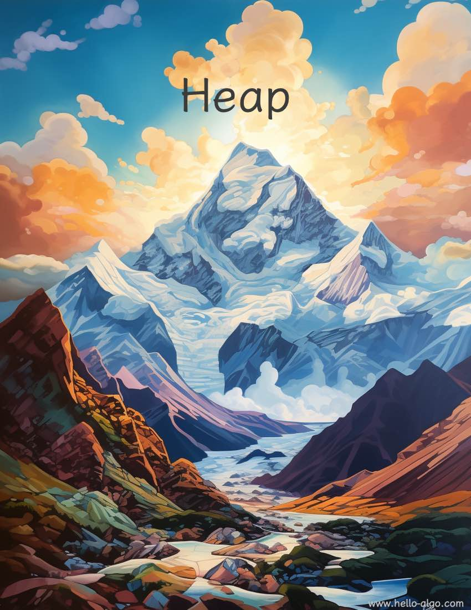

# Đống

!!! abstract

    Đống tựa như những đỉnh núi non trùng điệp, tầng tầng lớp lớp, muôn hình vạn trạng.

    Mỗi ngọn núi nhấp nhô cao thấp khác nhau, nhưng đỉnh núi cao nhất luôn là nơi đầu tiên thu hút ánh nhìn.
