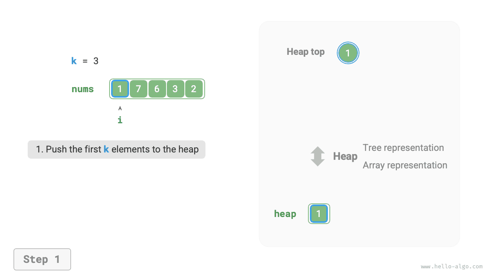
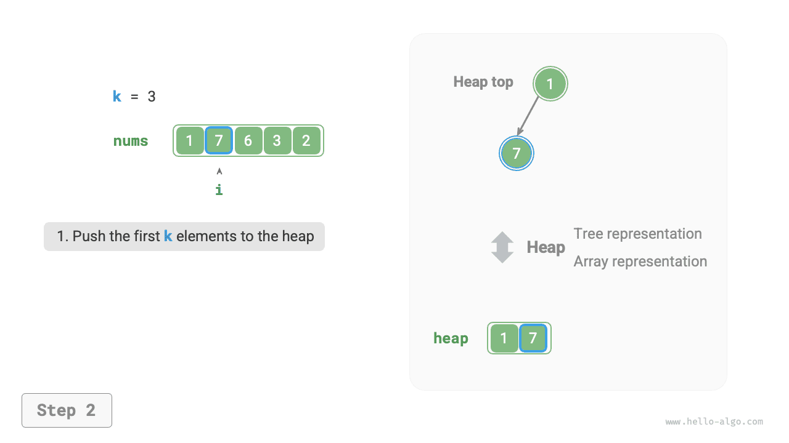
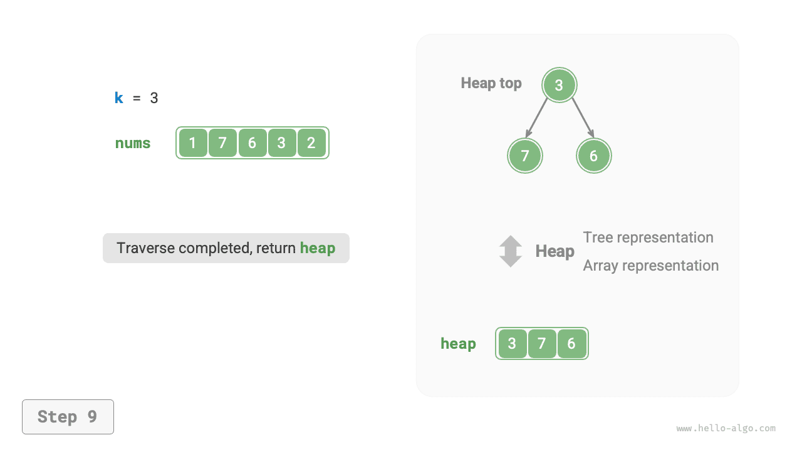

# Bài toán Top-k

!!! question

    Cho một mảng chưa sắp xếp `nums` có độ dài $n$ ，hãy trả về $k$ phần tử lớn nhất trong mảng.

Đối với bài toán này, trước tiên chúng ta sẽ giới thiệu hai cách tiếp cận trực tiếp, sau đó giới thiệu phương pháp sử dụng đống với hiệu năng cao hơn.

## Phương pháp 1: Duyệt và chọn lọc

Chúng ta có thể thực hiện $k$ vòng lặp như minh hoạ trong hình dưới đây, lần lượt trích xuất phần tử lớn thứ $1$, thứ $2$, $\dots$, thứ $k$ trong mỗi vòng, độ phức tạp thời gian là $O(nk)$ 。

Phương pháp này chỉ phù hợp với tình huống $k \ll n$ ，bởi vì khi $k$ tiệm cận với $n$ ，độ phức tạp thời gian của nó sẽ tiến tới $O(n^2)$ ，rất tốn thời gian.


!!! tip

    Khi $k = n$ ，chúng ta sẽ thu được một dãy hoàn chỉnh đã sắp xếp, lúc này tương đương với thuật toán "Sắp xếp chọn" (Selection sort).

## Phương pháp 2: Sắp xếp

Như minh hoạ trong hình dưới đây, chúng ta có thể sắp xếp mảng `nums` trước, sau đó trả về $k$ phần tử ở tận cùng bên phải, độ phức tạp thời gian là $O(n \log n)$ 。

Rõ ràng, phương pháp này đã làm "dư thừa" nhiệm vụ, bởi vì chúng ta chỉ cần tìm ra $k$ phần tử lớn nhất chứ không cần sắp xếp toàn bộ các phần tử còn lại.


## Phương pháp 3: Đống

Chúng ta có thể dựa vào đống để giải quyết bài toán Top-k hiệu quả hơn, quy trình như minh hoạ trong hình dưới đây:

1. Khởi tạo một đống cực tiểu, phần tử đỉnh đống có giá trị nhỏ nhất.
2. Lần lượt đưa $k$ phần tử đầu tiên của mảng vào đống.
3. Bắt đầu từ phần tử thứ $k + 1$ ，nếu phần tử hiện tại lớn hơn phần tử đỉnh đống, thì lấy phần tử đỉnh đống ra khỏi đống và đưa phần tử hiện tại vào đống.
4. Sau khi duyệt xong toàn bộ mảng, $k$ phần tử lưu giữ trong đống chính là $k$ phần tử lớn nhất cần tìm.

=== "<1>"
    

=== "<2>"
    

=== "<3>"
    

=== "<4>"
    

=== "<5>"
    

=== "<6>"
    

=== "<7>"
    

=== "<8>"
    

=== "<9>"
    

Mã nguồn ví dụ như sau:

```src
[file]{top_k}-[class]{}-[func]{top_k_heap}
```

Tổng cộng thực hiện $n$ vòng thêm và lấy phần tử khỏi đống, độ dài tối đa của đống là $k$ ，do đó độ phức tạp thời gian là $O(n \log k)$ 。Phương pháp này có hiệu năng rất cao: khi $k$ nhỏ, độ phức tạp thời gian tiệm cận $O(n)$ ；khi $k$ lớn, độ phức tạp thời gian cũng không vượt quá $O(n \log n)$ 。

Ngoài ra, phương pháp này rất phù hợp với tình huống luồng dữ liệu động (data stream). Khi dữ liệu liên tục được đưa vào, chúng ta có thể tiếp tục duy trì các phần tử trong đống, từ đó cập nhật động $k$ phần tử lớn nhất theo thời gian thực.
