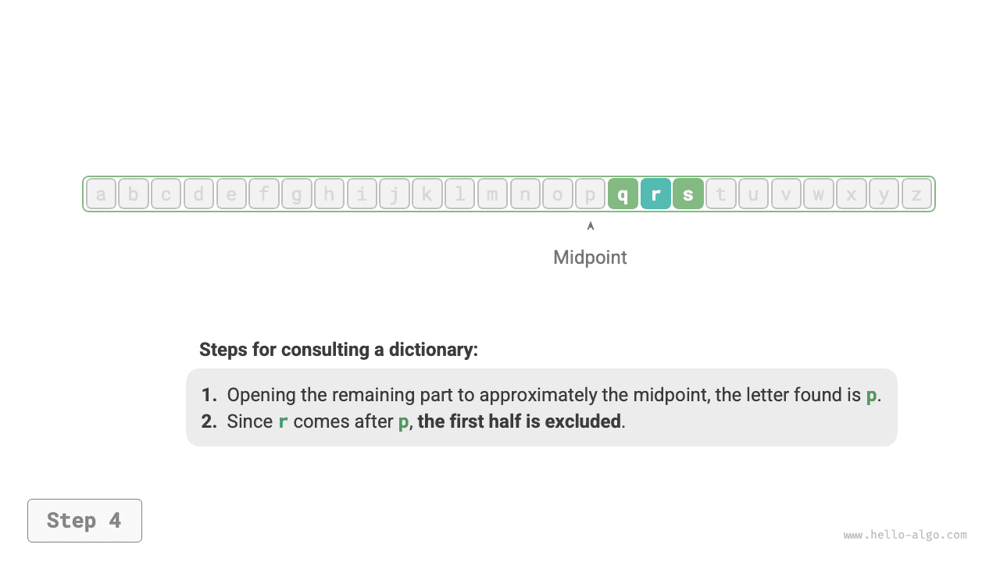

# Thuật toán ở khắp mọi nơi

Khi nghe thấy từ “thuật toán”, chúng ta thường nghĩ ngay đến toán học một cách rất tự nhiên. Tuy nhiên trên thực tế, nhiều thuật toán không đòi hỏi toán học phức tạp mà phụ thuộc nhiều hơn vào các suy luận logic cơ bản — những logic hiện diện ở khắp mọi nơi trong đời sống hàng ngày của chúng ta.

Trước khi chính thức đi sâu vào tìm hiểu thuật toán, có một sự thật thú vị đáng để chia sẻ: **bạn đã học được rất nhiều thuật toán trong vô thức và đã quen với việc áp dụng chúng vào đời sống thường ngày**. Dưới đây tôi sẽ đưa ra một vài ví dụ cụ thể để chứng minh điều này.

**Ví dụ 1: Tra từ điển**. Trong một cuốn từ điển, các từ ngữ được sắp xếp theo thứ tự bảng chữ cái. Giả sử chúng ta cần tìm một từ có chữ cái đầu là $r$, thông thường chúng ta sẽ thực hiện theo các bước như hình minh hoạ dưới đây.

1. Mở từ điển ở khoảng giữa cuốn sách, xem chữ cái đầu tiên ở trang đó là gì; giả sử chữ cái đầu là $m$.
2. Vì trong bảng chữ cái, $r$ đứng sau $m$, nên có thể loại trừ nửa đầu cuốn từ điển và thu hẹp phạm vi tìm kiếm sang nửa sau.
3. Liên tục lặp lại bước `1.` và bước `2.` cho đến khi tìm thấy trang có chữ cái đầu là $r$.

=== "<1>"
    

=== "<2>"
    

=== "<3>"
    

=== "<4>"
    

=== "<5>"
    

Kỹ năng tra từ điển quen thuộc của các bạn học sinh tiểu học thực chất chính là thuật toán “tìm kiếm nhị phân” trứ danh. Đứng từ góc độ cấu trúc dữ liệu, chúng ta có thể coi cuốn từ điển là một “mảng” đã được sắp xếp; còn đứng từ góc độ thuật toán, chuỗi thao tác tra từ điển ở trên chính là “tìm kiếm nhị phân”.

**Ví dụ 2: Xếp bài tây**. Khi chơi bài, ở mỗi ván chúng ta đều cần sắp xếp các lá bài trên tay theo thứ tự từ nhỏ đến lớn, quy trình thực hiện như trong hình dưới đây.

1. Chia các lá bài thành hai phần: “đã có thứ tự” và “chưa có thứ tự”, đồng thời giả định ở trạng thái ban đầu thì 1 lá bài ngoài cùng bên trái đã có thứ tự.
2. Rút một lá bài từ phần chưa có thứ tự và chèn vào đúng vị trí trong phần đã có thứ tự; sau khi hoàn thành, 2 lá bài ngoài cùng bên trái đã có thứ tự.
3. Liên tục lặp lại bước `2.`, mỗi vòng lại chèn một lá bài từ phần chưa có thứ tự vào phần đã có thứ tự, cho đến khi toàn bộ các lá bài đều có thứ tự.

Phương pháp sắp xếp bài ở trên về bản chất chính là thuật toán “sắp xếp chèn”, vốn hoạt động rất hiệu quả khi xử lý các tập dữ liệu nhỏ. Nhiều thư viện sắp xếp tích hợp sẵn trong các ngôn ngữ lập trình đều ứng dụng thuật toán sắp xếp chèn này.

**Ví dụ 3: Trả tiền thừa**. Giả sử chúng ta mua hàng hết $69$ đồng tại siêu thị và đưa cho thu ngân $100$ đồng, khi đó thu ngân cần trả lại cho chúng ta $31$ đồng tiền thừa. Người thu ngân sẽ tư duy một cách tự nhiên theo các bước như hình dưới đây.

1. Các lựa chọn khả thi là những mệnh giá nhỏ hơn $31$ đồng, bao gồm $1$ đồng, $5$ đồng, $10$ đồng, $20$ đồng.
2. Chọn mệnh giá lớn nhất trong các lựa chọn là $20$ đồng, số tiền còn lại là $31 - 20 = 11$ đồng.
3. Tiếp tục chọn mệnh giá lớn nhất trong các lựa chọn còn lại là $10$ đồng, số tiền còn lại là $11 - 10 = 1$ đồng.
4. Chọn mệnh giá lớn nhất trong các lựa chọn còn lại là $1$ đồng, số tiền còn lại là $1 - 1 = 0$ đồng.
5. Hoàn tất việc trả tiền thừa, phương án là $20 + 10 + 1 = 31$ đồng.

Trong các bước trên, ở mỗi bước chúng ta đều đưa ra lựa chọn có vẻ là tốt nhất ở thời điểm hiện tại (cố gắng dùng tiền có mệnh giá lớn nhất), và cuối cùng thu được một phương án trả tiền thừa khả thi. Đứng từ góc độ cấu trúc dữ liệu và giải thuật, phương pháp này về bản chất chính là thuật toán “tham lam”.

Từ việc nhỏ như nấu một món ăn đến việc lớn như du hành giữa các vì sao, hầu như việc giải quyết bất kỳ vấn đề nào cũng đều không thể tách rời thuật toán. Sự xuất hiện của máy tính cho phép chúng ta lưu trữ các cấu trúc dữ liệu trong bộ nhớ thông qua lập trình, đồng thời viết mã để điều khiển CPU và GPU thực thi các thuật toán. Nhờ đó, chúng ta có thể chuyển các bài toán trong đời sống vào máy tính để giải quyết các vấn đề phức tạp theo cách thức hiệu quả hơn nhiều.

!!! tip

    Nếu bạn vẫn còn cảm thấy mơ hồ về các khái niệm như cấu trúc dữ liệu, thuật toán, mảng và tìm kiếm nhị phân, xin hãy tiếp tục đọc tiếp; cuốn sách này sẽ dẫn dắt bạn bước vào toà lâu đài tri thức của cấu trúc dữ liệu và giải thuật.
