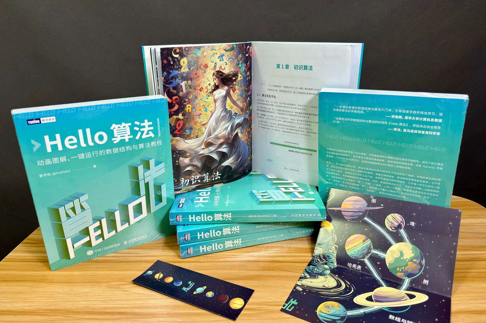
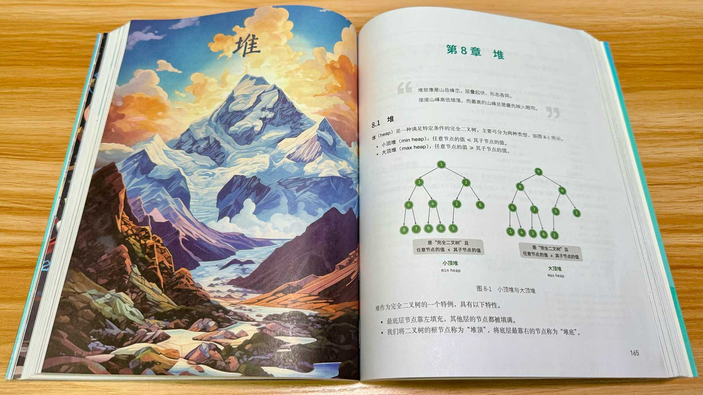
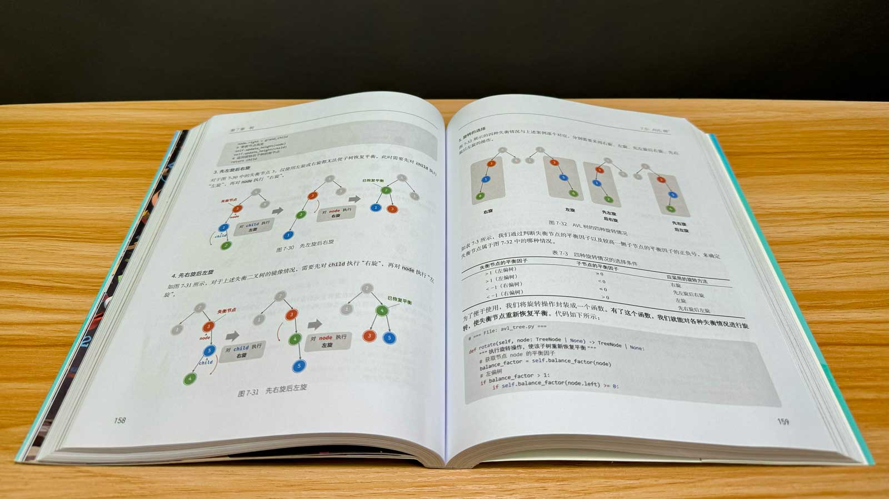
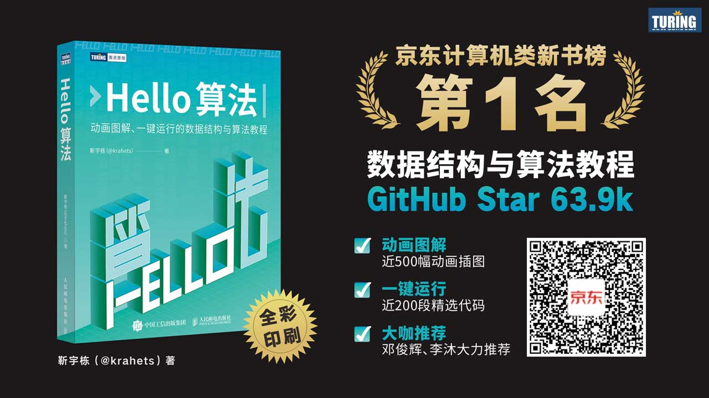

# Sách in

Sau thời gian dài trau chuốt và hoàn thiện, cuốn sách in "Hello Algo" cuối cùng đã chính thức ra mắt! Tâm trạng lúc này có thể diễn tả trọn vẹn qua câu thơ:

Đuổi gió đuổi trăng chớ dừng bước, qua hết cỏ hoang ngọn núi xuân đang chờ. <i>(Truy phong cảm nguyệt mạc đình lưu, bình vu tận xứ thị xuân sơn.)</i>

{ class="animation-figure" }

Video dưới đây giới thiệu về cuốn sách in, đồng thời chia sẻ một vài suy ngẫm của tác giả:

- Tầm quan trọng của việc học cấu trúc dữ liệu và giải thuật.
- Lý do lựa chọn Python làm ngôn ngữ trình bày trong sách in.
- Góc nhìn và cách thấu hiểu về việc chia sẻ tri thức.

> Tác giả mới làm video trên Bilibili, mong nhận được sự ủng hộ và tương tác từ các bạn! Cảm ơn các bạn rất nhiều!

    <iframe src="//player.bilibili.com/player.html?aid=1051597767&bvid=BV1QH4y157uC&cid=1462564112&p=1&autoplay=0" scrolling="no" border="0" frameborder="no" framespacing="0" allowfullscreen="true"> </iframe>

Dưới đây là một vài hình ảnh thực tế của cuốn sách in:

{ class="animation-figure" }

{ class="animation-figure" }

## Ưu điểm và một số điểm lưu ý

Tóm tắt những điểm ấn tượng mà cuốn sách in mang lại cho bạn đọc:

- In màu toàn bộ (Full color), phát huy tối đa và trọn vẹn ưu thế "hình minh hoạ sinh động" của cuốn sách.
- Chất liệu giấy được tuyển chọn kỹ lưỡng, vừa đảm bảo khả năng tái hiện màu sắc chân thực, vừa giữ được cảm giác cầm nắm đặc trưng của một cuốn sách in cao cấp.
- Định dạng bản in được chuẩn hoá chỉn chu hơn so với bản web, chẳng hạn các công thức toán trong hình vẽ đều được in nghiêng chuẩn mực.
- Tặng kèm sơ đồ tư duy (mindmap) gấp gọn và bookmark đánh dấu trang mà không làm tăng giá bìa.
- Nội dung sách in, bản web và bản PDF được đồng bộ hoá, giúp bạn đọc thoải mái chuyển đổi giữa các hình thức đọc.

!!! tip

    Do việc đồng bộ hoá giữa sách in và bản web có độ phức tạp khá cao nên có thể xuất hiện một số khác biệt nhỏ ở vài chi tiết, kính mong quý độc giả thông cảm!

Tất nhiên, sách in cũng có một số điểm bạn đọc nên cân nhắc trước khi quyết định sở hữu:

- Sách sử dụng ngôn ngữ Python, có thể không trùng khớp với ngôn ngữ lập trình chính của bạn (bạn có thể xem Python như mã giả để tập trung thấu hiểu tư tưởng thuật toán).
- In màu toàn bộ tuy nâng cao đáng kể trải nghiệm đọc hình vẽ và mã nguồn, nhưng chi phí in ấn sẽ cao hơn so với in đen trắng truyền thống.

!!! tip

    "Chất lượng in ấn" và "Giá thành" cũng giống như "Hiệu năng thời gian" và "Hiệu năng không gian" trong thuật toán, rất khó để vẹn toàn cả hai. Và theo quan điểm của tác giả, "chất lượng in ấn" tương ứng với "hiệu năng thời gian", xứng đáng được ưu tiên hàng đầu.

## Liên kết mua sách

Nếu bạn quan tâm tới cuốn sách in, bạn có thể cân nhắc sở hữu một cuốn. Chúng tôi đã nỗ lực mang lại ưu đãi giảm giá 50% cho sách mới, xin vui lòng truy cập [liên kết này](https://3.cn/1X-qmTD3) hoặc quét mã QR dưới đây:

{ class="animation-figure" }

## Lời kết

Ban đầu, tôi đã đánh giá thấp khối lượng công việc xuất bản một cuốn sách in, cứ ngỡ rằng chỉ cần duy trì tốt dự án mã nguồn mở là bản in có thể tự động sinh ra thông qua các công cụ tự động hoá. Thực tế chứng minh quy trình sản xuất sách in khác biệt rất lớn so với cơ chế cập nhật của dự án mã nguồn mở, việc chuyển đổi giữa hai hình thức này đòi hỏi lượng lớn công việc bổ trợ.

Khoảng cách từ bản thảo đầu tiên đến bản thảo hoàn chỉnh đạt chuẩn xuất bản là một chặng đường dài, đòi hỏi sự hợp tác chặt chẽ và dày công mài giũa giữa nhà xuất bản (từ khâu hoạch định, biên tập, thiết kế mỹ thuật, đến truyền thông tiếp thị...) và tác giả. Tại đây, tôi xin gửi lời cảm ơn chân thành đến biên tập viên Vương Quân Hoa (Wang Junhua) của Turing, cùng toàn thể đội ngũ Nhà xuất bản Bưu chính Viễn thông Nhân dân (Posts & Telecom Press) và Cộng đồng Turing đã đồng hành trong suốt quá trình xuất bản cuốn sách!

Hy vọng cuốn sách này sẽ mang lại nhiều giá trị hữu ích cho bạn trên con đường chinh phục thuật toán!
