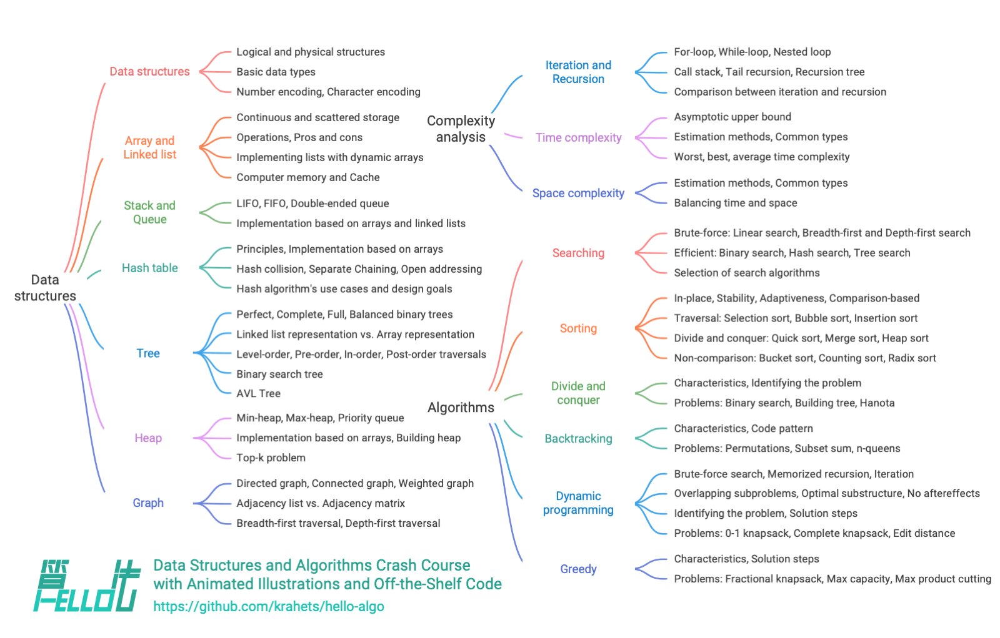

# Về cuốn sách này

Dự án này nhằm tạo ra một cuốn giáo trình nhập môn cấu trúc dữ liệu và giải thuật mã nguồn mở, miễn phí và thân thiện với người mới bắt đầu.

- Toàn bộ cuốn sách sử dụng hình động minh hoạ, nội dung rõ ràng dễ hiểu, đường cong học tập vừa phải, dẫn lối người mới bắt đầu khám phá bản đồ tri thức của cấu trúc dữ liệu và giải thuật.
- Mã nguồn có thể chạy chỉ với một cú nhấp chuột, giúp độc giả nâng cao kỹ năng lập trình trong quá trình thực hành, hiểu rõ nguyên lý hoạt động của thuật toán và cách thức hiện thực bên dưới của cấu trúc dữ liệu.
- Đề cao tinh thần học tập tương trợ lẫn nhau, hoan nghênh mọi người đặt câu hỏi và chia sẻ góc nhìn trong phần bình luận để cùng nhau tiến bộ qua trao đổi, thảo luận.

## Đối tượng độc giả

Nếu bạn là người mới bắt đầu, chưa từng tiếp xúc với thuật toán, hoặc đã có đôi chút kinh nghiệm luyện giải bài tập nhưng nhận thức về cấu trúc dữ liệu và giải thuật vẫn còn mơ hồ, lơ lửng giữa hiểu và chưa hiểu — thì cuốn sách này được thiết kế dành riêng cho bạn!

Nếu bạn đã tích luỹ được một lượng bài tập nhất định và quen thuộc với hầu hết các dạng bài, cuốn sách này sẽ giúp bạn ôn tập và hệ thống hoá lại mạng lưới kiến thức thuật toán; đồng thời mã nguồn trong kho lưu trữ có thể được dùng như một "kho công cụ luyện đề" hoặc "từ điển thuật toán".

Nếu bạn là một "cao thủ" thuật toán, chúng tôi rất mong nhận được những góp ý quý báu của bạn, hoặc [cùng tham gia sáng tác](https://www.hello-algo.com/chapter_appendix/contribution/).

!!! success "Điều kiện tiên quyết"

    Bạn cần có nền tảng lập trình căn bản ở ít nhất một ngôn ngữ, có thể đọc hiểu và viết được các đoạn mã đơn giản.

## Cấu trúc nội dung

Nội dung chính của cuốn sách được thể hiện như trong hình dưới đây.

- **Phân tích độ phức tạp**: Các chiều đánh giá và phương pháp đánh giá cấu trúc dữ liệu cùng thuật toán. Phương pháp suy diễn độ phức tạp thời gian và độ phức tạp không gian, các dạng thường gặp, ví dụ minh hoạ, v.v.
- **Cấu trúc dữ liệu**: Kiểu dữ liệu cơ bản và phương pháp phân loại cấu trúc dữ liệu. Định nghĩa, ưu nhược điểm, thao tác thông dụng, dạng biến thể phổ biến, ứng dụng điển hình, phương pháp hiện thực của các cấu trúc dữ liệu như mảng, danh sách liên kết, ngăn xếp, hàng đợi, bảng băm, cây, đống, đồ thị, v.v.
- **Thuật toán**: Định nghĩa, ưu nhược điểm, hiệu năng, ngữ cảnh ứng dụng, các bước giải bài và bài toán mẫu của các thuật toán như tìm kiếm, sắp xếp, chia để trị, quay lui, quy hoạch động, tham lam, v.v.

## Lời cảm ơn

Cuốn sách này liên tục được hoàn thiện nhờ vào nỗ lực chung của đông đảo cộng tác viên trong cộng đồng mã nguồn mở. Xin gửi lời cảm ơn đến từng tác giả đóng góp đã dành thời gian và tâm huyết, họ là (theo thứ tự được tạo tự động bởi GitHub): krahets, coderonion, Gonglja, nuomi1, Reanon, justin-tse, hpstory, danielsss, curtishd, night-cruise, S-N-O-R-L-A-X, rongyi, msk397, gvenusleo, khoaxuantu, rivertwilight, K3v123, gyt95, zhuoqinyue, yuelinxin, Zuoxun, mingXta, Phoenix0415, FangYuan33, GN-Yu, longsizhuo, pengchzn, QiLOL, Cathay-Chen, guowei-gong, xBLACKICEx, IsChristina, JoseHung, qualifier1024, hello-ikun, magentaqin, Guanngxu, thomasq0, sunshinesDL, L-Super, Transmigration-zhou, WSL0809, Slone123c, lhxsm, yuan0221, what-is-me, theNefelibatas, Shyam-Chen, sangxiaai, longranger2, codeberg-user, xiongsp, JeffersonHuang, prinpal, seven1240, Wonderdch, malone6, xiaomiusa87, gaofer, bluebean-cloud, a16su, SamJin98, hongyun-robot, nanlei, XiaChuerwu, yd-j, iron-irax, mgisr, steventimes, junminhong, heshuyue, danny900714, Nigh, Dr-XYZ, MolDuM, XC-Zero, reeswell, PXG-XPG, NI-SW, Horbin-Magician, Enlightenus, YangXuanyi, xjr7670, beatrix-chan, DullSword, qq909244296, iStig, boloboloda, hts0000, gledfish, fbigm, echo1937, jiaxianhua, wenjianmin, keshida, kilikilikid, lclc6, lwbaptx, linyejoe2, liuxjerry, szu17dmy, dshlstarr, Yucao-cy, coderlef, czruby, bongbongbakudan, beintentional, ZongYangL, ZhongYuuu, ZhongGuanbin, hezhizhen, linzeyan, ZJKung, JTCPOWI, KawaiiAsh, luluxia, xb534, ztkuaikuai, yw-1021, ElaBosak233, baagod, zhouLion, yishangzhang, yi427, yanedie, yabo083, weibk, wangwang105, th1nk3r-ing, tao363, 4yDX3906, syd168, sslmj2020, smilelsb, siqyka, selear, sdshaoda, Xi-Row, popozhu, nuquist19, noobcodemaker, XiaoK29, chadyi, lyl625760, lucaswangdev, llql1211, 0130w, shanghai-Jerry, EJackYang, Javesun99, eltociear, lipusheng, KNChiu, BlindTerran, ShiMaRing, lovelock, FreddieLi, FloranceYeh, fanchenggang, gltianwen, goerll, nedchu, curly210102, CuB3y0nd, KraHsu, CarrotDLaw, youshaoXG, bubble9um, Asashishi, Asa0oo0o0o, fanenr, eagleanurag, akshiterate, 52coder, foursevenlove, KorsChen, hopkings2008, yang-le, realwujing, Evilrabbit520, Umer-Jahangir, Turing-1024-Lee, Suremotoo, paoxiaomooo, Chieko-Seren, Senrian, Allen-Scai, 19santosh99, ymmmas, Risuntsy, Richard-Zhang1019, RafaelCaso, qingpeng9802, primexiao, Urbaner3, codetypess, nidhoggfgg, MwumLi, CreatorMetaSky, martinx, ZnYang2018, hugtyftg, logan-qiu, psychelzh, Kunchen-Luo, Keynman và KeiichiKasai.

Công tác duyệt mã nguồn cho cuốn sách này được thực hiện bởi coderonion, curtishd, Gonglja, gvenusleo, hpstory, justin-tse, khoaxuantu, krahets, night-cruise, nuomi1, Reanon và rongyi (xếp theo thứ tự bảng chữ cái). Xin cảm ơn thời gian và công sức của các bạn; chính các bạn đã đảm bảo tính quy chuẩn và đồng nhất cho mã nguồn ở các ngôn ngữ khác nhau.

Bản tiếng Anh của cuốn sách được rà soát bởi yuelinxin, K3v123, magentaqin, QiLOL, Phoenix0415, SamJin98, yanedie, RafaelCaso, pengchzn và thomasq0; bản tiếng Nhật được rà soát bởi eltociear; bản tiếng Nga được rà soát bởi И. А. Шевкун và Yuyan Huang; bản chữ Hán phồn thể được rà soát bởi Shyam-Chen và Dr-XYZ. Nhờ vào sự đóng góp của các bạn, cuốn sách này mới có thể tiếp cận được đông đảo độc giả hơn, xin chân thành cảm ơn các bạn.

Công cụ tạo sách điện tử ePub cho dự án này do zhongfq phát triển. Xin cảm ơn sự đóng góp của bạn, mang lại cho độc giả phương thức đọc linh hoạt hơn.

Trong quá trình sáng tác cuốn sách này, tôi đã nhận được sự giúp đỡ từ rất nhiều người.

- Cảm ơn người hướng dẫn của tôi tại công ty, Tiến sĩ Lý Tịch (Li Xi), trong một buổi trò chuyện cởi mở bạn đã khích lệ tôi "hãy hành động ngay đi", củng cố quyết tâm viết cuốn sách này trong tôi;
- Cảm ơn bạn gái Bong Bóng (Bubble) của tôi, độc giả đầu tiên của cuốn sách, người đã đưa ra nhiều góp ý quý báu dưới góc nhìn của một người hoàn toàn mới học thuật toán, giúp cuốn sách trở nên thân thiện và phù hợp hơn với người mới bắt đầu;
- Cảm ơn Đằng Bảo, Kỳ Bảo, Phi Bảo đã đặt cho cuốn sách một cái tên đầy sáng tạo, gợi lại ký ức tươi đẹp khi mỗi chúng ta viết dòng mã đầu tiên "Hello World!";
- Cảm ơn Hiệu Thuyên đã hỗ trợ chuyên môn về mặt sở hữu trí tuệ, đóng vai trò quan trọng trong việc hoàn thiện cuốn sách mã nguồn mở này;
- Cảm ơn Tô Đồng đã thiết kế bìa sách và logo tuyệt đẹp, đồng thời kiên nhẫn chỉnh sửa nhiều lần theo sự cầu toàn của tôi;
- Cảm ơn @squidfunk vì những lời khuyên về cách dàn trang cũng như giao diện tài liệu mã nguồn mở tuyệt vời [Material-for-MkDocs](https://github.com/squidfunk/mkdocs-material) do anh phát triển.

Trong quá trình biên soạn, tôi đã tham khảo rất nhiều giáo trình và bài viết về cấu trúc dữ liệu và giải thuật. Những tác phẩm ấy đã trở thành những chuẩn mực xuất sắc, bảo đảm cho tính chính xác và chất lượng của cuốn sách này. Xin chân thành cảm ơn những đóng góp kiệt xuất của tất cả các thầy cô và các bậc tiền bối!

Cuốn sách này đề cao phương pháp học tập kết hợp giữa tư duy và thực hành, ở điểm này tôi chịu ảnh hưởng sâu sắc từ cuốn [《动手学深度学习》 (*Dive into Deep Learning*)](https://github.com/d2l-ai/d2l-zh). Xin trân trọng giới thiệu đến bạn đọc tác phẩm xuất sắc này.

**Xin gửi lời cảm ơn sâu sắc nhất tới cha mẹ tôi, chính sự ủng hộ và khích lệ không ngừng của cha mẹ đã cho con cơ hội được thực hiện công việc đầy thú vị này.**
