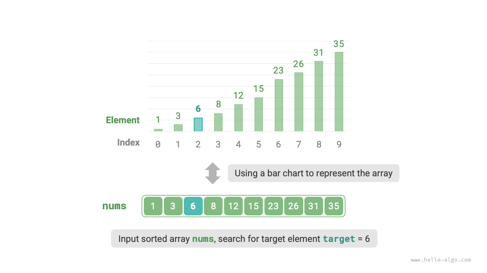
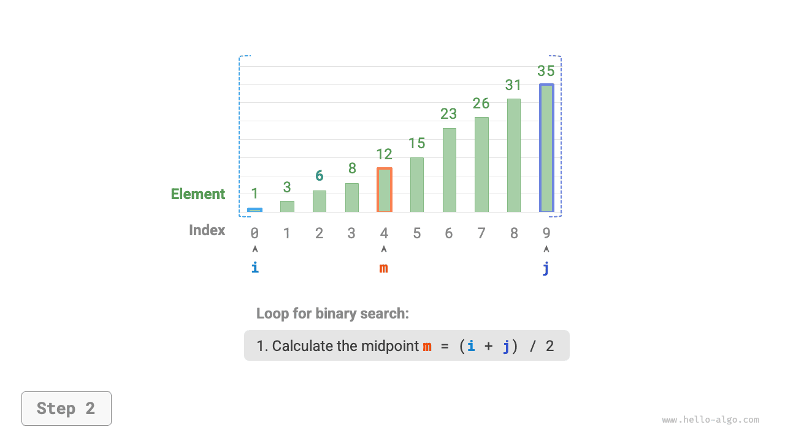
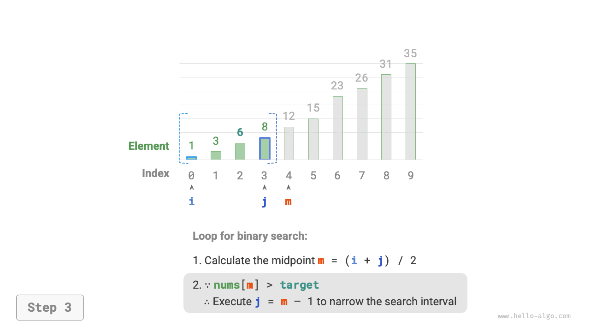
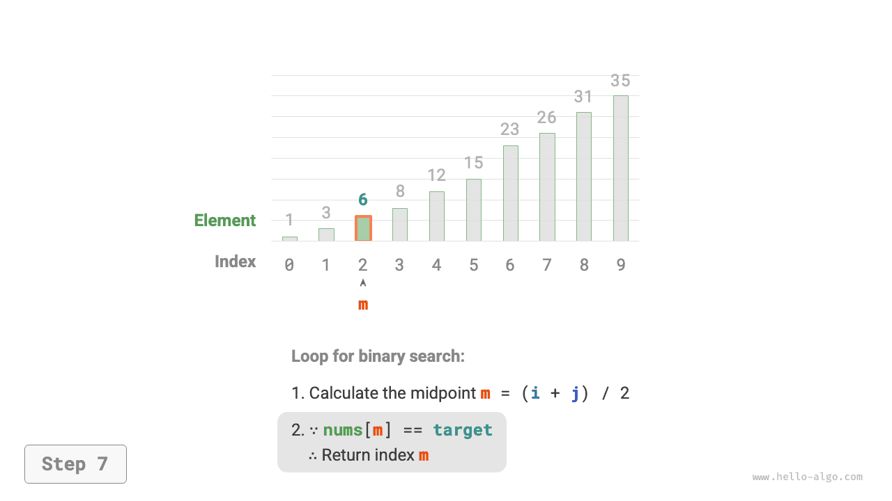

# Tìm kiếm nhị phân

<u>Tìm kiếm nhị phân (binary search)</u> là một thuật toán tìm kiếm hiệu năng cao dựa trên chiến lược chia để trị. Nó tận dụng tính có thứ tự của dữ liệu, trong mỗi vòng lặp đều thu hẹp một nửa phạm vi tìm kiếm, cho đến khi tìm thấy phần tử mục tiêu hoặc khoảng tìm kiếm trở nên rỗng.

!!! question

    Cho một mảng `nums` có độ dài $n$, các phần tử được sắp xếp theo thứ tự từ nhỏ đến lớn và không trùng lặp. Hãy tìm kiếm và trả về chỉ số của phần tử `target` trong mảng đó. Nếu mảng không chứa phần tử này, trả về $-1$. Dữ liệu ví dụ như hình dưới đây.



Như hình dưới đây, trước tiên chúng ta khởi tạo hai con trỏ $i = 0$ và $j = n - 1$, lần lượt trỏ tới phần tử đầu tiên và phần tử cuối cùng của mảng, đại diện cho khoảng tìm kiếm $[0, n - 1]$. Xin lưu ý rằng dấu ngoặc vuông biểu thị khoảng đóng (đoạn), bao gồm cả chính các giá trị biên.

Tiếp theo, thực hiện lặp đi lặp lại hai bước sau:

1. Tính toán chỉ số trung điểm $m = \lfloor {(i + j) / 2} \rfloor$, trong đó $\lfloor \: \rfloor$ biểu thị phép toán lấy phần nguyên làm tròn xuống.
2. So sánh quan hệ độ lớn giữa `nums[m]` và `target`, chia thành 3 trường hợp sau:
    1. Khi `nums[m] < target`, cho thấy `target` nằm trong khoảng $[m + 1, j]$, do đó thực hiện $i = m + 1$.
    2. Khi `nums[m] > target`, cho thấy `target` nằm trong khoảng $[i, m - 1]$, do đó thực hiện $j = m - 1$.
    3. Khi `nums[m] = target`, cho thấy đã tìm thấy `target`, do đó trả về chỉ số $m$.

Nếu mảng không chứa phần tử mục tiêu, khoảng tìm kiếm cuối cùng sẽ thu hẹp thành rỗng. Lúc này trả về $-1$.

=== "<1>"
    

=== "<2>"
    

=== "<3>"
    

=== "<4>"
    

=== "<5>"
    

=== "<6>"
    

=== "<7>"
    

Đáng chú ý là do $i$ và $j$ đều thuộc kiểu `int`, **vì vậy $i + j$ có thể vượt quá phạm vi giá trị của kiểu `int` (tràn số)**. Để tránh tràn số nguyên lớn, chúng ta thường áp dụng công thức $m = \lfloor {i + (j - i) / 2} \rfloor$ để tính toán điểm giữa.

Mã nguồn như sau:

```src
[file]{binary_search}-[class]{}-[func]{binary_search}
```

**Độ phức tạp thời gian là $O(\log n)$**: Trong vòng lặp nhị phân, khoảng tìm kiếm trong mỗi vòng giảm đi một nửa, do đó số vòng lặp là $\log_2 n$.

**Độ phức tạp không gian là $O(1)$**: Các con trỏ $i$ và $j$ chỉ sử dụng không gian kích thước hằng số.

## Phương thức biểu diễn khoảng

Ngoài khoảng đóng hai đầu (đoạn) ở trên, một cách biểu diễn khoảng phổ biến khác là khoảng "nửa đóng nửa mở" (đóng trái mở phải), được định nghĩa là $[0, n)$, tức là biên trái chứa chính nó còn biên phải không chứa chính nó. Dưới cách biểu diễn này, khoảng $[i, j)$ sẽ rỗng khi $i = j$.

Chúng ta có thể dựa vào cách biểu diễn này để hiện thực thuật toán tìm kiếm nhị phân có cùng chức năng:

```src
[file]{binary_search}-[class]{}-[func]{binary_search_lcro}
```

Như hình dưới đây, dưới hai cách biểu diễn khoảng, các thao tác khởi tạo, điều kiện vòng lặp và thu hẹp khoảng của thuật toán tìm kiếm nhị phân đều có sự khác nhau.

Do trong cách biểu diễn "khoảng đóng hai đầu", cả biên trái và biên phải đều được định nghĩa là đóng, nên các thao tác thu hẹp khoảng thông qua con trỏ $i$ và con trỏ $j$ mang tính đối xứng hoàn toàn. Cách này ít bị lỗi hơn, **vì vậy thông thường chúng tôi khuyến khích bạn áp dụng cách viết "khoảng đóng hai đầu"**.


## Ưu điểm và hạn chế

Tìm kiếm nhị phân có hiệu năng vượt trội cả về mặt thời gian lẫn không gian:

- Hiệu năng thời gian cao: Với lượng dữ liệu lớn, độ phức tạp thời gian bậc logarit có ưu thế vượt trội rõ rệt. Ví dụ khi kích thước dữ liệu $n = 2^{20}$, tìm kiếm tuyến tính cần tới $2^{20} = 1048576$ vòng lặp, trong khi tìm kiếm nhị phân chỉ cần $\log_2 2^{20} = 20$ vòng lặp.
- Không tốn thêm không gian bộ nhớ: So với các thuật toán tìm kiếm đòi hỏi không gian phụ trợ (như tìm kiếm bằng bảng băm), tìm kiếm nhị phân tiết kiệm bộ nhớ hơn nhiều.

Tuy nhiên, tìm kiếm nhị phân không phải lúc nào cũng thích hợp cho mọi trường hợp, chủ yếu vì những lý do sau:

- Tìm kiếm nhị phân chỉ áp dụng cho dữ liệu có thứ tự. Nếu dữ liệu đầu vào chưa sắp xếp, việc cất công sắp xếp dữ liệu chỉ để phục vụ tìm kiếm nhị phân sẽ không mang lại hiệu quả kinh tế (lợi bất cập hại), bởi vì độ phức tạp thời gian của thuật toán sắp xếp thường là $O(n \log n)$, cao hơn nhiều so với cả tìm kiếm tuyến tính lẫn tìm kiếm nhị phân. Đối với các tình huống chèn phần tử thường xuyên, để duy trì tính thứ tự của mảng, cần phải chèn phần tử vào vị trí chỉ định với độ phức tạp thời gian $O(n)$, chi phí này cũng rất tốn kém.
- Tìm kiếm nhị phân chỉ áp dụng cho mảng. Tìm kiếm nhị phân đòi hỏi phải truy cập phần tử theo bước nhảy (không liên tục), trong khi việc truy cập nhảy bước trong danh sách liên kết có hiệu năng rất thấp, do đó không thích hợp áp dụng trên danh sách liên kết hoặc các cấu trúc dữ liệu xây dựng trên nền tảng danh sách liên kết.
- Khi dữ liệu nhỏ, tìm kiếm tuyến tính có hiệu năng tốt hơn. Trong tìm kiếm tuyến tính, mỗi vòng lặp chỉ cần 1 thao tác so sánh; trong khi trong tìm kiếm nhị phân, cần 1 phép cộng, 1 phép chia, 1 ~ 3 phép so sánh, 1 phép cộng (trừ), tổng cộng 4 ~ 6 thao tác đơn vị; vì vậy khi lượng dữ liệu $n$ tương đối nhỏ, tìm kiếm tuyến tính trái lại chạy nhanh hơn tìm kiếm nhị phân.
