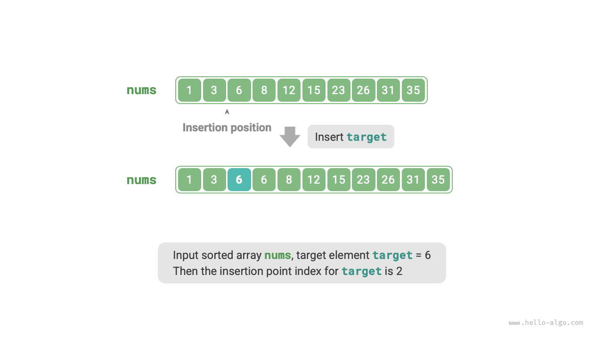
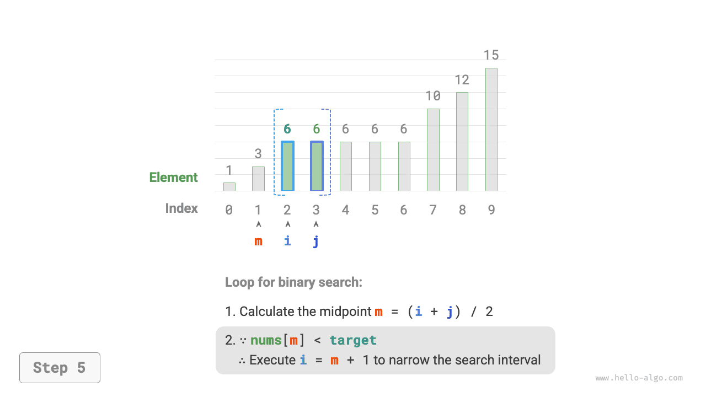
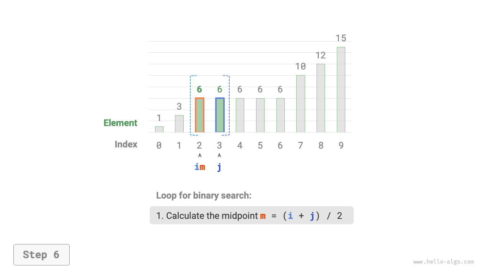

# Điểm chèn trong tìm kiếm nhị phân

Tìm kiếm nhị phân không chỉ dùng để tìm kiếm phần tử mục tiêu mà còn có thể dùng để giải quyết rất nhiều biến thể bài toán khác nhau, chẳng hạn như tìm vị trí chèn của phần tử mục tiêu.

## Trường hợp không có phần tử trùng lặp

!!! question

    Cho một mảng đã sắp xếp `nums` có độ dài $n$ và một phần tử `target` ，mảng không chứa các phần tử trùng lặp. Bây giờ chèn `target` vào mảng `nums` sao cho vẫn duy trì tính có thứ tự của mảng. Nếu trong mảng đã tồn tại phần tử `target` thì chèn vào bên trái của phần tử đó. Hãy trả về chỉ số của `target` trong mảng sau khi chèn. Dữ liệu ví dụ như hình dưới đây.



Nếu muốn tái sử dụng mã nguồn tìm kiếm nhị phân ở phần trước, chúng ta cần trả lời hai câu hỏi sau:

**Câu hỏi 1**: Khi mảng có chứa `target` ，chỉ số của điểm chèn có phải chính là chỉ số của phần tử đó không?

Đề bài yêu cầu chèn `target` vào bên trái của phần tử bằng nó, điều này đồng nghĩa với việc `target` mới chèn sẽ thay thế vị trí của `target` ban đầu. Nói cách khác, **khi mảng có chứa `target` ，chỉ số điểm chèn chính là chỉ số của `target` đó**.

**Câu hỏi 2**: Khi mảng không chứa `target` ，điểm chèn là chỉ số của phần tử nào?

Suy ngẫm sâu hơn về tiến trình tìm kiếm nhị phân: khi `nums[m] < target` thì con trỏ $i$ dịch chuyển, điều này có nghĩa là con trỏ $i$ đang tiến lại gần các phần tử lớn hơn hoặc bằng `target` 。Tương tự, con trỏ $j$ luôn tiến lại gần các phần tử nhỏ hơn hoặc bằng `target` 。

Vì vậy khi quá trình tìm kiếm nhị phân kết thúc, chắc chắn $i$ sẽ trỏ tới phần tử đầu tiên lớn hơn `target` ，còn $j$ trỏ tới phần tử tận cùng bên phải nhỏ hơn `target` 。**Dễ thấy khi mảng không chứa `target` ，chỉ số điểm chèn chính là $i$** 。Mã nguồn như sau:

```src
[file]{binary_search_insertion}-[class]{}-[func]{binary_search_insertion_simple}
```

## Trường hợp tồn tại phần tử trùng lặp

!!! question

    Dựa trên bài toán trước, quy định mảng có thể chứa các phần tử trùng lặp, các điều kiện còn lại giữ nguyên.

Giả sử trong mảng tồn tại nhiều phần tử `target` ，thì tìm kiếm nhị phân thông thường chỉ có thể trả về chỉ số của một phần tử `target` nào đó, **chứ không thể xác định được bên trái và bên phải phần tử đó còn bao nhiêu phần tử `target` khác**.

Đề bài yêu cầu chèn phần tử mục tiêu vào vị trí ngoài cùng bên trái, **vì vậy chúng ta cần tìm kiếm chỉ số của phần tử `target` ngoài cùng bên trái trong mảng**. Trước tiên cân nhắc thực hiện qua các bước thể hiện trong hình dưới đây:

1. Thực hiện tìm kiếm nhị phân để lấy được chỉ số của một `target` bất kỳ, ghi nhận là $k$ 。
2. Bắt đầu từ chỉ số $k$ ，duyệt tuyến tính sang bên trái, khi tìm thấy `target` ngoài cùng bên trái thì trả về.


Phương pháp này tuy dùng được nhưng do chứa thao tác tìm kiếm tuyến tính nên độ phức tạp thời gian là $O(n)$ 。Khi trong mảng có rất nhiều phần tử `target` trùng lặp, hiệu năng của phương pháp này rất thấp.

Bây giờ cân nhắc mở rộng mã nguồn tìm kiếm nhị phân. Như hình dưới đây, quy trình tổng thể vẫn giữ nguyên, trong mỗi vòng lặp trước tiên tính chỉ số trung điểm $m$ ，sau đó so sánh quan hệ độ lớn giữa `target` và `nums[m]`, chia thành các trường hợp sau:

- Khi `nums[m] < target` hoặc `nums[m] > target` ，cho thấy vẫn chưa tìm thấy `target` ，do đó áp dụng thao tác thu hẹp khoảng của tìm kiếm nhị phân thông thường, **nhờ đó làm cho hai con trỏ $i$ và $j$ tiến lại gần `target`**.
- Khi `nums[m] == target` ，cho thấy các phần tử nhỏ hơn `target` nằm trong khoảng $[i, m - 1]$ ，do đó áp dụng $j = m - 1$ để thu hẹp khoảng, **nhờ đó làm cho con trỏ $j$ tiến lại gần các phần tử nhỏ hơn `target`**.

Sau khi kết thúc vòng lặp, $i$ sẽ trỏ tới `target` ngoài cùng bên trái, còn $j$ trỏ tới phần tử tận cùng bên phải nhỏ hơn `target` ，**do đó chỉ số $i$ chính là điểm chèn**.

=== "<1>"
    

=== "<2>"
    

=== "<3>"
    

=== "<4>"
    

=== "<5>"
    

=== "<6>"
    

=== "<7>"
    

=== "<8>"
    

Quan sát đoạn mã dưới đây, các thao tác trong hai nhánh điều kiện `nums[m] > target` và `nums[m] == target` là giống hệt nhau, do đó có thể gộp chung lại.

Dù vậy, chúng ta vẫn có thể giữ nguyên các điều kiện phân nhánh mở rộng như vậy vì logic của nó rõ ràng và dễ đọc hơn.

```src
[file]{binary_search_insertion}-[class]{}-[func]{binary_search_insertion}
```

!!! tip

    Mã nguồn trong phần này đều áp dụng cách viết "khoảng đóng hai đầu". Bạn đọc quan tâm có thể tự mình hiện thực cách viết "khoảng đóng trái mở phải".

Nhìn chung, tìm kiếm nhị phân thực chất chính là thiết lập mục tiêu tìm kiếm cho hai con trỏ $i$ và $j$ ，mục tiêu có thể là một phần tử cụ thể (như `target` ), hoặc có thể là một phạm vi phần tử (như các phần tử nhỏ hơn `target` ).

Trong quá trình lặp nhị phân liên tục, cả con trỏ $i$ và $j$ đều dần dần tiếp cận mục tiêu đã định sẵn. Cuối cùng, chúng hoặc là tìm thấy câu trả lời thành công, hoặc là vượt qua ranh giới biên rồi dừng lại.
