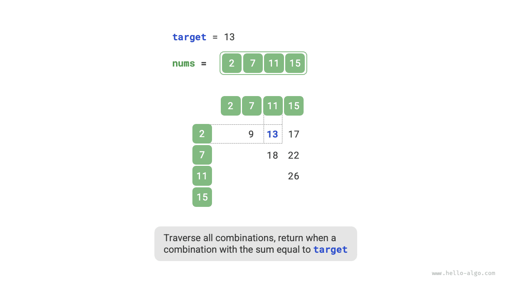
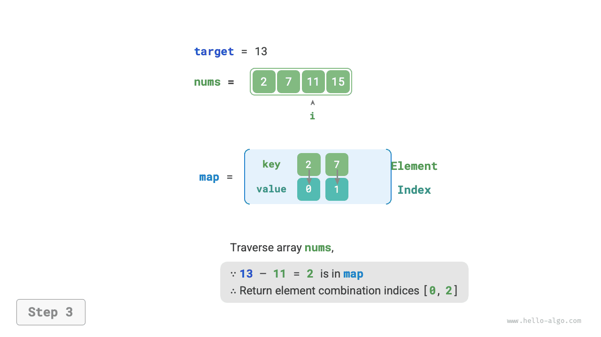

# Chiến lược tối ưu hoá bằng bảng băm

Trong các bài toán thuật toán, **chúng ta thường giảm độ phức tạp thời gian của thuật toán bằng cách thay thế tìm kiếm tuyến tính bằng tìm kiếm bằng bảng băm**. Chúng ta sẽ thông qua một bài toán thuật toán kinh điển để hiểu sâu hơn về điều này.

!!! question

    Cho một mảng số nguyên `nums` và một giá trị mục tiêu `target`, hãy tìm hai phần tử trong mảng có tổng bằng `target`, và trả về chỉ số mảng của chúng. Trả về bất kỳ một lời giải hợp lệ nào là được.

## Tìm kiếm tuyến tính: Đổi thời gian lấy không gian

Cân nhắc duyệt trực tiếp toàn bộ các tổ hợp có thể. Như hình dưới đây, chúng ta mở hai vòng lặp lồng nhau, trong mỗi vòng kiểm tra xem tổng của hai số nguyên có bằng `target` hay không, nếu đúng thì trả về chỉ số của chúng.



Mã nguồn như sau:

```src
[file]{two_sum}-[class]{}-[func]{two_sum_brute_force}
```

Phương pháp này có độ phức tạp thời gian là $O(n^2)$ và độ phức tạp không gian là $O(1)$, rất tốn thời gian khi lượng dữ liệu lớn.

## Tìm kiếm bằng bảng băm: Đổi không gian lấy thời gian

Cân nhắc nhờ một bảng băm, với các cặp khoá-giá trị (key-value) lần lượt là phần tử mảng và chỉ số phần tử. Vòng lặp duyệt qua mảng, trong mỗi vòng thực hiện các bước thể hiện trong hình dưới đây:

1. Kiểm tra số `target - nums[i]` có nằm trong bảng băm không, nếu có thì trực tiếp trả về chỉ số của hai phần tử này.
2. Thêm cặp key-value `nums[i]` và chỉ số `i` vào bảng băm.

=== "<1>"
    

=== "<2>"
    

=== "<3>"
    

Mã nguồn hiện thực như dưới đây, chỉ cần một vòng lặp đơn:

```src
[file]{two_sum}-[class]{}-[func]{two_sum_hash_table}
```

Phương pháp này thông qua tìm kiếm bằng bảng băm đã hạ độ phức tạp thời gian từ $O(n^2)$ xuống $O(n)$, nâng cao đáng kể hiệu năng chạy chương trình.

Do cần phải duy trì thêm một bảng băm phụ trợ nên độ phức tạp không gian là $O(n)$. **Dù vậy, hiệu năng tổng thể về thời gian và không gian của phương pháp này cân bằng hơn nhiều, vì vậy đây là cách giải tối ưu nhất cho bài toán này**.
