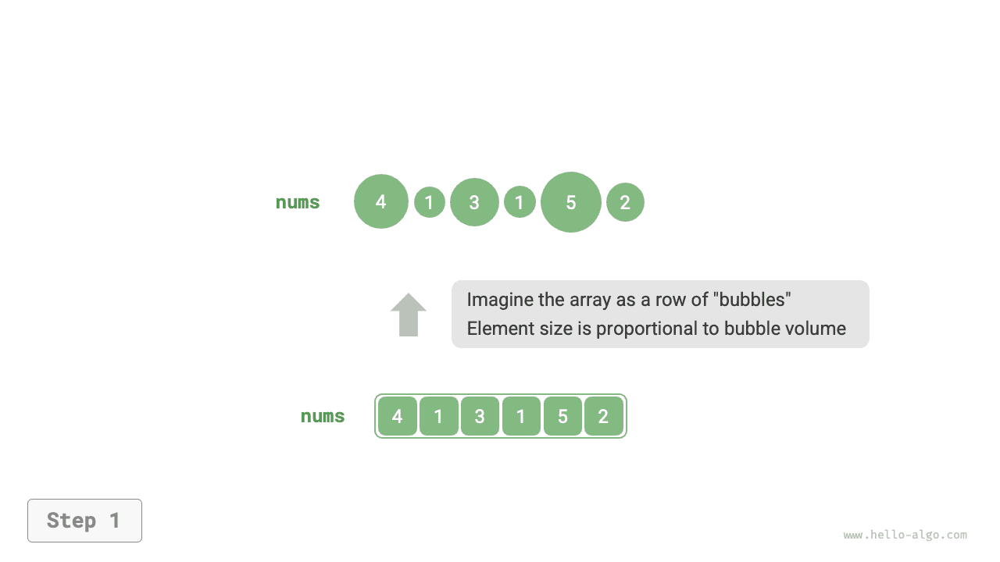
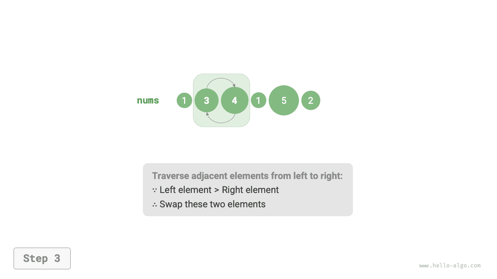
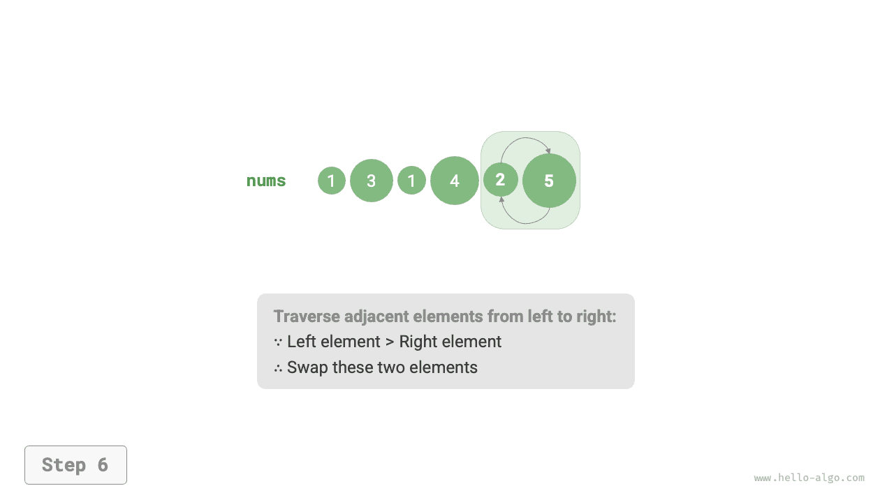

# Sắp xếp nổi bọt

<u>Sắp xếp nổi bọt (bubble sort)</u> thực hiện sắp xếp thông qua việc liên tục so sánh và hoán đổi các phần tử liền kề. Quá trình này tương tự như những bọt khí nổi dần từ đáy lên trên mặt nước, do đó có tên gọi là sắp xếp nổi bọt.

Như hình dưới đây, quá trình nổi bọt có thể được mô phỏng bằng thao tác hoán đổi phần tử: bắt đầu từ đầu tận cùng bên trái của mảng duyệt sang phải, lần lượt so sánh độ lớn của hai phần tử liền kề, nếu "phần tử trái > phần tử phải" thì hoán đổi cả hai. Sau khi duyệt xong, phần tử lớn nhất sẽ được đưa về tận cùng bên phải của mảng.

=== "<1>"
    

=== "<2>"
    

=== "<3>"
    

=== "<4>"
    

=== "<5>"
    

=== "<6>"
    

=== "<7>"
    

## Quy trình thuật toán

Giả sử độ dài của mảng là $n$ ，các bước của sắp xếp nổi bọt được thể hiện như hình dưới đây:

1. Đầu tiên, thực hiện "nổi bọt" trên $n$ phần tử, **hoán đổi phần tử lớn nhất của mảng về đúng vị trí**.
2. Tiếp theo, thực hiện "nổi bọt" trên $n - 1$ phần tử còn lại, **hoán đổi phần tử lớn thứ hai về đúng vị trí**.
3. Cứ thế tiếp tục, sau $n - 1$ vòng "nổi bọt", **$n - 1$ phần tử lớn nhất đều được hoán đổi về đúng vị trí**.
4. Phần tử duy nhất còn lại chắc chắn là phần tử nhỏ nhất, không cần phải sắp xếp nữa, do đó mảng đã được sắp xếp hoàn tất.


Mã nguồn ví dụ như sau:

```src
[file]{bubble_sort}-[class]{}-[func]{bubble_sort}
```

## Tối ưu hoá hiệu năng

Chúng ta nhận thấy rằng nếu trong một vòng "nổi bọt" nào đó không thực hiện bất kỳ thao tác hoán đổi nào, điều đó chứng tỏ mảng đã được sắp xếp hoàn tất, có thể trực tiếp trả về kết quả. Do đó, có thể bổ sung một biến cờ hiệu `flag` để giám sát tình huống này, một khi xuất hiện thì lập tức dừng lại và trả về.

Sau khi tối ưu, độ phức tạp thời gian trong trường hợp xấu nhất và trung bình của sắp xếp nổi bọt vẫn là $O(n^2)$ ；nhưng khi mảng đầu vào đã hoàn toàn có thứ tự sẵn, thuật toán có thể đạt độ phức tạp thời gian tốt nhất là $O(n)$ 。

```src
[file]{bubble_sort}-[class]{}-[func]{bubble_sort_with_flag}
```

## Đặc tính của thuật toán

- **Độ phức tạp thời gian là $O(n^2)$、Sắp xếp thích ứng**: Độ dài mảng được duyệt trong các vòng "nổi bọt" lần lượt là $n - 1$、$n - 2$、$\dots$、$2$、$1$ ，tổng cộng là $(n - 1) n / 2$ 。Sau khi áp dụng tối ưu bằng `flag` ，độ phức tạp thời gian tốt nhất có thể đạt $O(n)$ 。
- **Độ phức tạp không gian là $O(1)$、Sắp xếp tại chỗ**: Các con trỏ $i$ và $j$ chỉ sử dụng không gian phụ trợ kích thước hằng số.
- **Sắp xếp ổn định**: Do trong quá trình "nổi bọt", khi gặp các phần tử có giá trị bằng nhau thì không thực hiện hoán đổi.
