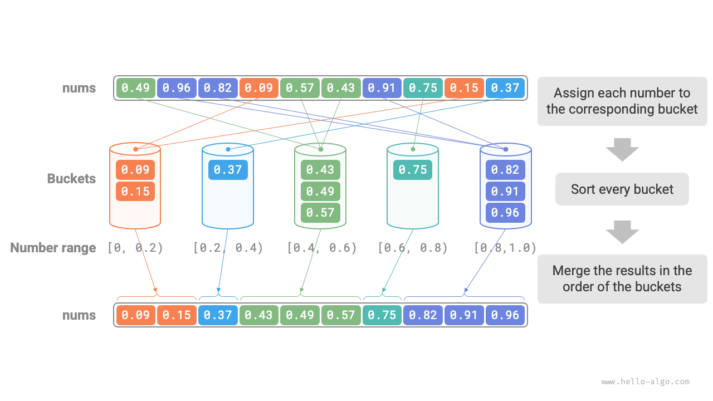
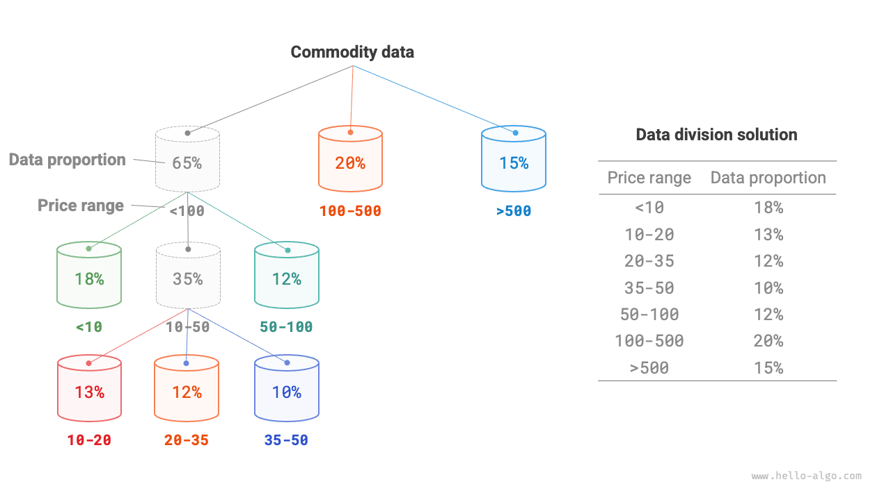

# Sắp xếp theo ngăn (Bucket Sort)

Các thuật toán sắp xếp đã đề cập ở trên đều thuộc nhóm "thuật toán sắp xếp dựa trên so sánh", chúng thực hiện sắp xếp bằng cách so sánh độ lớn giữa các phần tử. Chặn dưới của độ phức tạp thời gian trong trường hợp xấu nhất của nhóm thuật toán sắp xếp này là $\Omega(n \log n)$ 。Tiếp theo, chúng ta sẽ khám phá một vài "thuật toán sắp xếp không dựa trên so sánh", độ phức tạp thời gian của chúng có thể đạt tới bậc tuyến tính.

<u>Sắp xếp theo ngăn (bucket sort)</u> là một ứng dụng tiêu biểu của chiến lược chia để trị. Nó hoạt động bằng cách thiết lập một dãy các ngăn (bucket) có thứ tự kích thước, mỗi ngăn tương ứng với một khoảng giá trị dữ liệu, rồi phân phối đều dữ liệu vào từng ngăn; sau đó, thực hiện sắp xếp riêng rẽ bên trong từng ngăn; cuối cùng hợp nhất toàn bộ dữ liệu theo thứ tự các ngăn.

## Quy trình thuật toán

Xét một mảng có độ dài $n$ ，các phần tử là các số thực dấu phẩy động nằm trong khoảng $[0, 1)$ 。Quy trình của sắp xếp theo ngăn được thể hiện như hình dưới đây:

1. Khởi tạo $k$ ngăn, phân phối $n$ phần tử vào $k$ ngăn đó.
2. Thực hiện sắp xếp riêng cho từng ngăn (ở đây áp dụng hàm sắp xếp tích hợp sẵn của ngôn ngữ lập trình).
3. Hợp nhất kết quả theo thứ tự từ ngăn nhỏ đến ngăn lớn.



Mã nguồn như sau:

```src
[file]{bucket_sort}-[class]{}-[func]{bucket_sort}
```

## Đặc tính của thuật toán

Sắp xếp theo ngăn rất thích hợp để xử lý khối lượng dữ liệu khổng lồ. Ví dụ, dữ liệu đầu vào chứa 1 triệu phần tử, do giới hạn không gian bộ nhớ, hệ thống không thể tải toàn bộ dữ liệu vào bộ nhớ cùng một lúc. Lúc này, chúng ta có thể chia dữ liệu thành 1000 ngăn, sau đó lần lượt sắp xếp từng ngăn, cuối cùng gộp các kết quả lại.

- **Độ phức tạp thời gian là $O(n + k)$** ：Giả sử các phần tử phân bố đều trong các ngăn, khi đó số lượng phần tử trong mỗi ngăn là $\frac{n}{k}$ 。Giả sử sắp xếp một ngăn đơn lẻ mất thời gian $O(\frac{n}{k} \log\frac{n}{k})$ ，thì sắp xếp toàn bộ các ngăn sẽ mất thời gian $O(n \log\frac{n}{k})$ 。**Khi số lượng ngăn $k$ tương đối lớn, độ phức tạp thời gian sẽ tiệm cận $O(n)$** 。Khi hợp nhất kết quả cần duyệt qua toàn bộ các ngăn và phần tử, mất thời gian $O(n + k)$ 。Trong trường hợp xấu nhất, toàn bộ dữ liệu bị phân vào cùng một ngăn duy nhất, và việc sắp xếp ngăn đó mất thời gian $O(n^2)$ 。
- **Độ phức tạp không gian là $O(n + k)$、Sắp xếp không tại chỗ**: Cần nhờ không gian phụ trợ cho $k$ ngăn và tổng cộng $n$ phần tử.
- Tính ổn định của sắp xếp theo ngăn phụ thuộc vào việc thuật toán sắp xếp các phần tử bên trong ngăn có ổn định hay không.

## Làm thế nào để phân phối đều dữ liệu?

Độ phức tạp thời gian của sắp xếp theo ngăn trên lý thuyết có thể đạt tới $O(n)$ ，**mấu chốt nằm ở việc phân phối đều các phần tử vào từng ngăn**, bởi vì dữ liệu thực tế thường không phân bố đồng đều. Ví dụ, chúng ta muốn chia toàn bộ hàng hoá trên sàn thương mại điện tử vào 10 ngăn theo khoảng giá, nhưng phân bố giá hàng hoá lại không đều: các mặt hàng dưới 100 nghìn đồng rất nhiều, trong khi các mặt hàng trên 10 triệu đồng lại rất ít. Nếu chia đều khoảng giá thành 10 khoảng bằng nhau, số lượng hàng hoá trong các ngăn sẽ có sự chênh lệch vô cùng lớn.

Để thực hiện phân phối đều, trước tiên chúng ta có thể đặt một ranh giới phân chia ước lượng, chia thô dữ liệu vào 3 ngăn. **Sau khi phân phối xong, tiếp tục chia nhỏ những ngăn có lượng hàng hoá nhiều thành 3 ngăn con, cứ thế cho đến khi số lượng phần tử trong toàn bộ các ngăn xấp xỉ bằng nhau**.

Như hình dưới đây, phương pháp này về bản chất là tạo ra một cây đệ quy, mục tiêu là làm cho giá trị tại các nút lá càng phân bố đều càng tốt. Tất nhiên, không nhất thiết mỗi vòng phải chia dữ liệu thành 3 ngăn, cách thức phân chia cụ thể có thể linh hoạt lựa chọn dựa vào đặc điểm của dữ liệu.



Nếu chúng ta biết trước phân phối xác suất của giá hàng hoá, **thì có thể thiết lập các ranh giới giá cho từng ngăn dựa trên phân phối xác suất của dữ liệu**. Đáng chú ý là phân bố dữ liệu không nhất thiết phải thống kê chi tiết từ trước mà có thể dựa vào đặc điểm dữ liệu để áp dụng một mô hình xác suất gần đúng nào đó.

Như hình dưới đây, chúng ta giả định giá hàng hoá tuân theo phân phối chuẩn (phân phối Gauss), như vậy có thể thiết lập các khoảng giá một cách hợp lý, từ đó phân phối đều hàng hoá vào từng ngăn.


