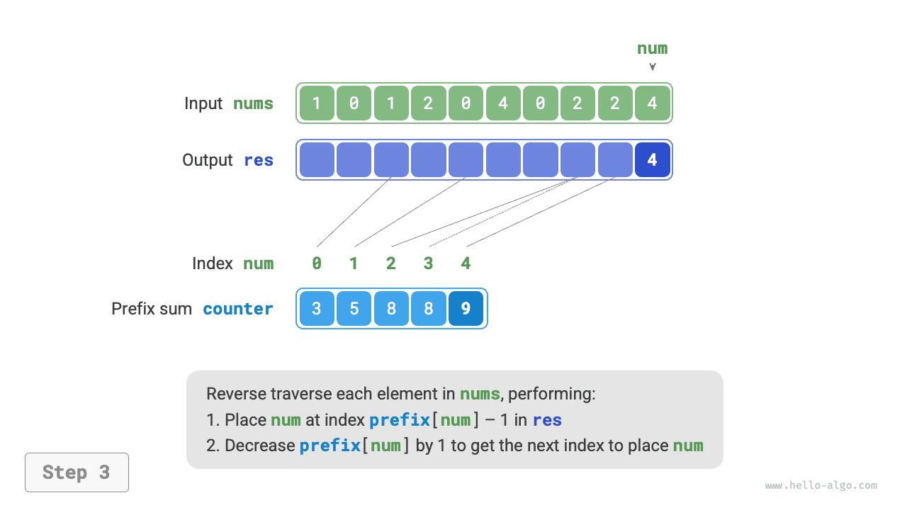
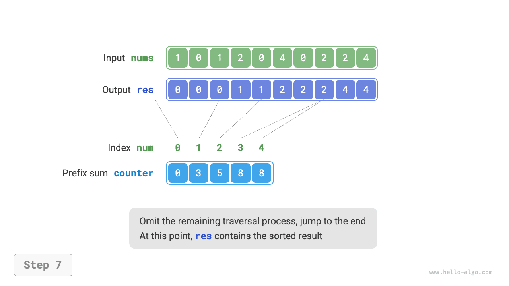

# Sắp xếp đếm

<u>Sắp xếp đếm (counting sort)</u> thực hiện sắp xếp thông qua việc thống kê số lượng xuất hiện của các phần tử, thường được áp dụng cho các mảng số nguyên.

## Hiện thực đơn giản

Trước tiên hãy xem một ví dụ đơn giản. Cho một mảng `nums` có độ dài $n$ ，các phần tử trong đó đều là các "số nguyên không âm", quy trình tổng thể của sắp xếp đếm được thể hiện như hình dưới đây:

1. Duyệt mảng, tìm ra số lớn nhất trong đó, ghi nhận là $m$ ，sau đó tạo một mảng phụ trợ `counter` có độ dài là $m + 1$ 。
2. **Nhờ `counter` để thống kê số lần xuất hiện của từng số trong `nums`**, trong đó `counter[num]` tương ứng với số lần xuất hiện của số `num` 。Phương pháp thống kê rất đơn giản, chỉ cần duyệt qua `nums` (đặt số hiện tại là `num`), trong mỗi vòng tăng `counter[num]` lên $1$ là được.
3. **Do các chỉ số của `counter` vốn dĩ đã có thứ tự sẵn một cách tự nhiên, nên tương đương với việc toàn bộ các số đã được sắp xếp xong**. Tiếp theo, chúng ta duyệt qua `counter` ，lần lượt điền các số vào `nums` theo thứ tự số lần xuất hiện từ nhỏ đến lớn là xong.


Mã nguồn như sau:

```src
[file]{counting_sort}-[class]{}-[func]{counting_sort_naive}
```

!!! note "Mối liên hệ giữa sắp xếp đếm và sắp xếp theo ngăn"

    Xét từ góc độ của sắp xếp theo ngăn, chúng ta có thể coi mỗi chỉ số của mảng đếm `counter` là một ngăn (bucket), và coi quá trình thống kê số lượng là quá trình phân phối các phần tử vào các ngăn tương ứng. Về bản chất, sắp xếp đếm chính là một trường hợp đặc biệt của sắp xếp theo ngăn áp dụng cho dữ liệu kiểu số nguyên.

## Hiện thực hoàn chỉnh

Bạn đọc tinh ý có thể đã nhận ra rằng, **nếu dữ liệu đầu vào là các đối tượng, bước `3.` ở trên sẽ không còn hiệu lực**. Giả sử dữ liệu đầu vào là các đối tượng hàng hoá, chúng ta muốn sắp xếp hàng hoá theo giá tiền (biến thành viên của lớp), trong khi thuật toán trên chỉ có thể đưa ra kết quả sắp xếp của bản thân các con số giá tiền.

Vậy làm thế nào mới có thể thu được kết quả sắp xếp của dữ liệu ban đầu? Trước hết chúng ta tính toán "tổng tiền tố" (prefix sum) của mảng `counter`. Đúng như tên gọi, tổng tiền tố `prefix[i]` tại chỉ số `i` bằng tổng của `i + 1` phần tử đầu tiên trong mảng:

$$
\text{prefix}[i] = \sum_{j=0}^i \text{counter[j]}
$$

**Tổng tiền tố mang ý nghĩa rất rõ ràng: `prefix[num] - 1` đại diện cho chỉ số xuất hiện lần cuối cùng của phần tử `num` trong mảng kết quả `res`**. Thông tin này cực kỳ quan trọng, bởi vì nó cho chúng ta biết mỗi phần tử nên xuất hiện tại vị trí nào trong mảng kết quả. Tiếp theo, chúng ta duyệt ngược mảng ban đầu `nums` qua từng phần tử `num` ，trong mỗi vòng lặp thực hiện hai bước sau:

1. Điền `num` vào vị trí chỉ số `prefix[num] - 1` của mảng `res` 。
2. Giảm giá trị tổng tiền tố `prefix[num]` đi $1$ ，từ đó thu được chỉ số để đặt phần tử `num` ở lần tiếp theo.

Sau khi duyệt xong, trong mảng `res` chính là kết quả đã sắp xếp, cuối cùng dùng `res` ghi đè lên mảng ban đầu `nums` là hoàn tất. Hình dưới đây minh hoạ quy trình hoàn chỉnh của sắp xếp đếm.

=== "<1>"
    

=== "<2>"
    

=== "<3>"
    

=== "<4>"
    

=== "<5>"
    

=== "<6>"
    

=== "<7>"
    

=== "<8>"
    

Mã nguồn hiện thực của sắp xếp đếm như sau:

```src
[file]{counting_sort}-[class]{}-[func]{counting_sort}
```

## Đặc tính của thuật toán

- **Độ phức tạp thời gian là $O(n + m)$、Sắp xếp không thích ứng**: Bao gồm việc duyệt qua `nums` và duyệt qua `counter` ，đều sử dụng thời gian tuyến tính. Thông thường $n \gg m$ ，độ phức tạp thời gian tiệm cận $O(n)$ 。
- **Độ phức tạp không gian là $O(n + m)$、Sắp xếp không tại chỗ**: Cần nhờ các mảng `res` và `counter` có độ dài lần lượt là $n$ và $m$ 。
- **Sắp xếp ổn định**: Do thứ tự điền phần tử vào `res` là "từ phải sang trái", nên việc duyệt ngược mảng `nums` có thể tránh làm thay đổi vị trí tương đối giữa các phần tử bằng nhau, từ đó đạt được tính ổn định. Trên thực tế, nếu duyệt xuôi mảng `nums` cũng thu được kết quả sắp xếp đúng, nhưng kết quả đó lại không ổn định.

## Hạn chế

Đọc đến đây, có thể bạn sẽ thấy sắp xếp đếm vô cùng khéo léo, chỉ thông qua việc thống kê số lượng là đã có thể thực hiện sắp xếp hiệu năng cao. Tuy nhiên, điều kiện tiên quyết để sử dụng sắp xếp đếm tương đối khắt khe:

**Sắp xếp đếm chỉ áp dụng cho số nguyên không âm**. Nếu muốn áp dụng cho các kiểu dữ liệu khác, cần đảm bảo các dữ liệu đó có thể chuyển đổi thành số nguyên không âm, và trong quá trình chuyển đổi không làm thay đổi mối quan hệ độ lớn tương đối giữa các phần tử. Ví dụ, đối với mảng số nguyên có chứa số âm, trước tiên có thể cộng thêm một hằng số vào tất cả các số để biến toàn bộ thành số dương, sau khi sắp xếp xong thì trừ lại hằng số đó để đưa về ban đầu.

**Sắp xếp đếm chỉ thích hợp cho tình huống lượng dữ liệu lớn nhưng phạm vi dữ liệu nhỏ**. Chẳng hạn, trong ví dụ trên $m$ không thể quá lớn, nếu không sẽ chiếm dụng quá nhiều bộ nhớ. Và khi $n \ll m$ ，sắp xếp đếm mất thời gian $O(m)$ ，có thể còn chậm hơn cả các thuật toán sắp xếp $O(n \log n)$ 。
