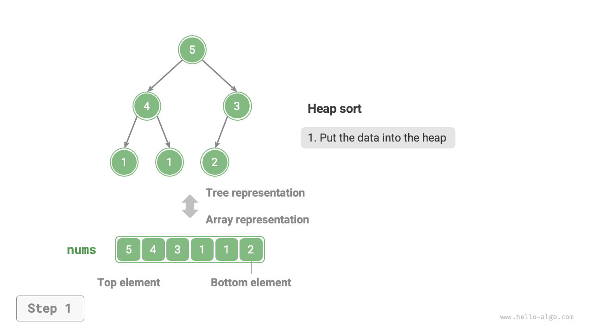
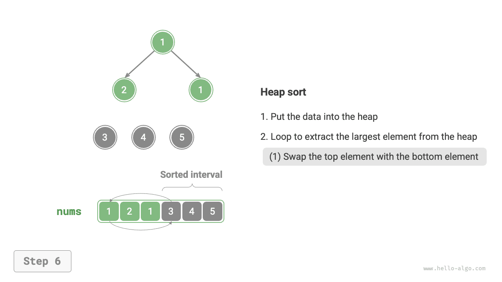
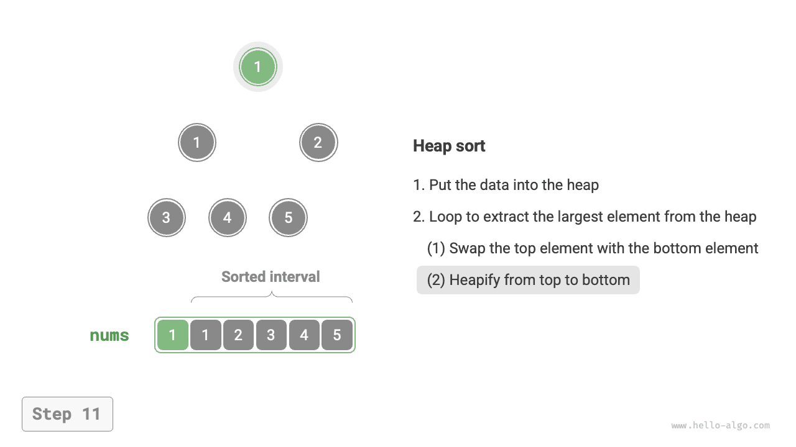
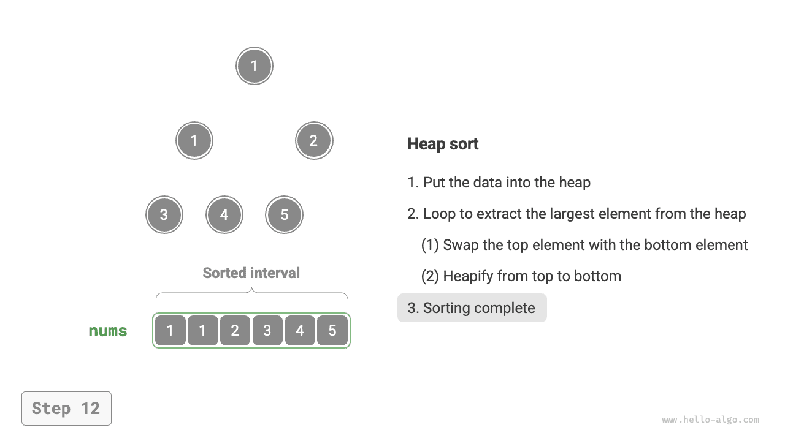

# Sắp xếp vun đống

!!! tip

    Trước khi đọc phần này, xin hãy đảm bảo rằng bạn đã học xong chương "Đống".

<u>Sắp xếp vun đống (heap sort)</u> là một thuật toán sắp xếp hiệu năng cao dựa trên cấu trúc dữ liệu đống. Chúng ta có thể tận dụng "thao tác thiết lập đống" và "thao tác lấy phần tử ra khỏi đống" đã học để hiện thực sắp xếp vun đống:

1. Nhập mảng đầu vào và thiết lập đống cực tiểu, lúc này phần tử nhỏ nhất nằm ở đỉnh đống.
2. Liên tục thực hiện thao tác lấy phần tử ra khỏi đống, lần lượt ghi lại các phần tử lấy ra, ta sẽ thu được một dãy số sắp xếp từ nhỏ đến lớn.

Phương pháp trên tuy khả thi nhưng cần nhờ một mảng phụ trợ để lưu trữ các phần tử được lấy ra, khá lãng phí không gian bộ nhớ. Trong thực tế, chúng ta thường sử dụng một cách hiện thực tao nhã hơn nhiều.

## Quy trình thuật toán

Giả sử độ dài của mảng là $n$ ，quy trình của sắp xếp vun đống được thể hiện như hình dưới đây:

1. Nhập mảng đầu vào và thiết lập đống cực đại. Sau khi hoàn tất, phần tử lớn nhất nằm ở đỉnh đống.
2. Hoán đổi phần tử đỉnh đống (phần tử đầu tiên) với phần tử đáy đống (phần tử cuối cùng). Sau khi hoàn thành hoán đổi, độ dài của đống giảm đi $1$ ，và số lượng phần tử đã sắp xếp tăng thêm $1$ 。
3. Bắt đầu từ phần tử đỉnh đống, thực hiện thao tác vun đống từ đỉnh xuống đáy (sift down / vun xuống). Sau khi vun đống xong, tính chất của đống được khôi phục.
4. Lặp lại bước `2.` và bước `3.` 。Sau khi lặp $n - 1$ vòng, việc sắp xếp mảng sẽ được hoàn tất.

!!! tip

    Trên thực tế, thao tác lấy phần tử ra khỏi đống cũng bao gồm bước `2.` và bước `3.` ，chỉ là có thêm một bước xoá phần tử ra ngoài.

=== "<1>"
    

=== "<2>"
    

=== "<3>"
    

=== "<4>"
    

=== "<5>"
    

=== "<6>"
    

=== "<7>"
    

=== "<8>"
    

=== "<9>"
    

=== "<10>"
    

=== "<11>"
    

=== "<12>"
    

Trong mã nguồn hiện thực, chúng ta sử dụng hàm vun đống từ đỉnh xuống đáy `sift_down()` giống như trong chương "Đống". Đáng chú ý là do độ dài của đống sẽ giảm dần theo việc trích xuất phần tử lớn nhất, nên chúng ta cần bổ sung thêm một tham số độ dài $n$ cho hàm `sift_down()` để chỉ định độ dài hiệu lực hiện tại của đống. Mã nguồn như sau:

```src
[file]{heap_sort}-[class]{}-[func]{heap_sort}
```

## Đặc tính của thuật toán

- **Độ phức tạp thời gian là $O(n \log n)$、Sắp xếp không thích ứng**: Thao tác thiết lập đống mất thời gian $O(n)$ 。Mỗi lần trích xuất phần tử lớn nhất từ đống mất thời gian $O(\log n)$ ，tổng cộng lặp $n - 1$ vòng.
- **Độ phức tạp không gian là $O(1)$、Sắp xếp tại chỗ**: Một vài biến con trỏ chỉ sử dụng $O(1)$ không gian. Các thao tác hoán đổi phần tử và vun đống đều được thực hiện trực tiếp trên mảng ban đầu.
- **Sắp xếp không ổn định**: Khi hoán đổi phần tử đỉnh đống và đáy đống, vị trí tương đối của các phần tử có giá trị bằng nhau có thể bị thay đổi.
