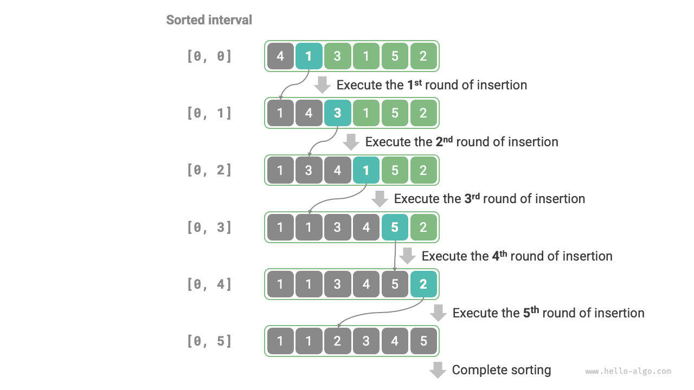

# Sắp xếp chèn

<u>Sắp xếp chèn (insertion sort)</u> là một thuật toán sắp xếp đơn giản, nguyên lý hoạt động của nó rất giống với cách chúng ta xếp bài thủ công khi chơi bài Tây.

Cụ thể, chúng ta chọn một phần tử chuẩn (base element) trong khoảng chưa sắp xếp, so sánh lần lượt phần tử đó với các phần tử trong khoảng đã sắp xếp ở bên trái nó, rồi chèn phần tử đó vào đúng vị trí.

Hình dưới đây minh hoạ quy trình thao tác chèn phần tử vào mảng. Đặt phần tử chuẩn là `base`, chúng ta cần dịch chuyển toàn bộ các phần tử từ chỉ số mục tiêu đến vị trí của `base` sang phải một ô, sau đó gán giá trị `base` vào chỉ số mục tiêu.


## Quy trình thuật toán

Quy trình tổng thể của sắp xếp chèn được thể hiện như hình dưới đây:

1. Ở trạng thái ban đầu, phần tử thứ 1 của mảng đã hoàn thành sắp xếp.
2. Chọn phần tử thứ 2 của mảng làm `base`, sau khi chèn nó vào đúng vị trí, **2 phần tử đầu tiên của mảng đã được sắp xếp**.
3. Chọn phần tử thứ 3 làm `base`, sau khi chèn nó vào đúng vị trí, **3 phần tử đầu tiên của mảng đã được sắp xếp**.
4. Cứ thế tiếp tục, ở vòng cuối cùng, chọn phần tử cuối cùng làm `base`, sau khi chèn nó vào đúng vị trí, **toàn bộ các phần tử đều đã được sắp xếp**.



Mã nguồn ví dụ như sau:

```src
[file]{insertion_sort}-[class]{}-[func]{insertion_sort}
```

## Đặc tính của thuật toán

- **Độ phức tạp thời gian là $O(n^2)$, Sắp xếp thích ứng**: Trong trường hợp xấu nhất, mỗi thao tác chèn lần lượt cần lặp $n - 1$, $n-2$, $\dots$, $2$, $1$ lần, tính tổng lại thu được $(n - 1) n / 2$, do đó độ phức tạp thời gian là $O(n^2)$. Khi gặp dữ liệu có thứ tự sẵn, thao tác chèn sẽ kết thúc sớm. Khi mảng đầu vào đã hoàn toàn có thứ tự sẵn, sắp xếp chèn đạt độ phức tạp thời gian tốt nhất là $O(n)$.
- **Độ phức tạp không gian là $O(1)$, Sắp xếp tại chỗ**: Các con trỏ $i$ và $j$ chỉ sử dụng không gian phụ trợ kích thước hằng số.
- **Sắp xếp ổn định**: Trong quá trình thực hiện thao tác chèn, chúng ta sẽ chèn phần tử vào bên phải của phần tử có giá trị bằng nó, không làm thay đổi thứ tự tương đối giữa chúng.

## Ưu thế của sắp xếp chèn

Độ phức tạp thời gian của sắp xếp chèn là $O(n^2)$, trong khi thuật toán sắp xếp nhanh mà chúng ta sắp học có độ phức tạp thời gian là $O(n \log n)$. Mặc dù sắp xếp chèn có độ phức tạp thời gian tiệm cận cao hơn, **nhưng trong trường hợp lượng dữ liệu nhỏ, sắp xếp chèn thường chạy nhanh hơn**.

Kết luận này tương tự như kết luận về phạm vi ứng dụng của tìm kiếm tuyến tính và tìm kiếm nhị phân. Các thuật toán $O(n \log n)$ như sắp xếp nhanh thuộc nhóm thuật toán dựa trên chiến lược chia để trị, thường chứa nhiều thao tác tính toán đơn vị hơn. Còn khi lượng dữ liệu nhỏ, giá trị của $n^2$ và $n \log n$ khá xấp xỉ nhau, độ phức tạp tiệm cận không đóng vai trò áp đảo, mà số lượng thao tác đơn vị trong mỗi vòng lặp mới mang tính quyết định.

Trên thực tế, hàm sắp xếp tích hợp sẵn trong nhiều ngôn ngữ lập trình (chẳng hạn như Java) áp dụng sắp xếp chèn theo tư tưởng: đối với mảng dài, áp dụng thuật toán sắp xếp chia để trị như sắp xếp nhanh; đối với mảng ngắn, trực tiếp sử dụng sắp xếp chèn.

Mặc dù sắp xếp nổi bọt, sắp xếp chọn và sắp xếp chèn đều có độ phức tạp thời gian là $O(n^2)$, nhưng trong thực tế, **tần suất sử dụng của sắp xếp chèn cao hơn vượt trội so với sắp xếp nổi bọt và sắp xếp chọn**, chủ yếu vì những lý do sau:

- Sắp xếp nổi bọt dựa trên hoán đổi phần tử, cần nhờ một biến tạm và bao gồm 3 thao tác đơn vị; sắp xếp chèn dựa trên phép gán phần tử, chỉ cần 1 thao tác đơn vị. Do đó, **chi phí tính toán của sắp xếp nổi bọt thường cao hơn sắp xếp chèn**.
- Sắp xếp chọn trong mọi trường hợp đều có độ phức tạp thời gian là $O(n^2)$. **Nếu cho một tập dữ liệu đã có thứ tự một phần, sắp xếp chèn thường có hiệu năng cao hơn sắp xếp chọn**.
- Sắp xếp chọn không ổn định, không thể ứng dụng trong sắp xếp nhiều cấp độ.
