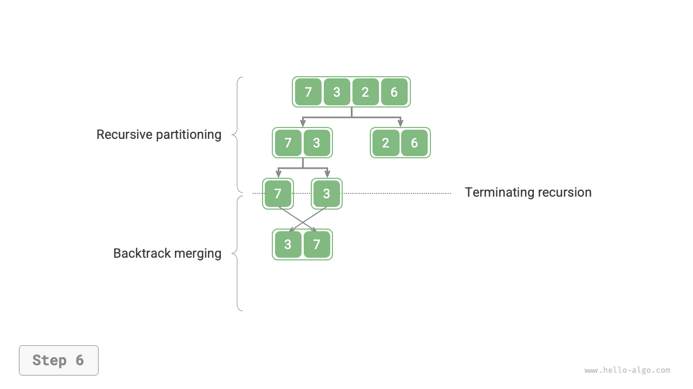
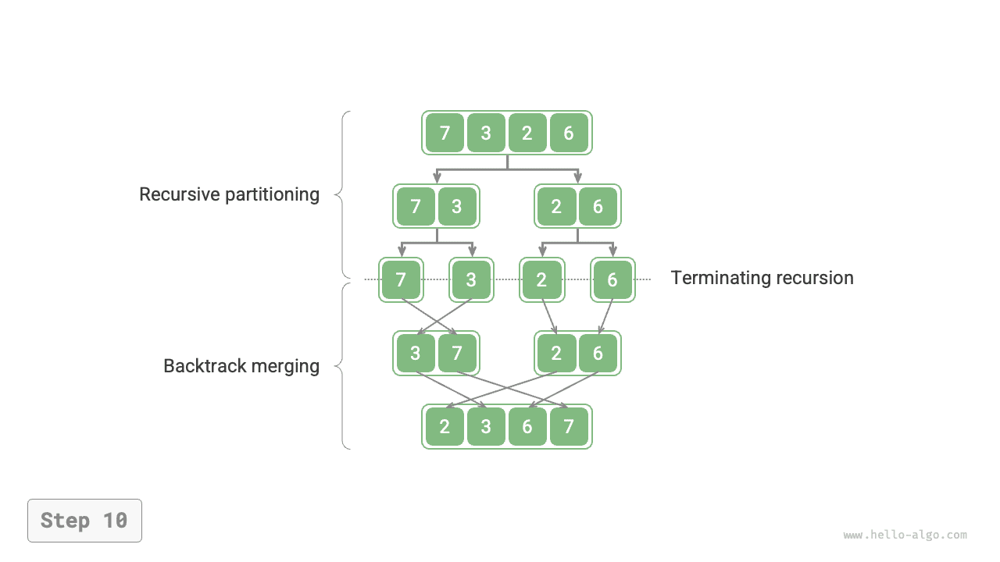

# Sắp xếp trộn

<u>Sắp xếp trộn (merge sort)</u> là một thuật toán sắp xếp dựa trên chiến lược chia để trị, bao gồm hai giai đoạn "chia" (divide) và "trộn" (merge) như minh hoạ trong hình dưới đây:

1. **Giai đoạn chia**: Thông qua đệ quy liên tục chia mảng làm đôi tại điểm giữa, chuyển đổi bài toán sắp xếp một mảng dài thành bài toán sắp xếp các mảng ngắn hơn.
2. **Giai đoạn trộn**: Khi độ dài mảng con bằng 1 thì dừng chia và bắt đầu trộn, liên tục gộp hai mảng con đã sắp xếp ngắn hơn ở hai bên trái phải thành một mảng đã sắp xếp dài hơn, cho đến khi kết thúc.


## Quy trình thuật toán

Như hình dưới đây, "giai đoạn chia" đệ quy từ đỉnh xuống đáy để cắt đôi mảng từ điểm giữa thành hai mảng con:

1. Tính toán điểm giữa `mid` của mảng, đệ quy chia mảng con trái (khoảng `[left, mid]`) và mảng con phải (khoảng `[mid + 1, right]`).
2. Lặp lại bước `1.` theo kiểu đệ quy cho đến khi độ dài khoảng mảng con bằng 1 thì dừng lại.

"Giai đoạn trộn" hợp nhất mảng con trái và mảng con phải từ đáy lên đỉnh thành một mảng đã sắp xếp. Cần lưu ý rằng việc trộn bắt đầu từ các mảng con có độ dài bằng 1, do đó trong giai đoạn trộn, mọi mảng con tham gia trộn đều đã có thứ tự sẵn.

=== "<1>"
    

=== "<2>"
    

=== "<3>"
    

=== "<4>"
    

=== "<5>"
    

=== "<6>"
    

=== "<7>"
    

=== "<8>"
    

=== "<9>"
    

=== "<10>"
    

Quan sát nhận thấy thứ tự đệ quy của sắp xếp trộn hoàn toàn trùng khớp với thứ tự duyệt hậu thứ tự của cây nhị phân:

- **Duyệt hậu thứ tự**: Đệ quy cây con trái trước, sau đó đệ quy cây con phải, cuối cùng mới xử lý nút gốc.
- **Sắp xếp trộn**: Đệ quy mảng con trái trước, sau đó đệ quy mảng con phải, cuối cùng mới xử lý thao tác trộn.

Hiện thực của sắp xếp trộn như mã nguồn dưới đây. Xin lưu ý rằng khoảng cần trộn trong `nums` là `[left, right]`, trong khi khoảng tương ứng trong `tmp` là `[0, right - left]`.

```src
[file]{merge_sort}-[class]{}-[func]{merge_sort}
```

## Đặc tính của thuật toán

- **Độ phức tạp thời gian là $O(n \log n)$, Sắp xếp không thích ứng**: Quá trình chia tạo ra cây đệ quy có chiều cao là $\log n$, tổng số thao tác trộn ở mỗi tầng là $n$, do đó tổng thể độ phức tạp thời gian là $O(n \log n)$.
- **Độ phức tạp không gian là $O(n)$, Sắp xếp không tại chỗ**: Độ sâu đệ quy là $\log n$, chiếm dụng $O(\log n)$ không gian khung ngăn xếp. Thao tác trộn cần nhờ đến mảng phụ trợ, chiếm dụng $O(n)$ không gian bộ nhớ.
- **Sắp xếp ổn định**: Trong quá trình trộn, thứ tự tương đối của các phần tử có giá trị bằng nhau được giữ nguyên không đổi.

## Sắp xếp danh sách liên kết

Đối với danh sách liên kết, sắp xếp trộn sở hữu ưu thế vượt trội so với các thuật toán sắp xếp khác, **có thể tối ưu hoá độ phức tạp không gian của bài toán sắp xếp danh sách liên kết về mức $O(1)$**:

- **Giai đoạn chia**: Có thể sử dụng phương pháp "lặp" thay cho "đệ quy" để thực hiện công việc chia danh sách liên kết, từ đó loại bỏ hoàn toàn không gian khung ngăn xếp do đệ quy sử dụng.
- **Giai đoạn trộn**: Trong danh sách liên kết, thao tác thêm và xoá nút chỉ cần thay đổi các tham chiếu (con trỏ), do đó giai đoạn trộn (gộp hai danh sách liên kết ngắn đã sắp xếp thành một danh sách dài đã sắp xếp) hoàn toàn không cần phải tạo thêm danh sách liên kết mới.

Chi tiết hiện thực tương đối phức tạp, bạn đọc quan tâm có thể tìm hiểu thêm trong các tài liệu tham khảo liên quan.
