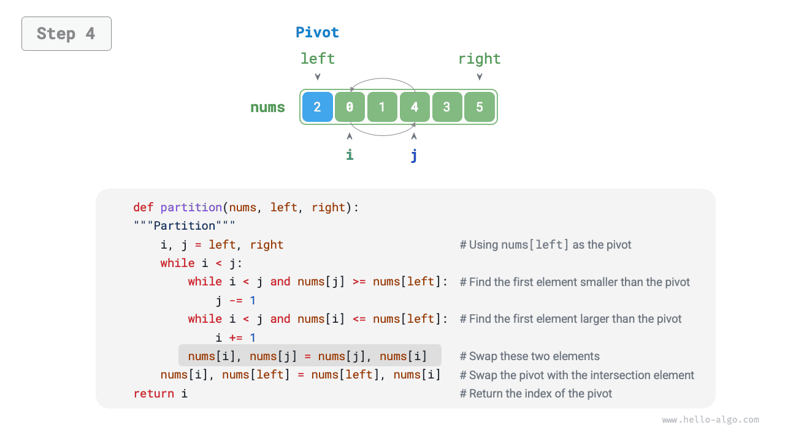
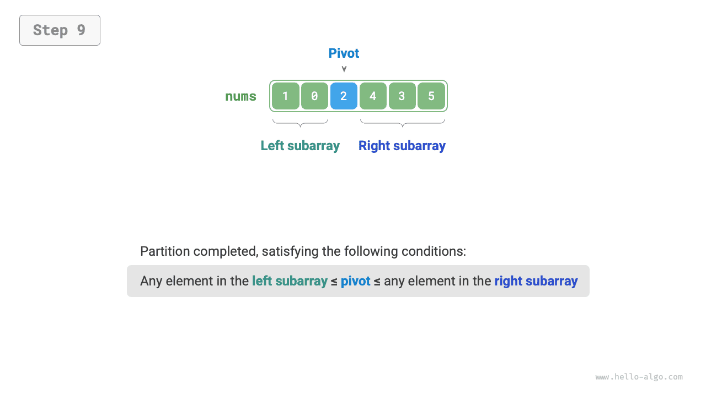
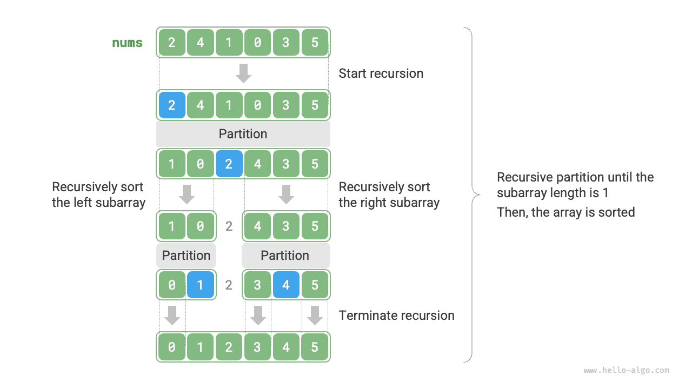

# Sắp xếp nhanh

<u>Sắp xếp nhanh (quick sort)</u> là một thuật toán sắp xếp dựa trên chiến lược chia để trị, vận hành hiệu quả và được ứng dụng rất rộng rãi.

Thao tác cốt lõi của sắp xếp nhanh là "phân hoạch lính canh" (sentinel partitioning), mục tiêu của nó là: chọn một phần tử trong mảng làm "phần tử chốt" (pivot), di chuyển tất cả các phần tử nhỏ hơn phần tử chốt về bên trái của nó, và di chuyển tất cả các phần tử lớn hơn phần tử chốt về bên phải của nó. Cụ thể, quy trình phân hoạch lính canh được thể hiện như hình dưới đây:

1. Chọn phần tử ngoài cùng bên trái của mảng làm phần tử chốt, khởi tạo hai con trỏ `i` và `j` lần lượt trỏ tới hai đầu của mảng.
2. Thiết lập một vòng lặp, trong mỗi vòng dùng `i` (`j`) lần lượt tìm kiếm phần tử đầu tiên lớn hơn (nhỏ hơn) phần tử chốt, sau đó hoán đổi hai phần tử này cho nhau.
3. Lặp lại bước `2.` cho đến khi `i` và `j` gặp nhau thì dừng lại, cuối cùng hoán đổi phần tử chốt về vị trí ranh giới phân chia giữa hai mảng con.

=== "<1>"
    

=== "<2>"
    

=== "<3>"
    

=== "<4>"
    

=== "<5>"
    

=== "<6>"
    

=== "<7>"
    

=== "<8>"
    

=== "<9>"
    

Sau khi hoàn tất phân hoạch lính canh, mảng ban đầu được chia thành ba phần: mảng con trái, phần tử chốt, mảng con phải, và thoả mãn "mọi phần tử mảng con trái $\leq$ phần tử chốt $\leq$ mọi phần tử mảng con phải". Do đó, tiếp theo chúng ta chỉ cần sắp xếp hai mảng con này.

!!! note "Chiến lược chia để trị của sắp xếp nhanh"

    Bản chất của phân hoạch lính canh là đơn giản hoá bài toán sắp xếp một mảng dài thành bài toán sắp xếp hai mảng ngắn hơn.

```src
[file]{quick_sort}-[class]{quick_sort}-[func]{partition}
```

## Quy trình thuật toán

Quy trình tổng thể của sắp xếp nhanh được thể hiện như hình dưới đây:

1. Đầu tiên, thực hiện một lần "phân hoạch lính canh" trên mảng ban đầu, thu được mảng con trái và mảng con phải chưa sắp xếp.
2. Sau đó, lần lượt thực hiện đệ quy "phân hoạch lính canh" trên mảng con trái và mảng con phải.
3. Tiếp tục đệ quy cho đến khi độ dài mảng con bằng 1 thì dừng lại, từ đó hoàn thành việc sắp xếp toàn bộ mảng.



```src
[file]{quick_sort}-[class]{quick_sort}-[func]{quick_sort}
```

## Đặc tính của thuật toán

- **Độ phức tạp thời gian là $O(n \log n)$, Sắp xếp không thích ứng**: Trong trường hợp trung bình, số tầng đệ quy của phân hoạch lính canh là $\log n$, tổng số vòng lặp trong mỗi tầng là $n$, tổng thể mất thời gian $O(n \log n)$. Trong trường hợp xấu nhất, mỗi vòng phân hoạch lính canh đều chia mảng có độ dài $n$ thành hai mảng con có độ dài $0$ và $n - 1$, lúc này số tầng đệ quy đạt tới $n$, số vòng lặp trong mỗi tầng là $n$, tổng thể mất thời gian $O(n^2)$.
- **Độ phức tạp không gian là $O(n)$, Sắp xếp tại chỗ**: Trong trường hợp mảng đầu vào có thứ tự hoàn toàn ngược lại, độ sâu đệ quy đạt mức xấu nhất là $n$, chiếm dụng $O(n)$ không gian khung ngăn xếp (call stack). Thao tác sắp xếp được thực hiện trực tiếp trên mảng ban đầu, không cần nhờ đến mảng phụ trợ.
- **Sắp xếp không ổn định**: Ở bước cuối cùng của phân hoạch lính canh, phần tử chốt có thể bị hoán đổi sang bên phải của phần tử có giá trị bằng nó.

## Tại sao sắp xếp nhanh lại nhanh?

Ngay từ tên gọi đã thấy sắp xếp nhanh sở hữu ưu thế vượt trội về mặt hiệu năng. Mặc dù độ phức tạp thời gian trung bình của sắp xếp nhanh bằng với "sắp xếp trộn" và "sắp xếp vun đống", nhưng thông thường hiệu năng thực tế của sắp xếp nhanh lại cao hơn, chủ yếu vì những lý do sau:

- **Xác suất xuất hiện trường hợp xấu nhất là rất thấp**: Mặc dù độ phức tạp thời gian xấu nhất của sắp xếp nhanh là $O(n^2)$, không ổn định bằng sắp xếp trộn, nhưng trong đại đa số các trường hợp, sắp xếp nhanh đều có thể chạy ở độ phức tạp $O(n \log n)$.
- **Hiệu quả sử dụng bộ nhớ đệm (cache) cao**: Khi thực hiện thao tác phân hoạch lính canh, hệ thống có thể tải toàn bộ mảng con vào bộ nhớ đệm, do đó hiệu năng truy cập phần tử là rất cao. Trong khi các thuật toán như "sắp xếp vun đống" đòi hỏi truy cập phần tử nhảy bước liên tục nên thiếu đi ưu thế này.
- **Hệ số hằng số trong độ phức tạp nhỏ**: Trong ba thuật toán trên, tổng số lượng thao tác so sánh, gán, hoán đổi của sắp xếp nhanh là ít nhất. Điều này tương tự như lý do tại sao "sắp xếp chèn" chạy nhanh hơn "sắp xếp nổi bọt".

## Tối ưu hoá phần tử chốt

**Hiệu năng thời gian của sắp xếp nhanh có thể bị suy giảm dưới một số dữ liệu đầu vào nhất định**. Lấy một ví dụ cực đoan, giả sử mảng đầu vào có thứ tự đảo ngược hoàn toàn, do chúng ta chọn phần tử ngoài cùng bên trái làm phần tử chốt, nên sau khi phân hoạch lính canh xong, phần tử chốt bị hoán đổi về tận cùng bên phải mảng, dẫn đến mảng con trái có độ dài $n - 1$ và mảng con phải có độ dài $0$. Cứ đệ quy tiếp tục như vậy, sau mỗi vòng phân hoạch lính canh đều có một mảng con có độ dài bằng $0$, chiến lược chia để trị bị vô hiệu hoá, sắp xếp nhanh thoái hoá thành một dạng gần giống với "sắp xếp nổi bọt".

Để hạn chế tối đa tình huống này xảy ra, **chúng ta có thể tối ưu hoá chiến lược lựa chọn phần tử chốt trong phân hoạch lính canh**. Ví dụ, chúng ta có thể chọn ngẫu nhiên một phần tử làm phần tử chốt. Tuy nhiên, nếu không may mắn, lần nào cũng chọn phải phần tử chốt không lý tưởng, hiệu năng vẫn sẽ không như ý muốn.

Cần lưu ý rằng các ngôn ngữ lập trình thường sinh ra "số giả ngẫu nhiên". Nếu chúng ta xây dựng một trường hợp kiểm thử đặc biệt nhắm vào chuỗi số giả ngẫu nhiên đó thì hiệu năng của sắp xếp nhanh vẫn có thể bị suy giảm.

Để cải tiến sâu hơn, chúng ta có thể chọn ba phần tử ứng viên trong mảng (thường là phần tử đầu, cuối và trung điểm của mảng), **và lấy giá trị trung vị (median) của ba phần tử ứng viên này làm phần tử chốt**. Làm như vậy, xác suất phần tử chốt "không quá nhỏ cũng không quá lớn" sẽ tăng lên đáng kể. Tất nhiên, chúng ta còn có thể chọn nhiều phần tử ứng viên hơn nữa để nâng cao hơn tính vững chắc (robustness) của thuật toán. Sau khi áp dụng phương pháp này, xác suất độ phức tạp thời gian bị suy giảm về $O(n^2)$ sẽ giảm đi rất nhiều.

Mã nguồn ví dụ như sau:

```src
[file]{quick_sort}-[class]{quick_sort_median}-[func]{partition}
```

## Tối ưu hoá độ sâu đệ quy

**Dưới một số dữ liệu đầu vào, sắp xếp nhanh có thể chiếm dụng nhiều không gian ngăn xếp**. Lấy mảng đầu vào đã sắp xếp hoàn toàn làm ví dụ, đặt độ dài mảng con trong đệ quy là $m$, mỗi vòng phân hoạch lính canh đều tạo ra mảng con trái có độ dài $0$ và mảng con phải có độ dài $m - 1$, điều này đồng nghĩa với việc mỗi tầng gọi đệ quy chỉ giảm quy mô bài toán đi rất ít (chỉ giảm 1 phần tử), chiều cao của cây đệ quy sẽ đạt tới $n - 1$, lúc này cần chiếm dụng không gian khung ngăn xếp kích thước $O(n)$.

Để tránh việc tích luỹ không gian khung ngăn xếp, chúng ta có thể sau khi hoàn thành phân hoạch lính canh ở mỗi vòng, so sánh độ dài của hai mảng con, **chỉ thực hiện gọi đệ quy trên mảng con ngắn hơn**. Do độ dài của mảng con ngắn hơn không vượt quá $n / 2$, vì vậy phương pháp này có thể đảm bảo độ sâu đệ quy không vượt quá $\log n$, từ đó tối ưu hoá độ phức tạp không gian trong trường hợp xấu nhất về $O(\log n)$. Mã nguồn như sau:

```src
[file]{quick_sort}-[class]{quick_sort_tail_call}-[func]{quick_sort}
```
