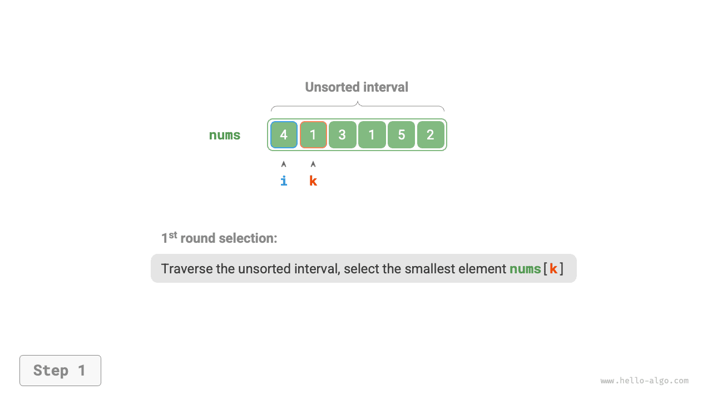
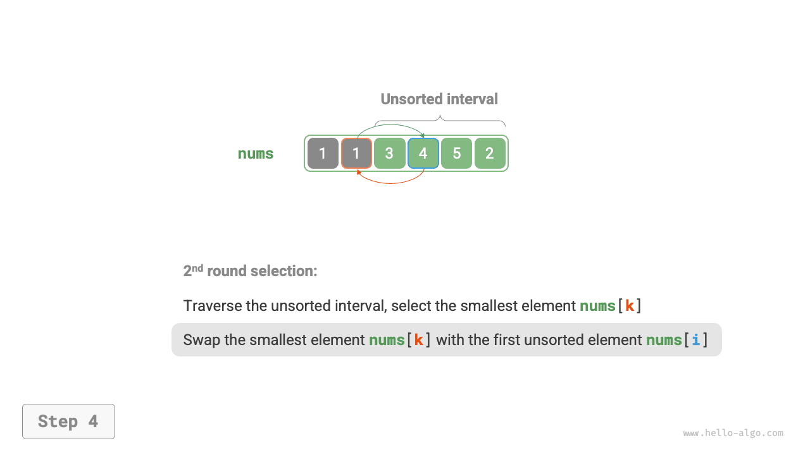
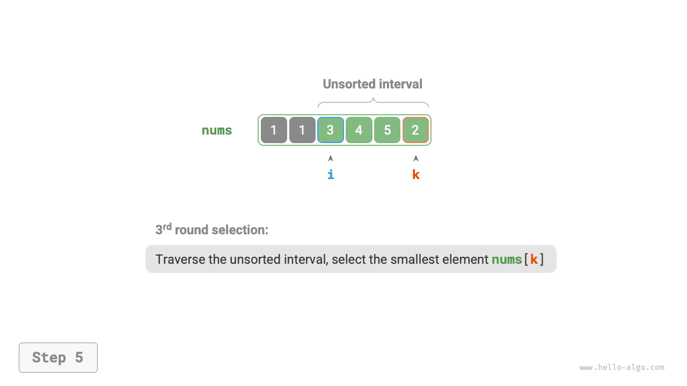
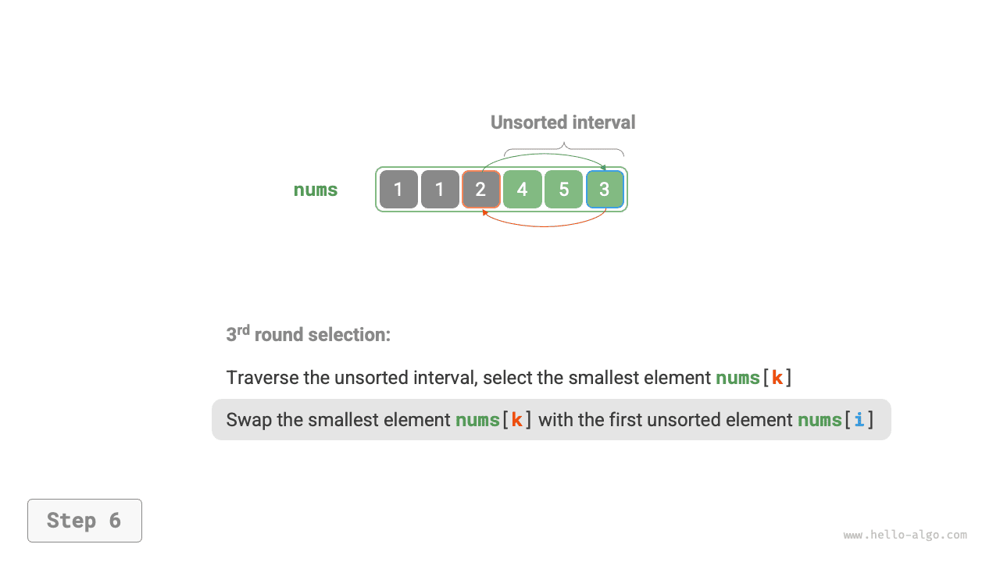
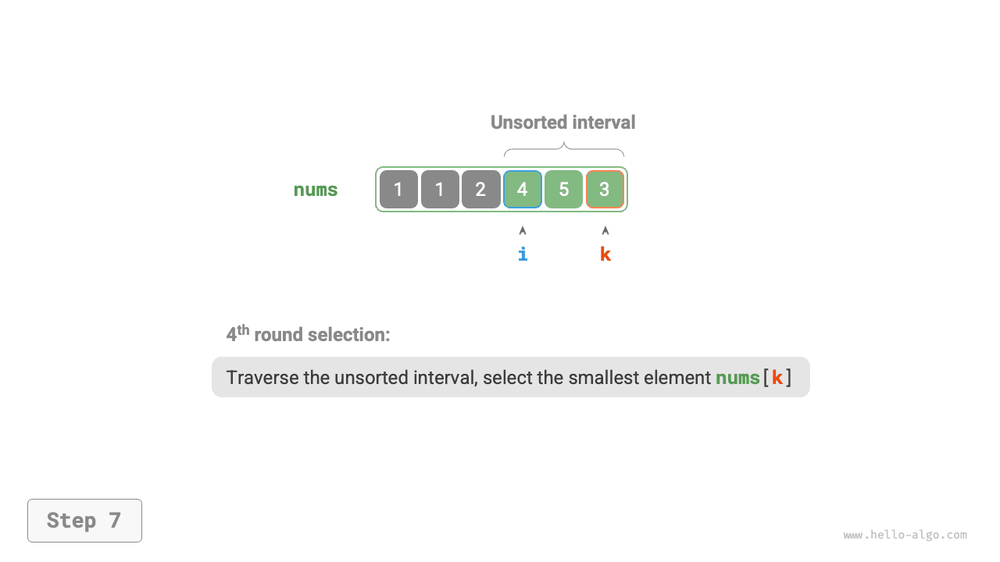
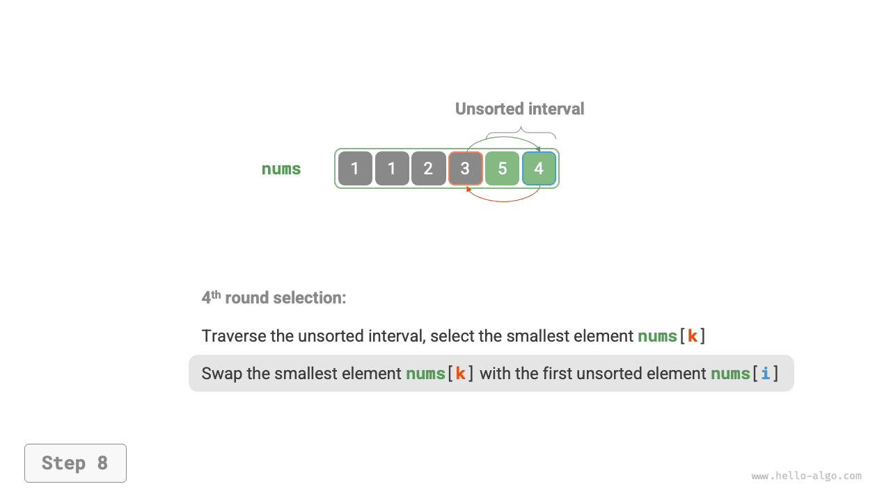
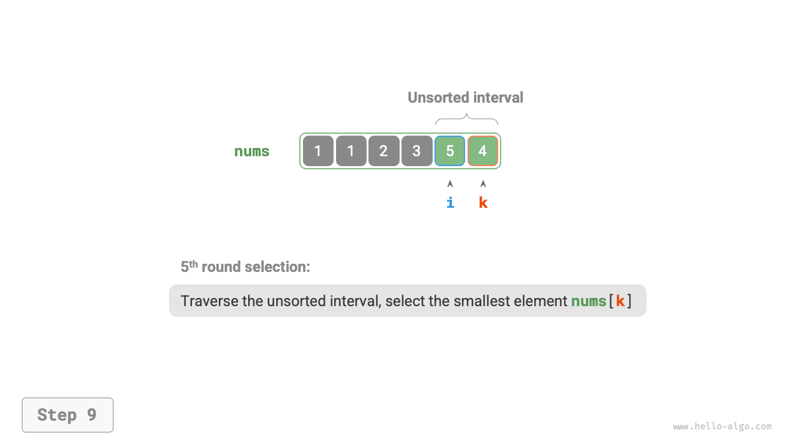

# Sắp xếp chọn

Nguyên lý hoạt động của <u>sắp xếp chọn (selection sort)</u> rất đơn giản: mở một vòng lặp, trong mỗi vòng chọn phần tử nhỏ nhất từ khoảng chưa sắp xếp và đặt nó vào cuối khoảng đã sắp xếp.

Giả sử độ dài của mảng là $n$ ，quy trình thuật toán sắp xếp chọn được thể hiện như hình dưới đây:

1. Ở trạng thái ban đầu, toàn bộ các phần tử đều chưa được sắp xếp, tức là khoảng (chỉ số) chưa sắp xếp là $[0, n-1]$ 。
2. Chọn phần tử nhỏ nhất trong khoảng $[0, n-1]$ ，hoán đổi nó với phần tử tại chỉ số $0$ 。Sau khi hoàn tất, 1 phần tử đầu tiên của mảng đã được sắp xếp.
3. Chọn phần tử nhỏ nhất trong khoảng $[1, n-1]$ ，hoán đổi nó với phần tử tại chỉ số $1$ 。Sau khi hoàn tất, 2 phần tử đầu tiên của mảng đã được sắp xếp.
4. Cứ thế tiếp tục. Sau $n - 1$ vòng chọn và hoán đổi, $n - 1$ phần tử đầu tiên của mảng đã được sắp xếp.
5. Phần tử duy nhất còn lại chắc chắn là phần tử lớn nhất, không cần phải sắp xếp nữa, do đó mảng đã được sắp xếp hoàn tất.

=== "<1>"
    

=== "<2>"
    

=== "<3>"
    

=== "<4>"
    

=== "<5>"
    

=== "<6>"
    

=== "<7>"
    

=== "<8>"
    

=== "<9>"
    

=== "<10>"
    

=== "<11>"
    

Trong mã nguồn, chúng ta dùng $k$ để ghi lại chỉ số của phần tử nhỏ nhất bên trong khoảng chưa sắp xếp:

```src
[file]{selection_sort}-[class]{}-[func]{selection_sort}
```

## Đặc tính của thuật toán

- **Độ phức tạp thời gian là $O(n^2)$、Sắp xếp không thích ứng**: Vòng lặp ngoài có tổng cộng $n - 1$ vòng, vòng lặp trong ở vòng đầu tiên thực thi $n - 1$ lần, ở vòng cuối cùng thực thi $1$ lần, tức là các vòng lặp trong lần lượt thực thi $n - 1$、$n - 2$、$\dots$、$2$、$1$ lần, tổng cộng là $\frac{n(n - 1)}{2}$ lần.
- **Độ phức tạp không gian là $O(1)$、Sắp xếp tại chỗ**: Các con trỏ $i$ và $j$ chỉ sử dụng không gian phụ trợ kích thước hằng số.
- **Sắp xếp không ổn định**: Như hình dưới đây, phần tử `nums[i]` có thể bị hoán đổi về bên phải của phần tử có giá trị bằng nó, dẫn đến việc thứ tự tương đối giữa chúng bị thay đổi.


