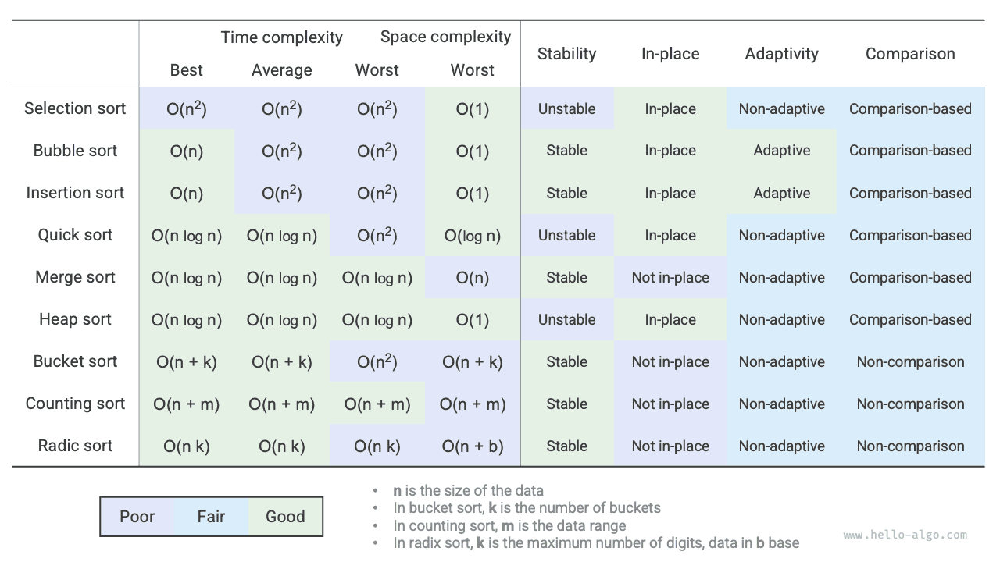

# Tóm tắt

### Điểm mấu chốt cần nhớ

- Sắp xếp nổi bọt thực hiện sắp xếp bằng cách hoán đổi các phần tử liền kề. Bằng cách thêm một biến cờ hiệu để trả về sớm khi mảng đã có thứ tự, chúng ta có thể tối ưu hoá độ phức tạp thời gian tốt nhất của sắp xếp nổi bọt về mức $O(n)$ 。
- Sắp xếp chèn trong mỗi vòng sẽ chèn phần tử từ khoảng chưa sắp xếp vào đúng vị trí trong khoảng đã sắp xếp. Mặc dù độ phức tạp thời gian của sắp xếp chèn là $O(n^2)$ ，nhưng do các thao tác đơn vị tương đối ít nên nó rất được ưa chuộng trong các tác vụ sắp xếp với lượng dữ liệu nhỏ.
- Sắp xếp nhanh dựa trên thao tác phân hoạch lính canh để thực hiện sắp xếp. Trong phân hoạch lính canh, có khả năng mỗi lần đều chọn phải phần tử chốt tồi nhất, dẫn đến độ phức tạp thời gian suy giảm về $O(n^2)$ 。Đưa vào cơ chế chọn phần tử chốt theo trung vị hoặc ngẫu nhiên có thể giảm bớt xác suất xảy ra sự suy giảm này. Bằng cách ưu tiên gọi đệ quy trên mảng con ngắn hơn, chúng ta có thể giảm độ sâu đệ quy một cách hiệu quả, tối ưu hoá độ phức tạp không gian về mức $O(\log n)$ 。
- Sắp xếp trộn bao gồm hai giai đoạn: chia và trộn, thể hiện điển hình chiến lược chia để trị. Trong sắp xếp trộn, sắp xếp mảng cần tạo thêm mảng phụ trợ với độ phức tạp không gian là $O(n)$ ；tuy nhiên khi sắp xếp danh sách liên kết, độ phức tạp không gian có thể tối ưu hoá về mức $O(1)$ 。
- Sắp xếp theo ngăn bao gồm ba bước: chia dữ liệu vào các ngăn, sắp xếp trong từng ngăn và hợp nhất kết quả. Nó cũng thể hiện chiến lược chia để trị và rất thích hợp cho tình huống lượng dữ liệu khổng lồ. Mấu chốt của sắp xếp theo ngăn nằm ở việc phân phối đều dữ liệu vào các ngăn.
- Sắp xếp đếm là một trường hợp đặc biệt của sắp xếp theo ngăn, nó thực hiện sắp xếp bằng cách đếm số lần xuất hiện của dữ liệu. Sắp xếp đếm thích hợp cho tình huống lượng dữ liệu lớn nhưng phạm vi dữ liệu hữu hạn, đồng thời yêu cầu dữ liệu có thể chuyển đổi thành số nguyên không âm.
- Sắp xếp cơ số thực hiện sắp xếp dữ liệu thông qua việc sắp xếp lần lượt theo từng hàng chữ số, yêu cầu dữ liệu có thể biểu diễn dưới dạng các con số có số lượng chữ số cố định.
- Tổng kết lại, chúng ta mong muốn tìm thấy một thuật toán sắp xếp có hiệu năng cao, ổn định, tại chỗ và có tính thích ứng. Tuy nhiên, cũng giống như các cấu trúc dữ liệu và thuật toán khác, không có một thuật toán sắp xếp nào có thể đồng thời thoả mãn toàn bộ các điều kiện này. Trong ứng dụng thực tế, chúng ta cần căn cứ vào đặc tính của dữ liệu để lựa chọn thuật toán sắp xếp phù hợp.
- Hình dưới đây so sánh các thuật toán sắp xếp chủ lưu về các tiêu chí hiệu năng, tính ổn định, tính tại chỗ và tính thích ứng.

### Hỏi & Đáp (Q & A)

**Q**：Tính ổn định của thuật toán sắp xếp là điều bắt buộc trong những trường hợp nào?

Trong thực tế, chúng ta có thể cần sắp xếp dựa trên một thuộc tính nhất định của đối tượng. Ví dụ, sinh viên có hai thuộc tính là tên và chiều cao, chúng ta muốn hiện thực sắp xếp nhiều cấp: trước tiên sắp xếp theo tên, thu được `(A, 180) (B, 185) (C, 170) (D, 170)` ；sau đó sắp xếp theo chiều cao. Nếu thuật toán sắp xếp không ổn định, chúng ta có thể nhận được kết quả `(D, 170) (C, 170) (A, 180) (B, 185)` 。

Có thể nhận thấy vị trí của sinh viên D và C đã bị hoán đổi cho nhau, tính có thứ tự theo tên đã bị phá vỡ, và đây là điều chúng ta không mong muốn.

**Q**：Trong phân hoạch lính canh, thứ tự "tìm từ phải sang trái" và "tìm từ trái sang phải" có thể hoán đổi cho nhau không?

Không được. Khi chúng ta lấy phần tử ngoài cùng bên trái làm phần tử chốt, bắt buộc phải "tìm từ phải sang trái" trước rồi mới "tìm từ trái sang phải". Kết luận này nghe có vẻ hơi phản trực giác, chúng ta hãy cùng phân tích nguyên nhân.

Bước cuối cùng của hàm phân hoạch `partition()` là hoán đổi `nums[left]` và `nums[i]` 。Sau khi hoán đổi xong, toàn bộ các phần tử bên trái phần tử chốt đều phải `<=` phần tử chốt, **điều này đòi hỏi trước bước hoán đổi cuối cùng, điều kiện `nums[left] >= nums[i]` bắt buộc phải thoả mãn**. Giả sử chúng ta "tìm từ trái sang phải" trước, thì nếu không tìm thấy phần tử nào lớn hơn phần tử chốt, **chúng ta sẽ thoát khỏi vòng lặp khi `i == j`, lúc này có thể `nums[j] == nums[i] > nums[left]`**。Nói cách khác, thao tác hoán đổi cuối cùng sẽ đổi một phần tử lớn hơn phần tử chốt về tận cùng bên trái của mảng, dẫn đến việc phân hoạch lính canh bị thất bại.

Lấy ví dụ, cho mảng `[0, 0, 0, 0, 1]` ，nếu "tìm từ trái sang phải" trước, sau khi phân hoạch mảng sẽ trở thành `[1, 0, 0, 0, 0]` ，kết quả này hoàn toàn sai.

Suy ngẫm sâu hơn một chút, nếu chúng ta chọn `nums[right]` làm phần tử chốt, thì quy tắc sẽ đảo ngược lại chính xác: bắt buộc phải "tìm từ trái sang phải" trước.

**Q**：Về việc tối ưu hoá độ sâu đệ quy của sắp xếp nhanh, tại sao việc chọn mảng ngắn hơn lại đảm bảo độ sâu đệ quy không vượt quá $\log n$ ？

Độ sâu đệ quy chính là số lượng các hàm đệ quy hiện tại chưa trả về trên ngăn xếp. Mỗi vòng phân hoạch lính canh chia mảng ban đầu thành hai mảng con. Sau khi tối ưu độ sâu đệ quy, độ dài của mảng con được chọn để gọi đệ quy tiếp theo tối đa chỉ bằng một nửa độ dài mảng ban đầu. Giả sử trường hợp xấu nhất xảy ra liên tục (luôn bằng một nửa độ dài), thì độ sâu đệ quy cuối cùng sẽ là $\log n$ 。

Nhìn lại thuật toán sắp xếp nhanh nguyên bản, chúng ta có khả năng liên tục gọi đệ quy trên mảng có độ dài lớn hơn, trong trường hợp xấu nhất các độ dài lần lượt là $n$、$n - 1$、$\dots$、$2$、$1$ ，độ sâu đệ quy sẽ là $n$ 。Việc tối ưu hoá độ sâu đệ quy có thể triệt tiêu hoàn toàn tình huống này.

**Q**：Khi tất cả các phần tử trong mảng đều bằng nhau, độ phức tạp thời gian của sắp xếp nhanh có phải là $O(n^2)$ không? Làm thế nào để xử lý tình huống thoái hoá này?

Đúng vậy. Đối với tình huống này, có thể cân nhắc thông qua phân hoạch lính canh để chia mảng thành ba phần: nhỏ hơn, bằng và lớn hơn phần tử chốt (phân hoạch 3 chiều / Dutch National Flag). Sau đó chỉ gọi đệ quy trên hai phần nhỏ hơn và lớn hơn. Dưới phương pháp này, với mảng đầu vào có toàn bộ các phần tử bằng nhau, chỉ cần đúng một vòng phân hoạch là có thể hoàn tất việc sắp xếp.

**Q**：Tại sao độ phức tạp thời gian trong trường hợp xấu nhất của sắp xếp theo ngăn lại là $O(n^2)$ ？

Trong trường hợp xấu nhất, toàn bộ các phần tử đều bị phân bổ vào cùng một ngăn duy nhất. Nếu chúng ta áp dụng một thuật toán $O(n^2)$ để sắp xếp các phần tử bên trong ngăn đó, thì độ phức tạp thời gian tổng thể sẽ là $O(n^2)$ 。
