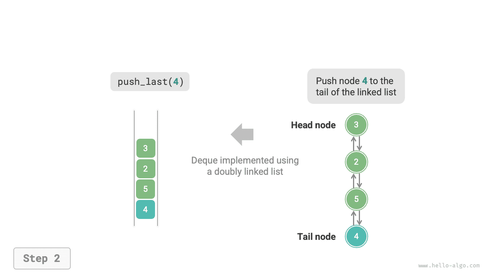
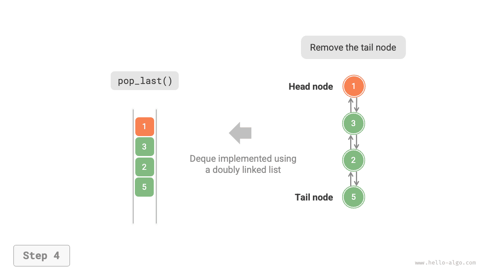
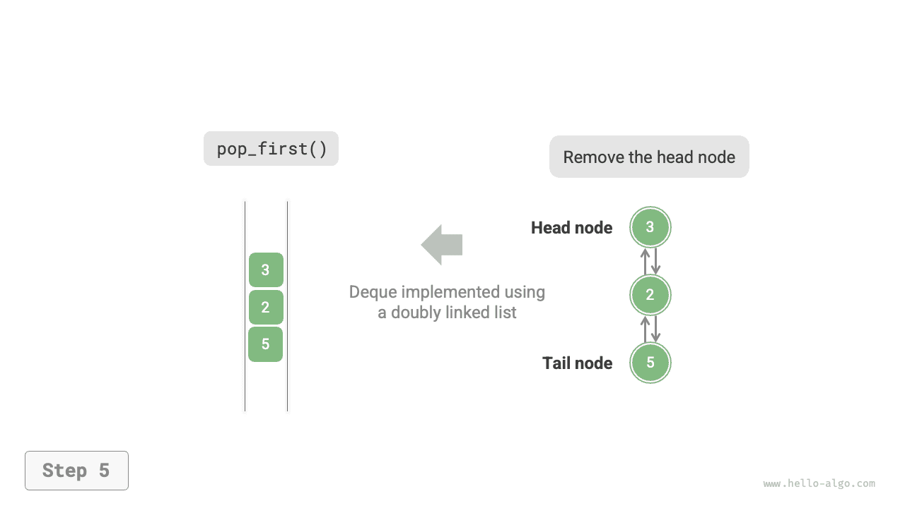
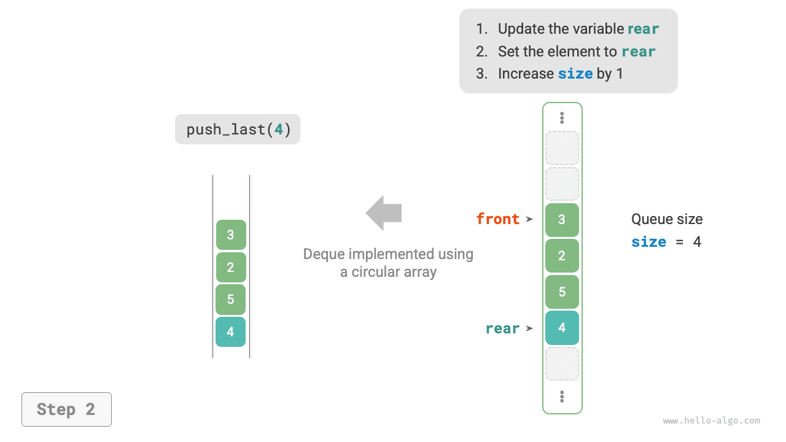
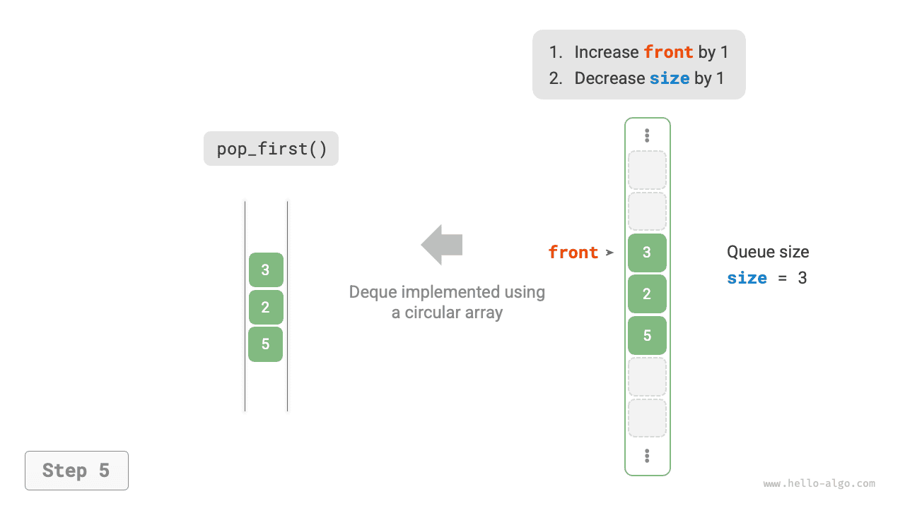

# Hàng đợi hai đầu

Trong hàng đợi thông thường, chúng ta chỉ có thể xoá phần tử ở đầu hàng hoặc thêm phần tử ở cuối hàng. Như minh hoạ trong hình dưới đây, <u>hàng đợi hai đầu (double-ended queue, deque)</u> mang lại độ linh hoạt cao hơn, cho phép thực hiện thêm hoặc xoá phần tử ở cả hai đầu (đầu hàng và cuối hàng).


## Các thao tác thường dùng trên hàng đợi hai đầu

Các thao tác thường dùng trên hàng đợi hai đầu được liệt kê trong bảng dưới đây, tên phương thức cụ thể phụ thuộc vào ngôn ngữ lập trình sử dụng.

<p align="center"> Bảng <id> &nbsp; Hiệu năng thao tác của hàng đợi hai đầu </p>

| Tên phương thức | Mô tả             | Độ phức tạp thời gian |
| -------------- | ---------------- | ---------- |
| `push_first()` | Thêm phần tử vào đầu hàng đợi | $O(1)$     |
| `push_last()`  | Thêm phần tử vào cuối hàng đợi | $O(1)$     |
| `pop_first()`  | Xoá phần tử ở đầu hàng đợi     | $O(1)$     |
| `pop_last()`   | Xoá phần tử ở cuối hàng đợi     | $O(1)$     |
| `peek_first()` | Truy cập phần tử ở đầu hàng đợi | $O(1)$     |
| `peek_last()`  | Truy cập phần tử ở cuối hàng đợi | $O(1)$     |

Tương tự, chúng ta có thể sử dụng trực tiếp các lớp hàng đợi hai đầu đã được hiện thực sẵn trong ngôn ngữ lập trình:

=== "Python"

    ```python title="deque.py"
    from collections import deque

    # Khởi tạo hàng đợi hai đầu
    deq: deque[int] = deque()

    # Thêm phần tử vào hàng đợi
    deq.append(2)      # Thêm vào cuối hàng đợi
    deq.append(5)
    deq.append(4)
    deq.appendleft(3)  # Thêm vào đầu hàng đợi
    deq.appendleft(1)

    # Truy cập phần tử
    front: int = deq[0]  # Phần tử đầu hàng đợi
    rear: int = deq[-1]  # Phần tử cuối hàng đợi

    # Lấy phần tử ra khỏi hàng đợi
    pop_front: int = deq.popleft()  # Lấy phần tử đầu ra khỏi hàng đợi
    pop_rear: int = deq.pop()       # Lấy phần tử cuối ra khỏi hàng đợi

    # Lấy độ dài của hàng đợi hai đầu
    size: int = len(deq)

    # Kiểm tra hàng đợi hai đầu có rỗng không
    is_empty: bool = len(deq) == 0
    ```

=== "C++"

    ```cpp title="deque.cpp"
    /* Khởi tạo hàng đợi hai đầu */
    deque<int> deque;

    /* Thêm phần tử vào hàng đợi */
    deque.push_back(2);   // Thêm vào cuối hàng đợi
    deque.push_back(5);
    deque.push_back(4);
    deque.push_front(3);  // Thêm vào đầu hàng đợi
    deque.push_front(1);

    /* Truy cập phần tử */
    int front = deque.front(); // Phần tử đầu hàng đợi
    int back = deque.back();   // Phần tử cuối hàng đợi

    /* Lấy phần tử ra khỏi hàng đợi */
    deque.pop_front();  // Lấy phần tử đầu ra khỏi hàng đợi
    deque.pop_back();   // Lấy phần tử cuối ra khỏi hàng đợi

    /* Lấy độ dài của hàng đợi hai đầu */
    int size = deque.size();

    /* Kiểm tra hàng đợi hai đầu có rỗng không */
    bool empty = deque.empty();
    ```

=== "Java"

    ```java title="deque.java"
    /* Khởi tạo hàng đợi hai đầu */
    Deque<Integer> deque = new LinkedList<>();

    /* Thêm phần tử vào hàng đợi */
    deque.offerLast(2);   // Thêm vào cuối hàng đợi
    deque.offerLast(5);
    deque.offerLast(4);
    deque.offerFirst(3);  // Thêm vào đầu hàng đợi
    deque.offerFirst(1);

    /* Truy cập phần tử */
    int peekFirst = deque.peekFirst();  // Phần tử đầu hàng đợi
    int peekLast = deque.peekLast();    // Phần tử cuối hàng đợi

    /* Lấy phần tử ra khỏi hàng đợi */
    int popFirst = deque.pollFirst();  // Lấy phần tử đầu ra khỏi hàng đợi
    int popLast = deque.pollLast();    // Lấy phần tử cuối ra khỏi hàng đợi

    /* Lấy độ dài của hàng đợi hai đầu */
    int size = deque.size();

    /* Kiểm tra hàng đợi hai đầu có rỗng không */
    boolean isEmpty = deque.isEmpty();
    ```

=== "C#"

    ```csharp title="deque.cs"
    /* Khởi tạo hàng đợi hai đầu */
    // Trong C#, LinkedList thường được sử dụng làm deque
    LinkedList<int> deque = new();

    /* Thêm phần tử vào hàng đợi */
    deque.AddLast(2);   // Thêm vào cuối hàng đợi
    deque.AddLast(5);
    deque.AddLast(4);
    deque.AddFirst(3);  // Thêm vào đầu hàng đợi
    deque.AddFirst(1);

    /* Truy cập phần tử */
    int peekFirst = deque.First!.Value; // Phần tử đầu hàng đợi
    int peekLast = deque.Last!.Value;   // Phần tử cuối hàng đợi

    /* Lấy phần tử ra khỏi hàng đợi */
    deque.RemoveFirst(); // Lấy phần tử đầu ra khỏi hàng đợi
    deque.RemoveLast();  // Lấy phần tử cuối ra khỏi hàng đợi

    /* Lấy độ dài của hàng đợi hai đầu */
    int size = deque.Count;

    /* Kiểm tra hàng đợi hai đầu có rỗng không */
    bool isEmpty = deque.Count == 0;
    ```

=== "Go"

    ```go title="deque_test.go"
    /* Khởi tạo hàng đợi hai đầu */
    // Trong Go, có thể dùng list làm hàng đợi hai đầu
    deq := list.New()

    /* Thêm phần tử vào hàng đợi */
    deq.PushBack(2)  // Thêm vào cuối hàng đợi
    deq.PushBack(5)
    deq.PushBack(4)
    deq.PushFront(3) // Thêm vào đầu hàng đợi
    deq.PushFront(1)

    /* Truy cập phần tử */
    front := deq.Front().Value.(int) // Phần tử đầu hàng đợi
    rear := deq.Back().Value.(int)   // Phần tử cuối hàng đợi

    /* Lấy phần tử ra khỏi hàng đợi */
    popFront := deq.Front() // Lấy phần tử đầu ra khỏi hàng đợi
    deq.Remove(popFront)
    popRear := deq.Back()   // Lấy phần tử cuối ra khỏi hàng đợi
    deq.Remove(popRear)

    /* Lấy độ dài của hàng đợi hai đầu */
    size := deq.Len()

    /* Kiểm tra hàng đợi hai đầu có rỗng không */
    isEmpty := deq.Len() == 0
    ```

=== "Swift"

    ```swift title="deque.swift"
    /* Khởi tạo hàng đợi hai đầu */
    // Swift không có cấu trúc Deque tích hợp sẵn, ở đây sử dụng Array để mô phỏng
    var deque: [Int] = []

    /* Thêm phần tử vào hàng đợi */
    deque.append(2) // Thêm vào cuối hàng đợi
    deque.append(5)
    deque.append(4)
    deque.insert(3, at: 0) // Thêm vào đầu hàng đợi
    deque.insert(1, at: 0)

    /* Truy cập phần tử */
    let peekFirst = deque.first! // Phần tử đầu hàng đợi
    let peekLast = deque.last!   // Phần tử cuối hàng đợi

    /* Lấy phần tử ra khỏi hàng đợi */
    // Thao tác removeFirst() có độ phức tạp thời gian là O(n)
    let popFirst = deque.removeFirst() // Lấy phần tử đầu ra khỏi hàng đợi
    let popLast = deque.removeLast()   // Lấy phần tử cuối ra khỏi hàng đợi

    /* Lấy độ dài của hàng đợi hai đầu */
    let size = deque.count

    /* Kiểm tra hàng đợi hai đầu có rỗng không */
    let isEmpty = deque.isEmpty
    ```

=== "JS"

    ```javascript title="deque.js"
    /* Khởi tạo hàng đợi hai đầu */
    // JavaScript không có cấu trúc Deque tích hợp sẵn, ở đây sử dụng Array để mô phỏng
    const deque = [];

    /* Thêm phần tử vào hàng đợi */
    deque.push(2);
    deque.push(5);
    deque.push(4);
    // Thao tác unshift() có độ phức tạp thời gian là O(n)
    deque.unshift(3);
    deque.unshift(1);

    /* Truy cập phần tử */
    const peekFirst = deque[0];
    const peekLast = deque[deque.length - 1];

    /* Lấy phần tử ra khỏi hàng đợi */
    // Thao tác shift() có độ phức tạp thời gian là O(n)
    const popFirst = deque.shift();
    const popLast = deque.pop();

    /* Lấy độ dài của hàng đợi hai đầu */
    const size = deque.length;

    /* Kiểm tra hàng đợi hai đầu có rỗng không */
    const isEmpty = deque.length === 0;
    ```

=== "TS"

    ```typescript title="deque.ts"
    /* Khởi tạo hàng đợi hai đầu */
    // TypeScript không có cấu trúc Deque tích hợp sẵn, ở đây sử dụng Array để mô phỏng
    const deque: number[] = [];

    /* Thêm phần tử vào hàng đợi */
    deque.push(2);
    deque.push(5);
    deque.push(4);
    // Thao tác unshift() có độ phức tạp thời gian là O(n)
    deque.unshift(3);
    deque.unshift(1);

    /* Truy cập phần tử */
    const peekFirst: number = deque[0];
    const peekLast: number = deque[deque.length - 1];

    /* Lấy phần tử ra khỏi hàng đợi */
    // Thao tác shift() có độ phức tạp thời gian là O(n)
    const popFirst: number = deque.shift()!;
    const popLast: number = deque.pop()!;

    /* Lấy độ dài của hàng đợi hai đầu */
    const size: number = deque.length;

    /* Kiểm tra hàng đợi hai đầu có rỗng không */
    const isEmpty: boolean = deque.length === 0;
    ```

=== "Dart"

    ```dart title="deque.dart"
    /* Khởi tạo hàng đợi hai đầu */
    Queue<int> deque = Queue<int>();

    /* Thêm phần tử vào hàng đợi */
    deque.addLast(2);   // Thêm vào cuối hàng đợi
    deque.addLast(5);
    deque.addLast(4);
    deque.addFirst(3);  // Thêm vào đầu hàng đợi
    deque.addFirst(1);

    /* Truy cập phần tử */
    int peekFirst = deque.first; // Phần tử đầu hàng đợi
    int peekLast = deque.last;   // Phần tử cuối hàng đợi

    /* Lấy phần tử ra khỏi hàng đợi */
    int popFirst = deque.removeFirst(); // Lấy phần tử đầu ra khỏi hàng đợi
    int popLast = deque.removeLast();   // Lấy phần tử cuối ra khỏi hàng đợi

    /* Lấy độ dài của hàng đợi hai đầu */
    int size = deque.length;

    /* Kiểm tra hàng đợi hai đầu có rỗng không */
    bool isEmpty = deque.isEmpty;
    ```

=== "Rust"

    ```rust title="deque.rs"
    /* Khởi tạo hàng đợi hai đầu */
    let mut deque: VecDeque<i32> = VecDeque::new();

    /* Thêm phần tử vào hàng đợi */
    deque.push_back(2);  // Thêm vào cuối hàng đợi
    deque.push_back(5);
    deque.push_back(4);
    deque.push_front(3); // Thêm vào đầu hàng đợi
    deque.push_front(1);

    /* Truy cập phần tử */
    let peek_first: &i32 = deque.front().unwrap(); // Phần tử đầu hàng đợi
    let peek_last: &i32 = deque.back().unwrap();   // Phần tử cuối hàng đợi

    /* Lấy phần tử ra khỏi hàng đợi */
    let pop_first: i32 = deque.pop_front().unwrap(); // Lấy phần tử đầu ra khỏi hàng đợi
    let pop_last: i32 = deque.pop_back().unwrap();   // Lấy phần tử cuối ra khỏi hàng đợi

    /* Lấy độ dài của hàng đợi hai đầu */
    let size: usize = deque.len();

    /* Kiểm tra hàng đợi hai đầu có rỗng không */
    let is_empty: bool = deque.is_empty();
    ```

=== "C"

    ```c title="deque.c"
    // C chưa cung cấp cấu trúc hàng đợi hai đầu tích hợp sẵn
    ```

=== "Kotlin"

    ```kotlin title="deque.kt"
    /* Khởi tạo hàng đợi hai đầu */
    val deque: Deque<Int> = LinkedList()

    /* Thêm phần tử vào hàng đợi */
    deque.offerLast(2)  // Thêm vào cuối hàng đợi
    deque.offerLast(5)
    deque.offerLast(4)
    deque.offerFirst(3) // Thêm vào đầu hàng đợi
    deque.offerFirst(1)

    /* Truy cập phần tử */
    val peekFirst = deque.peekFirst() // Phần tử đầu hàng đợi
    val peekLast = deque.peekLast()   // Phần tử cuối hàng đợi

    /* Lấy phần tử ra khỏi hàng đợi */
    val popFirst = deque.pollFirst() // Lấy phần tử đầu ra khỏi hàng đợi
    val popLast = deque.pollLast()   // Lấy phần tử cuối ra khỏi hàng đợi

    /* Lấy độ dài của hàng đợi hai đầu */
    val size = deque.size

    /* Kiểm tra hàng đợi hai đầu có rỗng không */
    val isEmpty = deque.isEmpty()
    ```

=== "Ruby"

    ```ruby title="deque.rb"
    # Khởi tạo hàng đợi hai đầu
    # Ruby không có cấu trúc Deque tích hợp sẵn, ở đây sử dụng Array để mô phỏng
    deque = []

    # Thêm phần tử vào hàng đợi
    deque.push(2)
    deque.push(5)
    deque.push(4)
    deque.unshift(3)
    deque.unshift(1)

    # Truy cập phần tử
    peek_first = deque.first
    peek_last = deque.last

    # Lấy phần tử ra khỏi hàng đợi
    pop_first = deque.shift
    pop_last = deque.pop

    # Lấy độ dài của hàng đợi hai đầu
    size = deque.length

    # Kiểm tra hàng đợi hai đầu có rỗng không
    is_empty = deque.empty?
    ```

=== "Zig"

    ```zig title="deque.zig"
    // Khởi tạo hàng đợi hai đầu
    // Trong Zig, có thể dùng TailQueue làm hàng đợi hai đầu
    var deque = std.DoublyLinkedList(i32){};

    // Thêm phần tử vào hàng đợi
    var node1 = std.DoublyLinkedList(i32).Node{ .data = 2 };
    var node2 = std.DoublyLinkedList(i32).Node{ .data = 5 };
    var node3 = std.DoublyLinkedList(i32).Node{ .data = 4 };
    var node4 = std.DoublyLinkedList(i32).Node{ .data = 3 };
    var node5 = std.DoublyLinkedList(i32).Node{ .data = 1 };
    deque.append(&node1);  // Thêm vào cuối hàng đợi
    deque.append(&node2);
    deque.append(&node3);
    deque.prepend(&node4); // Thêm vào đầu hàng đợi
    deque.prepend(&node5);

    // Truy cập phần tử
    const peek_first = deque.first.?.data; // Phần tử đầu hàng đợi
    const peek_last = deque.last.?.data;   // Phần tử cuối hàng đợi

    // Lấy phần tử ra khỏi hàng đợi
    const pop_first = deque.popFirst().?.data; // Lấy phần tử đầu ra khỏi hàng đợi
    const pop_last = deque.pop().?.data;       // Lấy phần tử cuối ra khỏi hàng đợi

    // Lấy độ dài của hàng đợi hai đầu
    const size = deque.len;

    // Kiểm tra hàng đợi hai đầu có rỗng không
    const is_empty = deque.len == 0;
    ```

??? pythontutor "Trực quan hoá thực thi"

    https://pythontutor.com/render.html#code=from%20collections%20import%20deque%0A%0A%22%22%22Driver%20Code%22%22%22%0Aif%20__name__%20%3D%3D%20%22__main__%22%3A%0A%20%20%20%20#%20%E5%88%9D%E5%A7%8B%E5%8C%96%E5%8F%8C%E5%90%91%E9%98%9F%E5%88%97%0A%20%20%20%20deq%20%3D%20deque%28%29%0A%0A%20%20%20%20#%20%E5%85%83%E7%B4%A0%E5%85%A5%E9%98%9F%0A%20%20%20%20deq.append%282%29%20%20#%20%E6%B7%BB%E5%8A%A0%E8%87%B3%E9%98%9F%E5%B0%BE%0A%20%20%20%20deq.append%285%29%0A%20%20%20%20deq.append%284%29%0A%20%20%20%20deq.appendleft%283%29%20%20#%20%E6%B7%BB%E5%8A%A0%E8%87%B3%E9%98%9F%E9%A6%96%0A%20%20%20%20deq.appendleft%281%29%0A%20%20%20%20print%28%22%E5%8F%8C%E5%90%91%E9%98%9F%E5%88%97%20deque%20%3D%22,%20deq%29%0A%0A%20%20%20%20#%20%E8%AE%BF%E9%97%AE%E5%85%83%E7%B4%A0%0A%20%20%20%20front%20%3D%20deq%5B0%5D%20%20#%20%E9%98%9F%E9%A6%96%E5%85%83%E7%B4%A0%0A%20%20%20%20print%28%22%E9%98%9F%E9%A6%96%E5%85%83%E7%B4%A0%20front%20%3D%22,%20front%29%0A%20%20%20%20rear%20%3D%20deq%5B-1%5D%20%20#%20%E9%98%9F%E5%B0%BE%E5%85%83%E7%B4%A0%0A%20%20%20%20print%28%22%E9%98%9F%E5%B0%BE%E5%85%83%E7%B4%A0%20rear%20%3D%22,%20rear%29%0A%0A%20%20%20%20#%20%E5%85%83%E7%B4%A0%E5%87%BA%E9%98%9F%0A%20%20%20%20pop_front%20%3D%20deq.popleft%28%29%20%20#%20%E9%98%9F%E9%A6%96%E5%85%83%E7%B4%A0%E5%87%BA%E9%98%9F%0A%20%20%20%20print%28%22%E9%98%9F%E9%A6%96%E5%87%BA%E9%98%9F%E5%85%83%E7%B4%A0%20%20pop_front%20%3D%22,%20pop_front%29%0A%20%20%20%20print%28%22%E9%98%9F%E9%A6%96%E5%87%BA%E9%98%9F%E5%90%8E%20deque%20%3D%22,%20deq%29%0A%20%20%20%20pop_rear%20%3D%20deq.pop%28%29%20%20#%20%E9%98%9F%E5%B0%BE%E5%85%83%E7%B4%A0%E5%87%BA%E9%98%9F%0A%20%20%20%20print%28%22%E9%98%9F%E5%B0%BE%E5%87%BA%E9%98%9F%E5%85%83%E7%B4%A0%20%20pop_rear%20%3D%22,%20pop_rear%29%0A%20%20%20%20print%28%22%E9%98%9F%E5%B0%BE%E5%87%BA%E9%98%9F%E5%90%8E%20deque%20%3D%22,%20deq%29%0A%0A%20%20%20%20#%20%E8%8E%B7%E5%8F%96%E5%8F%8C%E5%90%91%E9%98%9F%E5%88%97%E7%9A%84%E9%95%BF%E5%BA%A6%0A%20%20%20%20size%20%3D%20len%28deq%29%0A%20%20%20%20print%28%22%E5%8F%8C%E5%90%91%E9%98%9F%E5%88%97%E9%95%BF%E5%BA%A6%20size%20%3D%22,%20size%29%0A%0A%20%20%20%20#%20%E5%88%A4%E6%96%AD%E5%8F%8C%E5%90%91%E9%98%9F%E5%88%97%E6%98%AF%E5%90%A6%E4%B8%BA%E7%A9%BA%0A%20%20%20%20is_empty%20%3D%20len%28deq%29%20%3D%3D%200%0A%20%20%20%20print%28%22%E5%8F%8C%E5%90%91%E9%98%9F%E5%88%97%E6%98%AF%E5%90%A6%E4%B8%BA%E7%A9%BA%20%3D%22,%20is_empty%29&cumulative=false&curInstr=3&heapPrimitives=nevernest&mode=display&origin=opt-frontend.js&py=311&rawInputLstJSON=%5B%5D&textReferences=false

## Hiện thực hàng đợi hai đầu *

Việc hiện thực hàng đợi hai đầu tương tự như hàng đợi thông thường, có thể chọn danh sách liên kết hoặc mảng làm cấu trúc dữ liệu tầng dưới.

### Hiện thực dựa trên danh sách liên kết đôi

Nhắc lại nội dung bài trước, chúng ta dùng danh sách liên kết đơn thông thường để hiện thực hàng đợi, vì nó có thể dễ dàng xoá nút đầu (tương ứng thao tác ra khỏi hàng đợi) và thêm nút mới vào sau nút cuối (tương ứng thao tác vào hàng đợi).

Đối với hàng đợi hai đầu, cả phần đầu và phần cuối đều có thể thực hiện thao tác vào và ra khỏi hàng đợi. Nói cách khác, hàng đợi hai đầu cần hiện thực các thao tác đối xứng ở cả hai chiều. Vì vậy, chúng ta áp dụng "danh sách liên kết đôi" làm cấu trúc dữ liệu bên dưới cho hàng đợi hai đầu.

Như minh hoạ trong hình dưới đây, chúng ta coi nút đầu và nút cuối của danh sách liên kết đôi lần lượt là đầu và cuối của hàng đợi hai đầu, đồng thời hiện thực các chức năng thêm và xoá nút ở cả hai đầu:

=== "<1>"
    

=== "<2>"
    

=== "<3>"
    

=== "<4>"
    

=== "<5>"
    

Mã nguồn hiện thực như sau:

```src
[file]{linkedlist_deque}-[class]{linked_list_deque}-[func]{}
```

### Hiện thực dựa trên mảng

Như minh hoạ trong hình dưới đây, tương tự như hiện thực hàng đợi bằng mảng, chúng ta cũng có thể sử dụng mảng vòng để hiện thực hàng đợi hai đầu.

=== "<1>"
    

=== "<2>"
    

=== "<3>"
    

=== "<4>"
    

=== "<5>"
    

Dựa trên nền tảng của hàng đợi, chỉ cần bổ sung thêm các phương thức "thêm vào đầu hàng đợi" và "xoá ở cuối hàng đợi":

```src
[file]{array_deque}-[class]{array_deque}-[func]{}
```

## Các ứng dụng của hàng đợi hai đầu

Hàng đợi hai đầu dung hoà cả logic của ngăn xếp lẫn hàng đợi, **do đó nó có thể ứng dụng trong mọi tình huống của cả hai cấu trúc này, đồng thời mang lại độ tự do cao hơn**.

Chúng ta biết rằng chức năng "Hoàn tác" (Undo) của phần mềm thường được hiện thực bằng ngăn xếp: hệ thống sẽ đẩy (`push`) mỗi thao tác thay đổi vào ngăn xếp, rồi hoàn tác bằng cách lấy ra (`pop`). Tuy nhiên, xét đến giới hạn tài nguyên hệ thống, phần mềm thường sẽ giới hạn số bước hoàn tác (ví dụ chỉ cho phép lưu tối đa $50$ bước). Khi độ dài ngăn xếp vượt quá $50$, phần mềm cần phải thực hiện xoá thao tác cũ nhất ở đáy ngăn xếp (đầu hàng đợi). **Nhưng bản thân ngăn xếp không thể hỗ trợ thao tác này, lúc này cần phải sử dụng hàng đợi hai đầu để thay thế ngăn xếp**. Xin lưu ý rằng, logic cốt lõi của chức năng "Hoàn tác" vẫn tuân theo nguyên tắc vào sau ra trước của ngăn xếp, chỉ là hàng đợi hai đầu có thể hiện thực linh hoạt hơn một số logic bổ sung bên lề.
