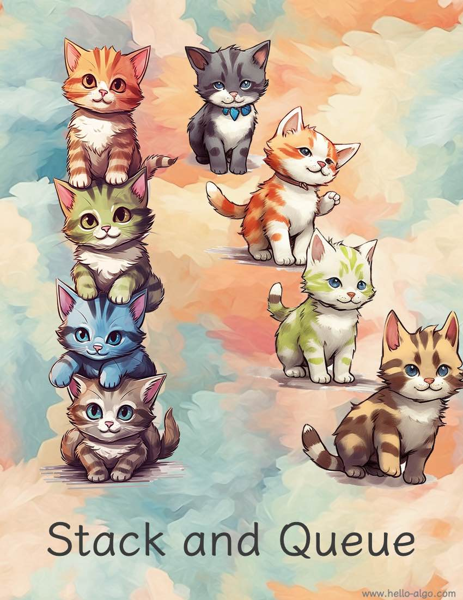

# Ngăn xếp và hàng đợi

!!! abstract

    Ngăn xếp tựa như đàn mèo chồng lên nhau, còn hàng đợi giống như đàn mèo đang xếp hàng.

    Hai cấu trúc lần lượt đại diện cho mối quan hệ logic: vào sau ra trước (LIFO) và vào trước ra trước (FIFO).
