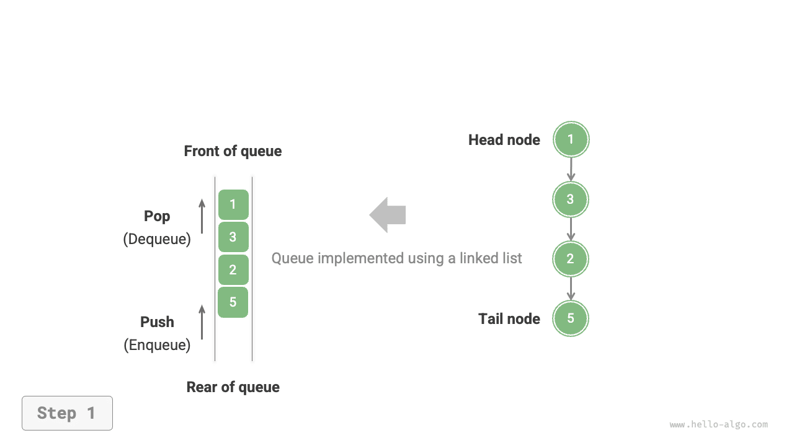

# Hàng đợi

<u>Hàng đợi (queue)</u> là một cấu trúc dữ liệu tuyến tính tuân theo nguyên lý vào trước ra trước (FIFO - First In, First Out). Đúng như tên gọi, hàng đợi mô phỏng hiện tượng xếp hàng trong đời thực: người mới đến sẽ liên tục xếp vào cuối hàng, trong khi người ở đầu hàng sẽ lần lượt rời đi sau khi được phục vụ.

Như hình dưới đây, chúng ta gọi phần đầu của hàng đợi là "đầu hàng đợi" (front), phần cuối là "cuối hàng đợi" (rear), thao tác thêm phần tử vào cuối hàng đợi được gọi là "vào hàng đợi" (enqueue), còn thao tác xoá phần tử ở đầu hàng đợi được gọi là "ra khỏi hàng đợi" (dequeue).


## Các thao tác thường dùng trên hàng đợi

Các thao tác thường gặp trên hàng đợi được liệt kê trong bảng dưới đây. Cần lưu ý rằng tên phương thức có thể khác nhau tuỳ theo từng ngôn ngữ lập trình. Ở đây chúng ta áp dụng cách đặt tên phương thức tương tự như ngăn xếp.

<p align="center"> Bảng <id> &nbsp; Hiệu năng thao tác của hàng đợi </p>

| Phương thức | Mô tả                         | Độ phức tạp thời gian |
| -------- | ---------------------------- | ---------- |
| `push()` | Thêm phần tử vào cuối hàng đợi (enqueue) | $O(1)$     |
| `pop()`  | Lấy phần tử đầu ra khỏi hàng đợi (dequeue) | $O(1)$     |
| `peek()` | Truy cập phần tử ở đầu hàng đợi | $O(1)$     |

Chúng ta có thể sử dụng trực tiếp các lớp hàng đợi có sẵn trong các ngôn ngữ lập trình:

=== "Python"

    ```python title="queue.py"
    from collections import deque

    # Khởi tạo hàng đợi
    # Trong Python, chúng ta thường dùng lớp hàng đợi hai đầu deque làm hàng đợi
    # Mặc dù queue.Queue() là lớp hàng đợi chuẩn, nhưng khó sử dụng hơn nên không khuyến khích
    que: deque[int] = deque()

    # Thêm phần tử vào cuối hàng đợi
    que.append(1)
    que.append(3)
    que.append(2)
    que.append(5)
    que.append(4)

    # Truy cập phần tử đầu hàng đợi
    front: int = que[0]

    # Lấy phần tử đầu ra khỏi hàng đợi
    pop: int = que.popleft()

    # Lấy độ dài hàng đợi
    size: int = len(que)

    # Kiểm tra hàng đợi có rỗng không
    is_empty: bool = len(que) == 0
    ```

=== "C++"

    ```cpp title="queue.cpp"
    /* Khởi tạo hàng đợi */
    queue<int> queue;

    /* Thêm phần tử vào cuối hàng đợi */
    queue.push(1);
    queue.push(3);
    queue.push(2);
    queue.push(5);
    queue.push(4);

    /* Truy cập phần tử đầu hàng đợi */
    int front = queue.front();

    /* Lấy phần tử đầu ra khỏi hàng đợi */
    queue.pop();

    /* Lấy độ dài hàng đợi */
    int size = queue.size();

    /* Kiểm tra hàng đợi có rỗng không */
    bool empty = queue.empty();
    ```

=== "Java"

    ```java title="queue.java"
    /* Khởi tạo hàng đợi */
    Queue<Integer> queue = new LinkedList<>();

    /* Thêm phần tử vào cuối hàng đợi */
    queue.offer(1);
    queue.offer(3);
    queue.offer(2);
    queue.offer(5);
    queue.offer(4);

    /* Truy cập phần tử đầu hàng đợi */
    int peek = queue.peek();

    /* Lấy phần tử đầu ra khỏi hàng đợi */
    int pop = queue.poll();

    /* Lấy độ dài hàng đợi */
    int size = queue.size();

    /* Kiểm tra hàng đợi có rỗng không */
    boolean isEmpty = queue.isEmpty();
    ```

=== "C#"

    ```csharp title="queue.cs"
    /* Khởi tạo hàng đợi */
    Queue<int> queue = new();

    /* Thêm phần tử vào cuối hàng đợi */
    queue.Enqueue(1);
    queue.Enqueue(3);
    queue.Enqueue(2);
    queue.Enqueue(5);
    queue.Enqueue(4);

    /* Truy cập phần tử đầu hàng đợi */
    int peek = queue.Peek();

    /* Lấy phần tử đầu ra khỏi hàng đợi */
    int pop = queue.Dequeue();

    /* Lấy độ dài hàng đợi */
    int size = queue.Count;

    /* Kiểm tra hàng đợi có rỗng không */
    bool isEmpty = queue.Count == 0;
    ```

=== "Go"

    ```go title="queue_test.go"
    /* Khởi tạo hàng đợi */
    // Trong Go, có thể dùng list hoặc slice làm hàng đợi
    // Dưới đây sử dụng list được hiện thực bằng danh sách liên kết đôi
    que := list.New()

    /* Thêm phần tử vào cuối hàng đợi */
    que.PushBack(1)
    que.PushBack(3)
    que.PushBack(2)
    que.PushBack(5)
    que.PushBack(4)

    /* Truy cập phần tử đầu hàng đợi */
    peek := que.Front().Value.(int)

    /* Lấy phần tử đầu ra khỏi hàng đợi */
    pop := que.Front()
    que.Remove(pop)

    /* Lấy độ dài hàng đợi */
    size := que.Len()

    /* Kiểm tra hàng đợi có rỗng không */
    isEmpty := que.Len() == 0
    ```

=== "Swift"

    ```swift title="queue.swift"
    /* Khởi tạo hàng đợi */
    // Swift không có cấu trúc Queue tích hợp sẵn, ở đây sử dụng Array để mô phỏng
    var queue: [Int] = []

    /* Thêm phần tử vào cuối hàng đợi */
    queue.append(1)
    queue.append(3)
    queue.append(2)
    queue.append(5)
    queue.append(4)

    /* Truy cập phần tử đầu hàng đợi */
    let peek = queue.first!

    /* Lấy phần tử đầu ra khỏi hàng đợi */
    let pop = queue.removeFirst()

    /* Lấy độ dài hàng đợi */
    let size = queue.count

    /* Kiểm tra hàng đợi có rỗng không */
    let isEmpty = queue.isEmpty
    ```

=== "JS"

    ```javascript title="queue.js"
    /* Khởi tạo hàng đợi */
    // JavaScript không có cấu trúc Queue tích hợp sẵn, ở đây sử dụng Array để mô phỏng
    const queue = [];

    /* Thêm phần tử vào cuối hàng đợi */
    queue.push(1);
    queue.push(3);
    queue.push(2);
    queue.push(5);
    queue.push(4);

    /* Truy cập phần tử đầu hàng đợi */
    const peek = queue[0];

    /* Lấy phần tử đầu ra khỏi hàng đợi */
    // Thao tác shift() có độ phức tạp thời gian là O(n)
    const pop = queue.shift();

    /* Lấy độ dài hàng đợi */
    const size = queue.length;

    /* Kiểm tra hàng đợi có rỗng không */
    const empty = queue.length === 0;
    ```

=== "TS"

    ```typescript title="queue.ts"
    /* Khởi tạo hàng đợi */
    // TypeScript không có cấu trúc Queue tích hợp sẵn, ở đây sử dụng Array để mô phỏng
    const queue: number[] = [];

    /* Thêm phần tử vào cuối hàng đợi */
    queue.push(1);
    queue.push(3);
    queue.push(2);
    queue.push(5);
    queue.push(4);

    /* Truy cập phần tử đầu hàng đợi */
    const peek = queue[0];

    /* Lấy phần tử đầu ra khỏi hàng đợi */
    // Thao tác shift() có độ phức tạp thời gian là O(n)
    const pop = queue.shift();

    /* Lấy độ dài hàng đợi */
    const size = queue.length;

    /* Kiểm tra hàng đợi có rỗng không */
    const empty = queue.length === 0;
    ```

=== "Dart"

    ```dart title="queue.dart"
    /* Khởi tạo hàng đợi */
    Queue<int> queue = Queue<int>();

    /* Thêm phần tử vào cuối hàng đợi */
    queue.add(1);
    queue.add(3);
    queue.add(2);
    queue.add(5);
    queue.add(4);

    /* Truy cập phần tử đầu hàng đợi */
    int peek = queue.first;

    /* Lấy phần tử đầu ra khỏi hàng đợi */
    int pop = queue.removeFirst();

    /* Lấy độ dài hàng đợi */
    int size = queue.length;

    /* Kiểm tra hàng đợi có rỗng không */
    bool isEmpty = queue.isEmpty;
    ```

=== "Rust"

    ```rust title="queue.rs"
    /* Khởi tạo hàng đợi */
    // Trong Rust, ta thường dùng VecDeque làm hàng đợi
    let mut queue: VecDeque<i32> = VecDeque::new();

    /* Thêm phần tử vào cuối hàng đợi */
    queue.push_back(1);
    queue.push_back(3);
    queue.push_back(2);
    queue.push_back(5);
    queue.push_back(4);

    /* Truy cập phần tử đầu hàng đợi */
    let peek = queue.front().unwrap();

    /* Lấy phần tử đầu ra khỏi hàng đợi */
    let pop = queue.pop_front().unwrap();

    /* Lấy độ dài hàng đợi */
    let size = queue.len();

    /* Kiểm tra hàng đợi có rỗng không */
    let is_empty = queue.is_empty();
    ```

=== "C"

    ```c title="queue.c"
    // C chưa cung cấp cấu trúc hàng đợi tích hợp sẵn
    ```

=== "Kotlin"

    ```kotlin title="queue.kt"
    /* Khởi tạo hàng đợi */
    val queue: Queue<Int> = LinkedList()

    /* Thêm phần tử vào cuối hàng đợi */
    queue.offer(1)
    queue.offer(3)
    queue.offer(2)
    queue.offer(5)
    queue.offer(4)

    /* Truy cập phần tử đầu hàng đợi */
    val peek = queue.peek()

    /* Lấy phần tử đầu ra khỏi hàng đợi */
    val pop = queue.poll()

    /* Lấy độ dài hàng đợi */
    val size = queue.size

    /* Kiểm tra hàng đợi có rỗng không */
    val isEmpty = queue.isEmpty()
    ```

=== "Ruby"

    ```ruby title="queue.rb"
    # Khởi tạo hàng đợi
    queue = Queue.new

    # Thêm phần tử vào cuối hàng đợi
    queue.push(1)
    queue.push(3)
    queue.push(2)
    queue.push(5)
    queue.push(4)

    # Truy cập phần tử đầu hàng đợi
    # Ruby Queue không hỗ trợ xem phần tử đầu trực tiếp (peek)
    peek = queue.pop
    queue.unshift(peek)

    # Lấy phần tử đầu ra khỏi hàng đợi
    pop = queue.pop

    # Lấy độ dài hàng đợi
    size = queue.length

    # Kiểm tra hàng đợi có rỗng không
    is_empty = queue.empty?
    ```

=== "Zig"

    ```zig title="queue.zig"
    // Khởi tạo hàng đợi
    // Trong Zig, có thể dùng TailQueue làm hàng đợi
    var queue = std.DoublyLinkedList(i32){};

    // Thêm phần tử vào cuối hàng đợi
    var node1 = std.DoublyLinkedList(i32).Node{ .data = 1 };
    var node2 = std.DoublyLinkedList(i32).Node{ .data = 3 };
    var node3 = std.DoublyLinkedList(i32).Node{ .data = 2 };
    var node4 = std.DoublyLinkedList(i32).Node{ .data = 5 };
    var node5 = std.DoublyLinkedList(i32).Node{ .data = 4 };
    queue.append(&node1);
    queue.append(&node2);
    queue.append(&node3);
    queue.append(&node4);
    queue.append(&node5);

    // Truy cập phần tử đầu hàng đợi
    const peek = queue.first.?.data;

    // Lấy phần tử đầu ra khỏi hàng đợi
    const pop = queue.popFirst().?.data;

    // Lấy độ dài hàng đợi
    const size = queue.len;

    // Kiểm tra hàng đợi có rỗng không
    const is_empty = queue.len == 0;
    ```

??? pythontutor "Trực quan hoá thực thi"

    https://pythontutor.com/render.html#code=from%20collections%20import%20deque%0A%0A%22%22%22Driver%20Code%22%22%22%0Aif%20__name__%20%3D%3D%20%22__main__%22%3A%0A%20%20%20%20#%20%E5%88%9D%E5%A7%8B%E5%8C%96%E9%98%9F%E5%88%97%0A%20%20%20%20#%20%E5%9C%A8%20Python%20%E4%B8%AD%EF%BC%8C%E6%88%91%E4%BB%AC%E4%B8%80%E8%88%AC%E5%B0%86%E5%8F%8C%E5%90%91%E9%98%9F%E5%88%97%E7%B1%BB%20deque%20%E7%9C%8B%E4%BD%9C%E9%98%9F%E5%88%97%E4%BD%BF%E7%94%A8%0A%20%20%20%20#%20%E8%99%BD%E7%84%B6%20queue.Queue%28%29%20%E6%98%AF%E7%BA%AF%E6%AD%A3%E7%9A%84%E9%98%9F%E5%88%97%E7%B1%BB%EF%BC%8C%E4%BD%86%E4%B8%8D%E5%A4%AA%E5%A5%BD%E7%94%A8%0A%20%20%20%20que%20%3D%20deque%28%29%0A%0A%20%20%20%20#%20%E5%85%83%E7%B4%A0%E5%85%A5%E9%98%9F%0A%20%20%20%20que.append%281%29%0A%20%20%20%20que.append%283%29%0A%20%20%20%20que.append%282%29%0A%20%20%20%20que.append%285%29%0A%20%20%20%20que.append%284%29%0A%20%20%20%20print%28%22%E9%98%9F%E5%88%97%20que%20%3D%22,%20que%29%0A%0A%20%20%20%20#%20%E8%AE%BF%E9%97%AE%E9%98%9F%E9%A6%96%E5%85%83%E7%B4%A0%0A%20%20%20%20front%20%3D%20que%5B0%5D%0A%20%20%20%20print%28%22%E9%98%9F%E9%A6%96%E5%85%83%E7%B4%A0%20front%20%3D%22,%20front%29%0A%0A%20%20%20%20#%20%E5%85%83%E7%B4%A0%E5%87%BA%E9%98%9F%0A%20%20%20%20pop%20%3D%20que.popleft%28%29%0A%20%20%20%20print%28%22%E5%87%BA%E9%98%9F%E5%85%83%E7%B4%A0%20pop%20%3D%22,%20pop%29%0A%20%20%20%20print%28%22%E5%87%BA%E9%98%9F%E5%90%8E%20que%20%3D%22,%20que%29%0A%0A%20%20%20%20#%20%E8%8E%B7%E5%8F%96%E9%98%9F%E5%88%97%E7%9A%84%E9%95%BF%E5%BA%A6%0A%20%20%20%20size%20%3D%20len%28que%29%0A%20%20%20%20print%28%22%E9%98%9F%E5%88%97%E9%95%BF%E5%BA%A6%20size%20%3D%22,%20size%29%0A%0A%20%20%20%20#%20%E5%88%A4%E6%96%AD%E9%98%9F%E5%88%97%E6%98%AF%E5%90%A6%E4%B8%BA%E7%A9%BA%0A%20%20%20%20is_empty%20%3D%20len%28que%29%20%3D%3D%200%0A%20%20%20%20print%28%22%E9%98%9F%E5%88%97%E6%98%AF%E5%90%A6%E4%B8%BA%E7%A9%BA%20%3D%22,%20is_empty%29&cumulative=false&curInstr=3&heapPrimitives=nevernest&mode=display&origin=opt-frontend.js&py=311&rawInputLstJSON=%5B%5D&textReferences=false

## Hiện thực hàng đợi

Để hiện thực hàng đợi, chúng ta cần một cấu trúc dữ liệu cho phép thêm phần tử ở một đầu và xoá phần tử ở đầu đối diện. Cả danh sách liên kết và mảng đều đáp ứng được yêu cầu này.

### Hiện thực dựa trên danh sách liên kết

Như minh hoạ trong hình dưới đây, chúng ta có thể coi "nút đầu" và "nút cuối" của danh sách liên kết lần lượt là "đầu hàng đợi" (front) và "cuối hàng đợi" (rear), quy định chỉ được thêm nút ở cuối hàng đợi và chỉ được xoá nút ở đầu hàng đợi.

=== "<1>"
    

=== "<2>"
    

=== "<3>"
    

Dưới đây là mã nguồn hiện thực hàng đợi bằng danh sách liên kết:

```src
[file]{linkedlist_queue}-[class]{linked_list_queue}-[func]{}
```

### Hiện thực dựa trên mảng

Trong mảng, việc xoá phần tử đầu tiên có độ phức tạp thời gian là $O(n)$ ，điều này sẽ khiến thao tác ra khỏi hàng đợi kém hiệu quả. Tuy nhiên, chúng ta có thể áp dụng phương pháp khéo léo sau để khắc phục vấn đề này.

Chúng ta có thể sử dụng một biến `front` trỏ đến chỉ số của phần tử đầu hàng đợi, đồng thời duy trì một biến `size` để ghi nhận độ dài hàng đợi. Định nghĩa `rear = front + size` ，công thức này tính ra vị trí `rear` trỏ ngay sau phần tử cuối hàng đợi.

Dựa trên thiết kế này, **khoảng chỉ số hợp lệ chứa các phần tử trong mảng là `[front, rear - 1]`**，phương thức hiện thực các thao tác được thể hiện như hình dưới đây:

- Thao tác vào hàng đợi: Gán giá trị phần tử mới vào chỉ số `rear` ，và tăng `size` lên 1 。
- Thao tác ra khỏi hàng đợi: Chỉ cần tăng `front` lên 1 ，và giảm `size` đi 1 。

Có thể thấy, cả thao tác vào hàng đợi và ra khỏi hàng đợi đều chỉ cần thực hiện một phép tính duy nhất, độ phức tạp thời gian đều là $O(1)$ 。

=== "<1>"
    

=== "<2>"
    

=== "<3>"
    

Bạn có thể nhận ra một vấn đề: trong quá trình liên tục thêm và xoá phần tử, cả `front` và `rear` đều dịch chuyển dần về phía bên phải, **khi chúng chạm đến cuối mảng thì sẽ không thể di chuyển tiếp được nữa**. Để giải quyết vấn đề này, chúng ta có thể coi mảng là một "mảng vòng" (circular array) có đầu và đuôi nối liền nhau.

Đối với mảng vòng, khi `front` hoặc `rear` vượt quá giới hạn cuối mảng, chúng ta cho nó quay trở lại đầu mảng để tiếp tục di chuyển. Quy luật tuần hoàn này có thể thực hiện thông qua "phép toán lấy dư (modulo)", mã nguồn như sau:

```src
[file]{array_queue}-[class]{array_queue}-[func]{}
```

Hàng đợi được hiện thực ở trên vẫn còn một hạn chế: độ dài của nó là cố định. Tuy nhiên, vấn đề này hoàn toàn có thể giải quyết bằng cách thay thế mảng tĩnh bằng mảng động để bổ sung cơ chế tự động mở rộng dung lượng. Bạn đọc quan tâm có thể thử tự mình hiện thực.

Kết luận so sánh giữa hai cách hiện thực hoàn toàn tương tự như với ngăn xếp, nên ở đây sẽ không nhắc lại.

## Các ứng dụng điển hình của hàng đợi

- **Đơn hàng thương mại điện tử**: Sau khi người mua đặt hàng, đơn hàng sẽ được đưa vào hàng đợi, hệ thống sau đó sẽ lần lượt xử lý các đơn hàng theo đúng thứ tự. Trong các dịp lễ hội mua sắm lớn, lượng đơn hàng khổng lồ được tạo ra trong thời gian ngắn, vấn đề xử lý đồng thời cao (high concurrency) trở thành bài toán trọng điểm mà các kỹ sư cần giải quyết.
- **Các loại hàng đợi công việc (Task queues)**: Mọi tình huống cần đảm bảo tính "đến trước phục vụ trước", ví dụ như hàng đợi tác vụ in ấn của máy in, hàng đợi ra món ăn của nhà hàng, v.v., hàng đợi trong những trường hợp này có thể duy trì trật tự xử lý một cách hiệu quả.
